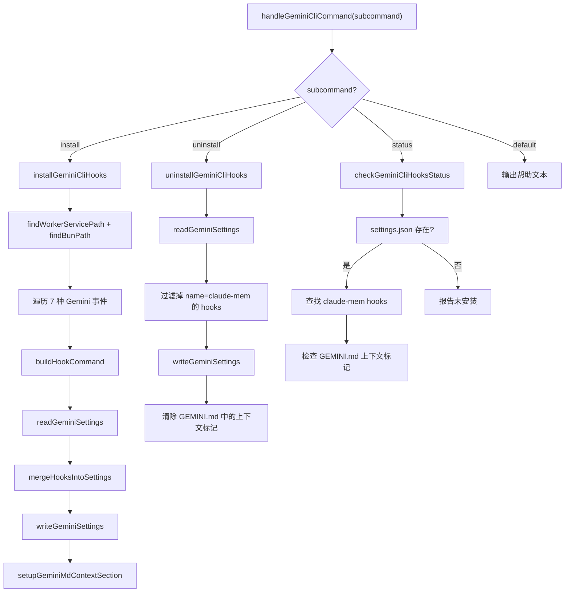

# GeminiCliHooksInstaller.ts 需求说明

> 源文件：src/services/integrations/GeminiCliHooksInstaller.ts ｜ 类型：源码 ｜ 行数：390 ｜ 所属模块：integrations ｜ 分析日期：2026-07-23

## 1. 文件定位总述

本文件实现 Claude-Mem 与 Gemini CLI 的 hooks 集成安装器。它负责将 claude-mem 的 hook 命令写入 Gemini CLI 的 `~/.gemini/settings.json` 配置文件，同时初始化 `~/.gemini/GEMINI.md` 中的上下文注入占位符。该文件将 7 种 Gemini CLI 事件映射到 claude-mem 内部子命令（context、session-init、observation、summarize），并提供安装、卸载、状态检查三个 CLI 子命令的入口。代码从 `CursorHooksInstaller.ts` 复用 `findWorkerServicePath` 和 `findBunPath` 辅助函数。

## 2. 功能需求

| 编号 | 需求描述（系统应当…） | 触发条件 / 输入 | 处理规则与输出 | 证据 |
|------|----------------------|----------------|---------------|------|
| FR-GEM-01 | 系统应当将 7 种 Gemini CLI 事件映射到 claude-mem 内部 hook 子命令。 | 安装时构建 hooks 配置。 | 映射表：SessionStart→context, BeforeAgent→session-init, AfterAgent/BeforeTool/AfterTool/Notification→observation, PreCompress→summarize。 | `src/services/integrations/GeminiCliHooksInstaller.ts:36-44` |
| FR-GEM-02 | 系统应当生成统一的 hook 命令字符串：`bun worker-service.cjs hook gemini-cli <internal_event>`。 | 为每个 Gemini 事件生成 hook command。 | 命令中 bun 路径和 worker 路径均做反斜杠转义（兼容 Windows）。 | `src/services/integrations/GeminiCliHooksInstaller.ts:46-60` |
| FR-GEM-03 | 系统应当在安装时将 hook 配置合并写入 `~/.gemini/settings.json`，保留用户已有的其他 hooks。 | 调用 `installGeminiCliHooks()`。 | 读取已有 settings，按事件名逐组查找是否存在 claude-mem hook（按 `name` 字段匹配），存在则替换、不存在则追加。 | `src/services/integrations/GeminiCliHooksInstaller.ts:97-131` |
| FR-GEM-04 | 系统应当拒绝在 Gemini settings.json 内容为非法 JSON 时覆写配置。 | 读取 `GEMINI_SETTINGS_PATH` 时解析失败。 | 抛出异常并返回退出码 1，防止损坏用户配置。 | `src/services/integrations/GeminiCliHooksInstaller.ts:82-89` |
| FR-GEM-05 | 系统应当在安装时自动在 `~/.gemini/GEMINI.md` 中插入上下文注入占位标记。 | 调用安装流程。 | 查找 `<claude-mem-context>` 标记，若不存在则追加含占位文本的标记块（含分隔符处理）。 | `src/services/integrations/GeminiCliHooksInstaller.ts:133-156` |
| FR-GEM-06 | 系统应当在卸载时仅移除 claude-mem 相关的 hook 条目，保留其他 hooks。 | 调用 `uninstallGeminiCliHooks()`。 | 遍历所有事件组的 hooks，按 `name !== 'claude-mem'` 过滤；空组删除；全部为空则删除 hooks 键。同时清除 GEMINI.md 中的上下文标记块。 | `src/services/integrations/GeminiCliHooksInstaller.ts:222-287` |
| FR-GEM-07 | 系统应当支持通过 `handleGeminiCliCommand` 分发 install/uninstall/status 子命令。 | CLI 入口传入 subcommand 和 args。 | switch 分发：install→安装, uninstall→卸载, status→状态检查, 其他→输出帮助文本。 | `src/services/integrations/GeminiCliHooksInstaller.ts:358-389` |
| FR-GEM-08 | 系统应当在状态检查时报告已安装的事件映射、上下文注入文件状态。 | 调用 `checkGeminiCliHooksStatus()`。 | 检查 settings.json 是否存在、hooks 中是否有 claude-mem 条目、GEMINI.md 是否含上下文标记，逐项输出到控制台。 | `src/services/integrations/GeminiCliHooksInstaller.ts:289-356` |

## 3. 业务规则与约束

- **BR-GEM-01** Gemini CLI 配置文件路径固定为 `~/.gemini/settings.json`，GEMINI.md 路径为 `~/.gemini/GEMINI.md`。`src/services/integrations/GeminiCliHooksInstaller.ts:29-31`
- **BR-GEM-02** Hook 名称固定为 `claude-mem`，用于在已有 hooks 中识别和替换/删除。`src/services/integrations/GeminiCliHooksInstaller.ts:33`
- **BR-GEM-03** Hook 超时时间固定为 10000ms（10 秒）。`src/services/integrations/GeminiCliHooksInstaller.ts:34`
- **BR-GEM-04** 每个 hook group 使用 `matcher: '*'` 全局匹配。`src/services/integrations/GeminiCliHooksInstaller.ts:64`
- **BR-GEM-05** GEMINI.md 上下文占位标记使用 `<claude-mem-context>` / `</claude-mem-context>` XML 标签，仅在没有该标记时追加。`src/services/integrations/GeminiCliHooksInstaller.ts:134-149`
- **BR-GEM-06** 卸载时若 hooks.json 中所有事件组均无剩余 hooks，则删除整个 hooks 键；若整个 settings 无 hooks 则移除。`src/services/integrations/GeminiCliHooksInstaller.ts:255-257`

## 4. 对外暴露

| 暴露项 | 类型 | 说明 |
|--------|------|------|
| `installGeminiCliHooks()` | async function → number | 安装 hooks，返回 0 成功 / 1 失败 |
| `uninstallGeminiCliHooks()` | function → number | 卸载 hooks，返回 0 成功 / 1 失败 |
| `checkGeminiCliHooksStatus()` | function → number | 状态检查，返回 0 |
| `handleGeminiCliCommand(subcommand, args)` | async function → number | CLI 入口分发 |

## 5. 依赖关系

| 依赖方 | 被依赖方 | 关系 |
|--------|---------|------|
| GeminiCliHooksInstaller.ts | `CursorHooksInstaller.ts` (`findWorkerServicePath`, `findBunPath`) | 复用路径查找逻辑 |
| GeminiCliHooksInstaller.ts | `utils/logger.ts` | 日志输出 |

## 6. 数据结构

**GeminiHooksConfig**（`src/services/integrations/GeminiCliHooksInstaller.ts:20-22`）

事件名到 hook group 数组的映射，每个 group 含 `matcher`（匹配规则）和 `hooks` 数组。

**GeminiHookGroup**（`src/services/integrations/GeminiCliHooksInstaller.ts:15-18`）

| 字段 | 类型 | 说明 |
|------|------|------|
| matcher | string | 事件匹配模式（固定 `'*'`） |
| hooks | GeminiHookEntry[] | hook 条目列表 |

**GeminiHookEntry**（`src/services/integrations/GeminiCliHooksInstaller.ts:8-13`）

| 字段 | 类型 | 说明 |
|------|------|------|
| name | string | hook 名称（固定 `'claude-mem'`） |
| type | string | 固定 `'command'` |
| command | string | shell 命令字符串 |
| timeout | number | 超时毫秒数（固定 10000） |

## 7. 复杂逻辑图示

上图展示了 Gemini CLI 集成的三个子命令入口及其内部流程。安装路径经过 hook 配置构建、合并写入和 GEMINI.md 上下文初始化；卸载路径精确移除 claude-mem 条目并清理上下文。

## 8. 逆向备注

- 注释中提及"安装后需启动 claude-mem worker 和重启 Gemini CLI"，说明 hooks 依赖 worker 运行。
- 推断：GEMINI.md 的上下文占位符在实际会话中由 worker 的 context 子命令填充，本文件仅负责创建占位结构。
