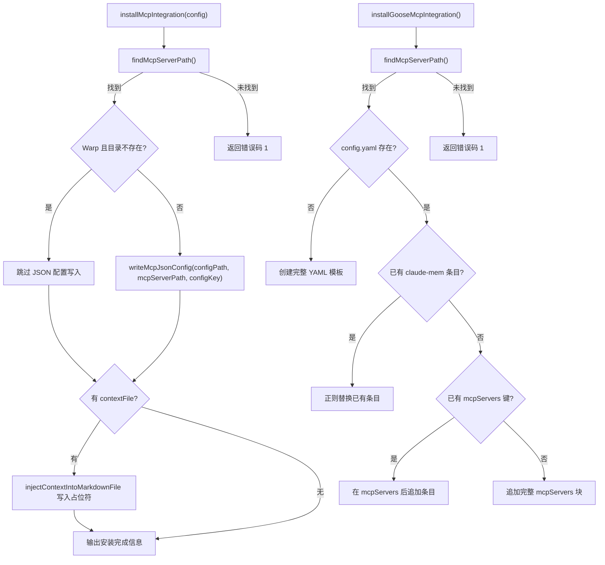

# McpIntegrations.ts 需求说明

> 源文件：`src/services/integrations/McpIntegrations.ts` ｜ 类型：源码 ｜ 行数：277 ｜ 所属模块：integrations ｜ 分析日期：2026-07-23

## 1. 文件定位总述

McpIntegrations 是 claude-mem 对多种第三方 IDE/工具的 MCP（Model Context Protocol）集成安装器集合。它通过统一的安装器工厂函数为 Copilot CLI、Antigravity、Roo Code、Warp 等工具生成安装逻辑，同时为 Goose 提供独立的 YAML 配置合并安装。每种 IDE 的安装包括写入 MCP 服务器 JSON 配置和创建上下文占位文件两步操作。所有安装器通过导出的 `MCP_IDE_INSTALLERS` 字典按 IDE ID 索引。

## 2. 功能需求

| 编号 | 需求描述（系统应当…） | 触发条件 / 输入 | 处理规则与输出 | 证据 |
|------|----------------------|----------------|---------------|------|
| FR-MCP-01 | 系统应当为 JSON 配置类 IDE 生成并写入 MCP 服务器配置 | 调用通用安装器（Copilot CLI/Antigravity/Roo Code/Warp） | 读取已有 JSON 配置文件；在 `mcpServers`/`servers` 键下写入 `claude-mem` 条目（command 为 `process.execPath`，args 为 MCP 服务器脚本路径）；文件不存在则创建目录并初始化 | `McpIntegrations.ts:23-40` |
| FR-MCP-02 | 系统应当为 JSON 配置类 IDE 创建上下文占位文件 | IDE 配置中定义了 contextFile | 调用 `injectContextIntoMarkdownFile` 写入占位符上下文文本到指定路径 | `McpIntegrations.ts:98-101` |
| FR-MCP-03 | 系统应当为 Warp 特殊处理：配置目录不存在时跳过写入 | Warp 的 `~/.warp/` 目录不存在 | 仅输出提示信息，不写入 MCP 配置文件，提示用户通过 Warp Drive UI 配置 | `McpIntegrations.ts:66,91-93` |
| FR-MCP-04 | 系统应当为 Goose 执行 YAML 配置合并安装 | 调用 `installGooseMcpIntegration()` | 查找 MCP 服务器脚本路径；对已有配置：已含 claude-mem 条目则替换，含 mcpServers 则追加，都不含则追加整个 mcpServers 块；新配置则创建完整 YAML 模板 | `McpIntegrations.ts:194-268` |
| FR-MCP-05 | 系统应当在 YAML 合并时通过正则精确替换 Goose 的 claude-mem 配置块 | Goose 配置中已有 claude-mem + mcpServers 标记 | 使用正则 `/( {2}claude-mem:\n(?:.*\n)*?(?= {2}\S|\n\n|^\S|$))/m` 匹配并替换为新的条目；匹配失败则抛出异常 | `McpIntegrations.ts:223-229` |
| FR-MCP-06 | 系统应当提供按 IDE ID 索引的安装器字典 | 外部通过 IDE ID 查找安装器 | `MCP_IDE_INSTALLERS` 字典包含 5 个 IDE 的安装器函数 | `McpIntegrations.ts:270-276` |

## 3. 业务规则与约束

- **JSON 配置写入策略**：不覆盖已有配置文件的其他内容，仅在 `mcpServers`/`servers` 键下添加或更新 `claude-mem` 条目（`McpIntegrations.ts:33-39`）。
- **上下文文件路径约定**：各 IDE 的上下文文件路径均为工作区相对路径（`isWorkspaceRelative: true`），即 `process.cwd()` 下（`McpIntegrations.ts:129,139,149,162`）。
- **Goose YAML 处理局限性**：使用字符串拼接方式操作 YAML，而非 YAML 解析器，依赖特定缩进格式（两空格缩进）（`McpIntegrations.ts:170-197`）。
- **MCP 服务器命令构建**：统一使用 `process.execPath`（当前 Node.js 可执行路径）作为命令，MCP 服务器脚本作为参数（`McpIntegrations.ts:16-21`）。
- **MCP 服务器脚本查找**：通过 `findMcpServerPath()` 从 `CursorHooksInstaller.ts` 导入，预期路径为 `~/.claude/plugins/marketplaces/thedotmack/plugin/scripts/mcp-server.cjs`（`McpIntegrations.ts:6,57-61`）。
- **JSON 配置键差异**：Copilot CLI 使用 `servers` 键，其他 IDE 使用 `mcpServers` 键（`McpIntegrations.ts:126,133,144,155`）。

## 4. 对外暴露

| 公开成员 | 类型 | 说明 |
|---------|------|------|
| `MCP_IDE_INSTALLERS` | `Record<string, () => Promise<number>>` | IDE ID 到安装函数的映射字典 |
| `installGooseMcpIntegration` | `() => Promise<number>` | Goose 独立安装函数 |

**MCP_IDE_INSTALLERS 包含的 IDE**：
- `copilot-cli`：配置路径 `~/.github/copilot/mcp.json`，上下文 `.github/copilot-instructions.md`
- `antigravity`：配置路径 `~/.gemini/antigravity/mcp_config.json`，上下文 `.agents/rules/claude-mem-context.md`
- `goose`：配置路径 `~/.config/goose/config.yaml`（YAML，独立处理）
- `roo-code`：配置路径 `.roo/mcp.json`，上下文 `.roo/rules/claude-mem-context.md`
- `warp`：配置路径 `~/.warp/mcp.json`，上下文 `WARP.md`

## 5. 依赖关系

**内部依赖**：
- `src/services/integrations/CursorHooksInstaller.ts` → `findMcpServerPath`（`McpIntegrations.ts:6`）
- `src/utils/json-utils.ts` → `readJsonSafe`（`McpIntegrations.ts:7`）
- `src/utils/context-injection.ts` → `injectContextIntoMarkdownFile`（`McpIntegrations.ts:8`）
- `src/utils/logger.ts` → 日志（`McpIntegrations.ts:5`）

**外部依赖**：
- Node.js `fs`、`path`、`os`

## 6. 数据结构

**McpInstallerConfig**（IDE 安装配置）：
```typescript
interface McpInstallerConfig {
  ideId: string;              // IDE 标识符
  ideLabel: string;           // IDE 显示名称
  configPath: string;         // MCP 配置文件路径
  configKey: 'servers' | 'mcpServers';  // JSON 中的键名
  contextFile?: {              // 上下文文件配置
    path: string;
    isWorkspaceRelative: boolean;
  };
}
```

## 7. 复杂逻辑图示



上图展示了 MCP 集成的安装流程。JSON 类 IDE 走统一工厂路径，Goose 走独立的 YAML 合并路径，其中 Goose 的 YAML 合并根据已有配置的不同状态采取不同策略。

## 8. 逆向备注

- Goose 的 YAML 处理完全基于字符串操作而非 YAML 解析器，正则替换模式 `( {2}claude-mem:\n(?:.*\n)*?(?= {2}\S|\n\n|^\S|$))/m`（`McpIntegrations.ts:223`）在嵌套结构复杂时可能不够健壮，但对 claude-mem 的扁平配置足够。
- Warp 的特殊处理通过 `config.ideId === 'warp'` 硬编码判断（`McpIntegrations.ts:66`），而非配置驱动。
- `PLACEHOLDER_CONTEXT` 常量标题为 `# claude-mem: Cross-Session Memory`（`McpIntegrations.ts:10`），与 OpenCodeInstaller 中使用的 `# Claude-Mem Memory Context` 不同，跨 IDE 上下文标题不统一。
- Goose 的 `buildGooseMcpYamlBlock` 和 `buildGooseClaudeMemEntryYaml` 生成的内容缩进不一致：前者带 `mcpServers:` 头，后者仅生成条目级（`McpIntegrations.ts:176-192`）。
