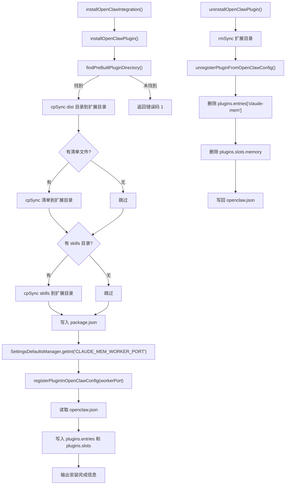

# OpenClawInstaller.ts 需求说明

> 源文件：`src/services/integrations/OpenClawInstaller.ts` ｜ 类型：源码 ｜ 行数：327 ｜ 所属模块：integrations ｜ 分析日期：2026-07-23

## 1. 文件定位总述

OpenClawInstaller 是 claude-mem 对 OpenClaw 平台的集成安装/卸载/状态查询模块。它负责将预构建的 OpenClaw 插件（dist 目录、清单文件、skills 目录）复制到 `~/.openclaw/extensions/claude-mem/` 目录，并注册到 `openclaw.json` 配置的 plugins 体系（包括 entries 和 slots）。安装时自动从 SettingsDefaultsManager 获取 worker 端口并写入配置。卸载时删除扩展目录并从配置中移除注册信息。

## 2. 功能需求

| 编号 | 需求描述（系统应当…） | 触发条件 / 输入 | 处理规则与输出 | 证据 |
|------|----------------------|----------------|---------------|------|
| FR-OC-INSTALL-01 | 系统应当将预构建的 OpenClaw 插件复制到扩展目录 | 调用 `installOpenClawPlugin()` | 查找 `openclaw/dist/index.js`（先查市场插件目录，再查 cwd）；创建目标 dist 目录（recursive）；复制整个 dist 目录、清单文件（openclaw.plugin.json）和 skills 目录；写入 package.json；注册到 openclaw.json | `OpenClawInstaller.ts:161-193` |
| FR-OC-INSTALL-02 | 系统应当在 openclaw.json 中注册 claude-mem 插件 | 插件文件复制完成后 | 在 `plugins.entries['claude-mem']` 中写入 enabled:true、workerPort、project、syncMemoryFile；在 `plugins.slots.memory` 中设置为 `'claude-mem'`；已有配置仅补充缺失字段 | `OpenClawInstaller.ts:108-142` |
| FR-OC-INSTALL-03 | 系统应当执行完整的 OpenClaw 集成安装流程 | 调用 `installOpenClawIntegration()` | 先安装插件文件并注册；输出安装完成信息和使用指引 | `OpenClawInstaller.ts:303-326` |
| FR-OC-UNINSTALL-01 | 系统应当卸载 OpenClaw 插件 | 调用 `uninstallOpenClawPlugin()` | 递归删除扩展目录 `~/.openclaw/extensions/claude-mem/`；从 openclaw.json 移除 entries 和 slots 中的 claude-mem 条目；返回 0 成功 / 1 有错误 | `OpenClawInstaller.ts:231-256` |
| FR-OC-STATUS-01 | 系统应当查询并输出 OpenClaw 集成状态 | 调用 `checkOpenClawStatus()` | 输出配置目录是否存在、扩展目录和入口文件是否存在、openclaw.json 中注册状态（registered/enabled/memory slot）以及插件配置详情（worker port/project/syncMemoryFile） | `OpenClawInstaller.ts:258-301` |
| FR-OC-FIND-01 | 系统应当查找预构建的 OpenClaw 插件目录 | 调用 `findPreBuiltPluginDirectory()` | 在市场插件目录和 cwd 下查找 `openclaw/dist/index.js`；返回 dist 目录路径或 null | `OpenClawInstaller.ts:32-50` |
| FR-OC-FIND-02 | 系统应当查找 OpenClaw 插件清单文件 | 调用 `findPluginManifestPath()` | 查找 `openclaw/openclaw.plugin.json` | `OpenClawInstaller.ts:52-69` |
| FR-OC-FIND-03 | 系统应当查找 OpenClaw skills 目录 | 调用 `findPluginSkillsDirectory()` | 查找 `openclaw/skills` 目录 | `OpenClawInstaller.ts:71-88` |

## 3. 业务规则与约束

- **配置合并策略**：注册插件时若 `plugins.entries['claude-mem']` 已存在，仅补充缺失的配置字段（workerPort、project、syncMemoryFile），不覆盖已有值（`OpenClawInstaller.ts:131-139`）。
- **默认配置值**：安装时 project 默认为 `'openclaw'`，syncMemoryFile 默认为 `true`（`OpenClawInstaller.ts:111`）。
- **Worker 端口获取**：通过 `SettingsDefaultsManager.getInt('CLAUDE_MEM_WORKER_PORT')` 从设置中读取，非硬编码（`OpenClawInstaller.ts:224`）。
- **查找路径优先级**：先查 `~/.claude/plugins/marketplaces/thedotmack/`，再查 `process.cwd()`（`OpenClawInstaller.ts:34-39,54-59,72-77`）。
- **目录复制使用 force**：`cpSync` 使用 `{ recursive: true, force: true }`，覆盖已存在的文件（`OpenClawInstaller.ts:203,208,214`）。
- **package.json 模板**：扩展目录的 package.json 固定为 name=claude-mem, version=1.0.0, type=module, main=dist/index.js（`OpenClawInstaller.ts:176-182`）。

## 4. 对外暴露

| 公开方法 | 签名 | 说明 |
|---------|------|------|
| `installOpenClawPlugin` | `() => number` | 安装插件文件并注册 |
| `uninstallOpenClawPlugin` | `() => number` | 卸载插件并清理注册 |
| `checkOpenClawStatus` | `() => number` | 查询集成状态 |
| `installOpenClawIntegration` | `() => Promise<number>` | 完整安装流程 |
| `getOpenClawConfigDirectory` | `() => string` | 获取配置目录路径 |
| `getOpenClawExtensionsDirectory` | `() => string` | 获取扩展目录路径 |
| `getOpenClawClaudeMemExtensionDirectory` | `() => string` | 获取 claude-mem 扩展目录路径 |
| `getOpenClawConfigFilePath` | `() => string` | 获取配置文件路径 |
| `findPreBuiltPluginDirectory` | `() => string \| null` | 查找预构建插件目录 |
| `findPluginManifestPath` | `() => string \| null` | 查找清单文件 |
| `findPluginSkillsDirectory` | `() => string \| null` | 查找 skills 目录 |

## 5. 依赖关系

**内部依赖**：
- `src/shared/SettingsDefaultsManager.ts` → `SettingsDefaultsManager`（`OpenClawInstaller.ts:14`）
- `src/utils/logger.ts` → 日志（`OpenClawInstaller.ts:13`）

**外部依赖**：
- Node.js `fs`、`path`、`os`

## 6. 数据结构

**openclaw.json 插件配置结构**：
```json
{
  "plugins": {
    "slots": {
      "memory": "claude-mem"
    },
    "entries": {
      "claude-mem": {
        "enabled": true,
        "config": {
          "workerPort": number,
          "project": string,
          "syncMemoryFile": boolean
        }
      }
    }
  }
}
```

**扩展目录结构**：
```
~/.openclaw/extensions/claude-mem/
  ├── dist/           # 预构建的插件代码
  │   └── index.js
  ├── skills/         # 技能文件（可选）
  ├── openclaw.plugin.json  # 清单文件（可选）
  └── package.json    # 包描述文件
```

## 7. 复杂逻辑图示



上图展示了 OpenClaw 集成的安装与卸载流程。安装时按序复制 dist、清单、skills，最后注册到配置；卸载时反向操作，删除目录并清理配置条目。

## 8. 逆向备注

- `installOpenClawIntegration` 声明为 `async` 函数（`OpenClawInstaller.ts:303`），但函数体内没有 `await` 操作，推断：（预留异步扩展或保持与其他 Installer 的接口一致性）。
- `readOpenClawConfig` 中 JSON 解析失败时抛出异常（`OpenClawInstaller.ts:97-99`），而 `writeOpenClawConfig` 不读取配置直接覆盖写入——两者配合在 `registerPluginInOpenClawConfig` 中使用时形成读-改-写模式，但非原子操作。
- 三个查找函数（`findPreBuiltPluginDirectory`、`findPluginManifestPath`、`findPluginSkillsDirectory`）结构几乎相同，仅搜索目标和返回值不同，存在一定代码重复。
- `registerPluginInOpenClawConfig` 中 `project` 参数默认为 `'openclaw'`（`OpenClawInstaller.ts:111`），而 OpenCodeInstaller 使用的 project 参数从外部传入——两套 Installer 的 project 来源不同。
