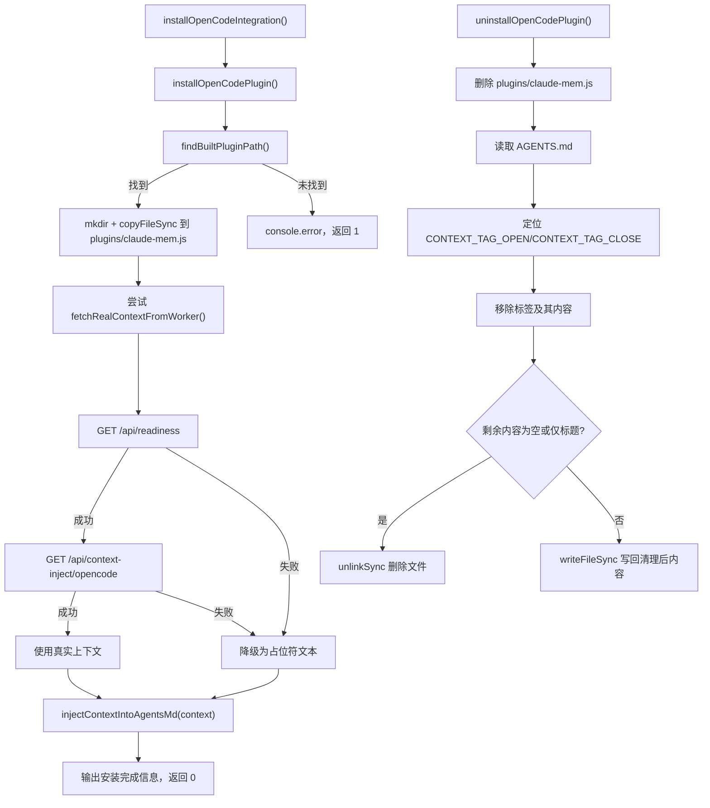

# OpenCodeInstaller.ts 需求说明

> 源文件：`src/services/integrations/OpenCodeInstaller.ts` ｜ 类型：源码 ｜ 行数：280 ｜ 所属模块：integrations ｜ 分析日期：2026-07-23

## 1. 文件定位总述

OpenCodeInstaller 是 claude-mem 对 OpenCode IDE 集成的安装/卸载/状态查询模块。它负责将预构建的 OpenCode 插件 JS 文件复制到 OpenCode 配置目录的 plugins 子目录中，管理 AGENTS.md 中的记忆上下文注入（使用标签隔离），并在安装时尝试从运行中的 worker 获取真实上下文或写入占位符。同时提供卸载时清理插件文件和上下文标签、运行时从 worker 同步上下文到 AGENTS.md 的能力。

## 2. 功能需求

| 编号 | 需求描述（系统应当…） | 触发条件 / 输入 | 处理规则与输出 | 证据 |
|------|----------------------|----------------|---------------|------|
| FR-INSTALL-01 | 系统应当将预构建的 OpenCode 插件复制到 OpenCode 插件目录 | 调用 `installOpenCodePlugin()` | 在已安装插件目录和市场插件目录两个候选位置查找 `dist/opencode-plugin/index.js`；创建目标 plugins 目录（recursive），复制文件到 `plugins/claude-mem.js`；返回 0 成功 / 1 失败 | `OpenCodeInstaller.ts:49-75` |
| FR-INSTALL-02 | 系统应当向 AGENTS.md 注入上下文内容 | 调用 `injectContextIntoAgentsMd(contextContent)` | 使用 `injectContextIntoMarkdownFile` 以 `# Claude-Mem Memory Context` 为标题注入上下文；返回 0 成功 / 1 失败 | `OpenCodeInstaller.ts:77-89` |
| FR-INSTALL-03 | 系统应当执行完整的 OpenCode 集成安装流程 | 调用 `installOpenCodeIntegration()` | 先安装插件；尝试从 worker 获取真实上下文，成功则使用真实上下文，失败则写入占位符文本；注入到 AGENTS.md；输出安装完成信息 | `OpenCodeInstaller.ts:225-279` |
| FR-INSTALL-04 | 系统应当在安装时优先使用 worker 已有的真实记忆上下文 | worker 正在运行且 `/api/readiness` 和 `/api/context-inject/opencode` 端点可用 | 调用 `fetchRealContextFromWorker()`：先检查 readiness，再获取上下文；获取成功则使用真实内容；失败则降级为占位符 | `OpenCodeInstaller.ts:241-253` |
| FR-INSTALL-05 | 系统应当从 worker 同步上下文到 AGENTS.md | 调用 `syncContextToAgentsMd(project)` | 从 worker 获取指定项目的上下文内容，调用 `fetchAndInjectOpenCodeContext` 写入 AGENTS.md；worker 不可用时静默失败（debug 日志） | `OpenCodeInstaller.ts:91-103` |
| FR-UNINSTALL-01 | 系统应当卸载 OpenCode 插件文件并清理上下文 | 调用 `uninstallOpenCodePlugin()` | 删除 `plugins/claude-mem.js`；读取 AGENTS.md，定位 `<claude-mem-context>` 标签范围并移除；移除后若内容为空或仅剩标题则删除文件；返回 0 成功 / 1 有错误 | `OpenCodeInstaller.ts:146-194` |
| FR-STATUS-01 | 系统应当查询并输出 OpenCode 集成状态 | 调用 `checkOpenCodeStatus()` | 输出配置目录是否存在、插件是否已安装、AGENTS.md 是否存在且含 claude-mem 上下文标签；返回 0 | `OpenCodeInstaller.ts:196-223` |
| FR-PATH-01 | 系统应当支持通过环境变量覆盖 OpenCode 配置目录 | 设置 `OPENCODE_CONFIG_DIR` 环境变量 | 优先使用环境变量值，否则默认 `~/.config/opencode` | `OpenCodeInstaller.ts:12-16` |

## 3. 业务规则与约束

- **插件查找优先级**：先查找已安装的市场插件目录 `~/.claude/plugins/marketplaces/thedotmack/dist/opencode-plugin/index.js`，再查找相对于当前文件的 `../../../dist/opencode-plugin/index.js`（`OpenCodeInstaller.ts:31-47`）。
- **上下文标签隔离**：AGENTS.md 中的上下文内容使用 `CONTEXT_TAG_OPEN` / `CONTEXT_TAG_CLOSE` 标签包裹，卸载时通过定位标签精确移除，不影响文件其他内容（`OpenCodeInstaller.ts:173-190`）。
- **空文件清理**：卸载时若移除上下文后 AGENTS.md 内容为空或仅剩标题行 `# Claude-Mem Memory Context`，则删除整个文件（`OpenCodeInstaller.ts:134-144`）。
- **同步降级**：运行时上下文同步（`syncContextToAgentsMd`）在 worker 不可用时静默降级，不抛异常（`OpenCodeInstaller.ts:96-101`）。
- **Warp 特殊处理**：未在本文件中直接出现 Warp 逻辑，但 McpIntegrations.ts 中有对 Warp 的特殊跳过逻辑。

## 4. 对外暴露

| 公开方法 | 签名 | 说明 |
|---------|------|------|
| `installOpenCodePlugin` | `() => number` | 安装插件文件，返回退出码 |
| `injectContextIntoAgentsMd` | `(contextContent: string) => number` | 注入上下文到 AGENTS.md |
| `syncContextToAgentsMd` | `(project: string) => Promise<void>` | 从 worker 同步上下文 |
| `uninstallOpenCodePlugin` | `() => number` | 卸载插件并清理上下文 |
| `checkOpenCodeStatus` | `() => number` | 查询集成状态 |
| `installOpenCodeIntegration` | `() => Promise<number>` | 完整安装流程 |
| `getOpenCodeConfigDirectory` | `() => string` | 获取配置目录路径 |
| `getOpenCodePluginsDirectory` | `() => string` | 获取插件目录路径 |
| `getOpenCodeAgentsMdPath` | `() => string` | 获取 AGENTS.md 路径 |
| `getInstalledPluginPath` | `() => string` | 获取已安装插件路径 |
| `findBuiltPluginPath` | `() => string \| null` | 查找预构建插件路径 |

## 5. 依赖关系

**内部依赖**：
- `src/utils/context-injection.ts` → `CONTEXT_TAG_OPEN`/`CONTEXT_TAG_CLOSE`/`injectContextIntoMarkdownFile`（`OpenCodeInstaller.ts:7`）
- `src/shared/worker-utils.ts` → `buildWorkerUrl`（`OpenCodeInstaller.ts:8`）
- `src/shared/query-utils.ts` → `buildContextInjectPath`（`OpenCodeInstaller.ts:9`）
- `src/utils/logger.ts` → 日志（`OpenCodeInstaller.ts:6`）

**外部依赖**：
- Node.js `fs`、`path`、`os`、`url`

## 6. 数据结构

不适用（无自定义复杂数据结构，主要为路径解析函数）。

## 7. 复杂逻辑图示

上图展示了 OpenCode 集成的安装与卸载流程。安装时先复制插件文件，再尝试从 worker 获取真实上下文，失败时降级为占位符。卸载时通过标签隔离精确移除上下文内容，空文件则直接删除。

## 8. 逆向备注

- `fetchRealContextFromWorker` 函数定义为 `async`（`OpenCodeInstaller.ts:105`），但其调用方 `installOpenCodeIntegration` 使用 `try/catch` 包裹且在 `catch` 中输出 debug 日志（`OpenCodeInstaller.ts:247-253`），说明 worker 不可用是预期场景。
- `fetchAndInjectOpenCodeContext`（`OpenCodeInstaller.ts:118-131`）直接请求项目特定的上下文路径，而 `fetchRealContextFromWorker` 请求的是 `opencode` 特定路径，两者用于不同场景。
- 卸载逻辑中 `hasErrors` 变量在 AGENTS.md 读取失败时被设为 `true`（`OpenCodeInstaller.ts:168`），但后续仍继续执行清理操作，说明采用"尽力而为"策略。
