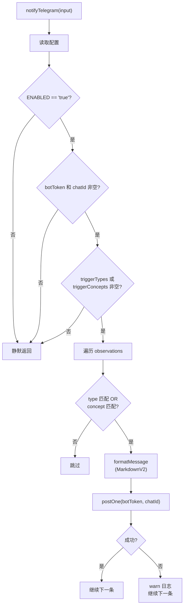

# TelegramNotifier.ts 需求说明

> 源文件：src/services/integrations/TelegramNotifier.ts | 类型：源码 | 行数：108 | 所属模块：integrations | 分析日期：2026-07-23

## 1. 文件定位总述

TelegramNotifier 是 claude-mem 的 Telegram 通知集成模块，在观察记录产生后根据配置条件（类型和概念匹配）向指定 Telegram 聊天发送通知。它支持按观察类型和概念进行过滤触发，消息格式采用 Telegram MarkdownV2，并对特殊字符进行转义。核心入口 `notifyTelegram` 在每次观察存储后被调用，但仅在配置启用且匹配条件满足时才实际发送。

## 2. 功能需求

| 编号 | 需求描述（系统应当…） | 触发条件 / 输入 | 处理规则与输出 | 证据 |
|------|----------------------|----------------|---------------|------|
| FR-TG-01 | 系统应当在观察记录产生后根据配置决定是否发送 Telegram 通知 | 调用 `notifyTelegram(input)` | 读取配置判断是否启用 Telegram 通知；检查 botToken 和 chatId 是否配置；检查是否有触发类型或触发概念；全部满足时逐条处理观察 | `src/services/integrations/TelegramNotifier.ts:66-107` |
| FR-TG-02 | 系统应当按观察类型和概念进行过滤触发 | 启用 Telegram 且有触发配置 | `triggerTypes` CSV 和 `triggerConcepts` CSV 解析为列表；观察的 type 在 triggerTypes 中或 concepts 有任一交集时触发通知（OR 逻辑） | `src/services/integrations/TelegramNotifier.ts:79-93` |
| FR-TG-03 | 系统应当使用 MarkdownV2 格式发送通知消息 | 满足触发条件 | 格式化消息包含 emoji + 类型 + 标题 + 副标题 + 项目和观察 ID；对 MarkdownV2 保留字符进行转义 | `src/services/integrations/TelegramNotifier.ts:33-46,48-64` |
| FR-TG-04 | 系统应当在 Telegram API 调用失败时记录日志而不中断流程 | `postOne` 抛出异常 | 记录 warn 级别日志包含 observationId、project、type；继续处理下一条观察 | `src/services/integrations/TelegramNotifier.ts:95-105` |

## 3. 业务规则与约束

- **全局开关**：`CLAUDE_MEM_TELEGRAM_ENABLED` 必须为 `'true'` 才启用，其他值（包括未设置）均视为禁用。`src/services/integrations/TelegramNotifier.ts:69`
- **必要配置**：`CLAUDE_MEM_TELEGRAM_BOT_TOKEN` 和 `CLAUDE_MEM_TELEGRAM_CHAT_ID` 都必须非空。`src/services/integrations/TelegramNotifier.ts:73-77`
- **触发条件联合逻辑**：观察的 type 匹配 OR concepts 匹配即触发，两者不必同时满足。`src/services/integrations/TelegramNotifier.ts:88-91`
- **空触发列表 = 全部静默**：当 `triggerTypes` 和 `triggerConcepts` 均为空时，所有观察都不触发通知。`src/services/integrations/TelegramNotifier.ts:81-83`
- **Emoji 映射**：`security_alert` 映射为 🚨，`security_note` 映射为 🔐，其他类型统一使用 🔔。`src/services/integrations/TelegramNotifier.ts:16-20`
- **配置热读取**：每次调用都重新从文件加载设置。`src/services/integrations/TelegramNotifier.ts:67`
- **单条发送**：每个匹配的观察单独发送一条 Telegram 消息（而非批量合并）。`src/services/integrations/TelegramNotifier.ts:86-106`

## 4. 对外暴露

| 名称 | 类型 | 说明 |
|------|------|------|
| `notifyTelegram(input)` | async 函数 | 入口函数，处理 Telegram 通知 |
| `TelegramNotifyInput` | 接口 | 输入参数类型 |

## 5. 依赖关系

- **SettingsDefaultsManager**（`../../shared/SettingsDefaultsManager.js`）：读取 Telegram 相关配置
- **USER_SETTINGS_PATH**（`../../shared/paths.js`）：设置文件路径
- **logger**（`../../utils/logger.js`）：结构化日志
- **ParsedObservation**（`../../sdk/parser.js`）：观察记录类型

## 6. 数据结构

**TelegramNotifyInput**（输入结构）：
```typescript
{
  observations: ParsedObservation[];
  observationIds: number[];
  project: string;
  memorySessionId: string;
}
```

**相关配置项**（settings.json）：
```
CLAUDE_MEM_TELEGRAM_ENABLED       = 'true'
CLAUDE_MEM_TELEGRAM_BOT_TOKEN      = <bot token>
CLAUDE_MEM_TELEGRAM_CHAT_ID        = <chat id>
CLAUDE_MEM_TELEGRAM_TRIGGER_TYPES  = 'security_alert,security_note' (CSV)
CLAUDE_MEM_TELEGRAM_TRIGGER_CONCEPTS = 'auth,login' (CSV)
```

## 7. 复杂逻辑图示



通知流程采用"全局开关 -> 必要配置 -> 触发条件 -> 逐条匹配发送"的多层过滤，每步不满足即静默返回。发送失败不阻断后续处理。

## 8. 逆向备注

- `MARKDOWN_V2_RESERVED` 正则使用了 `\` 两次转义（`\\\\`）以确保在正则中正确匹配反斜杠字符。`src/services/integrations/TelegramNotifier.ts:14`
