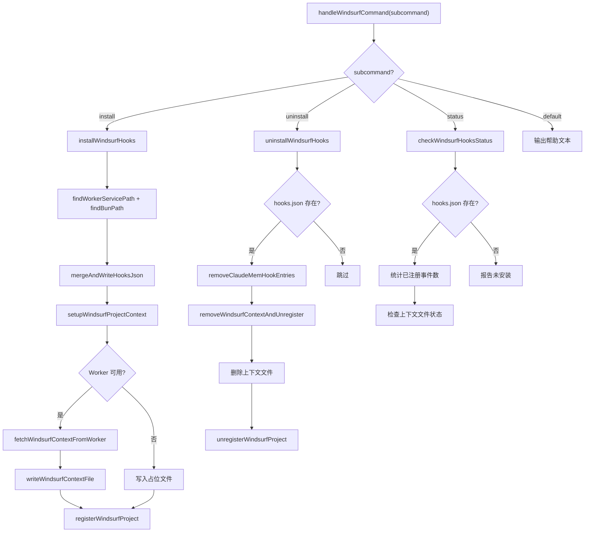

# WindsurfHooksInstaller.ts 需求说明

> 源文件：src/services/integrations/WindsurfHooksInstaller.ts ｜ 类型：源码 ｜ 行数：456 ｜ 所属模块：integrations ｜ 分析日期：2026-07-23

## 1. 文件定位总述

本文件实现 Claude-Mem 与 Windsurf IDE 的 hooks 集成安装器，负责将 claude-mem 的 hook 命令注入 Windsurf 的用户级 hooks 配置（`~/.codeium/windsurf/hooks.json`），并在工作区 `.windsurf/rules/claude-mem-context.md` 中注入持久化上下文。它维护一个项目注册表（`windsurf-projects.json`）用于跟踪哪些工作区已注册自动上下文更新，提供安装、卸载、状态检查三个 CLI 子命令，并支持从 worker 拉取已有记忆生成初始上下文。

## 2. 功能需求

| 编号 | 需求描述（系统应当…） | 触发条件 / 输入 | 处理规则与输出 | 证据 |
|------|----------------------|----------------|---------------|------|
| FR-WS-01 | 系统应当将 5 种 Windsurf 事件映射到 claude-mem 内部 hook 子命令。 | 安装时构建 hooks 配置。 | 映射：pre_user_prompt→session-init, post_write_code→file-edit, post_run_command/post_mcp_tool_use/post_cascade_response→observation。 | `src/services/integrations/WindsurfHooksInstaller.ts:37-43, 136-147` |
| FR-WS-02 | 系统应当在安装时将 hook 条目合并写入 `~/.codeium/windsurf/hooks.json`，保留其他 hooks。 | 调用 `installWindsurfHooks()`。 | 对每个事件，过滤掉已有的 claude-mem hooks（按 command 包含 `worker-service` 和 `windsurf` 判断），再追加新条目。 | `src/services/integrations/WindsurfHooksInstaller.ts:149-190` |
| FR-WS-03 | 系统应当拒绝在 hooks.json 内容为非法 JSON 时覆写配置。 | 读取 `hooks.json` 时解析失败。 | 抛出异常中止安装，返回退出码 1。 | `src/services/integrations/WindsurfHooksInstaller.ts:163-169` |
| FR-WS-04 | 系统应当在安装时为当前工作区生成初始上下文文件到 `.windsurf/rules/claude-mem-context.md`。 | 安装时 worker 运行中。 | 尝试从 worker `/api/readiness` 检查就绪状态，获取上下文内容并写入；若 worker 不可用则写入占位文本。 | `src/services/integrations/WindsurfHooksInstaller.ts:257-289` |
| FR-WS-05 | 系统应当将上下文文件内容限制在 6000 字符以内，超出时截断并附加提示。 | 写入上下文文件时。 | 超出 `WINDSURF_CONTEXT_CHAR_LIMIT`(6000) 时截断到 5950 字符并追加 `*[Truncated — use MCP search for full history]*`。 | `src/services/integrations/WindsurfHooksInstaller.ts:126-129` |
| FR-WS-06 | 系统应当使用原子写入（先写 .tmp 再 rename）写入上下文文件。 | 每次写入上下文文件。 | 写入 `{path}.tmp` 后调用 `renameSync` 替换目标文件。 | `src/services/integrations/WindsurfHooksInstaller.ts:131-133` |
| FR-WS-07 | 系统应当维护项目注册表记录已注册的工作区及其安装时间。 | 安装时或手动调用 `registerWindsurfProject`。 | 注册表存储在 `<DATA_DIR>/windsurf-projects.json`，格式为 `{ workspacePath: { installedAt: ISO时间戳 } }`。 | `src/services/integrations/WindsurfHooksInstaller.ts:59-72` |
| FR-WS-08 | 系统应当支持为已注册项目自动更新上下文内容（从 worker 拉取最新记忆）。 | 调用 `updateWindsurfContextForProject`。 | 检查项目是否在注册表中，是则从 worker 拉取上下文并调用 `writeWindsurfContextFile`。 | `src/services/integrations/WindsurfHooksInstaller.ts:83-107` |
| FR-WS-09 | 系统应当在卸载时仅移除 claude-mem 相关的 hook 条目，保留其他 hooks。 | 调用 `uninstallWindsurfHooks()`。 | 按 command 包含 `worker-service` 和 `windsurf` 过滤；空事件组删除；全部为空则删除整个 hooks.json 文件。 | `src/services/integrations/WindsurfHooksInstaller.ts:341-364` |
| FR-WS-10 | 系统应当在卸载时删除工作区的上下文文件并从注册表中移除。 | 调用 `uninstallWindsurfHooks()`。 | 删除 `.windsurf/rules/claude-mem-context.md` 和注册表条目。 | `src/services/integrations/WindsurfHooksInstaller.ts:366-378` |
| FR-WS-11 | 系统应当提供状态检查功能，报告用户级 hooks 安装状态、已注册事件数和上下文文件状态。 | 调用 `checkWindsurfHooksStatus()`。 | 检查 hooks.json 是否存在、解析并统计 claude-mem 注册事件数、检查当前工作区上下文文件。 | `src/services/integrations/WindsurfHooksInstaller.ts:380-421` |
| FR-WS-12 | 系统应当支持通过 `handleWindsurfCommand` 分发 install/uninstall/status 子命令。 | CLI 入口传入 subcommand。 | switch 分发：install→安装, uninstall→卸载, status→状态检查, 其他→帮助文本。 | `src/services/integrations/WindsurfHooksInstaller.ts:423-455` |

## 3. 业务规则与约束

- **BR-WS-01** Windsurf hooks 配置路径固定为 `~/.codeium/windsurf/hooks.json`。`src/services/integrations/WindsurfHooksInstaller.ts:31`
- **BR-WS-02** Hook 条目格式包含 `command`、`show_output: false`、`working_directory` 三个字段。`src/services/integrations/WindsurfHooksInstaller.ts:16-19`
- **BR-WS-03** 上下文字符限制为 6000 字符（`WINDSURF_CONTEXT_CHAR_LIMIT`）。`src/services/integrations/WindsurfHooksInstaller.ts:33`
- **BR-WS-04** 项目注册表文件路径为 `<DATA_DIR>/windsurf-projects.json`。`src/services/integrations/WindsurfHooksInstaller.ts:36`
- **BR-WS-05** 卸载时解析 hooks.json 失败不会中止流程，仅输出警告并保留原文件。`src/services/integrations/WindsurfHooksInstaller.ts:321-324`
- **BR-WS-06** 卸载全部 hooks 后删除 hooks.json 文件本身；部分保留时仅更新内容。`src/services/integrations/WindsurfHooksInstaller.ts:357-363`
- **BR-WS-07** 识别 claude-mem hook 的条件是 command 同时包含 `worker-service` 和 `windsurf`。`src/services/integrations/WindsurfHooksInstaller.ts:183-184`

## 4. 对外暴露

| 暴露项 | 类型 | 说明 |
|--------|------|------|
| `installWindsurfHooks()` | async function → number | 安装 hooks，返回 0/1 |
| `uninstallWindsurfHooks()` | function → number | 卸载 hooks，返回 0/1 |
| `checkWindsurfHooksStatus()` | function → number | 状态检查，返回 0 |
| `handleWindsurfCommand(subcommand, args)` | async function → number | CLI 入口分发 |
| `readWindsurfRegistry()` | function → WindsurfProjectRegistry | 读取项目注册表 |
| `writeWindsurfRegistry(registry)` | function | 写入项目注册表 |
| `registerWindsurfProject(workspacePath)` | function | 注册项目 |
| `unregisterWindsurfProject(workspacePath)` | function | 注销项目 |
| `updateWindsurfContextForProject(projectName, workspacePath)` | async function | 自动更新上下文 |
| `writeWindsurfContextFile(workspacePath, context)` | function | 写入上下文文件 |

## 5. 依赖关系

| 依赖方 | 被依赖方 | 关系 |
|--------|---------|------|
| WindsurfHooksInstaller.ts | `CursorHooksInstaller.ts` (`findBunPath`, `findWorkerServicePath`) | 复用路径查找逻辑 |
| WindsurfHooksInstaller.ts | `shared/worker-utils.ts` (`buildWorkerUrl`) | 构建 worker URL |
| WindsurfHooksInstaller.ts | `shared/query-utils.ts` (`buildContextInjectPath`) | 构建上下文 API 路径 |
| WindsurfHooksInstaller.ts | `utils/project-name.ts` (`getProjectContext`) | 项目标识解析 |
| WindsurfHooksInstaller.ts | `shared/paths.ts` (`DATA_DIR`) | 数据目录 |
| WindsurfHooksInstaller.ts | `utils/logger.ts` | 日志输出 |

## 6. 数据结构

**WindsurfHookEntry**（`src/services/integrations/WindsurfHooksInstaller.ts:12-16`）

| 字段 | 类型 | 说明 |
|------|------|------|
| command | string | shell 命令字符串 |
| show_output | boolean | 是否显示输出（固定 false） |
| working_directory | string | 命令执行目录 |

**WindsurfHooksJson**（`src/services/integrations/WindsurfHooksInstaller.ts:18-21`）

| 字段 | 类型 | 说明 |
|------|------|------|
| hooks | { [eventName: string]: WindsurfHookEntry[] } | 事件名到 hook 条目数组的映射 |

**WindsurfProjectRegistry**（`src/services/integrations/WindsurfHooksInstaller.ts:24-28`）

| 字段 | 类型 | 说明 |
|------|------|------|
| [workspacePath: string] | { installedAt: string } | 工作区路径到安装时间的映射 |

## 7. 复杂逻辑图示

上图展示了 Windsurf 集成的三个子命令流程。安装路径包含 hooks 合并、上下文生成（worker 可用时从已有记忆获取，否则使用占位）和项目注册。卸载路径精确移除 claude-mem 条目并清理工作区文件和注册表。

## 8. 逆向备注

- 与 `GeminiCliHooksInstaller` 的差异：Windsurf 使用工作区级别的上下文文件（`.windsurf/rules/claude-mem-context.md`）而非全局配置文件，且通过项目注册表支持多工作区独立管理。
- 推断：项目注册表 `windsurf-projects.json` 的存在使得系统可以在非安装时机（如 session_end）自动为已注册工作区更新上下文内容。
- 推断：上下文字符限制 6000 是 Windsurf IDE 对 rules 文件内容的隐性约束，防止过大文件影响 IDE 性能。
- 上下文文件使用原子写入（tmp + rename），这是防止写入中断导致文件损坏的标准做法。
