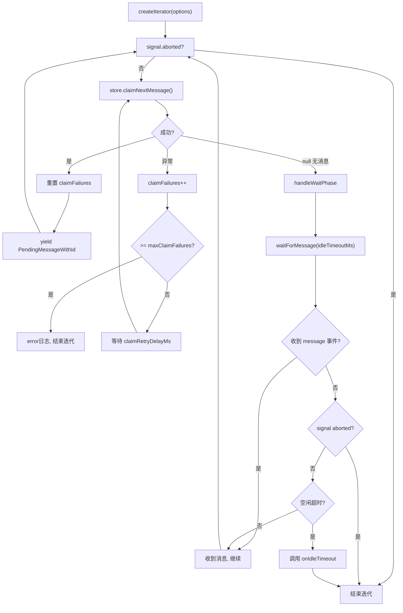

# SessionQueueProcessor.ts 需求说明

> 源文件：src/services/queue/SessionQueueProcessor.ts ｜ 类型：源码 ｜ 行数：158 ｜ 所属模块：queue ｜ 分析日期：2026-07-23

## 1. 文件定位总述

SessionQueueProcessor 是会话消息队列的异步迭代处理器，以 AsyncGenerator 模式消费 PendingMessageStore 中的待处理消息。它实现了消息认领（claim）→ 产出（yield）→ 等待新消息的循环，支持 AbortSignal 取消、空闲超时自动中止、认领失败重试（带上限和退避延迟）。该处理器是 Worker 消息处理管道的核心消费者，将数据库持久化的消息转化为流式输出供下游 AI 子进程消费。

## 2. 功能需求

| 编号 | 需求描述（系统应当…） | 触发条件 / 输入 | 处理规则与输出 | 证据 |
|------|----------------------|----------------|---------------|------|
| FR-ITERATE-01 | 系统应当以异步迭代器模式消费消息队列 | 调用 createIterator(options) | 返回 AsyncIterableIterator<PendingMessageWithId>，在循环中持续 claim 和 yield 消息直到中止 | `SessionQueueProcessor.ts:23-70` |
| FR-CLAIM-01 | 系统应当从持久化存储中认领下一条消息 | 每次迭代循环 | 调用 store.claimNextMessage(sessionDbId)；成功则重置失败计数并 yield | `SessionQueueProcessor.ts:37-56` |
| FR-RETRY-01 | 系统应当在认领失败时重试并限制次数 | claim 抛出异常 | 记录 error 日志，等待 claimRetryDelayMs（默认 250ms）后重试；达到 maxClaimFailures（默认 3 次）后终止迭代器 | `SessionQueueProcessor.ts:41-50` |
| FR-WAIT-01 | 系统应当在无消息时等待新消息到达 | claim 返回 null | 通过 EventEmitter 的 message 事件或 AbortSignal 或超时等待；收到消息返回 true 继续循环 | `SessionQueueProcessor.ts:59-69,105-136` |
| FR-IDLE-01 | 系统应当在空闲超时后触发中止回调 | 无消息持续时间 >= idleTimeoutMs（默认 3 分钟） | 记录 info 日志，调用 onIdleTimeout 回调，迭代器返回（生成器结束） | `SessionQueueProcessor.ts:90-100` |
| FR-ABORT-01 | 系统应当响应取消信号立即终止 | AbortSignal 触发 abort | 清理所有等待资源（timeout、event listener），迭代器返回 | `SessionQueueProcessor.ts:35,63` |
| FR-ENRICH-01 | 系统应当将持久化消息转为带 ID 的待处理消息 | claim 成功后 | 将 PersistentPendingMessage 转为 PendingMessageWithId，附加 _persistentId 和 _originalTimestamp | `SessionQueueProcessor.ts:72-79` |

## 3. 业务规则与约束

- **默认空闲超时**：3 分钟（180000ms），超过后触发中止 (`SessionQueueProcessor.ts:6`)
- **默认认领重试**：最多 3 次，间隔 250ms (`SessionQueueProcessor.ts:29-30`)
- **AbortSignal 传播**：所有等待操作（消息等待、重试延迟）都监听 AbortSignal，确保取消信号能立即终止所有阻塞 (`SessionQueueProcessor.ts:132-133,155`)
- **事件清理**：waitForMessage 中的 cleanup 函数确保 timeout、event listener、abort listener 全部移除，避免内存泄漏 (`SessionQueueProcessor.ts:124-130`)
- **失败计数重置**：每次成功 claim 后 claimFailures 归零，不会因偶尔失败累积 (`SessionQueueProcessor.ts:53`)

## 4. 对外暴露

| 公开方法 | 签名 | 说明 |
|---------|------|------|
| createIterator | (options: CreateIteratorOptions): AsyncIterableIterator<PendingMessageWithId> | 创建异步消息迭代器 |

**CreateIteratorOptions 接口** (`SessionQueueProcessor.ts:8-15`)：
```typescript
{
  sessionDbId: number;
  signal: AbortSignal;
  onIdleTimeout?: () => void;
  idleTimeoutMs?: number;        // 默认 180000
  claimRetryDelayMs?: number;    // 默认 250
  maxClaimFailures?: number;     // 默认 3
}
```

## 5. 依赖关系

- **核心依赖**：PendingMessageStore（消息持久化存储，提供 claimNextMessage 和 toPendingMessage）
- **事件依赖**：EventEmitter（等待新消息事件）
- **类型依赖**：PendingMessageWithId（来自 worker-types.ts）
- **上游调用**：SessionManager（创建迭代器供 AI 子进程消费）

## 6. 数据结构

**消息转换流程**：PersistentPendingMessage（数据库记录） → PendingMessageWithId（附加 _persistentId 和 _originalTimestamp）

## 7. 复杂逻辑图示



## 8. 逆向备注

- createIterator 使用 async generator（`async *`）模式，这是 Node.js 中处理异步数据流的惯用方式，调用方可用 `for await...of` 消费 (`SessionQueueProcessor.ts:23`)。
- waitForMessage 返回 Promise<boolean> 而非 Promise<void>，返回值表示是否收到了消息（true）还是因超时/abort 结束（false），但 handleWaitPhase 中仅使用"未收到消息"条件判断空闲超时 (`SessionQueueProcessor.ts:90-91`)。
- 空闲超时的触发条件是"无消息状态持续时间 >= idleTimeoutMs"，而非"最后一次活动距今 >= idleTimeoutMs"——如果中间有消息到来，lastActivityTime 会被更新，空闲计时器重新开始 (`SessionQueueProcessor.ts:54,62`)。
- claimRetryDelayMs 参数名暗示了退避策略，但实际使用固定延迟（未实现指数退避）(`SessionQueueProcessor.ts:48`)。
