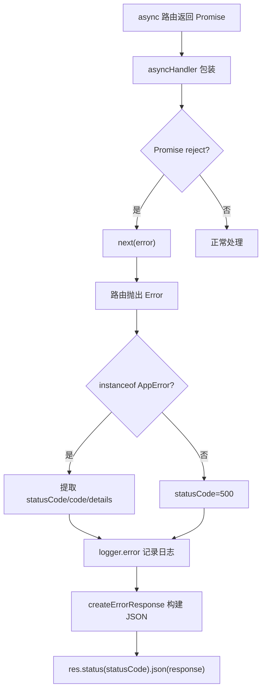

# ErrorHandler.ts 需求说明

> 源文件：src/services/server/ErrorHandler.ts | 类型：源码 | 行数：73 | 所属模块：server | 分析日期：2026-07-23

## 1. 文件定位总述

ErrorHandler 是 Worker HTTP 服务器的统一错误处理基础设施，提供自定义错误类 `AppError`、标准化错误响应构建器 `createErrorResponse`、Express 全局错误中间件 `errorHandler`、404 兜底处理器 `notFoundHandler`，以及异步路由处理器的 Promise 桥接工具 `asyncHandler`。它确保所有 HTTP 错误以一致的 JSON 格式返回给客户端，并记录结构化日志。

## 2. 功能需求

| 编号 | 需求描述（系统应当…） | 触发条件 / 输入 | 处理规则与输出 | 证据 |
|------|----------------------|----------------|---------------|------|
| FR-ErrorHandler-01 | 系统应当提供可携带 HTTP 状态码和业务错误码的自定义错误类 | 代码中 `throw new AppError(message, statusCode, code, details)` | `AppError` 继承 `Error`，固定 `name` 为 `'AppError'`，携带 `statusCode`（默认 500）、`code`、`details` 属性 | `src/services/server/ErrorHandler.ts:12-22` |
| FR-ErrorHandler-02 | 系统应当构建标准化的 JSON 错误响应 | 调用 `createErrorResponse(error, message, code?, details?)` | 返回 `ErrorResponse` 对象，始终包含 `error` 和 `message` 字段，可选包含 `code` 和 `details` | `src/services/server/ErrorHandler.ts:24-34` |
| FR-ErrorHandler-03 | 系统应当通过 Express 中间件统一捕获并处理路由错误 | Express 路由抛出 Error 或 AppError | 从 `AppError` 提取 statusCode，普通 Error 默认 500；记录结构化日志（含方法、路径、状态码、错误消息、错误码）；返回 JSON 响应 | `src/services/server/ErrorHandler.ts:36-58` |
| FR-ErrorHandler-04 | 系统应当对未匹配路由返回 404 | 请求路径未匹配任何已注册路由 | 返回 `{ error: 'NotFound', message: 'Cannot {method} {path}' }`，HTTP 404 | `src/services/server/ErrorHandler.ts:60-65` |
| FR-ErrorHandler-05 | 系统应当将 async 路由处理器的 rejection 桥接至 Express 的 next 管道 | 调用 `asyncHandler(fn)` 包装 async 路由处理函数 | 返回同步函数，将 Promise rejection 传入 `next()` 触发全局错误中间件 | `src/services/server/ErrorHandler.ts:67-73` |

## 3. 业务规则与约束

- **默认状态码**：非 `AppError` 类型的错误统一返回 500。`src/services/server/ErrorHandler.ts:42`
- **日志级别固定**：错误中间件始终使用 `logger.error`，不区分 4xx 和 5xx 的日志级别。`src/services/server/ErrorHandler.ts:44`
- **幂等性**：`createErrorResponse` 是纯函数，不产生副作用。`src/services/server/ErrorHandler.ts:24`

## 4. 对外暴露

| 名称 | 类型 | 说明 |
|------|------|------|
| `AppError` | 类 | 自定义 HTTP 错误类 |
| `createErrorResponse(error, message, code?, details?)` | 函数 | 构建标准化错误响应 |
| `errorHandler` | Express 中间件 | 全局错误处理（ErrorRequestHandler） |
| `notFoundHandler` | Express 处理器 | 404 兜底 |
| `asyncHandler(fn)` | 高阶函数 | async 路由 Promise 桥接 |
| `ErrorResponse` | 接口 | 错误响应类型定义 |

## 5. 依赖关系

- **express**（Request, Response, NextFunction, ErrorRequestHandler）：Express 类型
- **logger**（`../../utils/logger.js`）：结构化日志记录

## 6. 数据结构

**ErrorResponse**（接口）：
```typescript
{
  error: string;       // 错误类型名
  message: string;    // 人类可读消息
  code?: string;      // 业务错误码
  details?: unknown;  // 附加详情
}
```

## 7. 复杂逻辑图示



错误处理链从路由异常出发，通过 AppError 类型判断提取状态码，统一记录日志后返回 JSON 响应。asyncHandler 作为异步桥接器将 Promise rejection 转为中间件管道中的 error。

## 8. 逆向备注

- `asyncHandler` 与 `BaseRouteHandler.wrapHandler` 功能存在重叠。推断：（`asyncHandler` 是全局通用工具，`wrapHandler` 是 `BaseRouteHandler` 的实例方法，两者用途不同——前者用于非继承 BaseRouteHandler 的路由场景）。
