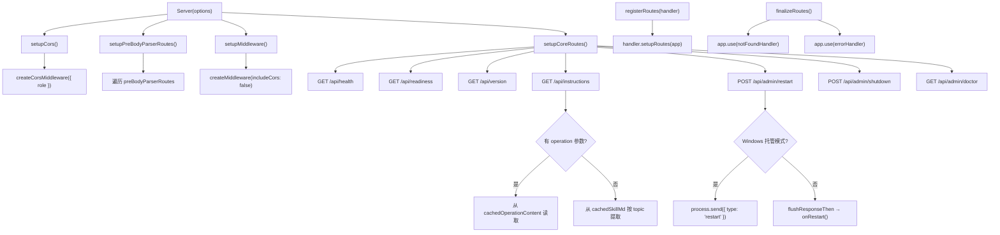

# Server.ts 需求说明

> 源文件：`src/services/server/Server.ts` ｜ 类型：源码 ｜ 行数：335 ｜ 所属模块：server ｜ 分析日期：2026-07-23

## 1. 文件定位总述

Server 是 claude-mem Worker 进程的 HTTP 服务器封装类，基于 Express 构建。它提供系统健康检查、就绪探测、版本查询、Skill 指令文档查询、管理员操作（重启/关闭/诊断）等核心端点，并通过 `registerRoutes` 和 `finalizeRoutes` 支持模块化路由注册。Server 在启动时缓存 Skill 指令文件（SKILL.md 和操作指令文件），避免运行时重复磁盘 I/O。它还集成了 CORS 中间件、请求体中间件、localhost 访问控制和全局错误处理。

## 2. 功能需求

| 编号 | 需求描述（系统应当…） | 触发条件 / 输入 | 处理规则与输出 | 证据 |
|------|----------------------|----------------|---------------|------|
| FR-SRV-01 | 系统应当创建并配置 Express 应用 | 构造 Server 实例 | 依次设置 CORS、preBodyParser 路由、通用中间件和核心路由 | `Server.ts:99-106` |
| FR-SRV-02 | 系统应当在指定端口和主机上启动 HTTP 监听 | 调用 `listen(port, host)` | 使用 `http.createServer` 包装 Express app；返回 Promise，成功或失败通过 resolve/reject 通知；记录启动日志 | `Server.ts:112-129` |
| FR-SRV-03 | 系统应当优雅关闭 HTTP 服务器 | 调用 `close()` | 调用 `closeAllConnections()` 关闭所有连接；Windows 平台额外等待 500ms 后再执行 `server.close()`；关闭后再次等待 500ms | `Server.ts:131-149` |
| FR-SRV-04 | 系统应当提供健康检查端点 | GET /api/health | 返回 JSON 包含 status（ok/degraded）、runtime、version、workerPath、uptime、managed、hasIpc、platform、pid、initialized、mcpReady、ai 状态、rateLimits、队列健康信息；若 BullMQ Redis 异常则 status=503 degraded | `Server.ts:178-199` |
| FR-SRV-05 | 系统应当提供就绪探测端点 | GET /api/readiness | 若初始化完成返回 200 { status: 'ready' }，否则返回 503 { status: 'initializing' } | `Server.ts:201-213` |
| FR-SRV-06 | 系统应当提供版本查询端点 | GET /api/version | 返回 JSON { version: string } | `Server.ts:215-217` |
| FR-SRV-07 | 系统应当提供 Skill 指令查询端点 | GET /api/instructions?topic=&operation= | 验证 topic 和 operation 参数的合法性；若指定 operation 则返回对应操作指令缓存；否则从 SKILL.md 缓存中按 topic 提取对应段落返回；无效参数返回 400，缓存未命中返回 404 | `Server.ts:219-246` |
| FR-SRV-08 | 系统应当在启动时缓存 Skill 指令文件 | Server 模块加载时 | 读取 `skills/mem-search/SKILL.md` 到 `cachedSkillMd`；遍历 ALLOWED_OPERATIONS 读取对应 `.md` 文件到 `cachedOperationContent` Map | `Server.ts:22-59` |
| FR-SRV-09 | 系统应当支持管理员重启操作 | POST /api/admin/restart（需 localhost） | Windows 托管模式通过 `process.send({ type: 'restart' })` 通知包装进程；其他模式通过 `flushResponseThen` 先发送响应再执行 onRestart 回调 | `Server.ts:248-260` |
| FR-SRV-10 | 系统应当支持管理员关闭操作 | POST /api/admin/shutdown（需 localhost） | Windows 托管模式通过 `process.send({ type: 'shutdown' })` 通知包装进程；其他模式通过 `flushResponseThen` 先发送响应再执行 onShutdown 回调 | `Server.ts:262-274` |
| FR-SRV-11 | 系统应当提供管理员诊断端点 | GET /api/admin/doctor（需 localhost） | 返回 supervisor 状态（pid/uptime）、所有注册进程（id/pid/type/status/startedAt）、死亡进程 PID 列表、环境变量清洁检查 | `Server.ts:276-312` |
| FR-SRV-12 | 系统应当支持模块化路由注册 | 调用 `registerRoutes(handler)` | 将外部 RouteHandler 的路由注册到 Express app | `Server.ts:152-154` |
| FR-SRV-13 | 系统应当在路由注册完成后添加 404 和错误处理 | 调用 `finalizeRoutes()` | 添加 notFoundHandler 和 errorHandler 中间件 | `Server.ts:156-159` |
| FR-SRV-14 | 系统应当从 SKILL.md 缓存中按主题提取指令段落 | topic 参数为 workflow/search_params/examples | 使用 `extractBetween` 按标记标题提取对应段落；topic 为 'all' 则返回完整内容 | `Server.ts:315-334` |

## 3. 业务规则与约束

- **Skill 指令缓存策略**：所有指令文件在 Server 模块加载时一次性读取并缓存（`Server.ts:22-59`），运行时不再访问磁盘。
- **管理员端点需 localhost**：`/api/admin/*` 端点均使用 `requireLocalhost` 中间件保护（`Server.ts:248,262,276`）。
- **Windows 平台特殊处理**：关闭和重启操作在 Windows 托管模式下通过 IPC 消息（`process.send`）委托给包装进程；关闭时额外等待 500ms 两次（`Server.ts:136-148`）。
- **flushResponseThen 模式**：重启和关闭操作先发送 HTTP 响应再执行异步操作（`Server.ts:258,272`），确保客户端收到响应。
- **健康检查降级**：当 BullMQ Redis 状态为 error 时返回 503 和 degraded 状态（`Server.ts:182-183`）。
- **版本回退**：构建时版本通过 `__DEFAULT_PACKAGE_VERSION__` 注入，未定义时回退为 `'development'`（`Server.ts:62-64`）。
- **路由注册顺序**：preBodyParser 路由 → CORS → 通用中间件 → 核心路由 → 外部注册路由 → 404/错误处理（`Server.ts:103-106,156-159`）。

## 4. 对外暴露

| 公开成员 | 类型 | 说明 |
|---------|------|------|
| `Server` | class | HTTP 服务器主类 |
| `RouteHandler` | interface | 路由注册接口，含 `setupRoutes(app)` |
| `ServerOptions` | interface | 服务器配置选项 |
| `AiStatus` | interface | AI 状态信息 |

**ServerOptions**：
```typescript
interface ServerOptions {
  getInitializationComplete: () => boolean;     // 初始化完成状态
  getMcpReady: () => boolean;                     // MCP 就绪状态
  onShutdown: () => Promise<void>;                // 关闭回调
  onRestart: () => Promise<void>;                 // 重启回调
  workerPath: string;                             // Worker 路径
  runtime?: string;                               // 运行时标识
  getAiStatus: () => AiStatus;                    // AI 状态查询
  preBodyParserRoutes?: RouteHandler[];           // 预 bodyParser 路由
  getQueueHealth?: () => ObservationQueueHealth | null | Promise<...>;  // 队列健康
  role?: 'client' | 'server';                      // 角色（影响 CORS）
}
```

**核心端点清单**：

| 方法 | 路径 | 说明 |
|------|------|------|
| GET | /api/health | 健康检查 |
| GET | /api/readiness | 就绪探测 |
| GET | /api/version | 版本查询 |
| GET | /api/instructions | Skill 指令查询 |
| POST | /api/admin/restart | 重启（localhost） |
| POST | /api/admin/shutdown | 关闭（localhost） |
| GET | /api/admin/doctor | 诊断（localhost） |

## 5. 依赖关系

**内部依赖**：
- `src/server/allowed-constants.ts` → `ALLOWED_OPERATIONS`/`ALLOWED_TOPICS`（`Server.ts:6`）
- `src/server/Middleware.ts` → `createCorsMiddleware`/`createMiddleware`/`summarizeRequestBody`/`requireLocalhost`（`Server.ts:8`）
- `src/server/ErrorHandler.ts` → `errorHandler`/`notFoundHandler`（`Server.ts:9`）
- `src/supervisor/index.ts` → `getSupervisor`（`Server.ts:10`）
- `src/supervisor/process-registry.ts` → `isPidAlive`（`Server.ts:11`）
- `src/supervisor/env-sanitizer.ts` → `ENV_PREFIXES`/`ENV_EXACT_MATCHES`（`Server.ts:12`）
- `src/server/flushResponseThen.ts` → `flushResponseThen`（`Server.ts:13`）
- `src/shared/uptime.ts` → `getUptimeSeconds`（`Server.ts:14`）
- `src/services/worker/RateLimitStore.ts` → `globalRateLimitStore`（`Server.ts:15`）

**外部依赖**：
- `express`、`http`、`fs`、`path`

## 6. 数据结构

**AiStatus**（AI 状态信息）：
```typescript
interface AiStatus {
  provider: string;
  authMethod: string;
  lastInteraction: {
    timestamp: number;
    success: boolean;
    error?: string;
  } | null;
}
```

**健康检查响应结构**：
```json
{
  "status": "ok" | "degraded",
  "runtime": "string",
  "version": "string",
  "workerPath": "string",
  "uptime": "number",
  "managed": "boolean",
  "hasIpc": "boolean",
  "platform": "string",
  "pid": "number",
  "initialized": "boolean",
  "mcpReady": "boolean",
  "ai": { "provider": "string", "authMethod": "string", "lastInteraction": "..." },
  "rateLimits": "...",
  "queue": { "engine": "...", "redis": { "status": "..." } }
}
```

## 7. 复杂逻辑图示



上图展示了 Server 的构造流程和核心路由布局。Server 在构造时按序设置 CORS、预处理器路由、通用中间件和核心路由，之后通过 `registerRoutes` 和 `finalizeRoutes` 完成外部路由注册和错误处理兜底。

## 8. 逆向备注

- `cachedSkillMd` 和 `cachedOperationContent` 使用 IIFE 在模块加载时初始化（`Server.ts:22-59`），这意味着 Server 模块被 import 时就会触发文件读取。若文件不存在则缓存为 null/空 Map，运行时返回 404。
- `/api/instructions` 端点支持两种查询模式：按 `operation` 返回单个操作指令文件，或按 `topic` 返回 SKILL.md 中的段落。两种模式互斥（`Server.ts:231-245`），但代码中未显式拒绝同时传入两者——推断：（operation 优先，topic 被忽略）。
- `/api/admin/doctor` 端点的环境变量清洁检查（`Server.ts:291-293`）判断是否有敏感环境变量残留，但仅返回 boolean 结果，不列出具体变量名。
- `extractBetween` 方法（`Server.ts:326-334`）在找不到结束标记时返回从起始标记到文件末尾的内容（`Server.ts:331`），这是一种容错设计。
- 版本号 `__DEFAULT_PACKAGE_VERSION__`（`Server.ts:61`）通过 `declare const` 声明为编译时注入的全局变量，由构建脚本替换。
