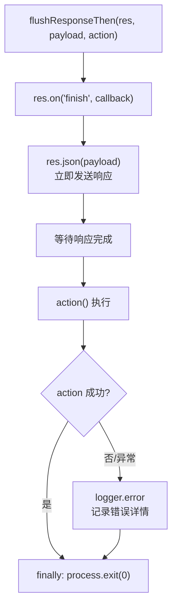

# flushResponseThen.ts 需求说明

> 源文件：src/services/server/flushResponseThen.ts ｜ 类型：源码（工具函数） ｜ 行数：23 ｜ 所属模块：server ｜ 分析日期：2026-07-23

## 1. 文件定位总述

本文件提供一个 HTTP 响应后置动作工具函数，用于在 Express 响应发送完成（`finish` 事件）后执行异步操作并立即退出进程。它解决了"先给客户端返回响应，再执行耗时清理后退出"的需求模式，同时确保后置动作失败时有完整的错误日志记录（而非静默吞掉）。

## 2. 功能需求

| 编号 | 需求描述（系统应当…） | 触发条件 / 输入 | 处理规则与输出 | 证据 |
|------|----------------------|----------------|---------------|------|
| FR-Flush-01 | 系统应当先发送 JSON 响应给客户端，再在响应完成事件后执行指定的后置动作 | flushResponseThen 被调用 | 立即调用 `res.json(payload)` 发送响应，注册 `res.on('finish', ...)` 监听器 | `src/services/server/flushResponseThen.ts:8-21` |
| FR-Flush-02 | 系统应当在后置动作执行完毕后（无论成功或失败）以退出码 0 退出进程 | finish 事件触发 | action() 执行后，finally 块中 `process.exit(0)` | `src/services/server/flushResponseThen.ts:17-18` |
| FR-Flush-03 | 系统应当捕获后置动作的异常并记录错误日志，防止静默失败 | action() 抛出异常 | catch 块中通过 logger.error 记录错误，然后继续执行 finally 中的 process.exit(0) | `src/services/server/flushResponseThen.ts:14-16` |

## 3. 业务规则与约束

- **响应优先**：JSON 响应在注册 finish 监听器之前就已发送（`res.json(payload)` 在 `res.on('finish', ...)` 之后调用但会先被 flush），确保客户端不会被阻塞（`src/services/server/flushResponseThen.ts:9,21`）
- **固定退出码 0**：无论后置动作成功或失败，进程都以退出码 0 退出，遵循项目的"不阻塞宿主终端"退出策略（`src/services/server/flushResponseThen.ts:18`）
- **错误不可吞**：注释提到之前的问题（X-004）是 action 失败被静默吞掉导致进程中途退出无诊断信息（`src/services/server/flushResponseThen.ts:13-14`）

## 4. 对外暴露

| 类别 | 名称 | 类型 | 说明 |
|------|------|------|------|
| 函数 | flushResponseThen | `(res: Response, payload: unknown, action: () => void \| Promise<void>) => void` | 发送响应后执行动作并退出 |

## 5. 依赖关系

- **上游**：`express`（Response 类型）、`../../utils/logger.js`
- **下游**：Worker HTTP API 中需要在返回响应后执行清理并退出的端点（如 shutdown、restart 等管理端点）

## 6. 数据结构

不适用。

## 7. 复杂逻辑图示

上图展示了"响应先行、动作后置、退出兜底"的执行模式。客户端先收到响应，服务端在后台完成清理工作后退出。

## 8. 逆向备注

- 推断（依据函数命名和退出策略）：此函数用于 Worker 的管理端点（如 `/api/shutdown`、`/api/restart`），在这些场景下需要先给 MCP 客户端返回成功响应，再执行实际的进程退出或重启操作。
- 退出码固定为 0 是为了符合项目的 hook 退出码策略——ERROR 级别日志已记录到诊断系统，退出码 0 避免触发宿主环境的错误处理。
