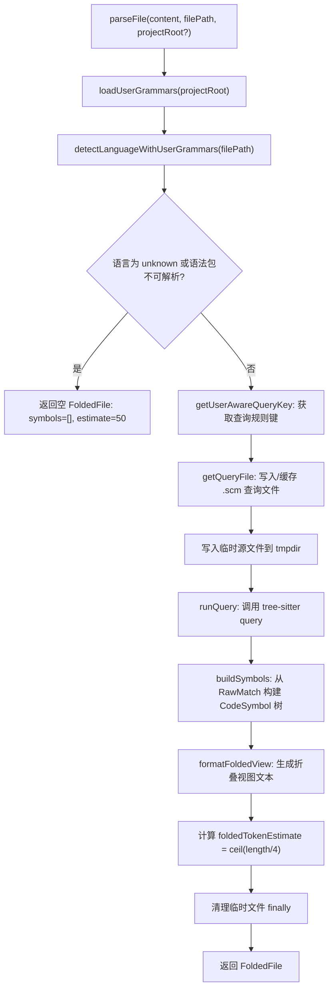
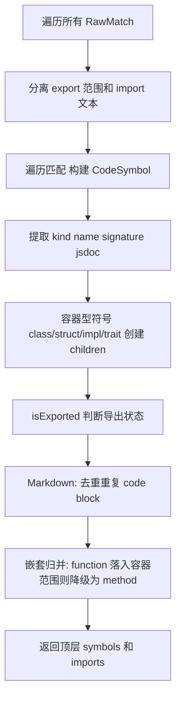

# parser.ts 需求说明

> 源文件：src/services/smart-file-read/parser.ts ｜ 类型：源码 ｜ 行数：1042 ｜ 所属模块：smart-file-read ｜ 分析日期：2026-07-23

## 1. 文件定位总述

parser.ts 是 claude-mem 智能文件读取（smart-file-read）子系统的核心解析器，负责通过 tree-sitter 对源代码文件进行语法分析，提取函数、类、方法、接口等代码符号的结构化信息，并生成"折叠视图"（folded view）供 Claude 在上下文窗口有限时快速理解文件骨架。该模块支持 26 种编程语言的扩展名检测和 tree-sitter 语法定义，内置 15 种语言的定制化查询规则（含 generic 兜底），并允许用户通过项目级 `.claude-mem.json` 配置自定义语法和查询文件。对外暴露单文件解析（`parseFile`）、批量解析（`parseFilesBatch`）、折叠视图格式化（`formatFoldedView`）和符号展开（`unfoldSymbol`）四个核心功能，是文件上下文注入链路的关键组件。

## 2. 功能需求

| 编号 | 需求描述（系统应当…） | 触发条件 / 输入 | 处理规则与输出 | 证据 |
|------|----------------------|----------------|---------------|------|
| FR-PARSE-01 | 系统应当根据文件内容、路径和项目根目录解析出代码符号结构 | 调用 `parseFile(content, filePath, projectRoot?)` | 检测语言 → 解析语法包路径 → 加载用户语法配置 → 生成查询文件 → 调用 tree-sitter query → 构建 CodeSymbol 树 → 计算 foldedTokenEstimate，返回 `FoldedFile` | `src/services/smart-file-read/parser.ts:762-802` |
| FR-PARSE-02 | 系统应当支持按语言分组的批量文件解析以提高效率 | 调用 `parseFilesBatch(files, projectRoot?)` | 将文件按语言分组，每组共享一个语法包和查询文件，通过 `runBatchQuery` 一次性查询多文件，结果按 relativePath 分发 | `src/services/smart-file-read/parser.ts:804-858` |
| FR-PARSE-03 | 系统应当将解析后的符号结构格式化为可读的折叠视图 | 调用 `formatFoldedView(file)` | 按语言区分格式：代码文件输出文件头（含语言和行数）、imports 汇总（限10条）、各符号（含图标、名称、导出标记、行号、签名、JSDoc 首行、子符号）；Markdown 文件输出标题层级、代码块、frontmatter、引用链接 | `src/services/smart-file-read/parser.ts:860-886` |
| FR-PARSE-04 | 系统应当支持按符号名称展开提取源码片段（含上方注释） | 调用 `unfoldSymbol(content, filePath, symbolName)` | 解析文件 → 递归查找匹配符号名 → Markdown 按标题层级确定范围提取章节；代码文件提取从注释区到符号结束的全部行，添加定位注释前缀 | `src/services/smart-file-read/parser.ts:985-1041` |
| FR-PARSE-05 | 系统应当根据文件扩展名检测编程语言 | 任意解析操作 | 内置 34 种扩展名到语言的映射（`LANG_MAP`），支持 `.js/.mjs/.cjs/.jsx/.ts/.tsx/.py/.go/.rs/.rb/.java/.c/.cpp/.kt/.swift/.php/.ex/.lua/.scala/.sh/.hs/.zig/.css/.scss/.toml/.yml/.sql/.md/.mdx` 等 | `src/services/smart-file-read/parser.ts:34-76` |
| FR-PARSE-06 | 系统应当支持通过项目级配置文件添加自定义语法包和查询规则 | 项目根目录存在 `.claude-mem.json` 且含 `grammars` 字段 | 解析配置中的 language → { package, extensions, query? } 映射；若内置语法包已存在则跳过；自定义查询文件路径相对于项目根目录解析，成功加载后存入 `QUERIES` 缓存 | `src/services/smart-file-read/parser.ts:112-181` |
| FR-PARSE-07 | 系统应当从 26 种语言的 tree-sitter 语法包中解析代码符号 | 语言检测成功且语法包可解析 | 通过 `require.resolve` 查找内置语法包的 package.json 获取路径；部分语言（如 markdown）需特殊子目录处理 | `src/services/smart-file-read/parser.ts:183-237` |
| FR-PARSE-08 | 系统应当构建代码符号的父子层级关系 | tree-sitter query 返回原始匹配后 | 识别容器型符号（class、struct、impl、trait），将落入其行范围内的顶层 function 符号降级为 method 并移入 children 数组 | `src/services/smart-file-read/parser.ts:714-759` |
| FR-PARSE-09 | 系统应当提取代码符号的签名信息 | 构建符号时 | 代码文件取首行至首个 `{` 或 `:` 为止的文本；Markdown section 取 `#` 等级+标题名；Markdown code block 取语言标签；Markdown metadata 取固定标记 | `src/services/smart-file-read/parser.ts:586-601,685-699` |
| FR-PARSE-10 | 系统应当提取代码符号上方的注释/JSDoc 信息 | 构建符号时 | 向上扫描注释行（`/**`、`*`、`*/`、`//`、`///`、`//!`、`#`、`@`）；Python 额外检查函数体前 3 行的 docstring（`"""` 或 `'''`） | `src/services/smart-file-read/parser.ts:603-634` |
| FR-PARSE-11 | 系统应当根据语言特征判断符号是否为导出符号 | 构建符号时 | JS/TS/TSX：检查是否在 export 语句行范围内；Python：不以 `_` 开头；Go：首字母大写；Rust：行首含 `pub`；其他语言：默认 true | `src/services/smart-file-read/parser.ts:636-655` |
| FR-PARSE-12 | 系统应当对 Markdown 文件的重复代码块去重 | 构建 Markdown 符号时 | 按行范围去重：同一范围内有命名块和匿名块时，保留命名块、移除匿名块 | `src/services/smart-file-read/parser.ts:722-745` |

## 3. 业务规则与约束

### 3.1 语言检测规则

- **扩展名优先级**：内置 `LANG_MAP` 优先匹配；匹配不到时查用户自定义 `extensionToLanguage`；均无则返回 `"unknown"`。`src/services/smart-file-read/parser.ts:78-83`
- **语言别名共享**：JavaScript/TypeScript/TSX 共享 `jsts` 查询规则（`src/services/smart-file-read/parser.ts:423-427`）；Elixir 降级使用 `generic` 查询（`src/services/smart-file-read/parser.ts:436`）。

### 3.2 语法包解析规则

- **内置语法包优先**：若内置 `GRAMMAR_PACKAGES` 已包含该语言，则忽略用户自定义的同一语言语法包（`src/services/smart-file-read/parser.ts:139`）。
- **用户语法包回退**：内置包不可用时，尝试从项目 `node_modules` 中查找用户指定的包（`src/services/smart-file-read/parser.ts:239-261`）。
- **特殊子目录**：markdown 语法包需在 `tree-sitter-markdown` 子目录下查找（`src/services/smart-file-read/parser.ts:211-213`）。

### 3.3 tree-sitter 查询执行规则

- **查询文件缓存**：查询内容写入临时目录 `smart-read-queries-*` 下的 `.scm` 文件，按 queryKey 缓存路径避免重复写入。`src/services/smart-file-read/parser.ts:452-466`
- **单文件超时**：tree-sitter query 调用超时 30 秒（`src/services/smart-file-read/parser.ts:515`）。
- **批量查询**：`runBatchQuery` 将多个文件路径一次性传给 tree-sitter，输出按文件名分行解析（`src/services/smart-file-read/parser.ts:507-522`）。
- **临时源文件**：单文件解析时将内容写入临时目录 `smart-src-*` 下的临时文件，解析后在 finally 中清理（`src/services/smart-file-read/parser.ts:779-801`）。

### 3.4 折叠视图格式规则

- **Token 估算**：`foldedTokenEstimate = Math.ceil(folded.length / 4)`（`src/services/smart-file-read/parser.ts:797`）；语法包不可用时默认估算为 50（`src/services/smart-file-read/parser.ts:771`）。
- **Imports 展示上限**：折叠视图中 imports 最多显示 10 条，超出显示 `+N more`（`src/services/smart-file-read/parser.ts:872-878`）。
- **Markdown 折叠列宽**：固定 56 字符列宽，行号右对齐（`src/services/smart-file-read/parser.ts:891`）。

### 3.5 用户语法配置规则

- **配置文件路径**：项目根目录下的 `.claude-mem.json`（`src/services/smart-file-read/parser.ts:115`）。
- **配置缓存**：按 projectRoot 缓存，同一项目只解析一次（`src/services/smart-file-read/parser.ts:113`）。
- **配置结构**：`grammars` 下每个 key 为语言名，value 含 `package`（必需）、`extensions`（必需，字符串数组）、`query`（可选，查询文件路径）。

## 4. 对外暴露

| 能力名称 | 类型 | 签名 | 说明 |
|---------|------|------|------|
| `CodeSymbol` | 导出接口 | `{ name, kind, signature, jsdoc?, lineStart, lineEnd, parent?, exported, children? }` | 代码符号数据结构，kind 支持 23 种类型 |
| `FoldedFile` | 导出接口 | `{ filePath, language, symbols, imports, totalLines, foldedTokenEstimate }` | 解析后的文件结构化数据 |
| `UserGrammarEntry` | 导出接口 | `{ package, extensions, query? }` | 用户自定义语法包配置 |
| `UserGrammarConfig` | 导出接口 | `{ grammars, extensionToLanguage, languageToQueryKey }` | 用户语法配置聚合 |
| `parseFile` | 导出函数 | `(content, filePath, projectRoot?) => FoldedFile` | 单文件解析 |
| `parseFilesBatch` | 导出函数 | `(files, projectRoot?) => Map<string, FoldedFile>` | 批量文件解析 |
| `formatFoldedView` | 导出函数 | `(file: FoldedFile) => string` | 生成折叠视图文本 |
| `unfoldSymbol` | 导出函数 | `(content, filePath, symbolName) => string | null` | 按名称展开符号源码片段 |
| `loadUserGrammars` | 导出函数 | `(projectRoot: string) => UserGrammarConfig` | 加载项目级用户语法配置 |
| `resolveGrammarPathWithFallback` | 导出函数 | `(language, projectRoot?) => string | null` | 解析语法包路径（内置优先、用户自定义回退） |

## 5. 依赖关系

### 上游
- **tree-sitter-cli**：通过 `execFileSync` 调用 `tree-sitter query` 命令行工具执行语法查询。`src/services/smart-file-read/parser.ts:470-486,507-522`
- **tree-sitter 语法包**（26 个）：通过 `require.resolve` 查找已安装的 npm 语法包。`src/services/smart-file-read/parser.ts:183-209`
- **Node.js 内置模块**：`child_process`（execFileSync）、`fs`（writeFileSync, readFileSync, mkdtempSync, rmSync, existsSync）、`path`（join, dirname）、`os`（tmpdir）、`module`（createRequire）。`src/services/smart-file-read/parser.ts:2-7`
- **用户配置**：`.claude-mem.json` 中的 `grammars` 字段和自定义查询文件。`src/services/smart-file-read/parser.ts:112-181`

### 下游
- **smart-file-read 的上层调用者**：ChromaSync 或文件上下文注入模块，消费 `FoldedFile` 结构化数据用于向量嵌入或上下文预览。推断依据：模块名和导出接口的用途。

### 内部依赖
- **logger**：tree-sitter query 失败时记录日志。`src/services/smart-file-read/parser.ts:7,517`

## 6. 数据结构

### CodeSymbol（导出接口）
```
name: string           // 符号名称
kind: "function" | "class" | "method" | "interface" | "type" | "const" |
      "variable" | "export" | "struct" | "enum" | "trait" | "impl" |
      "property" | "getter" | "setter" | "mixin" | "section" | "code" |
      "metadata" | "reference"  // 符号类型（23种）
signature: string      // 签名文本（限200字符，超出截断加...）
jsdoc?: string         // 上方注释或 Python docstring
lineStart: number      // 起始行号（0-based）
lineEnd: number        // 结束行号（0-based）
parent?: string        // 父符号名（未在 buildSymbols 中赋值，推断预留）
exported: boolean      // 是否导出
children?: CodeSymbol[] // 子符号（仅容器型符号）
```
`src/services/smart-file-read/parser.ts:13-23`

### FoldedFile（导出接口）
```
filePath: string            // 文件路径
language: string             // 检测到的编程语言
symbols: CodeSymbol[]        // 顶层符号列表（子符号嵌套在 children 中）
imports: string[]            // import 语句文本列表
totalLines: number           // 文件总行数
foldedTokenEstimate: number  // 折叠视图的 token 估算值
```
`src/services/smart-file-read/parser.ts:25-32`

### KIND_MAP（内部映射）
```
func → "function", const_func → "function", cls → "class", method → "method",
iface → "interface", tdef → "type", enm → "enum", struct_def → "struct",
trait_def → "trait", impl_def → "impl", mixin_def → "mixin", heading → "section",
code_block → "code", frontmatter → "metadata", ref → "reference"
```
`src/services/smart-file-read/parser.ts:566-582`

### LANG_MAP（扩展名→语言映射，34 项）
```
.js/.mjs/.cjs → "javascript", .jsx → "tsx", .ts → "typescript", .tsx → "tsx",
.py/.pyw → "python", .go → "go", .rs → "rust", .rb → "ruby",
.java → "java", .c/.h → "c", .cpp/.cc/.cxx/.hpp/.hh → "cpp",
.kt/.kts → "kotlin", .swift → "swift", .php → "php",
.ex/.exs → "elixir", .lua → "lua", .scala/.sc → "scala",
.sh/.bash/.zsh → "bash", .hs → "haskell", .zig → "zig",
.css → "css", .scss → "scss", .toml → "toml",
.yml/.yaml → "yaml", .sql → "sql", .md → "markdown", .mdx → "markdown"
```
`src/services/smart-file-read/parser.ts:34-76`

### GRAMMAR_PACKAGES（语言→npm 包映射，26 项）
```
javascript → "tree-sitter-javascript", typescript → "tree-sitter-typescript/typescript",
tsx → "tree-sitter-typescript/tsx", python → "tree-sitter-python",
go → "tree-sitter-go", rust → "tree-sitter-rust" ...
```
`src/services/smart-file-read/parser.ts:183-209`

## 7. 复杂逻辑图示

下图展示单文件解析的完整处理流水线：



下图展示符号层级构建（`buildSymbols`）的核心逻辑：



## 8. 逆向备注

1. **`parent` 字段声明但未赋值**：`CodeSymbol` 接口声明了 `parent?: string` 字段（`src/services/smart-file-read/parser.ts:20`），但在 `buildSymbols` 函数中从未对该字段赋值。推断该字段为预留设计，当前通过 `children` 数组实现父子关系。
2. **Markdown 去重的实现方式**：Markdown 代码块去重基于行范围匹配（`src/services/smart-file-read/parser.ts:722-745`），对于同一个范围内出现的多个 code_block match，保留有命名的版本。推断 tree-sitter markdown grammar 对 fenced_code_block 会生成两个 match（一个带 language tag、一个不带）。
3. **`isExported` 的注释扫描范围**：`findCommentAbove` 向上扫描时会将空行作为注释块边界（`src/services/smart-file-read/parser.ts:609`），但不影响注释提取——空行会中断注释连续性，防止跨区块误取。
4. **批量解析直接使用原始文件路径**：`parseFilesBatch` 中使用 `absolutePaths` 直接传给 `runBatchQuery`（`src/services/smart-file-read/parser.ts:834-835`），而单文件解析需要写入临时文件（`src/services/smart-file-read/parser.ts:779-781`）。推断 tree-sitter CLI 支持直接读取原始文件路径，单文件解析写入临时文件可能是为了处理内存中的 content 字符串。
5. **用户语法查询文件动态注入 QUERIES**：自定义查询文件的内容会被直接写入全局 `QUERIES` 对象（`src/services/smart-file-read/parser.ts:168`），queryKey 格式为 `user_<language>`。这意味着用户查询文件会影响全局状态，但按 projectRoot 缓存了配置。不同项目的同名语言查询文件可能冲突。
6. **`console.error` 与 logger 混用**：自定义语法加载失败时使用 `console.error`（`src/services/smart-file-read/parser.ts:171,259`），而 tree-sitter query 失败使用 `logger.debug`（`src/services/smart-file-read/parser.ts:517`）。推断日志标准化不完全一致。
