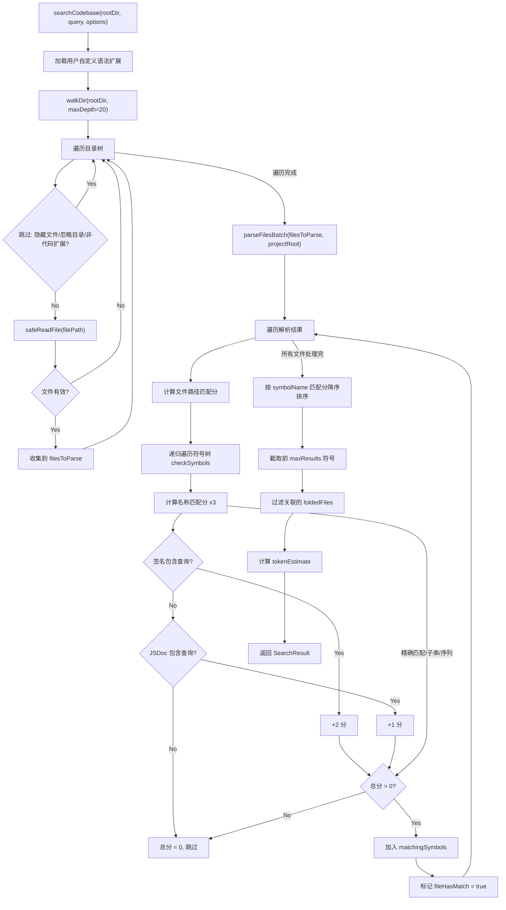
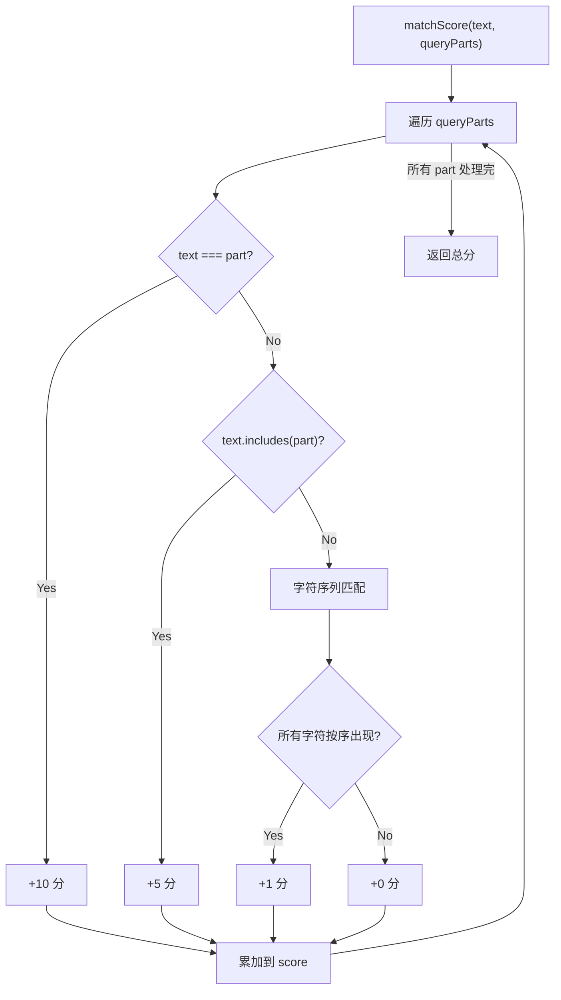

# search.ts 需求说明

> 源文件：src/services/smart-file-read/search.ts ｜ 类型：源码 ｜ 行数：304 ｜ 所属模块：smart-file-read（智能代码搜索） ｜ 分析日期：2026-07-23

## 1. 文件定位总述

search.ts 是 claude-mem 智能文件读取模块的代码搜索引擎，负责递归遍历项目目录、解析源代码文件为符号折叠视图（folded view）、并根据查询关键词匹配符号名称/签名/JSDoc 后输出格式化的搜索结果。它是"智能读取"能力的前端搜索层，与 AST 解析器（`parser.ts`）配合工作——search.ts 负责文件发现和结果匹配，parser.ts 负责将源码解析为结构化符号树。搜索采用多维度评分机制（精确匹配 > 子串包含 > 字符序列匹配），结果包含符号详情和折叠文件视图，估算输出 Token 数以控制上下文窗口消耗。

## 2. 功能需求

| 编号 | 需求描述（系统应当…） | 触发条件 / 输入 | 处理规则与输出 | 证据 |
|------|----------------------|----------------|---------------|------|
| FR-sfr-01 | 系统应当递归遍历项目目录，收集可解析的代码文件 | `searchCodebase` 内部调用 `walkDir` | 从根目录开始递归，最大深度 20 层；跳过以 `.` 开头的目录/文件（`.` 本身除外）和预定义忽略目录列表（node_modules, .git, dist 等）；仅收集 `CODE_EXTENSIONS` 集合中的扩展名文件，加上用户自定义语法扩展 | `src/services/smart-file-read/search.ts:61-87` |
| FR-sfr-02 | 系统应当安全读取文件内容，跳过大文件和二进制文件 | `safeReadFile(filePath)` | 文件大小超过 512KB（`MAX_FILE_SIZE`）则跳过；空文件跳过；前 1000 字符含 `\0` 则判定为二进制文件跳过；读取失败记录 debug 日志后跳过 | `src/services/smart-file-read/search.ts:89-104` |
| FR-sfr-03 | 系统应当将查询关键词拆分为多部分进行多维度匹配 | `searchCodebase` 执行符号匹配时 | 将查询转为小写后按 `[\\s_\\-./]+` 拆分为多个 token；对每个 token 计算匹配分（精确匹配 +10、子串包含 +5、字符序列 +1）；文件路径也参与匹配（匹配分 >= 1 即纳入结果） | `src/services/smart-file-read/search.ts:117-118,232-255` |
| FR-sfr-04 | 系统应当对符号的名称、签名和 JSDoc 进行多字段匹配 | `checkSymbols` 内部 | 名称匹配权重 x3；签名包含匹配 +2；JSDoc 包含匹配 +1；任一字段匹配即纳入结果 | `src/services/smart-file-read/search.ts:162-201` |
| FR-sfr-05 | 系统应当按匹配分数降序排列结果并限制返回数量 | 匹配完成后 | 按 `matchScore(symbolName, queryParts)` 降序排序；截取前 `maxResults`（默认 20）条符号；关联文件也按符号匹配过滤 | `src/services/smart-file-read/search.ts:211-219` |
| FR-sfr-06 | 系统应当支持按文件路径模式过滤搜索范围 | `searchCodebase` 传入 `filePattern` 选项 | 文件相对路径必须包含 `filePattern`（不区分大小写子串匹配） | `src/services/smart-file-read/search.ts:134-137` |
| FR-sfr-07 | 系统应当加载用户自定义语法扩展 | `searchCodebase` 初始化时 | 通过 `loadUserGrammars(projectRoot)` 加载用户配置，提取不在内置 `CODE_EXTENSIONS` 中的扩展名作为额外扩展 | `src/services/smart-file-read/search.ts:121-129` |
| FR-sfr-08 | 系统应当返回搜索结果的结构化摘要 | `searchCodebase` 返回 | 包含 `foldedFiles`（匹配的折叠文件视图）、`matchingSymbols`（匹配的符号详情）、`totalFilesScanned`（扫描文件总数）、`totalSymbolsFound`（总符号数）、`tokenEstimate`（折叠视图 Token 估算） | `src/services/smart-file-read/search.ts:223-229` |
| FR-sfr-09 | 系统应当将搜索结果格式化为人类可读文本 | 调用 `formatSearchResults(result, query)` | 输出标题（查询词 + 统计信息）+ 匹配符号列表（kind + 全限定名 + 路径:行号 + 签名 + JSDoc 首行）+ 折叠文件视图 + 操作建议 | `src/services/smart-file-read/search.ts:265-303` |

## 3. 业务规则与约束

1. **文件大小限制**：单个文件最大 512KB（`MAX_FILE_SIZE = 512 * 1024`），超过则跳过不报错。`src/services/smart-file-read/search.ts:40`
2. **递归深度限制**：最大深度 20 层，防止深层嵌套目录导致的性能问题。`src/services/smart-file-read/search.ts:61`
3. **忽略目录列表**：`node_modules, .git, dist, build, .next, __pycache__, .venv, venv, env, .env, target, vendor, .cache, .turbo, coverage, .nyc_output, .claude, .smart-file-read`。`src/services/smart-file-read/search.ts:33-38`
4. **隐藏文件跳过**：以 `.` 开头的目录和文件被跳过（`entry.name.startsWith(".")`），但根目录 `.` 本身允许遍历。`src/services/smart-file-read/search.ts:73`
5. **二进制文件检测**：前 1000 字符含 null 字节 `\0` 即判定为二进制文件。`src/services/smart-file-read/search.ts:97`
6. **符号匹配为深度优先**：`checkSymbols` 递归遍历符号及其 children，父级符号名通过 `parent` 参数拼接到子级名称前（`parent.name`），形成全限定名。`src/services/smart-file-read/search.ts:162-201`
7. **评分模型**：精确匹配（`text === part`）10 分、子串包含（`text.includes(part)`）5 分、字符序列匹配（所有字符按顺序出现）1 分。文件路径匹配也使用相同评分。`src/services/smart-file-read/search.ts:232-255`
8. **Token 估算**：使用折叠文件的 `foldedTokenEstimate` 字段累加（由 parser.ts 计算），而非简单的字符数除法。`src/services/smart-file-read/search.ts:221`

## 4. 对外暴露

| 名称 | 类型 | 签名 | 说明 |
|------|------|------|------|
| `SearchResult` | interface | `{ foldedFiles, matchingSymbols, totalFilesScanned, totalSymbolsFound, tokenEstimate }` | 搜索结果结构 |
| `SymbolMatch` | interface | `{ filePath, symbolName, kind, signature, jsdoc?, lineStart, lineEnd, matchReason }` | 符号匹配详情 |
| `searchCodebase` | function | `(rootDir, query, options?) => Promise<SearchResult>` | 搜索代码库 |
| `formatSearchResults` | function | `(result: SearchResult, query: string) => string` | 格式化搜索结果 |

共 2 个接口 + 2 个导出函数。

## 5. 依赖关系

- **上游依赖**：`parseFilesBatch`、`formatFoldedView`、`loadUserGrammars`、`FoldedFile` 类型（来自 `./parser.js`）
- **上游依赖**：`logger`（来自 `../../utils/logger.js`）
- **运行时依赖**：`node:fs/promises`（`readFile`, `readdir`, `stat`）
- **运行时依赖**：`node:path`（`join`, `relative`）

## 6. 数据结构

- **CODE_EXTENSIONS** (`src/services/smart-file-read/search.ts:7-31`)：内置支持 34 种代码文件扩展名，覆盖 JS/TS/Python/Go/Rust/Java/C/C++/Swift/Kotlin/PHP/Vue/Svelte/Elixir/Lua/Scala/Shell/Haskell/Zig/CSS/SCSS/TOML/YAML/SQL/MD
- **IGNORE_DIRS** (`src/services/smart-file-read/search.ts:33-38`)：13 个忽略目录名
- **MAX_FILE_SIZE** (`src/services/smart-file-read/search.ts:40`)：512 * 1024 = 524288 字节
- **SearchResult** (`src/services/smart-file-read/search.ts:42-48`)：`foldedFiles`（折叠文件视图列表）、`matchingSymbols`（匹配符号列表）、`totalFilesScanned`（扫描文件总数）、`totalSymbolsFound`（总符号数）、`tokenEstimate`（Token 估算）
- **SymbolMatch** (`src/services/smart-file-read/search.ts:50-59`)：`filePath`（相对路径）、`symbolName`（可能含父级前缀的全限定名）、`kind`（函数/类/方法等）、`signature`（函数签名）、`jsdoc`（可选文档注释）、`lineStart/lineEnd`（行号范围）、`matchReason`（匹配原因描述）

## 7. 复杂逻辑图示

上图展示了代码搜索的完整流程：文件发现 → 安全读取 → AST 解析 → 多维度符号匹配 → 评分排序 → 结果截取。

上图展示了 matchScore 的评分逻辑。每个查询 token 独立评分后累加，三级精度递减。

## 8. 逆向备注

1. **walkDir 使用隐藏文件例外处理**：条件 `entry.name.startsWith(".") && entry.name !== "."` 的写法意味着以 `.` 开头且不等于 `.` 的都会被跳过，但 `..` 开头的也会被跳过（因为 `..` 以 `.` 开头）。推断这个逻辑虽然写了 `entry.name !== "."`，但实际上 `.` 检查是多余的——因为入口参数是 `readdir` 返回的条目名，不会是 `.` 或 `..`（`readdir` 默认不返回它们）。`src/services/smart-file-read/search.ts:73`
2. **async generator 用于大目录**：`walkDir` 使用 `async function*` 惰性生成器，避免一次性将所有文件路径加载到内存。`src/services/smart-file-read/search.ts:61`
3. **formatSearchResults 导出但推断为辅助函数**：该函数导出供上层调用，但 `searchCodebase` 本身返回结构化 `SearchResult`，格式化是可选步骤。`src/services/smart-file-read/search.ts:265-303`
4. **全限定名拼接**：子级符号名通过 `parent ? parent + '.' + sym.name : sym.name` 拼接，仅支持一级 parent。若有更深层嵌套（children 的 children），推断 parser.ts 在解析时已扁平化。`src/services/smart-file-read/search.ts:187`
5. **忽略列表包含 `.claude` 和 `.smart-file-read`**：这两个是 claude-mem 自身的目录，避免搜索器遍历自身配置目录。`src/services/smart-file-read/search.ts:37`
6. **JSDoc 首行提取逻辑**：`formatSearchResults` 中 JSDoc 仅显示第一个非空行（去除 `/* * /` 前缀后），保持输出简洁。`src/services/smart-file-read/search.ts:284`
