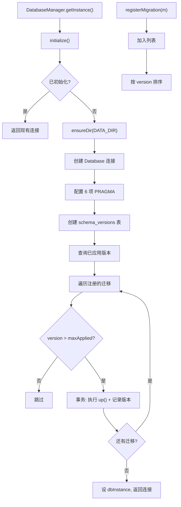

# Database.ts 需求说明

> 源文件：src/services/sqlite/Database.ts ｜ 类型：源码 ｜ 行数：174 ｜ 所属模块：sqlite ｜ 分析日期：2026-07-23

## 1. 文件定位总述

Database.ts 是 SQLite 数据库管理的核心入口，提供两种数据库初始化方式：简单的 `ClaudeMemDatabase`（同步初始化）和功能完整的 `DatabaseManager`（单例模式、异步初始化、迁移注册与执行）。它统一配置 SQLite 的 PRAGMA 参数（WAL 日志、内存临时存储、mmap、缓存），管理 schema_versions 表追踪迁移版本，并通过模块级重导出聚拢所有数据访问子模块（Sessions、Observations、Summaries、Prompts、Timeline、Import、transactions）。

## 2. 功能需求

| 编号 | 需求描述（系统应当…） | 触发条件 / 输入 | 处理规则与输出 | 证据 |
|------|----------------------|----------------|---------------|------|
| FR-CREATE-01 | 系统应当创建 SQLite 数据库连接并配置 PRAGMA | ClaudeMemDatabase 实例化 | 设置 WAL 日志模式、NORMAL 同步、外键启用、内存临时存储、256MB mmap、10000 页缓存；支持 :memory: 路径和文件路径 | `Database.ts:20-36` |
| FR-CLOSE-01 | 系统应当关闭数据库连接 | 调用 close() | 调用 db.close() 释放连接 | `Database.ts:38-41` |
| FR-SINGLETON-01 | 系统应当提供单例模式的 DatabaseManager | 调用 getInstance() | 返回全局唯一实例，首次调用自动创建 | `Database.ts:48-53` |
| FR-REGISTER-01 | 系统应当支持注册数据库迁移 | 调用 registerMigration(migration) | 添加到迁移列表并按 version 升序排列 | `Database.ts:55-58` |
| FR-INIT-01 | 系统应当异步初始化数据库并执行迁移 | 调用 initialize() | 创建连接、配置 PRAGMA、创建 schema_versions 表、执行所有未应用的迁移；已初始化时直接返回 | `Database.ts:60-82` |
| FR-CONN-01 | 系统应当在未初始化时抛出错误 | 调用 getConnection() 但 initialize() 未调用 | 抛出 Error: Database not initialized | `Database.ts:84-89` |
| FR-TXN-01 | 系统应当提供事务执行封装 | 调用 withTransaction(fn) | 使用 db.transaction() 包装函数，确保原子性 | `Database.ts:91-95` |
| FR-MIGRATE-01 | 系统应当仅执行版本号大于已应用最高版本的迁移 | runMigrations 中 | 查询 schema_versions 表获取已应用版本列表，比较后执行新迁移；每个迁移在事务中执行 | `Database.ts:117-139` |
| FR-VERSION-01 | 系统应当返回当前数据库版本 | 调用 getCurrentVersion() | 返回 schema_versions 中最大的 version 值，未初始化返回 0 | `Database.ts:142-149` |
| FR-GETDB-01 | 系统应当提供便捷的数据库获取函数 | 调用 getDatabase() | 返回模块级 dbInstance，未初始化抛出错误 | `Database.ts:152-157` |

## 3. 业务规则与约束

- **PRAGMA 配置**（两个类共享相同配置）：WAL 日志模式、NORMAL 同步级别、外键启用、内存临时存储、256MB mmap、10000 页缓存 (`Database.ts:27-32,69-74`)
- **迁移原子性**：每个迁移在独立事务中执行（schema 写入 + 迁移 up 操作），失败时整体回滚 (`Database.ts:129-136`)
- **迁移幂等性**：仅 version > maxApplied 的迁移会被执行，已执行的迁移不会重复 (`Database.ts:126`)
- **目录自动创建**：非 :memory: 路径时自动确保 DATA_DIR 存在 (`Database.ts:21-23,65`)
- **单例生命周期**：DatabaseManager.close() 同时重置 db 和 dbInstance (`Database.ts:97-103`)

## 4. 对外暴露

| 类/函数 | 签名/说明 |
|---------|----------|
| ClaudeMemDatabase | 简单同步数据库类（构造即初始化） |
| DatabaseManager | 单例异步数据库管理器 |
| DatabaseManager.getInstance() | 获取单例 |
| DatabaseManager.registerMigration() | 注册迁移 |
| DatabaseManager.initialize() | 异步初始化 |
| DatabaseManager.getConnection() | 获取连接 |
| DatabaseManager.withTransaction() | 事务执行 |
| DatabaseManager.getCurrentVersion() | 当前版本 |
| getDatabase() | 模块级便捷获取 |
| initializeDatabase() | 模块级异步初始化 |
| Migration 接口 | {version, up, down?} |
| 重导出 | Sessions, Observations, Summaries, Prompts, Timeline, Import, transactions |

## 5. 依赖关系

- **上游调用**：Worker 服务启动、所有数据访问模块
- **下游依赖**：MigrationRunner（迁移执行）、DATA_DIR/DB_PATH（路径常量）
- **重导出模块**：Sessions、Observations、Summaries、Prompts、Timeline、Import、transactions

## 6. 数据结构

**Migration 接口** (`Database.ts:9-13`)：
```typescript
{ version: number; up: (db: Database) => void; down?: (db: Database) => void }
```

**schema_versions 表** (`Database.ts:108-114`)：
```sql
CREATE TABLE IF NOT EXISTS schema_versions (
  id INTEGER PRIMARY KEY,
  version INTEGER UNIQUE NOT NULL,
  applied_at TEXT NOT NULL
)
```

## 7. 复杂逻辑图示



## 8. 逆向备注

- ClaudeMemDatabase 和 DatabaseManager 两个类存在大量重复的 PRAGMA 配置代码，且都创建 schema_versions 表——ClaudeMemDatabase 是简单场景（如测试），DatabaseManager 是生产场景 (`Database.ts:20-36 vs 60-82`)。
- `runMigrations` 方法被标记为 async 但实际使用同步的 `db.transaction()`，async 标记可能是为未来扩展预留 (`Database.ts:117`)。
- 模块底部的 `export *` 重导出使得其他模块只需 `import { ... } from './Database.js'` 即可访问所有数据访问函数，Database.ts 作为 sqlite 子系统的统一出口 (`Database.ts:168-174`)。
- `getDatabase()` 使用模块级变量 `dbInstance`，与 DatabaseManager 的 `this.db` 是同一个对象（通过 `initialize()` 赋值），这是方便全局访问的快捷方式 (`Database.ts:80`)。
