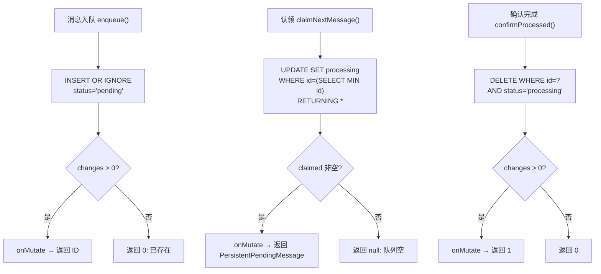

# PendingMessageStore.ts 需求说明

> 源文件：src/services/sqlite/PendingMessageStore.ts ｜ 类型：源码 ｜ 行数：187 ｜ 所属模块：sqlite ｜ 分析日期：2026-07-23

## 1. 文件定位总述

PendingMessageStore.ts 是消息持久化队列的核心实现，负责管理等待 AI 处理的消息（observation 和 summarize 类型）。该类基于 SQLite 的 `pending_messages` 表，提供入队、认领（原子状态变更）、清理、重置、统计等完整的队列操作能力。它使用 `INSERT OR IGNORE` 保证幂等入队，使用 `UPDATE ... RETURNING` 实现原子认领，并通过可选的 `onMutate` 回调通知外部消费者队列状态变化。

## 2. 功能需求

| 编号 | 需求描述（系统应当…） | 触发条件 / 输入 | 处理规则与输出 | 证据 |
|------|----------------------|----------------|---------------|------|
| FR-pms-01 | 系统应当将消息入队到持久化队列 | 调用 `enqueue(sessionDbId, contentSessionId, message)` | 使用 `INSERT OR IGNORE` 幂等插入；状态为 `pending`；返回新行 ID 或 0（已存在） | `PendingMessageStore.ts:32-65` |
| FR-pms-02 | 系统应当原子认领下一条待处理消息 | 调用 `claimNextMessage(sessionDbId)` | 使用 `UPDATE ... SET status='processing' WHERE id = (SELECT ... LIMIT 1) RETURNING *` 原子操作；按 id ASC 排序 | `PendingMessageStore.ts:67-89` |
| FR-pms-03 | 系统应当清空指定会话的所有待处理消息 | 调用 `clearPendingForSession(sessionDbId)` | `DELETE FROM pending_messages WHERE session_db_id = ?`，返回删除行数 | `PendingMessageStore.ts:91-103` |
| FR-pms-04 | 系统应当将 processing 状态重置为 pending | 调用 `resetProcessingToPending(sessionDbId)` | 模拟生成器重启后的消息恢复：所有 processing → pending | `PendingMessageStore.ts:105-119` |
| FR-pms-05 | 系统应当查询指定会话的待处理消息数量 | 调用 `getPendingCount(sessionDbId)` | 统计 status 为 pending 或 processing 的行数 | `PendingMessageStore.ts:121-128` |
| FR-pms-06 | 系统应当查询全局队列深度 | 调用 `getTotalQueueDepth()` | 统计所有会话中 pending+processing 的总行数 | `PendingMessageStore.ts:130-137` |
| FR-pms-07 | 系统应当查询有待处理消息的会话列表 | 调用 `getSessionsWithPendingMessages()` | 返回去重的 session_db_id 列表，按 ASC 排序 | `PendingMessageStore.ts:143-150` |
| FR-pms-08 | 系统应当确认消息处理完成 | 调用 `confirmProcessed(messageId)` | 删除 status 为 processing 的指定消息，返回删除行数（0=未找到或状态不对） | `PendingMessageStore.ts:152-162` |
| FR-pms-09 | 系统应当查看会话的待处理消息类型 | 调用 `peekPendingTypes(sessionDbId)` | 返回 message_type 和 tool_name 列表，不修改状态 | `PendingMessageStore.ts:164-171` |
| FR-pms-10 | 系统应当将持久化消息转换回内存对象 | 调用 `toPendingMessage(persistent)` | 解析 JSON 字段（tool_input, tool_response），返回 PendingMessage 对象 | `PendingMessageStore.ts:173-186` |
| FR-pms-11 | 系统应当在每次数据变更时通知外部消费者 | enqueue/claim/clear/reset/confirm 成功后 | 调用 `onMutate?.()` 回调 | 多处 `this.onMutate?.()` |

## 3. 业务规则与约束

- **幂等入队**：`INSERT OR IGNORE` 依赖表上的唯一约束（未在此文件定义，推断在建表 DDL 中）。`src/services/sqlite/PendingMessageStore.ts:35`
- **原子认领**：单条 SQL 完成"选最旧 pending → 改为 processing → 返回结果"三步操作，无竞态窗口。`src/services/sqlite/PendingMessageStore.ts:68-79`
- **状态机**：消息仅存在两种状态 `pending → processing`，processing 消息只能被 `confirmProcessed`（删除）或 `resetProcessingToPending`（回退）。`src/services/sqlite/PendingMessageStore.ts:9`
- **JSON 序列化**：tool_input 和 tool_response 在入队时序列化为 JSON 字符串，取出时反序列化。`src/services/sqlite/PendingMessageStore.ts:51-52, 177-178`
- **onMutate 仅成功时触发**：仅当 SQL 操作实际修改了数据（changes > 0 或 claimed 非空）才调用回调。

## 4. 对外暴露

| 名称 | 类型 | 说明 |
|------|------|------|
| `PendingMessageStore` | class | 持久化消息队列 |
| `PersistentPendingMessage` | interface | 持久化消息的数据库行类型 |
| `enqueue(sessionDbId, contentSessionId, message)` | method | 入队，返回行 ID 或 0 |
| `claimNextMessage(sessionDbId)` | method | 原子认领下一条 |
| `clearPendingForSession(sessionDbId)` | method | 清空会话队列 |
| `resetProcessingToPending(sessionDbId)` | method | 重置 processing 为 pending |
| `getPendingCount(sessionDbId)` | method | 获取会话待处理数量 |
| `getTotalQueueDepth()` | method | 全局队列深度 |
| `hasAnyPendingWork()` | method | 是否有待处理消息 |
| `getSessionsWithPendingMessages()` | method | 有待处理消息的会话列表 |
| `confirmProcessed(messageId)` | method | 确认处理完成 |
| `peekPendingTypes(sessionDbId)` | method | 查看消息类型 |
| `toPendingMessage(persistent)` | method | 持久化→内存对象转换 |

## 5. 依赖关系

- **内部依赖**：`bun:sqlite`（Database）、`../worker-types.js`（PendingMessage）、`../../utils/logger.js`
- **被依赖**：SessionManager、GeneratorExitHandler、worker 处理循环

## 6. 数据结构

**PersistentPendingMessage 接口**：`src/services/sqlite/PendingMessageStore.ts:5-20`

| 字段 | 类型 | 说明 |
|------|------|------|
| id | number | 自增主键 |
| session_db_id | number | 关联的会话数据库 ID |
| content_session_id | string | Claude Code 会话 ID |
| message_type | 'observation' \| 'summarize' | 消息类型 |
| tool_name / tool_input / tool_response | string \| null | 工具信息（JSON 序列化） |
| cwd | string \| null | 工作目录 |
| last_assistant_message | string \| null | 最后一条助手消息 |
| prompt_number | number \| null | 提示序号 |
| status | 'pending' \| 'processing' | 队列状态 |
| created_at_epoch | number | 入队时间（epoch ms） |
| agent_type / agent_id | string \| null | Agent 标识 |

## 7. 复杂逻辑图示

消息队列的三个核心操作：幂等入队、原子认领、确认完成。所有操作在数据变更时通知 onMutate 回调。

## 8. 逆向备注

- `enqueue` 使用 `INSERT OR IGNORE`，但入参中的 `toolUseId` 作为参数传入却在 SQL 中映射为 `tool_use_id` 列，该列在 PersistentPendingMessage 接口中未定义，推断是表结构中存在但接口未暴露的列。
- `resetProcessingToPending` 不区分会话内的消息，批量重置所有 processing 状态，适用于生成器崩溃恢复场景。
