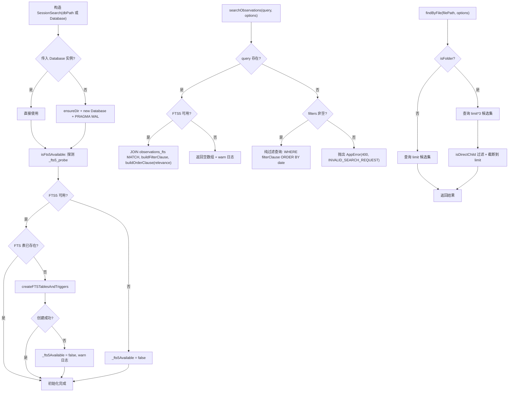

# SessionSearch.ts 需求说明

> 源文件：`src/services/sqlite/SessionSearch.ts` ｜ 类型：源码 ｜ 行数：597 ｜ 所属模块：sqlite（数据库搜索层） ｜ 分析日期：2026-07-23

## 1. 文件定位总述

SessionSearch 是 claude-mem 本地 SQLite 数据库的全文搜索与过滤查询服务，封装了 observations、session_summaries、user_prompts 三张业务表的多维度检索能力。该类在构造时自动检测 FTS5 可用性并创建全文索引虚拟表及同步触发器；当 FTS5 不可用时降级为 ChromaDB + LIKE 查询模式。对外提供按关键词全文检索、按概念/文件/类型过滤、按会话查询用户提示词等多种搜索入口，支持项目、日期范围、概念标签、文件路径等组合过滤条件，并提供分页和排序能力。该类是 Viewer UI 和搜索 API 的数据查询基础。

## 2. 功能需求

| 编号 | 需求描述（系统应当…） | 触发条件 / 输入 | 处理规则与输出 | 证据 |
|------|----------------------|----------------|---------------|------|
| FR-SS-01 | 系统应当在构造时自动检测 FTS5 扩展可用性并按需创建全文索引表及同步触发器 | SessionSearch 实例化 | 先用探测表（_fts5_probe）验证 FTS5 可用性；若可用且 FTS 表不存在，则创建 observations_fts 和 session_summaries_fts 虚拟表、回填已有数据、创建 INSERT/DELETE/UPDATE 三个同步触发器 | `SessionSearch.ts:32-35,63-149` |
| FR-SS-02 | 系统应当在 FTS5 不可用时降级处理 | FTS5 探测失败或表创建失败 | 设置 `_fts5Available = false`，搜索时跳过全文匹配，仅依赖过滤条件或 ChromaDB；创建失败时记录 warn 日志 | `SessionSearch.ts:47-49,58-60` |
| FR-SS-03 | 系统应当支持对 observations 表进行全文关键词搜索 | 调用 `searchObservations(query, options)`，query 非空且 FTS5 可用 | 将 query 转义为 FTS5 短语查询（双引号包裹），JOIN observations_fts 执行 MATCH 查询，支持按 rank 排序 | `SessionSearch.ts:255-279` |
| FR-SS-04 | 系统应当支持对 observations 表进行无关键词的纯过滤查询 | 调用 `searchObservations(undefined, options)` 但 filters 非空 | 不使用 FTS5，直接对 observations 表执行 WHERE 过滤子句 | `SessionSearch.ts:235-253` |
| FR-SS-05 | 系统应当在 observation 搜索无 query 且无 filters 时抛出错误 | searchObservations 两个参数均为空 | 抛出 AppError（400, INVALID_SEARCH_REQUEST, "Either query or filters required"） | `SessionSearch.ts:237-239` |
| FR-SS-06 | 系统应当支持对 session_summaries 表进行全文关键词搜索 | 调用 `searchSessions(query, options)`，query 非空且 FTS5 可用 | JOIN session_summaries_fts 执行 MATCH 查询；排序支持 relevance（FTS5 rank）、date_desc、date_asc | `SessionSearch.ts:313-344` |
| FR-SS-07 | 系统应当支持按概念标签查找 observations | 调用 `findByConcept(concept, options)` | 通过 `json_each(concepts)` 表值函数匹配 JSON 数组中的概念值，不使用 FTS5 | `SessionSearch.ts:350-369` |
| FR-SS-08 | 系统应当支持按文件路径查找关联的 observations 和 session_summaries | 调用 `findByFile(filePath, options)` | 对 observations 通过 `json_each(files_read)` 和 `json_each(files_modified)` 的 LIKE 匹配；对 session_summaries 通过 `json_each(files_read)` 和 `json_each(files_edited)` 的 LIKE 匹配；支持 isFolder 模式过滤直系子文件 | `SessionSearch.ts:405-481` |
| FR-SS-09 | 系统应当在文件搜索的文件夹模式下只保留路径为该文件夹直系子文件的记录 | options.isFolder = true | 获取 3 倍 limit 的候选集，然后通过 `isDirectChild()` 过滤并截断到 limit | `SessionSearch.ts:412,430-432,476-478` |
| FR-SS-10 | 系统应当支持按 observation 类型查找 | 调用 `findByType(type, options)` | type 支持单个值或数组，通过 buildFilterClause 构建 IN 子句 | `SessionSearch.ts:483-505` |
| FR-SS-11 | 系统应当支持对 user_prompts 表进行关键词搜索 | 调用 `searchUserPrompts(query, options)` | 使用 LIKE ESCAPE 进行模糊匹配（转义 \、%、_），JOIN sdk_sessions 获取项目信息 | `SessionSearch.ts:554-556` |
| FR-SS-12 | 系统应当支持查询指定会话的所有用户提示词 | 调用 `getUserPromptsBySession(contentSessionId)` | 按 content_session_id 精确查询，结果按 prompt_number ASC 排序 | `SessionSearch.ts:576-591` |
| FR-SS-13 | 系统应当支持多维度组合过滤条件 | 任意搜索方法传入 filters | 支持的过滤维度：project（精确匹配）、type（单值或数组 IN）、dateRange（start/end，支持 number 或 Date 字符串）、concepts（通过 json_each 精确匹配）、files（通过 json_each LIKE 模糊匹配） | `SessionSearch.ts:151-216` |
| FR-SS-14 | 系统应当支持分页和多种排序方式 | options 中传入 limit/offset/orderBy | limit 默认 50（user_prompts 默认 20），offset 默认 0；orderBy 支持 relevance（FTS5 rank）、date_desc、date_asc | `SessionSearch.ts:218-229` |

## 3. 业务规则与约束

| 编号 | 规则描述 | 证据 |
|------|---------|------|
| BR-SS-01 | FTS5 索引字段：observations 表索引 title, subtitle, narrative, text, facts, concepts（content='observations'，content_rowid='id'） | `SessionSearch.ts:74-85` |
| BR-SS-02 | FTS5 索引字段：session_summaries 表索引 request, investigated, learned, completed, next_steps, notes（content='session_summaries'，content_rowid='id'） | `SessionSearch.ts:112-123` |
| BR-SS-03 | FTS 触发器覆盖 INSERT（ai）、DELETE（ad）、UPDATE（au）三种操作，UPDATE 采用先 delete 再 insert 策略同步 | `SessionSearch.ts:94-109,132-148` |
| BR-SS-04 | FTS5 查询中 query 被转义为短语查询（`"query"`），双引号字符被转义为两个双引号 | `SessionSearch.ts:269,334` |
| BR-SS-05 | FTS5 不可用且无 ChromaDB 时，searchObservations/searchSessions 返回空数组并记录 warn 日志 | `SessionSearch.ts:281-282,346-347` |
| BR-SS-06 | 默认数据库路径使用 DB_PATH 常量，若构造函数传入 Database 实例则直接使用 | `SessionSearch.ts:23-25` |
| BR-SS-07 | 构造函数中若传入字符串路径，会设置 PRAGMA journal_mode = WAL | `SessionSearch.ts:29` |
| BR-SS-08 | concepts 过滤使用 `json_each()` 表值函数对 JSON 数组逐元素精确匹配，多个 concept 之间用 OR 连接 | `SessionSearch.ts:188-197` |
| BR-SS-09 | files 过滤使用 `json_each()` 配合 LIKE `%filePath%` 模糊匹配，同时检查 files_read 和 files_modified（observations）或 files_read 和 files_edited（summaries） | `SessionSearch.ts:199-213` |
| BR-SS-10 | dateRange 过滤中 start/end 支持两种输入：number（epoch ms）或 Date 兼容字符串（通过 new Date().getTime() 转换） | `SessionSearch.ts:177-186` |
| BR-SS-11 | session_summaries 搜索不支持 type 过滤（在 searchSessions 中显式 delete filterOptions.type） | `SessionSearch.ts:291,314` |
| BR-SS-12 | user_prompts 默认 limit 为 20（低于其他表的 50），推断用户提示词通常较长且单次查询需求较少 | `SessionSearch.ts:509` |

## 4. 对外暴露

| 导出项 | 类型 | 说明 | 证据 |
|--------|------|------|------|
| `SessionSearch` | class | 搜索服务主类，构造时初始化 FTS5 | `SessionSearch.ts:18-596` |
| - `searchObservations()` | method | 按关键词搜索 observations（支持 FTS5 和纯过滤模式） | `SessionSearch.ts:231-283` |
| - `searchSessions()` | method | 按关键词搜索 session_summaries | `SessionSearch.ts:285-348` |
| - `findByConcept()` | method | 按概念标签查找 observations | `SessionSearch.ts:350-369` |
| - `findByFile()` | method | 按文件路径查找 observations 和 session_summaries | `SessionSearch.ts:405-481` |
| - `findByType()` | method | 按 observation 类型查找 | `SessionSearch.ts:483-505` |
| - `searchUserPrompts()` | method | 按关键词搜索用户提示词 | `SessionSearch.ts:507-574` |
| - `getUserPromptsBySession()` | method | 查询指定会话的所有用户提示词 | `SessionSearch.ts:576-591` |
| - `close()` | method | 关闭数据库连接 | `SessionSearch.ts:593-595` |

## 5. 依赖关系

| 方向 | 依赖项 | 说明 |
|------|--------|------|
| 内部模块 | `Database` (bun:sqlite) | SQLite 数据库连接 |
| 内部模块 | `DATA_DIR`, `DB_PATH`, `ensureDir` (../../shared/paths.js) | 数据库路径与目录创建 |
| 内部模块 | `logger` (../../utils/logger.js) | 日志记录 |
| 内部模块 | `isDirectChild` (../../shared/path-utils.js) | 判断文件是否为文件夹直系子文件 |
| 内部模块 | `AppError` (../server/ErrorHandler.js) | 应用错误类型 |
| 内部模块 | 搜索结果类型 (./types.js) | ObservationSearchResult, SessionSummarySearchResult 等 |
| SQLite 扩展 | FTS5 | 全文搜索引擎（可选） |

## 6. 数据结构

**FTS5 虚拟表结构**

| 表名 | 索引列 | 内容表 | 关联字段 |
|------|--------|--------|---------|
| observations_fts | title, subtitle, narrative, text, facts, concepts | observations | id (rowid) |
| session_summaries_fts | request, investigated, learned, completed, next_steps, notes | session_summaries | id (rowid) |

**SearchFilters 结构**（从 types.js 导入）

| 字段 | 类型 | 说明 |
|------|------|------|
| project | string? | 项目路径精确过滤 |
| type | string \| string[]? | observation 类型过滤（单值或数组） |
| dateRange | DateRange? | 日期范围（start/end，支持 number 或 Date 字符串） |
| concepts | string \| string[]? | 概念标签过滤（json_each 精确匹配） |
| files | string \| string[]? | 文件路径过滤（json_each LIKE 模糊匹配） |

**SearchOptions 结构**（从 types.js 导入）

| 字段 | 类型 | 默认值 | 说明 |
|------|------|--------|------|
| limit | number | 50（user_prompts 为 20） | 每页条数 |
| offset | number | 0 | 偏移量 |
| orderBy | 'relevance' \| 'date_desc' \| 'date_asc' | 'relevance' | 排序方式 |
| ...SearchFilters | | | 继承过滤条件 |
| isFolder | boolean | false | 是否为文件夹搜索模式（findByFile 专用） |

## 7. 复杂逻辑图示

以下流程图展示 SessionSearch 的构造初始化与 FTS5 搜索路径：

**说明：** 上半部分展示构造时的 FTS5 初始化流程，包含探测、创建、降级三个分支。下半部分展示两个典型搜索路径——searchObservations 的多条分支（FTS5 可用/不可用、有/无 query）和 findByFile 的文件夹模式处理。

## 8. 逆向备注

| 编号 | 备注 | 证据 |
|------|------|------|
| RN-01 | FTS5 触发器创建使用单个 db.run() 调用包含多条 CREATE TRIGGER 语句，依赖 SQLite 的隐式事务自动提交多条 DDL。注释中 observations 的三个触发器在同一条 run 调用内，summaries 同理 | `SessionSearch.ts:94-109,132-148` |
| RN-02 | observations_fts 未索引 files_read 和 files_modified 字段，因此文件搜索不使用 FTS5 MATCH，而是通过 json_each + LIKE 实现。推断文件路径搜索精度要求低于全文搜索 | `SessionSearch.ts:74-85` |
| RN-03 | SessionSearch 构造时若传入 Database 实例则不设置 WAL 模式，仅字符串路径构造才设置。推断调用方可能已自行配置 journal_mode | `SessionSearch.ts:24-30` |
| RN-04 | searchUserPrompts 中 query 转义使用 `replace(/[\\%_]/g, '\\$&')` 并指定 `ESCAPE '\\'`，但 LIKE 中的 `_` 和 `%` 仍为通配符，这意味着用户输入的特殊字符被正确转义 | `SessionSearch.ts:554-556` |
| RN-05 | findByFile 对 observations 和 session_summaries 的查询 SQL 构建方式不同：observations 复用 buildFilterClause，session_summaries 则手动拼接条件。推断是历史演进导致的代码不一致 | `SessionSearch.ts:414-430,438-461` |
| RN-06 | user_prompts 表没有 FTS5 索引，始终使用 LIKE 模糊匹配。推断用户提示词通常按会话维度查询，全文搜索需求较低 | 整个文件中无 user_prompts_fts 相关代码 |
