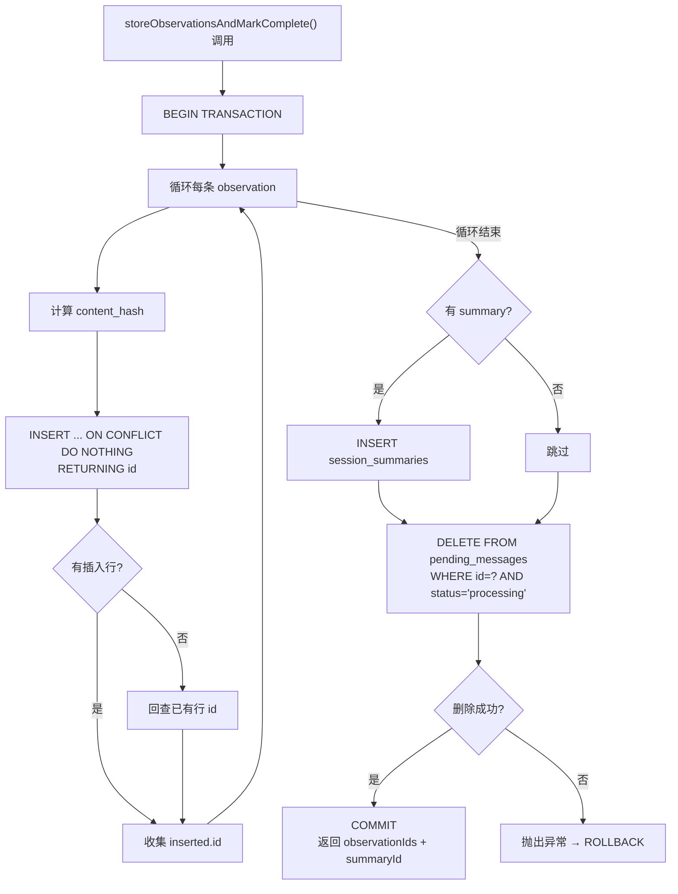
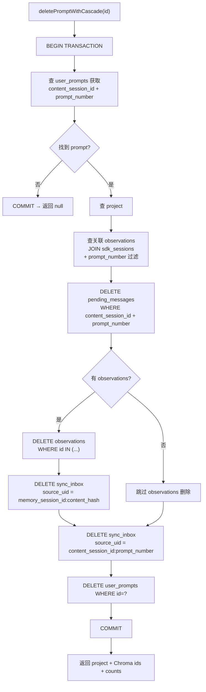

# SessionStore.ts 需求说明

> 源文件：src/services/sqlite/SessionStore.ts ｜ 类型：源码 ｜ 行数：3632 ｜ 所属模块：sqlite 持久层 ｜ 分析日期：2026-07-23

## 1. 文件定位总述

SessionStore 是 claude-mem 系统的核心数据访问层（DAL），封装了全部 SQLite 数据库操作。它承担三大职责：**schema 版本化迁移**（v4～v46，共 43 个迁移版本）、**会话/观测/摘要/用户提示的 CRUD**、以及**级联删除与数据导入导出**。该类通过 `bun:sqlite` 直接操作 SQLite3 数据库，以 `schema_versions` 表的版本号作为幂等迁移屏障，确保每次启动时仅执行未应用过的迁移。

SessionStore 是 Worker Service 和各 Hook 脚本的唯一数据库入口。上游由 `worker-service.ts` 在启动时实例化，下游被 `routes.ts`（HTTP API）、`ChromaSync.ts`（向量同步）、`summarize.ts`（AI 摘要）等多个模块调用。构造函数接受数据库路径或已存在的 Database 实例，支持内存数据库模式（`:memory:`），便于测试。

## 2. 功能需求

### 2.1 Schema 迁移

| 编号 | 需求描述（系统应当…） | 触发条件 / 输入 | 处理规则与输出 | 证据 |
|------|----------------------|----------------|---------------|------|
| FR-MIG-01 | 系统应当在实例化时自动创建基础表（schema_versions、sdk_sessions、observations、session_summaries）及索引 | 构造函数调用 | 使用 `CREATE TABLE IF NOT EXISTS`，版本号标记为 v4 | `src/services/sqlite/SessionStore.ts:681-750` |
| FR-MIG-02 | 系统应当按版本号顺序执行增量迁移，已应用的版本跳过不再执行 | 每个 `ensure*` 方法 | 先查 `schema_versions` 表，存在则 return；否则执行 ALTER/CREATE + 插入版本记录 | `src/services/sqlite/SessionStore.ts:127-128`（以 v38 为例，所有迁移方法通用） |
| FR-MIG-03 | 系统应当对不支持 ALTER TABLE DROP COLUMN 的场景使用"建新表-复制-删旧表-重命名"模式迁移 | SQLite 不支持 DROP COLUMN | 在事务内创建 `_new` 表，INSERT INTO 新表，DROP 旧表，RENAME，重建索引和 FTS 触发器 | `src/services/sqlite/SessionStore.ts:792-850`（v7 session_summaries UNIQUE 移除）、`src/services/sqlite/SessionStore.ts:881-944`（v9 observations.text 可空化）、`src/services/sqlite/SessionStore.ts:1157-1303`（v21 ON UPDATE CASCADE） |
| FR-MIG-04 | 系统应当在迁移失败时回滚事务，不留下中间状态 | 迁移过程中抛出异常 | `BEGIN TRANSACTION` / `COMMIT` / `ROLLBACK` 三段式 | `src/services/sqlite/SessionStore.ts:657-673`（v31）、`src/services/sqlite/SessionStore.ts:1287-1303`（v21） |
| FR-MIG-05 | 系统应当为 observations 表自动创建 FTS5 全文搜索虚拟表及同步触发器 | v10 迁移且 FTS5 可用 | `CREATE VIRTUAL TABLE user_prompts_fts USING fts5` + INSERT/DELETE/UPDATE 三个触发器；FTS5 不可用时降级跳过 | `src/services/sqlite/SessionStore.ts:977-1016` |
| FR-MIG-06 | 系统应当在 server 角色下创建 sync_inbox 去重表，client 角色下跳过 | `isServerRole()` 返回 true | 检查 `CLAUDE_MEM_NODE_ROLE` 环境变量或 settings.json，仅 server 模式建表 | `src/services/sqlite/SessionStore.ts:551-576` |
| FR-MIG-07 | 系统应当对 observations 按 (memory_session_id, content_hash) 建立去重索引，迁移时先删重复行 | v29 迁移 | `DELETE WHERE id NOT IN (SELECT MIN(id) GROUP BY ...)` + `CREATE UNIQUE INDEX` | `src/services/sqlite/SessionStore.ts:1516-1547` |
| FR-MIG-08 | 系统应当将所有 user_label 字段统一为 UPPERCASE 大写形式 | v46 迁移 | 先对含 UNIQUE 约束的表去重（保留 MIN rowid），再 UPPER() 更新所有 label 列 | `src/services/sqlite/SessionStore.ts:471-541` |
| FR-MIG-09 | 系统应当为 user_prompts 增加 active_ms/idle_ms 活跃时长字段 | v44 迁移 | ALTER TABLE ADD COLUMN，存量数据保持 NULL 不回填 | `src/services/sqlite/SessionStore.ts:347-362` |
| FR-MIG-10 | 系统应当为 user_prompts 增加 activity_updated_epoch 水位时间戳 | v45 迁移 | ALTER TABLE ADD COLUMN，供 sync payload 水位捕获 | `src/services/sqlite/SessionStore.ts:373-383` |
| FR-MIG-11 | 系统应当创建 weekly_reports 和 daily_reports 报表存储表 | v42/v43 迁移 | 含 UNIQUE(user_label, week_start) / UNIQUE(user_label, report_date) 约束 | `src/services/sqlite/SessionStore.ts:393-449` |
| FR-MIG-12 | 系统应当在 v40 迁移中为 user_prompts 回填 completed_at_epoch，使用四步策略（会话末条→LEAD 均值截断→默认 5min→修正倒挂） | v40 迁移 | Step A: 末条 prompt 取 session.completed_at；Step B: 计算全局截断均值；Step C: LEAD() 截断；Step D: 兜底 +5min | `src/services/sqlite/SessionStore.ts:233-314` |

### 2.2 会话生命周期管理

| 编号 | 需求描述（系统应当…） | 触发条件 / 输入 | 处理规则与输出 | 证据 |
|------|----------------------|----------------|---------------|------|
| FR-SESS-01 | 系统应当创建 SDK 会话记录（content_session_id + project + platform_source），若已存在则更新缺失字段 | `createSDKSession()` 调用 | INSERT 新记录（status='active'），或 UPDATE project/user_prompt/custom_title/platform_source 为空值时填充；platform_source 冲突时抛异常 | `src/services/sqlite/SessionStore.ts:2223-2298` |
| FR-SESS-02 | 系统应当标记会话为已完成状态，记录完成时间 | `markSessionCompleted(sessionDbId)` | UPDATE status='completed' + completed_at + completed_at_epoch | `src/services/sqlite/SessionStore.ts:1569-1577` |
| FR-SESS-03 | 系统应当注册或修正 memory_session_id，修复 FK 约束 | `ensureMemorySessionIdRegistered()` 调用 | 查找 session，若 memory_session_id 不匹配则 UPDATE，日志记录旧值 | `src/services/sqlite/SessionStore.ts:1579-1599` |
| FR-SESS-04 | 系统应当创建手动会话（manual-{project}），已存在则跳过 | `getOrCreateManualSession(project)` | 使用固定前缀 `manual-` 和 `manual-content-` 创建虚拟会话 | `src/services/sqlite/SessionStore.ts:3124-3145` |
| FR-SESS-05 | 系统应当按 DB id 获取会话详情 | `getSessionById(id)` | SELECT 基础字段，COALESCE platform_source 为默认值 | `src/services/sqlite/SessionStore.ts:2155-2184` |
| FR-SESS-06 | 系统应当按 content_session_id 获取最新用户提示（含 JOIN session 信息） | `getLatestUserPrompt(contentSessionId)` | JOIN sdk_sessions，ORDER BY created_at_epoch DESC LIMIT 1 | `src/services/sqlite/SessionStore.ts:1916-1940` |

### 2.3 观测记录管理

| 编号 | 需求描述（系统应当…） | 触发条件 / 输入 | 处理规则与输出 | 证据 |
|------|----------------------|----------------|---------------|------|
| FR-OBS-01 | 系统应当存储单条观测记录，基于 (memory_session_id, content_hash) 去重 | `storeObservation()` 调用 | `ON CONFLICT DO NOTHING RETURNING id`；冲突时回查已有行返回其 id | `src/services/sqlite/SessionStore.ts:2421-2493` |
| FR-OBS-02 | 系统应当在一个事务中批量存储观测记录和摘要，观测按 content_hash 去重 | `storeObservations()` 调用 | `this.db.transaction()` 包裹，循环插入每条 observation + 一条 summary | `src/services/sqlite/SessionStore.ts:2541-2658` |
| FR-OBS-03 | 系统应当批量存储观测并原子性地将 pending_messages 标记为完成（删除 processing 状态行） | `storeObservationsAndMarkComplete()` 调用 | 在事务中插入 observations + summary + `DELETE FROM pending_messages WHERE id=? AND status='processing'`；删除失败则抛异常回滚 | `src/services/sqlite/SessionStore.ts:2660-2789` |
| FR-OBS-04 | 系统应当按 id 列表查询观测记录，支持按 project/type/concepts/files 过滤和排序 | `getObservationsByIds(ids, options)` | 动态拼接 WHERE/ORDER BY/LIMIT，concepts/files 使用 `json_each()` 函数匹配 | `src/services/sqlite/SessionStore.ts:2016-2084` |
| FR-OBS-05 | 系统应当按 project 查询最近的观测摘要列表 | `getRecentObservations(project, limit)` | WHERE project = ? ORDER BY created_at_epoch DESC LIMIT ? | `src/services/sqlite/SessionStore.ts:1667-1687` |
| FR-OBS-06 | 系统应当重建 observations FTS5 全文索引 | `rebuildObservationsFTSIndex()` 调用 | `INSERT INTO observations_fts(observations_fts) VALUES('rebuild')` | `src/services/sqlite/SessionStore.ts:3586-3596` |

### 2.4 会话摘要管理

| 编号 | 需求描述（系统应当…） | 触发条件 / 输入 | 处理规则与输出 | 证据 |
|------|----------------------|----------------|---------------|------|
| FR-SUM-01 | 系统应当存储单条会话摘要 | `storeSummary()` 调用 | INSERT INTO session_summaries，返回 id 和 createdAtEpoch | `src/services/sqlite/SessionStore.ts:2495-2539` |
| FR-SUM-02 | 系统应当按 project 查询最近 N 条摘要 | `getRecentSummaries(project, limit)` | ORDER BY created_at_epoch DESC LIMIT ? | `src/services/sqlite/SessionStore.ts:1601-1635` |
| FR-SUM-03 | 系统应当按 memory_session_id 查询摘要详情 | `getSummaryForSession(memorySessionId)` | ORDER BY created_at_epoch DESC LIMIT 1 | `src/services/sqlite/SessionStore.ts:2086-2123` |
| FR-SUM-04 | 系统应当按 id 列表查询摘要，支持 project 过滤和 relevance 排序 | `getSessionSummariesByIds(ids, options)` | relevance 模式保持调用方传入的 id 顺序 | `src/services/sqlite/SessionStore.ts:2791-2821` |

### 2.5 用户提示管理

| 编号 | 需求描述（系统应当…） | 触发条件 / 输入 | 处理规则与输出 | 证据 |
|------|----------------------|----------------|---------------|------|
| FR-PROMPT-01 | 系统应当存储用户提示，支持优先使用 hook 事件时间戳 | `saveUserPrompt()` 调用 | submittedAtEpoch 优先于 Date.now()；think_time_ms 默认 0 | `src/services/sqlite/SessionStore.ts:2300-2314` |
| FR-PROMPT-02 | 系统应当按 (content_session_id, prompt_number) 获取提示文本 | `getUserPrompt()` 调用 | SELECT prompt_text WHERE content_session_id=? AND prompt_number=? LIMIT 1 | `src/services/sqlite/SessionStore.ts:2316-2326` |
| FR-PROMPT-03 | 系统应当记录提示完成时间，按来源区分写入强度 | `updatePromptCompletedAt()` 调用 | transcript 来源无条件覆盖；sdk_result/stop_hook 仅填 NULL | `src/services/sqlite/SessionStore.ts:2347-2367` |
| FR-PROMPT-04 | 系统应当回填提示的活跃/挂起时长 | `updatePromptActivity()` 调用 | 无条件覆盖 active_ms、idle_ms、activity_updated_epoch | `src/services/sqlite/SessionStore.ts:2375-2386` |
| FR-PROMPT-05 | 系统应当获取 session 内所有 prompt 的 (prompt_number, created_at_epoch) 时间线 | `getSessionPromptTimeline()` 调用 | ORDER BY created_at_epoch ASC, prompt_number ASC | `src/services/sqlite/SessionStore.ts:2394-2401` |
| FR-PROMPT-06 | 系统应当检测近期重复用户提示 | `findRecentDuplicateUserPrompt()` 调用 | 委托给 `findRecentDuplicateUserPromptRecord()` 函数 | `src/services/sqlite/SessionStore.ts:1942-1948` |
| FR-PROMPT-07 | 系统应当按 id 列表查询用户提示，支持 project 过滤和 relevance 排序 | `getUserPromptsByIds(ids, options)` | JOIN sdk_sessions 获取 project 和 memory_session_id | `src/services/sqlite/SessionStore.ts:2823-2856` |

### 2.6 时间线查询

| 编号 | 需求描述（系统应当…） | 触发条件 / 输入 | 处理规则与输出 | 证据 |
|------|----------------------|----------------|---------------|------|
| FR-TL-01 | 系统应当基于锚定时间戳查询前后深度范围内的观测、摘要和提示 | `getTimelineAroundTimestamp()` | 先查边界 epoch，再按范围查三种记录 | `src/services/sqlite/SessionStore.ts:2858-2869` |
| FR-TL-02 | 系统应当基于锚定观测 ID 查询前后深度范围内的混合时间线 | `getTimelineAroundObservation()` | 以 observation id 为锚，前后各取 depth+1 条确定 epoch 范围，返回 observations/sessions/prompts 三类记录 | `src/services/sqlite/SessionStore.ts:2871-3006` |

### 2.7 数据导入

| 编号 | 需求描述（系统应当…） | 触发条件 / 输入 | 处理规则与输出 | 证据 |
|------|----------------------|----------------|---------------|------|
| FR-IMPORT-01 | 系统应当导入 SDK 会话，已存在（按 content_session_id）则跳过 | `importSdkSession()` 调用 | SELECT → 存在返回 imported:false；否则 INSERT | `src/services/sqlite/SessionStore.ts:3431-3472` |
| FR-IMPORT-02 | 系统应当导入会话摘要，已存在（按 memory_session_id）则跳过 | `importSessionSummary()` 调用 | 同上模式 | `src/services/sqlite/SessionStore.ts:3474-3524` |
| FR-IMPORT-03 | 系统应当导入观测记录，已存在（按 memory_session_id+title+epoch）则跳过 | `importObservation()` 调用 | 三字段联合查重 | `src/services/sqlite/SessionStore.ts:3526-3584` |
| FR-IMPORT-04 | 系统应当导入用户提示，已存在（按 content_session_id+prompt_number）则跳过 | `importUserPrompt()` 调用 | 双字段联合查重 | `src/services/sqlite/SessionStore.ts:3598-3630` |

### 2.8 数据删除

| 编号 | 需求描述（系统应当…） | 触发条件 / 输入 | 处理规则与输出 | 证据 |
|------|----------------------|----------------|---------------|------|
| FR-DEL-01 | 系统应当永久删除单个用户提示 | `deletePromptById(id)` | DELETE FROM user_prompts WHERE id=? | `src/services/sqlite/SessionStore.ts:3300-3307` |
| FR-DEL-02 | 系统应当级联删除用户提示及其关联的 observations、pending_messages、sync_inbox 记录 | `deletePromptWithCascade(id)` | 在事务中：查 prompt → 查关联 observations（通过 JOIN + prompt_number 过滤）→ 删 pending/sync_inbox/observations/prompt；返回 Chroma 需要的 doc ids | `src/services/sqlite/SessionStore.ts:3337-3429` |
| FR-DEL-03 | 系统应当永久删除指定项目的所有数据（observations、summaries、prompts、pending、sessions），含 merged_into_project 关联数据 | `deleteProjectsCompletely(projects)` | 在事务中：先 COUNT 各表数量 → 按项目列表批量 DELETE observations/summaries/pending/user_prompts/sdk_sessions | `src/services/sqlite/SessionStore.ts:3197-3290` |
| FR-DEL-04 | 系统应当检查指定项目是否仍有待处理的 pending 工作 | `projectsWithPendingWork(projects)` | JOIN pending_messages + sdk_sessions，查 status IN ('pending','processing') | `src/services/sqlite/SessionStore.ts:3158-3175` |

### 2.9 项目目录与统计

| 编号 | 需求描述（系统应当…） | 触发条件 / 输入 | 处理规则与输出 | 证据 |
|------|----------------------|----------------|---------------|------|
| FR-CAT-01 | 系统应当获取所有不重复的项目列表，可按 platform_source 过滤，排除内部项目 | `getAllProjects(platformSource?)` | SELECT DISTINCT project WHERE project != OBSERVER_SESSIONS_PROJECT | `src/services/sqlite/SessionStore.ts:1827-1846` |
| FR-CAT-02 | 系统应当获取项目目录：项目列表、来源列表、按来源分组的子项目、以及每个项目关联的最新 user_label | `getProjectCatalog()` | 遍历 sdk_sessions，按 started_at_epoch DESC 去重，首次出现的 user_label 为项目归属用户 | `src/services/sqlite/SessionStore.ts:1848-1914` |

## 3. 业务规则与约束

### 3.1 Schema 迁移规则

- **版本号屏障**：每个迁移方法通过 `schema_versions` 表的版本号实现幂等，`INSERT OR IGNORE` 确保不重复记录。`src/services/sqlite/SessionStore.ts:749`
- **迁移顺序**：构造函数中按版本号从低到高依次调用，不使用外部编排。`src/services/sqlite/SessionStore.ts:78-115`
- **Server-only 迁移**：v37（sync_inbox）和 v38（api_keys.bound_user_label）仅当 `isServerRole()` 为 true 时执行。`src/services/sqlite/SessionStore.ts:124,552`
- **角色判定优先级**：环境变量 `CLAUDE_MEM_NODE_ROLE` 优先于 settings.json 文件；不可读时默认为 client。`src/services/sqlite/SessionStore.ts:40-57`

### 3.2 数据完整性约束

- **外键级联**：observations 和 session_summaries 对 sdk_sessions 的 FK 设为 `ON DELETE CASCADE ON UPDATE CASCADE`（v21 迁移）。`src/services/sqlite/SessionStore.ts:1157-1303`
- **observations 去重**：唯一索引 `ux_observations_session_hash(memory_session_id, content_hash)` 确保同一会话内相同内容不重复。`src/services/sqlite/SessionStore.ts:1538-1540`
- **pending_messages 去重**：唯一索引 `ux_pending_session_tool(content_session_id, tool_use_id) WHERE tool_use_id IS NOT NULL`（部分索引）。`src/services/sqlite/SessionStore.ts:1503-1505`
- **user_prompts_fts 同步**：三个触发器（ai/ad/au）保持 FTS5 虚拟表与主表数据一致。`src/services/sqlite/SessionStore.ts:985-1001`

### 3.3 平台来源规范化

- 所有 platform_source 字段在存储和查询时通过 `normalizePlatformSource()` 统一格式，默认值为 `DEFAULT_PLATFORM_SOURCE`（'claude'）。`src/services/sqlite/SessionStore.ts:18,697,1709,1762,1804`
- `createSDKSession` 中若已有非空 platform_source 与传入值不同，抛出冲突异常。`src/services/sqlite/SessionStore.ts:2271-2274`

### 3.4 时间戳与时区

- 所有时间同时存储 ISO 格式字符串（`created_at`）和 epoch 毫秒（`created_at_epoch`）。`src/services/sqlite/SessionStore.ts:2291-2293`
- `completed_at_epoch` 回填使用四步策略，确保不小于 `created_at_epoch`（sanity check）。`src/services/sqlite/SessionStore.ts:305-311`

### 3.5 项目过滤排除

- `OBSERVER_SESSIONS_PROJECT`（推断：内部观察者会话项目标识）在所有项目查询中被排除。`src/services/sqlite/SessionStore.ts:1833,1869`

## 4. 对外暴露

### 4.1 公开方法

SessionStore 共导出约 **60+ 个公开方法**，按职责分类如下：

| 分类 | 方法名 |
|------|--------|
| **会话 CRUD** | `createSDKSession`, `markSessionCompleted`, `updateMemorySessionId`, `ensureMemorySessionIdRegistered`, `getOrCreateManualSession`, `importSdkSession`, `getSessionById`, `getSdkSessionsBySessionIds`, `getSessionSummaryById` |
| **观测 CRUD** | `storeObservation`, `storeObservations`, `storeObservationsAndMarkComplete`, `getObservationById`, `getObservationsByIds`, `getObservationsForSession`, `getAllRecentObservations`, `importObservation`, `rebuildObservationsFTSIndex` |
| **摘要 CRUD** | `storeSummary`, `getRecentSummaries`, `getRecentSummariesWithSessionInfo`, `getSummaryForSession`, `getAllRecentSummaries`, `getSessionSummariesByIds`, `importSessionSummary` |
| **用户提示 CRUD** | `saveUserPrompt`, `getUserPrompt`, `getLatestUserPrompt`, `findRecentDuplicateUserPrompt`, `updatePromptCompletedAt`, `getPromptCompletedAt`, `updatePromptActivity`, `getSessionPromptTimeline`, `getLastObservationEpoch`, `getMaxPromptNumber`, `getPromptNumberFromUserPrompts`, `getAllRecentUserPrompts`, `getUserPromptsByIds`, `getPromptById`, `getPromptsByIds`, `importUserPrompt` |
| **时间线查询** | `getTimelineAroundTimestamp`, `getTimelineAroundObservation` |
| **项目目录** | `getAllProjects`, `getProjectCatalog` |
| **文件查询** | `getFilesForSession` |
| **删除操作** | `deletePromptById`, `deletePromptWithCascade`, `deleteProjectsCompletely`, `projectsWithPendingWork` |
| **生命周期** | `close` |
| **属性** | `db: Database`（公开只读） |

### 4.2 公开属性

- `db: Database` — 底层 bun:sqlite Database 实例，公开供需要直接 SQL 的模块（如 PendingMessageStore）使用。`src/services/sqlite/SessionStore.ts:60`

## 5. 依赖关系

### 5.1 上游依赖

| 依赖 | 用途 | 证据 |
|------|------|------|
| `bun:sqlite` (Database, SQLQueryBindings) | SQLite3 数据库驱动 | `src/services/sqlite/SessionStore.ts:1` |
| `fs` (existsSync, readFileSync) | 检查 settings.json 文件存在性（角色判定） | `src/services/sqlite/SessionStore.ts:2` |
| `../../shared/paths.js` (DATA_DIR, DB_PATH, USER_SETTINGS_PATH, ensureDir, OBSERVER_SESSIONS_PROJECT) | 数据目录和路径常量 | `src/services/sqlite/SessionStore.ts:3` |
| `../../utils/logger.js` | 日志记录 | `src/services/sqlite/SessionStore.ts:4` |
| `../../types/database.js` (TableColumnInfo, IndexInfo, SchemaVersion 等) | 类型定义 | `src/services/sqlite/SessionStore.ts:5-14` |
| `./PendingMessageStore.js` (PendingMessageStore type) | 待处理消息存储类型 | `src/services/sqlite/SessionStore.ts:15` |
| `./types.js` (ObservationSearchResult, SessionSummarySearchResult) | 搜索结果类型 | `src/services/sqlite/SessionStore.ts:16` |
| `./observations/store.js` (computeObservationContentHash) | 观测内容哈希计算 | `src/services/sqlite/SessionStore.ts:17` |
| `./observations/files.js` (parseFileList) | 文件列表 JSON 解析 | `src/services/sqlite/SessionStore.ts:18` |
| `../../shared/platform-source.js` (DEFAULT_PLATFORM_SOURCE, normalizePlatformSource, sortPlatformSources) | 平台来源规范化 | `src/services/sqlite/SessionStore.ts:19` |
| `../../shared/user-label.js` (resolveUserLabel) | 解析用户标签 | `src/services/sqlite/SessionStore.ts:20` |
| `../../shared/os-user.js` (getOsUserName) | 获取操作系统用户名 | `src/services/sqlite/SessionStore.ts:21` |
| `./prompts/get.js` (findRecentDuplicateUserPromptRecord) | 查找近期重复用户提示 | `src/services/sqlite/SessionStore.ts:22` |

### 5.2 下游消费者（推断，基于项目架构）

- Worker Service（`worker-service.ts`）— 实例化 SessionStore
- HTTP API Routes（`routes.ts`）— 通过 SessionStore 查询和操作数据
- ChromaSync（`ChromaSync.ts`）— 读取观测记录进行向量化
- 摘要生成器（`summarize.ts`）— 存储和查询摘要

## 6. 数据结构

### 6.1 核心表结构

#### sdk_sessions（会话主表）

| 字段 | 类型 | 约束 | 说明 |
|------|------|------|------|
| id | INTEGER | PK AUTOINCREMENT | 自增主键 |
| content_session_id | TEXT | UNIQUE NOT NULL | Claude/上游会话 ID |
| memory_session_id | TEXT | UNIQUE | 内部会话 ID，初始为 NULL |
| project | TEXT | NOT NULL | 项目路径 |
| platform_source | TEXT | NOT NULL DEFAULT 'claude' | 平台来源（v24+） |
| user_prompt | TEXT | - | 首条用户提示文本 |
| custom_title | TEXT | - | 自定义标题（v23+） |
| started_at | TEXT | NOT NULL | ISO 启动时间 |
| started_at_epoch | INTEGER | NOT NULL | epoch 启动时间 |
| completed_at | TEXT | - | ISO 完成时间 |
| completed_at_epoch | INTEGER | - | epoch 完成时间 |
| status | TEXT | NOT NULL DEFAULT 'active' CHECK IN ('active','completed','failed') | 状态 |
| worker_port | INTEGER | - | Worker 端口（v5+） |
| prompt_counter | INTEGER | DEFAULT 0 | 提示计数器（v6+） |
| user_name | TEXT | - | OS 用户名（v35+） |
| user_label | TEXT | - | 用户标签，UPPERCASE（v36+, v46 规范化） |

证据：`src/services/sqlite/SessionStore.ts:691-703,757-789,586-621`

#### observations（观测记录表）

| 字段 | 类型 | 约束 | 说明 |
|------|------|------|------|
| id | INTEGER | PK AUTOINCREMENT | 自增主键 |
| memory_session_id | TEXT | NOT NULL FK → sdk_sessions | 所属会话 |
| project | TEXT | NOT NULL | 项目路径 |
| text | TEXT | nullable（v9） | 原始文本 |
| type | TEXT | NOT NULL | 观测类型 |
| title | TEXT | - | 标题（v8+） |
| subtitle | TEXT | - | 副标题（v8+） |
| facts | TEXT | - | 事实，JSON 数组（v8+） |
| narrative | TEXT | - | 叙述（v8+） |
| concepts | TEXT | - | 概念，JSON 数组（v8+） |
| files_read | TEXT | - | 读取文件列表（v8+） |
| files_modified | TEXT | - | 修改文件列表（v8+） |
| prompt_number | INTEGER | - | 提示编号（v6+） |
| discovery_tokens | INTEGER | DEFAULT 0 | 发现令牌数（v11+） |
| generated_by_model | TEXT | - | 生成模型（v26+） |
| relevance_count | INTEGER | DEFAULT 0 | 引用计数（v26+） |
| content_hash | TEXT | - | 内容哈希（v22+），唯一索引 ux_observations_session_hash |
| agent_type | TEXT | - | Agent 类型（v27+） |
| agent_id | TEXT | - | Agent ID（v27+） |
| metadata | TEXT | - | 元数据 JSON（v30+） |
| user_label | TEXT | NOT NULL DEFAULT '' | 用户标签（v39+, v46 UPPERCASE） |
| created_at | TEXT | NOT NULL | ISO 创建时间 |
| created_at_epoch | INTEGER | NOT NULL | epoch 创建时间 |
| merged_into_project | TEXT | - | 合并目标项目 |

证据：`src/services/sqlite/SessionStore.ts:711-720,866-876,1033-1045,1398-1405,1331-1346,1429-1460,1549-1558`

#### session_summaries（会话摘要表）

| 字段 | 类型 | 约束 | 说明 |
|------|------|------|------|
| id | INTEGER | PK AUTOINCREMENT | 自增主键 |
| memory_session_id | TEXT | NOT NULL FK → sdk_sessions | 所属会话（v7 后无 UNIQUE） |
| project | TEXT | NOT NULL | 项目路径 |
| request | TEXT | - | 请求摘要 |
| investigated | TEXT | - | 调查内容 |
| learned | TEXT | - | 学到内容 |
| completed | TEXT | - | 完成内容 |
| next_steps | TEXT | - | 下一步 |
| files_read | TEXT | - | 读取文件 |
| files_edited | TEXT | - | 编辑文件 |
| notes | TEXT | - | 备注 |
| prompt_number | INTEGER | - | 提示编号（v6+） |
| discovery_tokens | INTEGER | DEFAULT 0 | 发现令牌（v11+） |
| user_label | TEXT | NOT NULL DEFAULT '' | 用户标签（v39+, v46 UPPERCASE） |
| created_at | TEXT | NOT NULL | ISO 创建时间 |
| created_at_epoch | INTEGER | NOT NULL | epoch 创建时间 |
| merged_into_project | TEXT | - | 合并目标项目 |

证据：`src/services/sqlite/SessionStore.ts:727-742`

#### user_prompts（用户提示表）

| 字段 | 类型 | 约束 | 说明 |
|------|------|------|------|
| id | INTEGER | PK AUTOINCREMENT | 自增主键 |
| content_session_id | TEXT | NOT NULL FK → sdk_sessions | 所属会话 |
| prompt_number | INTEGER | NOT NULL | 提示编号 |
| prompt_text | TEXT | NOT NULL | 提示文本 |
| created_at | TEXT | NOT NULL | ISO 创建时间 |
| created_at_epoch | INTEGER | NOT NULL | epoch 创建时间 |
| think_time_ms | INTEGER | NOT NULL DEFAULT 0 | 思考时长（v41+） |
| completed_at_epoch | INTEGER | - | 完成时间（v40+） |
| active_ms | INTEGER | - | 活跃时长（v44+） |
| idle_ms | INTEGER | - | 挂起时长（v44+） |
| activity_updated_epoch | INTEGER | - | 活跃更新时间（v45+） |

证据：`src/services/sqlite/SessionStore.ts:960-974,329,239,354-356,378-379`

#### pending_messages（待处理消息队列表）

| 字段 | 类型 | 约束 | 说明 |
|------|------|------|------|
| id | INTEGER | PK AUTOINCREMENT | 自增主键 |
| session_db_id | INTEGER | NOT NULL FK → sdk_sessions(id) | 关联会话 |
| content_session_id | TEXT | NOT NULL | 内容会话 ID |
| message_type | TEXT | NOT NULL CHECK IN ('observation','summarize') | 消息类型 |
| tool_name | TEXT | - | 工具名 |
| tool_input | TEXT | - | 工具输入 |
| tool_response | TEXT | - | 工具响应 |
| cwd | TEXT | - | 工作目录 |
| last_user_message | TEXT | - | 最后用户消息 |
| last_assistant_message | TEXT | - | 最后助手消息 |
| prompt_number | INTEGER | - | 提示编号 |
| status | TEXT | NOT NULL DEFAULT 'pending' CHECK IN ('pending','processing') | 状态 |
| created_at_epoch | INTEGER | NOT NULL | epoch 创建时间 |
| failed_at_epoch | INTEGER | - | 失败时间（v20+） |
| tool_use_id | TEXT | - | 工具调用 ID（v28+） |
| agent_type | TEXT | - | Agent 类型（v27+） |
| agent_id | TEXT | - | Agent ID（v27+） |

证据：`src/services/sqlite/SessionStore.ts:1060-1076`

#### sync_inbox（服务端同步去重表，server-only）

| 字段 | 类型 | 约束 | 说明 |
|------|------|------|------|
| id | INTEGER | PK AUTOINCREMENT | 自增主键 |
| user_label | TEXT | NOT NULL | 用户标签 |
| source_table | TEXT | NOT NULL CHECK IN ('sdk_sessions','observations','session_summaries','user_prompts') | 来源表 |
| source_uid | TEXT | NOT NULL | 来源唯一标识 |
| applied_at_epoch | INTEGER | NOT NULL | 应用时间 |
| applied_row_id | INTEGER | - | 应用行 ID |

UNIQUE(user_label, source_table, source_uid)。证据：`src/services/sqlite/SessionStore.ts:560-571`

#### weekly_reports / daily_reports（报表表）

| 字段 | 类型 | 约束 | 说明 |
|------|------|------|------|
| id | INTEGER | PK AUTOINCREMENT | 自增主键 |
| user_label | TEXT | NOT NULL | 用户标签 |
| week_start / report_date | TEXT | NOT NULL | 周起始 / 日报日期 |
| week_end | TEXT | NOT NULL | 周结束（仅周报） |
| markdown | TEXT | NOT NULL | 报表内容 |
| stats | TEXT | - | 统计数据 |
| model | TEXT | - | 生成模型 |
| generated_at_epoch | INTEGER | NOT NULL | 生成时间 |

证据：`src/services/sqlite/SessionStore.ts:401-410,435-444`

### 6.2 辅助函数

- `resolveCreateSessionArgs(customTitle?, platformSource?)`：规范化创建参数，platform_source 经过 `normalizePlatformSource()` 处理。`src/services/sqlite/SessionStore.ts:24-32`
- `isServerRole()`：判定当前是否为 server 角色，环境变量优先。`src/services/sqlite/SessionStore.ts:40-57`

## 7. 复杂逻辑图示

### 7.1 Schema 迁移执行流程

以下流程图展示 SessionStore 构造函数中 schema 初始化与增量迁移的执行顺序。

```mermaid
flowchart TB
    A["构造函数<br/>SessionStore(dbPathOrDb)"] --> B{"dbPathOrDb<br/>是 Database 实例?"}
    B -- 是 --> C["直接赋值 this.db"]
    B -- 否 --> D{"dbPathOrDb == ':memory:'?"}
    D -- 否 --> E["ensureDir(DATA_DIR)"]
    D -- 是 --> F["new Database(dbPathOrDb)"]
    E --> F
    F --> G["设置 PRAGMA<br/>WAL / NORMAL / FK_ON / journal_size_limit"]
    C --> G
    G --> H["initializeSchema()<br/>v4: 创建基础表"]

    H --> I["ensureWorkerPortColumn()<br/>v5"]
    I --> J["ensurePromptTrackingColumns()<br/>v6"]
    J --> K["removeSessionSummariesUniqueConstraint()<br/>v7"]
    K --> L["addObservationHierarchicalFields()<br/>v8"]
    L --> M["makeObservationsTextNullable()<br/>v9"]
    M --> N["createUserPromptsTable()<br/>v10 + FTS5"]
    N --> O["ensureDiscoveryTokensColumn()<br/>v11"]
    O --> P["createPendingMessagesTable()<br/>v16"]
    P --> Q["renameSessionIdColumns()<br/>v17"]
    Q --> R["repairSessionIdColumnRename()<br/>v19"]
    R --> S["addFailedAtEpochColumn()<br/>v20"]
    S --> T["addOnUpdateCascadeToForeignKeys()<br/>v21"]
    T --> U["addObservationContentHashColumn()<br/>v22"]
    U --> V["addSessionCustomTitleColumn()<br/>v23"]
    V --> W["addSessionPlatformSourceColumn()<br/>v24"]
    W --> X["addObservationModelColumns()<br/>v26"]
    X --> Y["ensureMergedIntoProjectColumns()"]
    Y --> Z["addObservationSubagentColumns()<br/>v27"]
    Z --> AA["addObservationsUniqueContentHashIndex()<br/>v29"]
    AA --> AB["addObservationsMetadataColumn()<br/>v30"]
    AB --> AC["dropDeadPendingMessagesColumns()<br/>v31"]
    AC --> AD["ensurePendingMessagesToolUseIdColumn()<br/>v28"]
    AD --> AE["dropWorkerPidColumn()<br/>v32"]
    AE --> AF["addSessionUserNameColumn()<br/>v35"]
    AF --> AG["addSessionUserLabelColumn()<br/>v36"]
    AG --> AH["createSyncInboxTable()<br/>v37 (server-only)"]
    AH --> AI["addApiKeysUserLabelColumn()<br/>v38 (server-only)"]
    AI --> AJ["ensureUserLabelColumns()<br/>v39"]
    AJ --> AK["ensurePromptCompletedAtColumn()<br/>v40"]
    AK --> AL["ensureThinkTimeColumn()<br/>v41"]
    AL --> AM["ensureWeeklyReportsTable()<br/>v42"]
    AM --> AN["ensureDailyReportsTable()<br/>v43"]
    AN --> AO["ensureActivityColumns()<br/>v44"]
    AO --> AP["ensureActivityUpdatedEpochColumn()<br/>v45"]
    AP --> AQ["normalizeUserLabelForm()<br/>v46"]
```

### 7.2 storeObservationsAndMarkComplete 事务流程

### 7.3 deletePromptWithCascade 级联删除流程

## 8. 逆向备注

### 8.1 注释与代码不一致

- `getSessionSummaryById` 方法（`src/services/sqlite/SessionStore.ts:3081-3122`）查询了 `request_summary` 和 `learned_summary` 两个字段，但 `sdk_sessions` 表的 DDL 中从未定义这两个字段（只有 `user_prompt`）。推断：这些字段可能在更早的 schema 版本中存在后已被移除，该方法可能返回 null 或抛出运行时错误。未在代码中证实该方法被实际调用。

- `storeObservations` 方法注释暗示这是"批量存储"方法，但观察其实现与 `storeObservationsAndMarkComplete` 几乎完全相同（除了不处理 pending_messages 删除），两者存在大量重复代码。推断：这可能是重构遗留，原 `storeObservations` 应当调用 `storeObservationsAndMarkComplete` 的内部逻辑但未提取。

### 8.2 版本号间隙

- schema_versions 中 v12、v13、v14、v15、v18、v25、v33、v34 缺失对应的迁移方法（版本号不连续）。推断：这些版本可能用于其他迁移文件或已被删除/合并。

### 8.3 硬编码 SQL 注入风险

- `createSDKSession`（`src/services/sqlite/SessionStore.ts:1373`）和 `addSessionPlatformSourceColumn`（`src/services/sqlite/SessionStore.ts:1379`）中，`DEFAULT_PLATFORM_SOURCE` 通过字符串插值直接嵌入 SQL。由于 `DEFAULT_PLATFORM_SOURCE` 是编译时常量（来自 `platform-source.ts`），不构成运行时注入风险，但违反了参数化查询最佳实践。

### 8.4 模块级辅助函数

- `resolveCreateSessionArgs` 和 `isServerRole` 是文件内的模块级函数而非类方法，可能为了在类实例化前可用或避免 `this` 上下文问题。

### 8.5 import 方法查重策略不一致

- `importObservation` 按 (memory_session_id, title, created_at_epoch) 三字段查重（`src/services/sqlite/SessionStore.ts:3547`），而运行时写入 `storeObservation` 按 (memory_session_id, content_hash) 去重。两种查重策略在极端情况下可能产生不一致结果。
