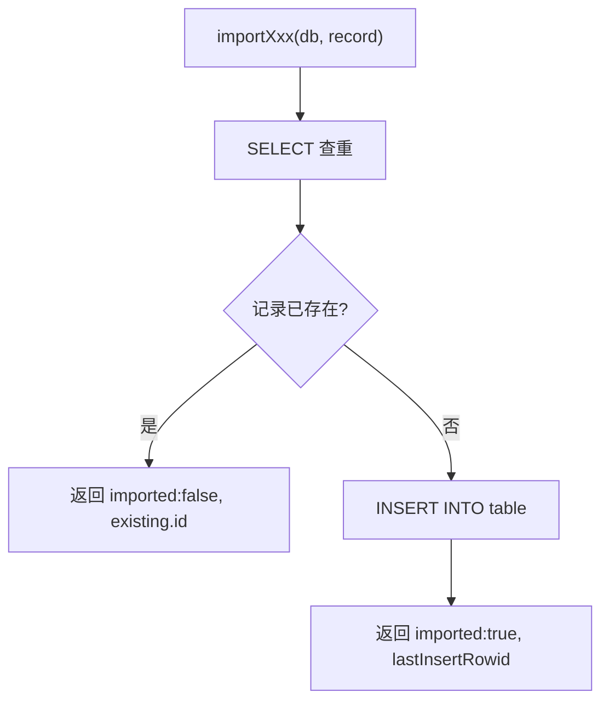

# bulk.ts 需求说明

> 源文件：src/services/sqlite/import/bulk.ts ｜ 类型：源码 ｜ 行数：220 ｜ 所属模块：sqlite/import ｜ 分析日期：2026-07-23

## 1. 文件定位总述

bulk.ts 是 SQLite 数据层的批量导入模块，提供将 SDK 会话数据（sessions、session summaries、observations、user prompts）安全写入本地数据库的能力。每个导入函数都采用"先查后插"的幂等模式：通过业务唯一键检测记录是否已存在，存在则跳过，不存在则插入。该模块服务于数据迁移、外部数据导入和同步回填等场景，确保数据不重复。

## 2. 功能需求

| 编号 | 需求描述（系统应当…） | 触发条件 / 输入 | 处理规则与输出 | 证据 |
|------|----------------------|----------------|---------------|------|
| FR-bulk-01 | 系统应当幂等导入 SDK 会话记录 | 调用 `importSdkSession(db, session)` | 以 `content_session_id` 为唯一键查重；已存在返回 `{imported: false, id}`；不存在则 INSERT 并返回 `{imported: true, id}` | `bulk.ts:10-52` |
| FR-bulk-02 | 系统应当幂等导入会话摘要记录 | 调用 `importSessionSummary(db, summary)` | 以 `memory_session_id` 为唯一键查重；已存在返回 false；不存在则 INSERT 9 个字段 | `bulk.ts:54-107` |
| FR-bulk-03 | 系统应当幂等导入观察记录 | 调用 `importObservation(db, obs)` | 以 `memory_session_id + title + created_at_epoch` 复合键查重；已存在返回 false；不存在则 INSERT 16 个字段 | `bulk.ts:109-176` |
| FR-bulk-04 | 系统应当幂等导入用户提示记录 | 调用 `importUserPrompt(db, prompt)` | 以 `content_session_id + prompt_number` 复合键查重；已存在返回 false；不存在则 INSERT | `bulk.ts:178-219` |

## 3. 业务规则与约束

- **幂等保证**：所有导入函数通过 SELECT 查重后再 INSERT，确保重复调用不会产生重复记录。`bulk.ts:24-30, 73-79, 131-144, 189-199`
- **唯一键设计**：
  - SDK sessions：`content_session_id`（单字段）`bulk.ts:25`
  - Session summaries：`memory_session_id`（单字段）`bulk.ts:74`
  - Observations：`memory_session_id + title + created_at_epoch`（三字段复合）`bulk.ts:133-137`
  - User prompts：`content_session_id + prompt_number`（双字段复合）`bulk.ts:190-194`
- **默认值兜底**：`discovery_tokens` 默认为 0（`summary` 和 `observation`）。`bulk.ts:101, 169`
- **agent 字段兜底**：`agent_type` 和 `agent_id` 默认为 null。`bulk.ts:169-170`
- **使用 bun:sqlite**：直接使用 Bun 原生 SQLite 模块的同步 API（`prepare().get()`、`prepare().run()`）。`bulk.ts:2`

## 4. 对外暴露

| 名称 | 类型 | 说明 |
|------|------|------|
| `ImportResult` | interface | 导入结果：`{imported: boolean; id: number}` |
| `importSdkSession(db, session)` | function | 导入 SDK 会话 |
| `importSessionSummary(db, summary)` | function | 导入会话摘要 |
| `importObservation(db, obs)` | function | 导入观察记录 |
| `importUserPrompt(db, prompt)` | function | 导入用户提示 |

## 5. 依赖关系

- **内部依赖**：`bun:sqlite`（Database）、`../../../utils/logger.js`（未在代码中直接引用但作为标准依赖）
- **被依赖**：数据迁移工具、同步回填模块、CLI 导入命令

## 6. 数据结构

**ImportResult 接口**：`src/services/sqlite/import/bulk.ts:5-8`

| 字段 | 类型 | 说明 |
|------|------|------|
| imported | boolean | 是否实际插入了新记录 |
| id | number | 现有或新插入记录的 ID |

**各导入函数输入字段**：

| 函数 | 关键输入字段 | 唯一键 |
|------|------------|--------|
| importSdkSession | content_session_id, memory_session_id, project, user_prompt, started_at/epoch, completed_at/epoch, status | content_session_id |
| importSessionSummary | memory_session_id, project, request, investigated, learned, completed, next_steps, files_read/edited, notes, prompt_number, discovery_tokens, created_at/epoch | memory_session_id |
| importObservation | memory_session_id, project, text, type, title, subtitle, facts, narrative, concepts, files_read/modified, prompt_number, discovery_tokens, agent_type, agent_id, created_at/epoch | memory_session_id+title+created_at_epoch |
| importUserPrompt | content_session_id, prompt_number, prompt_text, created_at/epoch | content_session_id+prompt_number |

## 7. 复杂逻辑图示

所有导入函数共享相同的"先查后插"幂等模式。

## 8. 逆向备注

- 所有函数使用 Bun SQLite 的同步 API（`.get()`, `.run()`），而非异步 API，说明调用方可能在同步上下文中使用或选择简单同步写入。
- Observation 的唯一键使用三字段复合（memory_session_id + title + created_at_epoch），推断同一个会话中可能有同 title 但不同时间的多条 observation。
- 未使用事务包裹批量导入操作，推断调用方负责事务管理。
