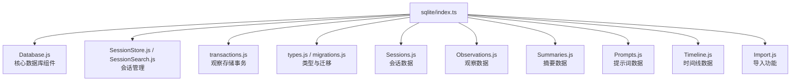

# index.ts 需求说明

> 源文件：src/services/sqlite/index.ts ｜ 类型：源码（桶文件） ｜ 行数：25 ｜ 所属模块：sqlite ｜ 分析日期：2026-07-23

## 1. 文件定位总述

本文件是 SQLite 数据访问层的顶层桶导出文件，统一导出数据库管理、数据操作和迁移的全部能力。它涵盖了数据库核心（Database、DatabaseManager、MigrationRunner）、会话管理（SessionStore、SessionSearch）、观察存储事务、以及所有实体子模块（Sessions、Observations、Summaries、Prompts、Timeline、Import）。这是整个数据层的唯一入口。

## 2. 功能需求

| 编号 | 需求描述（系统应当…） | 触发条件 / 输入 | 处理规则与输出 | 证据 |
|------|----------------------|----------------|---------------|------|
| FR-SqlIdx-01 | 系统应当导出数据库核心组件：ClaudeMemDatabase、DatabaseManager、getDatabase、initializeDatabase、MigrationRunner | 外部模块导入 | 重导出自 Database.js | `src/services/sqlite/index.ts:2-7` |
| FR-SqlIdx-02 | 系统应当导出会话存储和搜索组件 | 外部模块导入 | 导出 SessionStore、SessionSearch | `src/services/sqlite/index.ts:9-11` |
| FR-SqlIdx-03 | 系统应当导出类型定义和迁移配置 | 外部模块导入 | 重导出 types.js 和 migrations.js | `src/services/sqlite/index.ts:14-15` |
| FR-SqlIdx-04 | 系统应当导出观察存储事务函数 | 外部模块导入 | 导出 storeObservations、storeObservationsAndMarkComplete | `src/services/sqlite/index.ts:17-18` |
| FR-SqlIdx-05 | 系统应当导出所有实体子模块 | 外部模块导入 | 重导出 Sessions、Observations、Summaries、Prompts、Timeline、Import | `src/services/sqlite/index.ts:20-25` |

## 3. 业务规则与约束

无。本文件是纯桶导出。

## 4. 对外暴露

| 类别 | 名称 | 类型 | 来源 |
|------|------|------|------|
| 重导出 | ClaudeMemDatabase, DatabaseManager, getDatabase, initializeDatabase, MigrationRunner | 类/函数 | `./Database.js` |
| 导出 | SessionStore | 类 | `./SessionStore.js` |
| 导出 | SessionSearch | 类 | `./SessionSearch.js` |
| 重导出 | 数据层类型定义 | 类型 | `./types.js` |
| 重导出 | migrations | 常量/配置 | `./migrations.js` |
| 导出 | storeObservations, storeObservationsAndMarkComplete | 函数 | `./transactions.js` |
| 重导出 | Sessions 子模块 | 模块 | `./Sessions.js` |
| 重导出 | Observations 子模块 | 模块 | `./Observations.js` |
| 重导出 | Summaries 子模块 | 模块 | `./Summaries.js` |
| 重导出 | Prompts 子模块 | 模块 | `./Prompts.js` |
| 重导出 | Timeline 子模块 | 模块 | `./Timeline.js` |
| 重导出 | Import 子模块 | 模块 | `./Import.js` |

## 5. 依赖关系

- **上游**：`./Database.js`、`./SessionStore.js`、`./SessionSearch.js`、`./types.js`、`./migrations.js`、`./transactions.js`、六个实体子模块桶文件
- **下游**：Worker 服务层中所有需要数据库访问的模块

## 6. 数据结构

不适用。

## 7. 复杂逻辑图示

上图展示了 sqlite 模块导出的全部组件层次结构，体现了数据层作为系统唯一持久化入口的中心地位。

## 8. 逆向备注

推断：`storeObservationsAndMarkComplete` 的事务性（文件名为 transactions.js）暗示观察存储可能涉及多表写入（observations 表 + 关联表），需要在单个事务中保证原子性。`Import.js` 子模块的存在表明系统支持从外部数据源导入观察记录。
