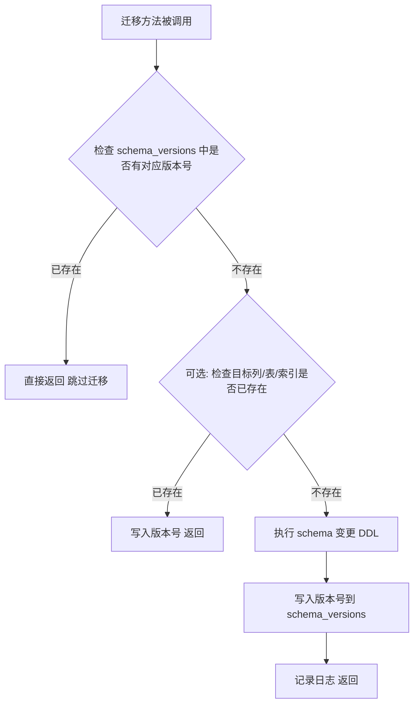
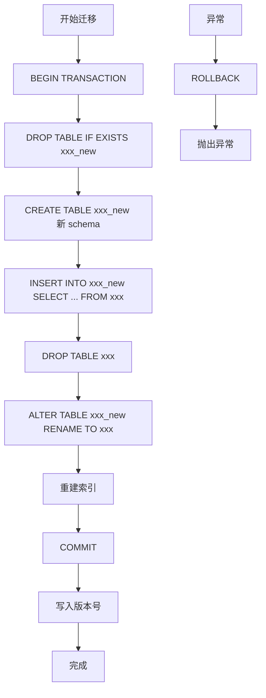

# runner.ts 需求说明

> 源文件：src/services/sqlite/migrations/runner.ts ｜ 类型：源码 ｜ 行数：1279 ｜ 所属模块：sqlite/migrations（数据库迁移） ｜ 分析日期：2026-07-23

## 1. 文件定位总述

MigrationRunner 是 claude-mem 数据库 schema 演进的核心执行器，负责在应用启动时将 SQLite 数据库从任意历史版本升级至最新版本。它采用顺序执行、版本号幂等的迁移策略：每个迁移步骤对应一个版本号，执行前检查 `schema_versions` 表中是否已存在该版本号，已执行的迁移自动跳过。迁移内容涵盖初始表创建、列增删改、约束变更、索引调整、表重建以及角色条件性表创建（server 模式专属表）。该类接收 `bun:sqlite` 的 Database 实例作为构造参数，不自行管理数据库连接生命周期。

## 2. 功能需求

### 2.1 总述

MigrationRunner 提供的对外能力仅有 `runAllMigrations()` 一个入口方法，内部按固定顺序调用 28 个私有迁移方法。每个迁移方法负责一项或多项相关的 schema 变更，通过版本号幂等机制保证可重复执行的安全性。迁移覆盖了从 v4（初始 schema）到 v39（最新）的全部演进历史。

### 2.2 功能需求清单

| 编号 | 需求描述（系统应当…） | 触发条件 / 输入 | 处理规则与输出 | 证据 |
|------|----------------------|----------------|---------------|------|
| FR-INIT-01 | 系统应当在首次启动时创建基础 schema，包括 schema_versions、sdk_sessions、observations、session_summaries 四张核心表及其索引。 | schema_versions 表不存在时 | 使用 CREATE TABLE IF NOT EXISTS 创建四张表；sdk_sessions 包含 content_session_id(UNIQUE)、memory_session_id(UNIQUE)、project、platform_source 等列及 CHECK 约束；observations 和 session_summaries 含外键引用 sdk_sessions 并设置 ON DELETE CASCADE；版本标记为 v4。 | `src/services/sqlite/migrations/runner.ts:193-262` |
| FR-V5-01 | 系统应当为 sdk_sessions 表添加 worker_port 列，用于记录处理该会话的 worker 进程端口号。 | v5 未执行过且列不存在时 | ALTER TABLE ADD COLUMN worker_port INTEGER；版本标记 v5。 | `src/services/sqlite/migrations/runner.ts:264-274` |
| FR-V6-01 | 系统应当为 sdk_sessions、observations、session_summaries 三张表分别添加 prompt 计数相关列，用于追踪每个会话/观测/摘要对应的提示词序号。 | v6 未执行过且对应列不存在时 | sdk_sessions 添加 prompt_counter（DEFAULT 0）；observations 添加 prompt_number；session_summaries 添加 prompt_number；版本标记 v6。 | `src/services/sqlite/migrations/runner.ts:276-302` |
| FR-V7-01 | 系统应当移除 session_summaries 表上 memory_session_id 列的 UNIQUE 约束，以允许同一会话产生多条摘要记录。 | v7 未执行过且存在非主键 UNIQUE 索引时 | 在事务中创建 _new 表（不含 UNIQUE）、迁移数据、删除原表、重命名新表、重建索引；版本标记 v7。 | `src/services/sqlite/migrations/runner.ts:304-362` |
| FR-V8-01 | 系统应当为 observations 表添加层级结构字段（title、subtitle、facts、narrative、concepts、files_read、files_modified），支持结构化观测数据的存储。 | v8 未执行过且 title 列不存在时 | ALTER TABLE 添加 7 个 TEXT 类型列；版本标记 v8。 | `src/services/sqlite/migrations/runner.ts:364-391` |
| FR-V9-01 | 系统应当将 observations 表的 text 列从 NOT NULL 变更为可空，因为结构化观测使用 narrative 替代原始 text。 | v9 未执行过且 text 列仍为 NOT NULL 时 | 在事务中重建表（text TEXT 可空）、迁移全部列数据、重建索引；版本标记 v9。 | `src/services/sqlite/migrations/runner.ts:393-456` |
| FR-V10-01 | 系统应当创建 user_prompts 表存储用户提示词历史，并尝试建立 FTS5 全文搜索虚拟表及同步触发器。 | v10 未执行过且表不存在时 | 在事务中创建 user_prompts 表（含外键引用 sdk_sessions）及 4 个索引；try 创建 FTS5 虚拟表和 3 个同步触发器（INSERT/DELETE/UPDATE），FTS5 不可用时降级跳过；版本标记 v10。 | `src/services/sqlite/migrations/runner.ts:458-500` |
| FR-V11-01 | 系统应当为 observations 和 session_summaries 表添加 discovery_tokens 列，记录 AI 处理过程中的 token 消耗。 | v11 未执行过且列不存在时 | 两表各添加 discovery_tokens INTEGER DEFAULT 0；版本标记 v11。 | `src/services/sqlite/migrations/runner.ts:531-552` |
| FR-V16-01 | 系统应当创建 pending_messages 表，用于暂存待处理的异步消息（观测和摘要），支持消息类型和状态的约束检查。 | v16 未执行过且表不存在时 | 创建表含 message_type CHECK（observation/summarize）和 status CHECK（pending/processing）；3 个索引；版本标记 v16。 | `src/services/sqlite/migrations/runner.ts:554-592` |
| FR-V17-01 | 系统应当将多个表中的会话 ID 列重命名为语义更清晰的名称：claude_session_id -> content_session_id，sdk_session_id -> memory_session_id。 | v17 未执行过时 | 遍历 sdk_sessions、pending_messages、observations、session_summaries、user_prompts 五张表执行安全重命名（检查目标列不存在才执行）；版本标记 v17。 | `src/services/sqlite/migrations/runner.ts:594-639` |
| FR-V20-01 | 系统应当为 pending_messages 表添加 failed_at_epoch 列，记录消息处理失败的 epoch 时间戳。 | v20 未执行过且列不存在时 | ALTER TABLE ADD COLUMN failed_at_epoch INTEGER；版本标记 v20。 | `src/services/sqlite/migrations/runner.ts:641-654` |
| FR-V21-01 | 系统应当为 observations 和 session_summaries 的外键约束添加 ON UPDATE CASCADE，使会话 ID 更新时子表数据自动同步。 | v21 未执行过时 | 关闭外键检查，在事务中重建两张表（含 ON DELETE CASCADE ON UPDATE CASCADE）、迁移数据、重建索引及 FTS 触发器；版本标记 v21。 | `src/services/sqlite/migrations/runner.ts:656-820` |
| FR-V22-01 | 系统应当为 observations 表添加 content_hash 列，并为已有记录填充随机哈希值，建立索引以支持未来去重查询。 | v22 未执行过且列不存在时 | ALTER TABLE ADD COLUMN content_hash TEXT；UPDATE 用 randomblob(8) 填充空值；CREATE INDEX；版本标记 v22。 | `src/services/sqlite/migrations/runner.ts:822-837` |
| FR-V23-01 | 系统应当为 sdk_sessions 表添加 custom_title 列，支持用户自定义会话标题。 | v23 未执行过且列不存在时 | ALTER TABLE ADD COLUMN custom_title TEXT；版本标记 v23。 | `src/services/sqlite/migrations/runner.ts:839-852` |
| FR-V24-01 | 系统应当创建 observation_feedback 表，用于记录观测的使用反馈信号（如正面/负面标记）。 | v24 未执行过时 | CREATE TABLE IF NOT EXISTS 含外键引用 observations(id)；两个索引（按 observation_id 和 signal_type）；版本标记 v24。 | `src/services/sqlite/migrations/runner.ts:854-874` |
| FR-V25-01 | 系统应当为 sdk_sessions 表添加 platform_source 列，记录产生该会话的平台来源，默认值为 claude，并为已有记录回填默认值。 | v25 未执行过或列/索引不完整时 | ALTER TABLE 添加列（NOT NULL DEFAULT）；UPDATE 回填空值；CREATE INDEX；版本标记 v25。 | `src/services/sqlite/migrations/runner.ts:876-901` |
| FR-V26-01 | 系统应当为 observations 和 session_summaries 表添加 merged_into_project 列及索引，支持项目合并场景下的归属记录。 | 列不存在时（无版本号检查，每次启动执行） | ALTER TABLE 添加 merged_into_project TEXT；CREATE INDEX IF NOT EXISTS。 | `src/services/sqlite/migrations/runner.ts:903-923` |
| FR-V27-01 | 系统应当为 observations 和 pending_messages 表添加 agent_type 和 agent_id 列，支持子代理（subagent）身份标识。 | v27 未执行过时 | observations 添加 agent_type 和 agent_id TEXT 列及两个索引；pending_messages 条件性添加（表存在时）；版本标记 v27。 | `src/services/sqlite/migrations/runner.ts:925-960` |
| FR-V28-01 | 系统应当重建 pending_messages 表，添加 tool_use_id 列支持自愈式消息认领，并通过去重查询和唯一索引防止同一条工具调用的消息重复入队。 | v28 未执行过且表存在时 | 在事务中重建表（添加 tool_use_id 列，移除 failed_at_epoch、completed_at_epoch 列）；迁移 status 为 pending/processing 的记录；DELETE 去重（按 content_session_id + tool_use_id 保留最早记录）；CREATE UNIQUE INDEX；版本标记 v28。 | `src/services/sqlite/migrations/runner.ts:962-1071` |
| FR-V29-01 | 系统应当为 observations 表建立 (memory_session_id, content_hash) 唯一索引，并在建索引前清理同一会话内的重复内容记录。 | v29 未执行过且前提列存在时 | 在事务中 DELETE 重复记录（保留每组最小 id）；CREATE UNIQUE INDEX；版本标记 v29。 | `src/services/sqlite/migrations/runner.ts:1073-1110` |
| FR-V30-01 | 系统应当为 observations 表添加 metadata 列，用于存储扩展的 JSON 元数据。 | 列不存在时（无版本号前置检查） | ALTER TABLE ADD COLUMN metadata TEXT；版本标记 v30。 | `src/services/sqlite/migrations/runner.ts:1112-1122` |
| FR-V31-01 | 系统应当清理 pending_messages 表中的废弃列（retry_count、failed_at_epoch、completed_at_epoch、worker_pid），并清除非活跃状态的死记录。 | 列存在时 | 先 DELETE WHERE status NOT IN ('pending', 'processing') 清除死记录；按需 DROP INDEX 和 DROP COLUMN；版本标记 v31。 | `src/services/sqlite/migrations/runner.ts:1124-1151` |
| FR-V32-01 | 系统应当从 pending_messages 表移除 worker_pid 列及其索引（v31 的补充清理，确保列被移除）。 | v32 未执行过且列存在时 | DROP INDEX IF EXISTS + ALTER TABLE DROP COLUMN；版本标记 v32。 | `src/services/sqlite/migrations/runner.ts:1153-1171` |
| FR-SERVER-01 | 系统应当在 server 角色模式下调用外部 schema 创建逻辑建立 server 专属表（如 api_keys 等），并将版本号与外部 schema 版本对齐。 | 角色为 server 时 | 调用 ensureServerStorageSchema(db) 并以 SERVER_STORAGE_SCHEMA_VERSION 标记版本号。 | `src/services/sqlite/migrations/runner.ts:1173-1179` |
| FR-V34-01 | 系统应当最终规范化 pending_messages 表的 status CHECK 约束，移除已废弃的 'processed' 和 'failed' 状态值，仅保留 'pending' 和 'processing'。 | v34 未执行过且存在旧状态值或废弃列时 | 在事务中重建表（status CHECK 仅含 pending/processing）；迁移活跃记录；重建索引和唯一索引；版本标记 v34。 | `src/services/sqlite/migrations/runner.ts:1181-1277` |
| FR-V35-01 | 系统应当为 sdk_sessions 表添加 user_name 列，记录创建该会话的操作系统用户名。 | v35 未执行过且列不存在时 | ALTER TABLE ADD COLUMN user_name TEXT；版本标记 v35。 | `src/services/sqlite/migrations/runner.ts:105-118` |
| FR-V36-01 | 系统应当为 sdk_sessions 表添加 user_label 列（同步身份标识）及索引，用于多用户环境下的用户区分。 | v36 未执行过且列不存在时 | ALTER TABLE ADD COLUMN user_label TEXT + CREATE INDEX；版本标记 v36。 | `src/services/sqlite/migrations/runner.ts:124-138` |
| FR-V37-01 | 系统应当在 server 角色模式下创建 sync_inbox 表，用于服务端摄入去重账本，记录跨用户同步的已处理条目。 | 角色为 server 且 v37 未执行过时 | CREATE TABLE 含 UNIQUE(user_label, source_table, source_uid) 约束及 CHECK(source_table) 限定四种表；CREATE INDEX；版本标记 v37。 | `src/services/sqlite/migrations/runner.ts:145-170` |
| FR-V38-01 | 系统应当在 server 角色模式下为 api_keys 表添加 bound_user_label 列及索引，用于将 API 密钥绑定到特定用户。 | 角色为 server 且 v38 未执行过且 api_keys 表存在时 | ALTER TABLE ADD COLUMN + CREATE INDEX；版本标记 v38。 | `src/services/sqlite/migrations/runner.ts:172-191` |
| FR-V39-01 | 系统应当创建 admin_login_attempts 表，用于 server 模式下 viewer 认证的登录尝试速率限制追踪。 | v39 未执行过时 | CREATE TABLE 含 attempted_at_epoch 和 success 列；CREATE INDEX；版本标记 v39。 | `src/services/sqlite/migrations/runner.ts:78-97` |

## 3. 业务规则与约束

| 编号 | 规则描述 | 证据 |
|------|---------|------|
| BR-01 | **版本号幂等**：每个迁移步骤通过 `schema_versions` 表的版本号实现幂等执行，已应用版本自动跳过。版本标记使用 `INSERT OR IGNORE` 防止重复插入。 | `src/services/sqlite/migrations/runner.ts:79-81,94-96` |
| BR-02 | **顺序执行**：`runAllMigrations()` 按 28 个私有方法的固定顺序执行，不使用依赖图或并行执行。 | `src/services/sqlite/migrations/runner.ts:41-72` |
| BR-03 | **表重建使用事务**：涉及表结构变更（移除约束、改 NOT NULL、添加 CASCADE）的迁移均在事务中执行，失败时 ROLLBACK 回滚。 | `src/services/sqlite/migrations/runner.ts:315-357,407-456,665-681` |
| BR-04 | **外键管理**：表重建类迁移临时关闭外键检查（PRAGMA foreign_keys = OFF），完成后重新开启。 | `src/services/sqlite/migrations/runner.ts:662,671,974,1060` |
| BR-05 | **FTS5 降级处理**：user_prompts 的 FTS5 全文搜索虚拟表创建使用 try-catch 包裹，不可用时降级跳过并记录警告日志（搜索回退到 ChromaDB）。 | `src/services/sqlite/migrations/runner.ts:489-493` |
| BR-06 | **角色条件迁移**：部分迁移（v37 sync_inbox、v38 api_keys、server 专属表）仅在 server 角色模式下执行，client 模式跳过。角色判定顺序：环境变量 CLAUDE_MEM_NODE_ROLE 优先，其次读取 settings.json。 | `src/services/sqlite/migrations/runner.ts:20-36,146,173,1173` |
| BR-07 | **安全列名处理**：v25 的 platform_source 列默认值通过字符串拼接 SQL 实现（`${DEFAULT_PLATFORM_SOURCE}`），推断该常量来源安全（编译时常量）。 | `src/services/sqlite/migrations/runner.ts:886,893` |
| BR-08 | **自适应列迁移**：v28 和 v34 的 pending_messages 重建使用 `has()` 函数动态检测源表中哪些列存在，SELECT 时对缺失列使用 NULL 替代，确保从任意中间版本都能迁移。 | `src/services/sqlite/migrations/runner.ts:979-1033,1200-1253` |
| BR-09 | **去重策略**：v29 在建唯一索引前先 DELETE 重复记录（保留 MIN(id)），v28 对 pending_messages 按 (content_session_id, tool_use_id) 去重后再建唯一索引。 | `src/services/sqlite/migrations/runner.ts:1043-1056,1087-1098` |
| BR-10 | **版本号不连续**：版本号从 v4 跳到 v39，中间存在间隔（如 v12-v15、v18-v19 等），推断这些版本号在其他迁移路径（如 SessionStore.ts）中使用，或已被废弃。 | `src/services/sqlite/migrations/runner.ts:41-72` |
| BR-11 | **无版本号迁移**：v22 和 v26 的迁移方法未前置检查 schema_versions，而是通过 PRAGMA table_info 检测列是否存在来判断是否需要执行，但仍写入版本号。v26 完全不写版本号。 | `src/services/sqlite/migrations/runner.ts:822-837,903-923` |

## 4. 对外暴露

| 暴露类型 | 名称 | 用途 | 证据 |
|---------|------|------|------|
| 公开方法 | runAllMigrations() | 执行全部 28 个迁移步骤，将数据库升级至最新 schema | `src/services/sqlite/migrations/runner.ts:41` |

MigrationRunner 的对外接口极为精简，仅暴露一个 `runAllMigrations()` 方法。其余 28 个迁移方法均为 private，不对外可见。

## 5. 依赖关系

| 依赖方向 | 依赖项 | 用途 | 证据 |
|---------|--------|------|------|
| 外部依赖 | bun:sqlite (Database) | 构造参数，提供 SQLite 数据库操作接口 | `src/services/sqlite/migrations/runner.ts:1,39` |
| 外部依赖 | fs (existsSync, readFileSync) | 在 isServerRole() 中读取 settings.json 判断运行角色 | `src/services/sqlite/migrations/runner.ts:2,26` |
| 内部依赖 | logger | 结构化日志输出 | `src/services/sqlite/migrations/runner.ts:3` |
| 内部依赖 | TableColumnInfo, IndexInfo, TableNameRow, SchemaVersion | 类型定义，用于 PRAGMA 查询结果的类型标注 | `src/services/sqlite/migrations/runner.ts:5-9` |
| 内部依赖 | DEFAULT_PLATFORM_SOURCE | sdk_sessions.platform_source 的默认值常量 | `src/services/sqlite/migrations/runner.ts:10,886,893` |
| 内部依赖 | USER_SETTINGS_PATH | settings.json 文件路径，用于角色判定 | `src/services/sqlite/migrations/runner.ts:11,26` |
| 内部依赖 | ensureServerStorageSchema, SERVER_STORAGE_SCHEMA_VERSION | server 专属表的创建逻辑和版本号 | `src/services/sqlite/migrations/runner.ts:12,1174-1178` |

## 6. 数据结构

### 6.1 迁移版本序列

MigrationRunner 管理的迁移版本序列如下（按 `runAllMigrations` 中的调用顺序排列）：

| 调用顺序 | 版本号 | 迁移方法 | 主要变更内容 |
|---------|--------|---------|------------|
| 1 | 4 | initializeSchema | 创建 schema_versions、sdk_sessions、observations、session_summaries |
| 2 | 5 | ensureWorkerPortColumn | sdk_sessions 添加 worker_port |
| 3 | 6 | ensurePromptTrackingColumns | 三表添加 prompt 计数列 |
| 4 | 7 | removeSessionSummariesUniqueConstraint | session_summaries 移除 UNIQUE 约束 |
| 5 | 8 | addObservationHierarchicalFields | observations 添加 7 个层级字段 |
| 6 | 9 | makeObservationsTextNullable | observations.text 改为可空 |
| 7 | 10 | createUserPromptsTable | 创建 user_prompts 表 + FTS5 |
| 8 | 11 | ensureDiscoveryTokensColumn | 两表添加 discovery_tokens |
| 9 | 16 | createPendingMessagesTable | 创建 pending_messages 表 |
| 10 | 17 | renameSessionIdColumns | 五表会话 ID 列重命名 |
| 11 | 20 | addFailedAtEpochColumn | pending_messages 添加 failed_at_epoch |
| 12 | 21 | addOnUpdateCascadeToForeignKeys | 两表外键添加 ON UPDATE CASCADE |
| 13 | 22 | addObservationContentHashColumn | observations 添加 content_hash |
| 14 | 23 | addSessionCustomTitleColumn | sdk_sessions 添加 custom_title |
| 15 | 24 | createObservationFeedbackTable | 创建 observation_feedback 表 |
| 16 | 25 | addSessionPlatformSourceColumn | sdk_sessions 添加 platform_source |
| 17 | - | ensureMergedIntoProjectColumns | 两表添加 merged_into_project（无版本号） |
| 18 | 27 | addObservationSubagentColumns | observations/pending_messages 添加 agent 列 |
| 19 | 28 | rebuildPendingMessagesForSelfHealingClaim | pending_messages 重建（tool_use_id + 去重） |
| 20 | 29 | addObservationsUniqueContentHashIndex | observations 唯一索引 + 去重 |
| 21 | 30 | addObservationsMetadataColumn | observations 添加 metadata |
| 22 | 31 | dropDeadPendingMessagesColumns | pending_messages 清理废弃列 |
| 23 | 32 | dropWorkerPidColumn | pending_messages 移除 worker_pid |
| 24 | 动态 | createServerOwnedTables | server 模式专属表 |
| 25 | 34 | rebuildPendingMessagesForFinalQueueSchema | pending_messages 最终规范化 |
| 26 | 35 | addSessionUserNameColumn | sdk_sessions 添加 user_name |
| 27 | 36 | addSessionUserLabelColumn | sdk_sessions 添加 user_label |
| 28 | 37 | createSyncInboxTable | server 模式创建 sync_inbox |
| 29 | 38 | addApiKeysUserLabelColumn | server 模式 api_keys 添加 bound_user_label |
| 30 | 39 | ensureAdminLoginAttemptsTable | 创建 admin_login_attempts |

证据：`src/services/sqlite/migrations/runner.ts:41-72`

### 6.2 核心表结构（最终 schema）

#### sdk_sessions

| 列名 | 类型 | 约束 | 版本 |
|------|------|------|------|
| id | INTEGER | PRIMARY KEY AUTOINCREMENT | v4 |
| content_session_id | TEXT | UNIQUE NOT NULL | v4 |
| memory_session_id | TEXT | UNIQUE | v4 |
| project | TEXT | NOT NULL | v4 |
| platform_source | TEXT | NOT NULL DEFAULT 'claude' | v4+v25 |
| user_prompt | TEXT | - | v4 |
| started_at | TEXT | NOT NULL | v4 |
| started_at_epoch | INTEGER | NOT NULL | v4 |
| completed_at | TEXT | - | v4 |
| completed_at_epoch | INTEGER | - | v4 |
| status | TEXT | CHECK(active/completed/failed), DEFAULT active | v4 |
| worker_port | INTEGER | - | v5 |
| prompt_counter | INTEGER | DEFAULT 0 | v6 |
| custom_title | TEXT | - | v23 |
| user_name | TEXT | - | v35 |
| user_label | TEXT | - | v36 |

证据：`src/services/sqlite/migrations/runner.ts:194-260` 及各版本迁移方法

#### observations

| 列名 | 类型 | 约束 | 版本 |
|------|------|------|------|
| id | INTEGER | PRIMARY KEY AUTOINCREMENT | v4 |
| memory_session_id | TEXT | NOT NULL, FK -> sdk_sessions | v4+v17+v21 |
| project | TEXT | NOT NULL | v4 |
| text | TEXT | 可空（v9 改） | v4+v9 |
| type | TEXT | NOT NULL | v4 |
| title | TEXT | - | v8 |
| subtitle | TEXT | - | v8 |
| facts | TEXT | - | v8 |
| narrative | TEXT | - | v8 |
| concepts | TEXT | - | v8 |
| files_read | TEXT | - | v8 |
| files_modified | TEXT | - | v8 |
| prompt_number | INTEGER | - | v6 |
| discovery_tokens | INTEGER | DEFAULT 0 | v11 |
| created_at | TEXT | NOT NULL | v4 |
| created_at_epoch | INTEGER | NOT NULL | v4 |
| content_hash | TEXT | 索引 + 唯一约束(memory_session_id, content_hash) | v22+v29 |
| merged_into_project | TEXT | - | v26 |
| agent_type | TEXT | - | v27 |
| agent_id | TEXT | - | v27 |
| metadata | TEXT | - | v30 |

#### pending_messages

| 列名 | 类型 | 约束 | 版本 |
|------|------|------|------|
| id | INTEGER | PRIMARY KEY AUTOINCREMENT | v16 |
| session_db_id | INTEGER | NOT NULL, FK -> sdk_sessions(id) | v16 |
| content_session_id | TEXT | NOT NULL | v16+v17 |
| tool_use_id | TEXT | - | v28 |
| message_type | TEXT | CHECK(observation/summarize), NOT NULL | v16 |
| tool_name | TEXT | - | v16 |
| tool_input | TEXT | - | v16 |
| tool_response | TEXT | - | v16 |
| cwd | TEXT | - | v16 |
| last_user_message | TEXT | - | v16 |
| last_assistant_message | TEXT | - | v16 |
| prompt_number | INTEGER | - | v16 |
| status | TEXT | CHECK(pending/processing), DEFAULT pending | v16+v34 |
| created_at_epoch | INTEGER | NOT NULL | v16 |
| agent_type | TEXT | - | v27 |
| agent_id | TEXT | - | v27 |

#### sync_inbox（server 模式专属）

| 列名 | 类型 | 约束 | 版本 |
|------|------|------|------|
| id | INTEGER | PRIMARY KEY AUTOINCREMENT | v37 |
| user_label | TEXT | NOT NULL | v37 |
| source_table | TEXT | NOT NULL, CHECK(四种表) | v37 |
| source_uid | TEXT | NOT NULL | v37 |
| applied_at_epoch | INTEGER | NOT NULL | v37 |
| applied_row_id | INTEGER | - | v37 |
| UNIQUE(user_label, source_table, source_uid) | | | v37 |

#### admin_login_attempts

| 列名 | 类型 | 约束 | 版本 |
|------|------|------|------|
| id | INTEGER | PRIMARY KEY AUTOINCREMENT | v39 |
| attempted_at_epoch | INTEGER | NOT NULL | v39 |
| success | INTEGER | NOT NULL DEFAULT 0 | v39 |

## 7. 复杂逻辑图示

### 7.1 迁移执行总流程

```mermaid
flowchart TB
    A["runAllMigrations 被调用"] --> B["initializeSchema v4"]
    B --> C["ensureWorkerPortColumn v5"]
    C --> D["ensurePromptTrackingColumns v6"]
    D --> E["removeSessionSummariesUniqueConstraint v7"]
    E --> F["addObservationHierarchicalFields v8"]
    F --> G["makeObservationsTextNullable v9"]
    G --> H["createUserPromptsTable v10"]
    H --> I["ensureDiscoveryTokensColumn v11"]
    I --> J["createPendingMessagesTable v16"]
    J --> K["renameSessionIdColumns v17"]
    K --> L["addFailedAtEpochColumn v20"]
    L --> M["addOnUpdateCascadeToForeignKeys v21"]
    M --> N["addObservationContentHashColumn v22"]
    N --> O["addSessionCustomTitleColumn v23"]
    O --> P["createObservationFeedbackTable v24"]
    P --> Q["addSessionPlatformSourceColumn v25"]
    Q --> R["ensureMergedIntoProjectColumns 无版本号"]
    R --> S["addObservationSubagentColumns v27"]
    S --> T["rebuildPendingMessagesForSelfHealingClaim v28"]
    T --> U["addObservationsUniqueContentHashIndex v29"]
    U --> V["addObservationsMetadataColumn v30"]
    V --> W["dropDeadPendingMessagesColumns v31"]
    W --> X["dropWorkerPidColumn v32"]
    X --> Y["createServerOwnedTables 动态版本"]
    Y --> Z["rebuildPendingMessagesForFinalQueueSchema v34"]
    Z --> AA["addSessionUserNameColumn v35"]
    AA --> AB["addSessionUserLabelColumn v36"]
    AB --> AC["createSyncInboxTable v37 server"]
    AC --> AD["addApiKeysUserLabelColumn v38 server"]
    AD --> AE["ensureAdminLoginAttemptsTable v39"]
```



### 7.2 单个迁移的幂等执行模式



绝大多数迁移遵循此模式：版本号检查 -> 列/表存在性检查 -> 执行 DDL -> 写入版本号。

### 7.3 表重建迁移模式（以 v9 为例）



SQLite 不支持 ALTER TABLE 修改列约束（如 NOT NULL -> nullable），因此需要通过创建新表、迁移数据、删除旧表、重命名的方式完成。

### 7.4 isServerRole 判定逻辑

```mermaid
flowchart TB
    A["isServerRole 被调用"] --> B{环境变量 CLAUDE_MEM_NODE_ROLE 非空?}
    B -->|是| C{值 === "server"?}
    C -->|是| D["返回 true"]
    C -->|否| E["返回 false"]
    B -->|否| F{settings.json 文件存在?}
    F -->|否| G["返回 false"]
    F -->|是| H["读取并解析 JSON"]
    H --> I{解析出 CLAUDE_MEM_NODE_ROLE === "server"?}
    I -->|是| D
    I -->|否| E
    H2["解析异常"] --> E
```

角色判定优先级：环境变量 > settings.json 配置 > 默认 false（client 模式）。

## 8. 逆向备注

| 编号 | 备注 | 证据 |
|------|------|------|
| N-01 | 版本号从 v4 开始（跳过 v1-v3），推断 v1-v3 可能在更早的代码版本中存在但已合并到 initializeSchema 中，或该项目的迁移体系从 v4 开始建立。 | `src/services/sqlite/migrations/runner.ts:261` |
| N-02 | 版本号存在跳跃（v11 直接到 v16，v17 到 v20 等），推断中间版本号被分配给其他迁移路径（如 SessionStore.ts 中有注释提到 "Mirrored in SessionStore.ts"），或为已废弃的迁移。 | `src/services/sqlite/migrations/runner.ts:100-103,121-123` |
| N-03 | v22 和 v30 的迁移方法没有前置版本号检查，而是直接通过 PRAGMA table_info 判断列是否存在。v30 直接检查列并写入版本号，但未先查 schema_versions 表，这意味着如果列已存在但版本号未写入（如手动建表），它会重复写入版本号（但因 INSERT OR IGNORE 不会报错）。 | `src/services/sqlite/migrations/runner.ts:822-837,1112-1122` |
| N-04 | v26 (ensureMergedIntoProjectColumns) 是唯一一个既无版本号前置检查也不写入版本号的迁移，这意味着它每次启动都会执行列存在性检查和 CREATE INDEX IF NOT EXISTS。推断：该迁移被视为"防御性检查"而非有版本意义的迁移。 | `src/services/sqlite/migrations/runner.ts:903-923` |
| N-05 | v31 (dropDeadPendingMessagesColumns) 和 v32 (dropWorkerPidColumn) 存在功能重叠：v31 尝试删除 worker_pid，v32 专门再删一次。推断 v32 是 v31 的安全补充——v31 的列列表来自硬编码数组但 DROP COLUMN 可能因 SQLite 版本不支持而失败（catch 后仅 warn），v32 单独确保 worker_pid 被移除。 | `src/services/sqlite/migrations/runner.ts:1127,1153-1171` |
| N-06 | isServerRole 函数直接读取 settings.json 文件而非通过 SettingsDefaultsManager，注释说明是为了避免循环导入（SettingsDefaultsManager 在迁移期间可能尚未完成初始化）。 | `src/services/sqlite/migrations/runner.ts:14-16` |
| N-07 | FTS5 触发器在 v21 的 recreateObservationsWithUpdateCascade 中被条件性重建，但 v4 的 initializeSchema 并未创建 FTS5 表。推断 observations 的 FTS5 虚拟表可能在另一个迁移路径（SessionStore.ts）中创建，runner 仅在表重建时负责恢复触发器。 | `src/services/sqlite/migrations/runner.ts:731-751` |
| N-08 | pending_messages 表经历了三次重建（v16 创建、v28 重建添加 tool_use_id、v34 最终规范化），这反映了消息队列模型的多轮迭代设计演进。 | `src/services/sqlite/migrations/runner.ts:554,962,1181` |
| N-09 | v28 和 v34 的迁移逻辑高度相似（都是重建 pending_messages 表并清理废弃状态），推断 v34 是 v28 后发现仍有残留旧状态值（processed/failed）和废弃列需要清理而追加的最终规范化迁移。 | `src/services/sqlite/migrations/runner.ts:962-1071,1181-1277` |
