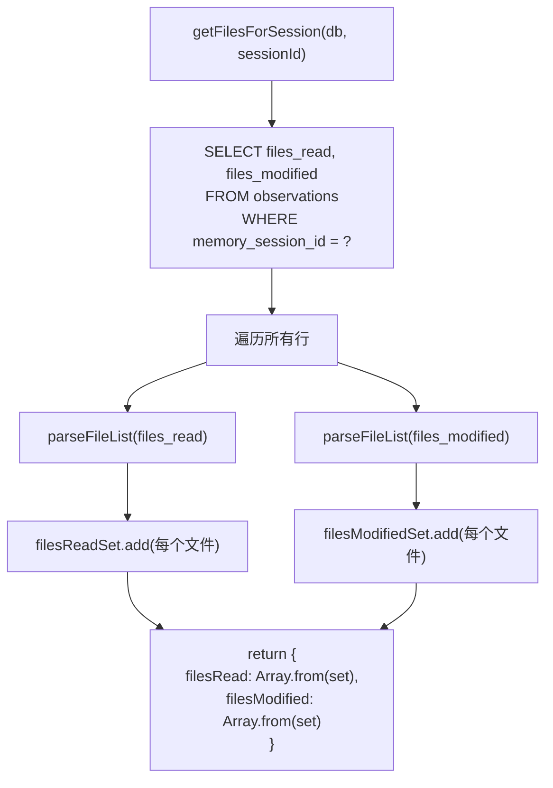

# observations/files.ts 需求说明

> 源文件：src/services/sqlite/observations/files.ts ｜ 类型：源码 ｜ 行数：45 ｜ 所属模块：sqlite/observations ｜ 分析日期：2026-07-23

## 1. 文件定位总述

本文件提供观测记录关联文件集合的查询能力，从 SQLite 数据库中按会话 ID 聚合该会话所有观测记录涉及的读取文件和修改文件列表。它包含一个 JSON 解析辅助函数 `parseFileList`，用于安全地将数据库中存储的 JSON 字符串（或原始字符串）转换为文件名数组，以及一个查询函数 `getFilesForSession`，返回去重后的文件集合。

## 2. 功能需求

| 编号 | 需求描述（系统应当…） | 触发条件 / 输入 | 处理规则与输出 | 证据 |
|------|----------------------|----------------|---------------|------|
| FR-OF-01 | 系统应当能安全解析文件列表字段，支持 JSON 数组、JSON 单值和原始字符串三种格式 | 调用 `parseFileList(value)`，value 为数据库字段值 | null/undefined/空值返回空数组；尝试 JSON.parse，数组直接返回，非数组包装为单元素数组；解析失败则将原始值作为单元素数组返回 | `src/services/sqlite/observations/files.ts:6-14` |
| FR-OF-02 | 系统应当能按记忆会话 ID 查询该会话关联的所有去重文件列表（读取+修改） | 调用 `getFilesForSession(db, memorySessionId)` | 从 observations 表查询 `files_read` 和 `files_modified`，逐行解析后用 Set 去重，返回 `{ filesRead, filesModified }` | `src/services/sqlite/observations/files.ts:16-44` |

## 3. 业务规则与约束

| 编号 | 规则描述 | 证据 |
|------|---------|------|
| BR-OF-01 | 文件列表字段在数据库中以 JSON 格式存储（推断），但也兼容原始字符串格式 | `src/services/sqlite/observations/files.ts:8-13` |
| BR-OF-02 | 文件去重基于精确字符串匹配（Set 语义） | `src/services/sqlite/observations/files.ts:31-32` |
| BR-OF-03 | 查询遍历该会话所有观测记录行，跨行聚合文件列表 | `src/services/sqlite/observations/files.ts:20-24` |

## 4. 对外暴露

| 导出项 | 类型 | 用途 |
|--------|------|------|
| `parseFileList` | 函数 | 解析文件列表字段（JSON 数组/单值/原始字符串） |
| `getFilesForSession` | 函数 | 按会话 ID 查询关联的去重文件集合 |

## 5. 依赖关系

- **上游依赖**：`bun:sqlite`（`Database` 类型）、`../../../utils/logger.js`（已引入未使用）、`./types.js`（`SessionFilesResult` 类型）
- **下游消费者**：推断被会话详情展示、上下文构建等模块引用

## 6. 数据结构

```typescript
// 返回类型
interface SessionFilesResult {
  filesRead: string[];     // 去重后的读取文件列表
  filesModified: string[];  // 去重后的修改文件列表
}
```

## 7. 复杂逻辑图示



图示说明：查询会话所有观测记录，逐行解析文件列表并用 Set 去重聚合。

## 8. 逆向备注

- `logger` 已导入但函数体内未调用，推断为预留。
- `parseFileList` 对 JSON 解析失败的容错处理（回退为单元素数组）增强了数据兼容性。
