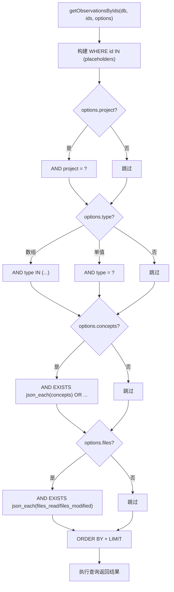

# get.ts 需求说明

> 源文件：src/services/sqlite/observations/get.ts ｜ 类型：源码 ｜ 行数：131 ｜ 所属模块：sqlite/observations ｜ 分析日期：2026-07-23

## 1. 文件定位总述

get.ts 是 observations 表的只读查询层，提供按 ID、ID 批量、会话、文件路径四种维度的观察记录查询功能。它是搜索和上下文注入链路中的数据获取核心，支持丰富的条件过滤（project、type、concepts、files、dateRange）和灵活的排序分页。concepts 和 files 字段使用 SQLite 的 `json_each` 函数进行 JSON 数组内的值匹配，实现了轻量级的标签搜索能力。

## 2. 功能需求

| 编号 | 需求描述（系统应当…） | 触发条件 / 输入 | 处理规则与输出 | 证据 |
|------|----------------------|----------------|---------------|------|
| FR-GETBYID-01 | 系统应当按 ID 获取单条观察记录 | 调用 `getObservationById(db, id)` | 查询 observations 表 `WHERE id = ?`，返回完整记录或 null | `get.ts:7-15` |
| FR-GETBYIDS-01 | 系统应当按 ID 批量获取观察记录并支持条件过滤 | 调用 `getObservationsByIds(db, ids, options)` | 构建 `WHERE id IN (...)` 主条件，附加可选的 project/type/concepts/files 过滤条件；支持 date_desc/date_asc 排序和 limit 限制；空 ID 列表返回空数组 | `get.ts:17-81` |
| FR-GETBYID-CONCEPTS-01 | 批量查询应当支持按 concepts 数组内元素匹配 | options 中传入 concepts | 使用 `json_each(concepts)` 子查询匹配 JSON 数组中的任意元素，多概念之间 OR 逻辑 | `get.ts:48-55` |
| FR-GETBYID-FILES-01 | 批量查询应当支持按文件路径模糊匹配 | options 中传入 files | 使用 `json_each(files_read)` 和 `json_each(files_modified)` 子查询进行 LIKE 匹配，多文件 OR 逻辑 | `get.ts:57-66` |
| FR-GETBYSESSION-01 | 系统应当按 memory_session_id 获取观察记录摘要 | 调用 `getObservationsForSession(db, memorySessionId)` | 返回 title、subtitle、type、prompt_number 字段，按 created_at_epoch 升序排列 | `get.ts:83-95` |
| FR-GETBYFILE-01 | 系统应当按文件路径查找涉及该文件的观察记录 | 调用 `getObservationsByFilePath(db, filePath, options)` | 在 files_read 和 files_modified 两个 JSON 数组中精确匹配文件路径；支持 projects 过滤和 limit 限制（默认 15，上限 100） | `get.ts:97-130` |

## 3. 业务规则与约束

- **ID 批量查询空值保护**：传入空 IDs 数组直接返回空数组，避免生成无效 SQL (`get.ts:22`)
- **类型过滤双模式**：type 参数支持单值（`type = ?`）和数组（`type IN (...)`）两种模式 (`get.ts:38-45`)
- **concepts 匹配逻辑**：单元素精确匹配、多元素 OR 逻辑——只要 observation 的 concepts 数组包含任意一个查询概念即匹配 (`get.ts:50-55`)
- **files 模糊匹配**：文件路径使用 LIKE `%path%` 进行模糊匹配，同时检查 files_read 和 files_modified (`get.ts:59-66`)
- **文件路径查询的 limit 约束**：默认 15 条，上限硬编码 100 条，超出部分被静默截断 (`get.ts:103-105`)
- **排序方向**：orderBy 仅支持 `date_desc`（默认）和 `date_asc`，映射为 SQL 的 DESC/ASC (`get.ts:25-26`)

## 4. 对外暴露

| 公开函数 | 签名 | 说明 |
|---------|------|------|
| `getObservationById` | `(db, id: number): ObservationRecord \| null` | 按 ID 查单条 |
| `getObservationsByIds` | `(db, ids: number[], options?): ObservationRecord[]` | 按 ID 批量查询（支持过滤） |
| `getObservationsForSession` | `(db, memorySessionId: string): ObservationSessionRow[]` | 按会话查摘要 |
| `getObservationsByFilePath` | `(db, filePath: string, options?): ObservationRecord[]` | 按文件路径查 |

## 5. 依赖关系

- **上游调用**：SessionSearch、ObservationCompiler、上下文注入逻辑
- **类型依赖**：`ObservationRecord`（数据库记录类型）、`GetObservationsByIdsOptions`、`ObservationSessionRow`
- **数据库表**：`observations`

## 6. 数据结构

消费 `ObservationRecord`（完整记录）和 `ObservationSessionRow`（会话内摘要，含 title、subtitle、type、prompt_number），均定义在 `./types.ts` 和 `../../../types/database.ts`。

## 7. 复杂逻辑图示

## 8. 逆向备注

- `getObservationsByIds` 中 concepts 和 files 的参数处理将单个值和数组统一转为数组形式处理，简化了 SQL 拼接逻辑 (`get.ts:49-50,59`)。
- `getObservationsForSession` 返回的是轻量级 `ObservationSessionRow`（仅 4 个字段），而非完整 `ObservationRecord`，表明该查询场景不需要完整数据 (`get.ts:87-95`)。
- `getObservationsByFilePath` 使用精确匹配（`value = ?`）而非 `getObservationsByIds` 中的模糊匹配（`LIKE %...%`），两种查询的文件匹配策略不一致 (`get.ts:121-123 vs 59-66`)。
