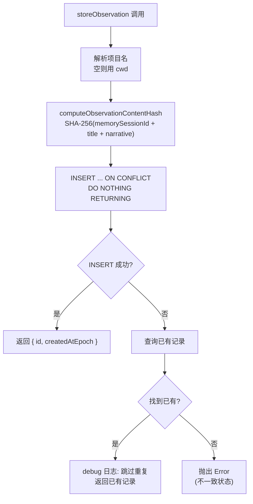

# store.ts (observations) 需求说明

> 源文件：src/services/sqlite/observations/store.ts | 类型：源码 | 行数：83 | 所属模块：sqlite/observations | 分析日期：2026-07-23

## 1. 文件定位总述

store.ts 是观察记录（Observation）的持久化层，提供内容哈希计算和观察存储两个核心功能。它实现了基于 `content_hash` 的去重机制（ON CONFLICT DO NOTHING），确保同一会话中相同内容的观察不会重复存储。存储时自动处理项目名称解析、时间戳生成和 JSON 序列化，并返回存储结果（含 id 和创建时间）。

## 2. 功能需求

| 编号 | 需求描述（系统应当…） | 触发条件 / 输入 | 处理规则与输出 | 证据 |
|------|----------------------|----------------|---------------|------|
| FR-ObsStore-01 | 系统应当为观察记录计算内容哈希 | 调用 `computeObservationContentHash(memorySessionId, title, narrative)` | 使用 SHA-256 对 `memorySessionId + title + narrative` 拼接（NUL 分隔）计算哈希，取前 16 个十六进制字符作为 content_hash | `src/services/sqlite/observations/store.ts:8-17` |
| FR-ObsStore-02 | 系统应当存储观察记录并自动去重 | 调用 `storeObservation(db, memorySessionId, project, observation, userLabel, ...)` | 使用 `INSERT ... ON CONFLICT(memory_session_id, content_hash) DO NOTHING` 实现去重；RETURNING 返回新记录的 id 和时间戳；冲突时查询已有记录返回 | `src/services/sqlite/observations/store.ts:19-82` |
| FR-ObsStore-03 | 系统应当处理项目名称为空的情况 | `project` 参数为空字符串 | 使用 `getProjectContext(process.cwd()).primary` 作为项目名称 | `src/services/sqlite/observations/store.ts:32` |
| FR-ObsStore-04 | 系统应当将数组类型字段序列化为 JSON | facts、concepts、files_read、files_modified 字段 | 使用 `JSON.stringify()` 序列化后存储 | `src/services/sqlite/observations/store.ts:51-55` |
| FR-ObsStore-05 | 系统应当在去重冲突时记录日志 | INSERT 冲突（已有相同 content_hash） | 记录 debug 级别日志，包含 contentHash 和 existingId | `src/services/sqlite/observations/store.ts:80` |
| FR-ObsStore-06 | 系统应当在 ON CONFLICT 触发但找不到已有记录时抛出异常 | RETURNING 无结果且查询已有记录也为空 | 抛出 Error 描述不一致状态（推断：数据库约束与查询不一致的严重异常） | `src/services/sqlite/observations/store.ts:74-78` |

## 3. 业务规则与约束

- **去重维度**：去重基于 `(memory_session_id, content_hash)` 联合唯一约束，同一会话内相同内容不重复存储。`src/services/sqlite/observations/store.ts:41`
- **content_hash 仅用 title + narrative**：哈希计算不包含 facts、concepts 等字段，仅使用 memorySessionId + title + narrative。推断：（去重粒度较粗，不同 facts 但相同标题和叙述的观察视为重复）。`src/services/sqlite/observations/store.ts:13-14`
- **哈希长度**：SHA-256 取前 16 个十六进制字符（64 位），非完整哈希。推断：（碰撞概率足够低且存储更紧凑）。`src/services/sqlite/observations/store.ts:16`
- **时间戳处理**：支持通过 `overrideTimestampEpoch` 覆盖时间戳（用于同步场景），未指定时使用 `Date.now()`。`src/services/sqlite/observations/store.ts:29`
- **facts/concepts 的 JSON 序列化**：observation 输入中的 facts 和 concepts 是数组，存储时序列化为 JSON 字符串。`src/services/sqlite/observations/store.ts:51-52`

## 4. 对外暴露

| 名称 | 类型 | 说明 |
|------|------|------|
| `computeObservationContentHash(memorySessionId, title, narrative)` | 函数 | 计算内容哈希（16 字符十六进制） |
| `storeObservation(db, memorySessionId, project, observation, ...)` | 函数 | 存储观察记录（含去重） |

## 5. 依赖关系

- **crypto**（Node.js 内置模块）：SHA-256 哈希计算
- **bun:sqlite**（Database）：SQLite 数据库连接
- **logger**（`../../../utils/logger.js`）：结构化日志
- **project-name.ts**（`../../../utils/project-name.js`）：项目上下文解析

## 6. 数据结构

**StoreObservationResult**（返回结构）：
```typescript
{
  id: number;            // 观察 ID（新记录或已有记录）
  createdAtEpoch: number; // 创建时间戳
}
```

**ObservationInput**（输入结构，来自 `./types.js`）：
```typescript
{
  type: string;
  title: string | null;
  subtitle: string | null;
  facts: string[];
  narrative: string | null;
  concepts: string[];
  files_read: string[];
  files_modified: string[];
  agent_type?: string;
  agent_id?: string;
}
```

## 7. 复杂逻辑图示



存储流程通过 ON CONFLICT 实现去重，冲突时回退查询已有记录，极端情况下（冲突但无记录）抛出异常。

## 8. 逆向备注

- `ObservationInput` 类型来自 `./types.js` 但 store.ts 未导入该类型（通过 DatabaseManager 的 SessionStore 间接使用）。`store.ts` 直接使用 `ObservationInput` 作为参数类型引用。
