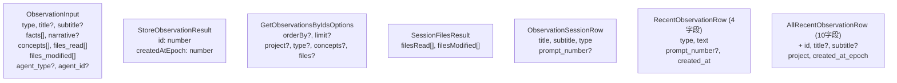

# observations/types.ts 需求说明

> 源文件：src/services/sqlite/observations/types.ts ｜ 类型：源码 ｜ 行数：60 ｜ 所属模块：sqlite/observations ｜ 分析日期：2026-07-23

## 1. 文件定位总述

本文件定义了观测记录（Observation）模块的类型体系，涵盖输入、输出、查询选项和数据库行映射四类接口。`ObservationInput` 是 AI 模型产出观测记录的结构化输入格式；`StoreObservationResult` 是写入后的返回标识；`GetObservationsByIdsOptions` 提供丰富的查询过滤维度；`SessionFilesResult` 和多个 `*Row` 接口对应不同查询场景的数据库行投影。

## 2. 功能需求

本文件为纯类型定义文件，无运行时逻辑。核心能力是为 observations 模块提供类型安全的输入/输出/查询契约。

## 3. 业务规则与约束

| 编号 | 规则描述 | 证据 |
|------|---------|------|
| BR-OT-01 | `ObservationInput` 同时支持顶层 `facts` 数组和 `narrative` 文本两种观测内容表达方式 | `src/services/sqlite/observations/types.ts:7-8` |
| BR-OT-02 | `agent_type` 和 `agent_id` 为可选字段，支持区分不同 AI 代理产生的观测 | `src/services/sqlite/observations/types.ts:12-13` |
| BR-OT-03 | `GetObservationsByIdsOptions` 支持按排序方向、数量限制、项目、类型、概念、文件六维过滤 | `src/services/sqlite/observations/types.ts:21-28` |
| BR-OT-04 | 概念和类型过滤字段支持字符串或字符串数组类型，推断用于单值和多值查询 | `src/services/sqlite/observations/types.ts:25-26` |
| BR-OT-05 | `RecentObservationRow` 精简为 4 字段用于快速列表展示，`AllRecentObservationRow` 扩展到 10 字段用于详情展示 | `src/services/sqlite/observations/types.ts:42-59` |

## 4. 对外暴露

| 导出项 | 类型 | 用途 |
|--------|------|------|
| `ObservationInput` | 接口 | AI 模型产出观测记录的输入格式 |
| `StoreObservationResult` | 接口 | 写入后的返回值（ID 和时间戳） |
| `GetObservationsByIdsOptions` | 接口 | 按多维条件查询观测记录的选项 |
| `SessionFilesResult` | 接口 | 会话关联的读取/修改文件集合 |
| `ObservationSessionRow` | 接口 | 观测记录会话级查询行（标题、副标题、类型、提示编号） |
| `RecentObservationRow` | 接口 | 精简观测行（4 字段） |
| `AllRecentObservationRow` | 接口 | 完整观测行（10 字段） |

## 5. 依赖关系

- **上游依赖**：`../../../utils/logger.js`（已引入未使用）
- **下游消费者**：observations 模块的 store、recent、files 等文件引用

## 6. 数据结构

图示说明：七个接口服务于观测记录生命周期中输入、输出、查询、展示各环节。

## 7. 复杂逻辑图示

不适用（纯类型定义文件）。

## 8. 逆向备注

- `logger` 已导入但未使用，推断为模板遗留。
- 接口设计支持两种观测内容表达（facts 数组 vs narrative 文本），推断为不同模式下的可选输出格式。
