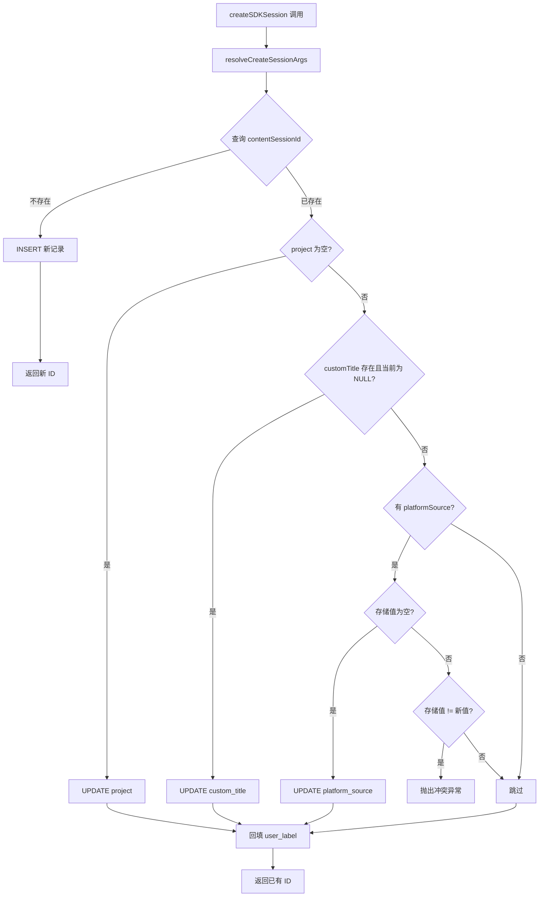

# create.ts 需求说明

> 源文件：src/services/sqlite/sessions/create.ts ｜ 类型：源码 ｜ 行数：111 ｜ 所属模块：sqlite/sessions ｜ 分析日期：2026-07-23

## 1. 文件定位总述

create.ts 是 SDK 会话（`sdk_sessions` 表）的创建与更新入口，负责在数据库中建立 Claude Code 会话与 claude-mem 记忆系统的关联。它实现"幂等创建"语义——同一 `contentSessionId` 重复调用时执行补全更新而非重复插入，同时处理平台来源归一化、用户标签回填、平台来源冲突检测等业务规则。该模块是 SessionStart hook 链路中最早写入数据库的环节之一。

## 2. 功能需求

| 编号 | 需求描述（系统应当…） | 触发条件 / 输入 | 处理规则与输出 | 证据 |
|------|----------------------|----------------|---------------|------|
| FR-CREATE-01 | 系统应当在会话首次出现时创建 SDK 会话记录 | `contentSessionId` 在 `sdk_sessions` 中不存在 | INSERT 一行包含 content_session_id、project、platform_source、user_prompt、custom_title、时间戳、状态 active、OS 用户名、用户标签；返回自增 ID | `create.ts:79-98` |
| FR-UPSERT-01 | 系统应当在会话已存在时补全更新缺失字段 | `contentSessionId` 已存在 | 仅当 project 为空时更新 project；仅当 custom_title 为 NULL 时更新；返回已有记录 ID | `create.ts:36-47` |
| FR-CONFLICT-01 | 系统应当检测并拒绝平台来源冲突 | 已有记录的 platform_source 与新传入值不一致 | 抛出 Error，包含已有值与接收值的详情 | `create.ts:60-63` |
| FR-LABEL-BF-01 | 系统应当回填用户标签 | 会话已存在且 user_label 为空 | 使用 `resolveUserLabel()` 获取当前用户标签，仅当 COALESCE(user_label,'')='' 时更新 | `create.ts:70-74` |
| FR-MEMSID-01 | 系统应当支持更新 memory_session_id | 调用 `updateMemorySessionId` | 按 sessionDbId 将 memory_session_id 字段更新为传入值（可为 null） | `create.ts:100-110` |
| FR-NORMALIZE-01 | 系统应当在创建前归一化平台来源 | 传入非空的 platformSource | 调用 `normalizePlatformSource()` 处理；若结果为空则使用 `DEFAULT_PLATFORM_SOURCE` | `create.ts:28-29` |

## 3. 业务规则与约束

- **幂等性**：同一 `contentSessionId` 多次调用不产生重复记录 (`create.ts:31-33`)
- **补全策略**：已存在的记录仅更新"空值"字段，不覆盖已有值——project 仅当 `NULL OR ''` 时更新，custom_title 仅当 `NULL` 时更新 (`create.ts:38-47`)
- **平台来源归一化**：通过 `normalizePlatformSource()` 统一格式，存储前再做一次归一化以确保一致 (`create.ts:50-51`)
- **用户标签回填**：服务于历史数据迁移场景（v36 迁移后旧记录 user_label 为空），不覆盖操作员手动设置的值 (`create.ts:67-69`)
- **默认值**：`memory_session_id` 创建时为 NULL，后续通过 `updateMemorySessionId` 填充；`status` 默认 `'active'` (`create.ts:82-83`)

## 4. 对外暴露

| 公开函数 | 签名 | 说明 |
|---------|------|------|
| `createSDKSession` | `(db, contentSessionId, project, userPrompt, customTitle?, platformSource?) => number` | 幂等创建/更新 SDK 会话，返回数据库 ID |
| `updateMemorySessionId` | `(db, sessionDbId, memorySessionId) => void` | 更新会话的 memory_session_id |

## 5. 依赖关系

- **上游调用**：SessionStart hook / SessionManager
- **依赖模块**：`normalizePlatformSource`（平台来源归一化）、`DEFAULT_PLATFORM_SOURCE`（默认平台常量）、`getOsUserName`（OS 用户名获取）、`resolveUserLabel`（用户标签解析）
- **数据库表**：`sdk_sessions`

## 6. 数据结构

写入 `sdk_sessions` 表，字段包含：content_session_id、memory_session_id、project、platform_source、user_prompt、custom_title、started_at、started_at_epoch、status、user_name、user_label。

## 7. 复杂逻辑图示

## 8. 逆向备注

- `resolveCreateSessionArgs` 函数将参数处理逻辑提取为独立函数，但仅做了 platformSource 的归一化，customTitle 未做任何处理直接透传 (`create.ts:8-16`)。
- 注释中提到"Backfill user_label for sessions created before migration v36 landed"，这是数据迁移兼容性设计的直接证据 (`create.ts:67-69`)。
