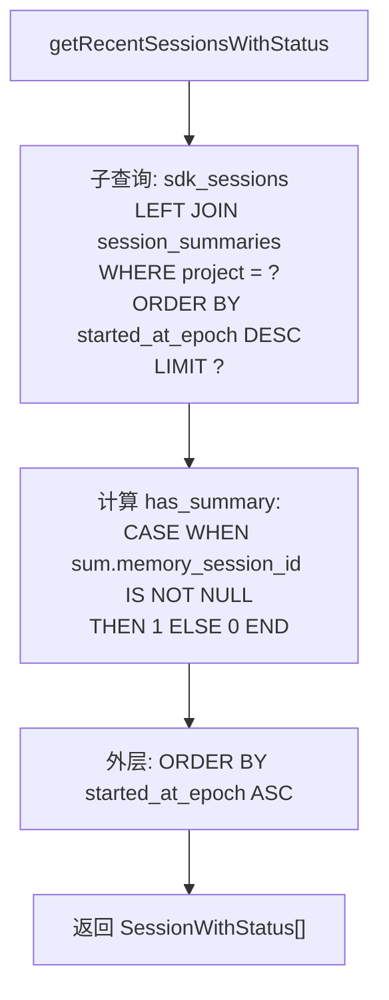

# get.ts (sessions) 需求说明

> 源文件：src/services/sqlite/sessions/get.ts | 类型：源码 | 行数：93 | 所属模块：sqlite/sessions | 分析日期：2026-07-23

## 1. 文件定位总述

本文件是 `sdk_sessions` 表的只读查询层，提供四种查询方式：按主键 id 获取基本会话信息、按 memory_session_id 列表批量获取完整会话、按项目获取最近带摘要状态的会话、按 id 获取会话摘要详情。它是会话数据从 SQLite 数据库到上层业务逻辑（如上下文注入、搜索、Viewer 展示）的数据通道。

## 2. 功能需求

| 编号 | 需求描述（系统应当…） | 触发条件 / 输入 | 处理规则与输出 | 证据 |
|------|----------------------|----------------|---------------|------|
| FR-SessionGet-01 | 系统应当根据主键 id 获取会话基本信息 | 调用 `getSessionById(db, id)` | 返回 id、content_session_id、memory_session_id、project、platform_source（COALESCE 默认 'claude'）、user_prompt、custom_title；不存在返回 null | `src/services/sqlite/sessions/get.ts:11-22` |
| FR-SessionGet-02 | 系统应当根据 memory_session_id 列表批量获取完整会话 | 调用 `getSdkSessionsBySessionIds(db, memorySessionIds)` | 空数组直接返回空结果；按 `started_at_epoch DESC` 排序；返回包含时间戳和 status 的完整会话记录 | `src/services/sqlite/sessions/get.ts:24-42` |
| FR-SessionGet-03 | 系统应当获取指定项目的最近 N 个会话及其摘要状态 | 调用 `getRecentSessionsWithStatus(db, project, limit?)` | LEFT JOIN session_summaries 判断是否有摘要；子查询按 started_at_epoch DESC 取前 N 条，外层按 ASC 排序返回；默认 limit 为 3 | `src/services/sqlite/sessions/get.ts:44-69` |
| FR-SessionGet-04 | 系统应当根据主键 id 获取会话摘要详情 | 调用 `getSessionSummaryById(db, id)` | 返回包含 user_prompt、request_summary、learned_summary、status 等摘要详情字段；不存在返回 null | `src/services/sqlite/sessions/get.ts:71-93` |

## 3. 业务规则与约束

- **platform_source 默认值**：使用 `COALESCE(platform_source, 'claude')` 确保无 platform_source 时默认为 'claude'。`src/services/sqlite/sessions/get.ts:14`
- **空数组快速返回**：`getSdkSessionsBySessionIds` 在 ids 为空数组时直接返回 `[]`。`src/services/sqlite/sessions/get.ts:28`
- **排序反转**：`getRecentSessionsWithStatus` 使用子查询 DESC 取最新 N 条后外层 ASC 排序返回，确保最终结果是按时间升序排列的最近 N 条。`src/services/sqlite/sessions/get.ts:60-65`
- **has_summary 计算**：通过 LEFT JOIN session_summaries 判断 `sum.memory_session_id IS NOT NULL`，结果为 0 或 1。`src/services/sqlite/sessions/get.ts:57`

## 4. 对外暴露

| 名称 | 类型 | 说明 |
|------|------|------|
| `getSessionById(db, id)` | 函数 | 按主键获取会话基本信息 |
| `getSdkSessionsBySessionIds(db, memorySessionIds)` | 函数 | 按 memory_session_id 列表批量获取 |
| `getRecentSessionsWithStatus(db, project, limit?)` | 函数 | 获取项目最近 N 个会话（含摘要状态） |
| `getSessionSummaryById(db, id)` | 函数 | 按主键获取会话摘要详情 |

## 5. 依赖关系

- **bun:sqlite**（Database 类型）：SQLite 数据库连接
- **./types.ts**：提供 SessionBasic、SessionFull、SessionWithStatus、SessionSummaryDetail 类型
- **logger**（`../../../utils/logger.js`）：日志工具（已导入但未使用）

## 6. 数据结构

**SessionWithStatus**（带摘要状态的会话）：
```typescript
{
  memory_session_id: string;
  status: string;
  started_at: string;
  started_at_epoch: number;
  user_prompt: string;
  has_summary: number;  // 0 或 1
}
```

## 7. 复杂逻辑图示



最近会话查询使用"子查询倒序取前 N + 外层正序返回"的模式，确保结果按时间升序但只取最近的 N 条。

## 8. 逆向备注

- `logger` 已导入但未使用。推断：（从其他查询函数模板复制或预留用于后续调试）。
