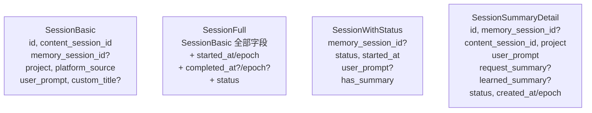

# sessions/types.ts 需求说明

> 源文件：src/services/sqlite/sessions/types.ts ｜ 类型：源码 ｜ 行数：48 ｜ 所属模块：sqlite/sessions ｜ 分析日期：2026-07-23

## 1. 文件定位总述

本文件定义了会话（Session）模块的 TypeScript 接口体系，涵盖从数据库行映射到各业务场景所需的不同"视图"：`SessionBasic` 为最精简的基础信息、`SessionFull` 包含完整时间戳和状态、`SessionWithStatus` 用于状态查询、`SessionSummaryDetail` 用于摘要详情展示。这些接口对应 SQLite `sessions` 表的不同投影查询结果，是 sessions 模块读写操作的输入/输出契约。

## 2. 功能需求

本文件为纯类型定义文件，无运行时逻辑。核心能力是为 sessions 模块提供类型安全的数据库行映射接口。

## 3. 业务规则与约束

| 编号 | 规则描述 | 证据 |
|------|---------|------|
| BR-ST-01 | `SessionBasic.memory_session_id` 允许为 null（会话可能尚未分配记忆 ID） | `src/services/sqlite/sessions/types.ts:7` |
| BR-ST-02 | `SessionFull.memory_session_id` 不允许为 null（完整视图隐含已初始化） | `src/services/sqlite/sessions/types.ts:17` |
| BR-ST-03 | 所有时间戳字段同时提供 ISO 字符串和 epoch 毫秒两种格式 | `src/services/sqlite/sessions/types.ts:22-24` |
| BR-ST-04 | `SessionSummaryDetail` 包含 `request_summary` 和 `learned_summary` 字段用于摘要关联展示 | `src/services/sqlite/sessions/types.ts:42-43` |
| BR-ST-05 | `SessionWithStatus.has_summary` 为布尔字段，推断由查询时子查询或 JOIN 计算 | `src/services/sqlite/sessions/types.ts:34` |

## 4. 对外暴露

| 导出项 | 类型 | 用途 |
|--------|------|------|
| `SessionBasic` | 接口 | 会话基础信息（ID、项目、提示词等） |
| `SessionFull` | 接口 | 会话完整信息（含时间戳、状态） |
| `SessionWithStatus` | 接口 | 会话状态查询结果（含摘要标记） |
| `SessionSummaryDetail` | 接口 | 会话摘要详情（含请求/学习摘要文本） |

## 5. 依赖关系

- **上游依赖**：`../../../utils/logger.js`（已引入未使用）
- **下游消费者**：sessions 模块的 store、query 等文件引用

## 6. 数据结构

图示说明：四个接口均为 `sessions` 表的不同投影视图，字段有重叠但各有侧重。

## 7. 复杂逻辑图示

不适用（纯类型定义文件）。

## 8. 逆向备注

- `logger` 已导入但未使用，推断为模板遗留。
- 接口间无继承关系，存在字段重复，推断为有意解耦不同业务场景的类型约束。
