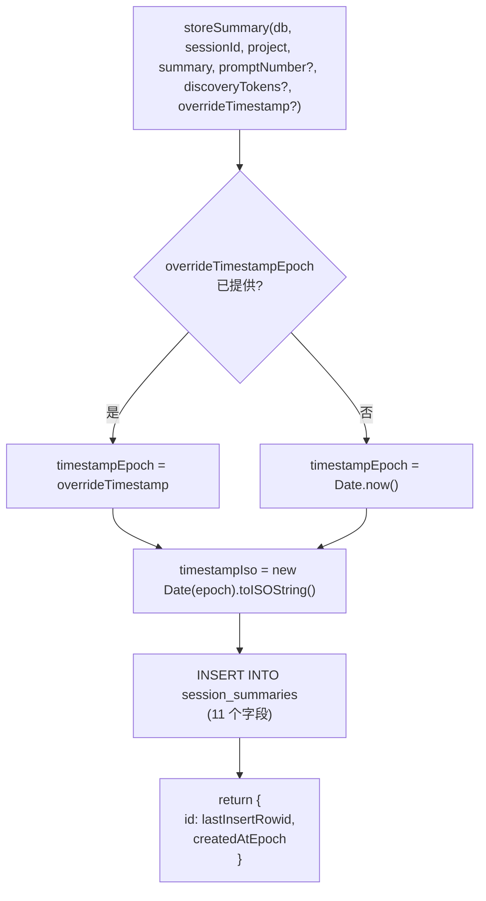

# summaries/store.ts 需求说明

> 源文件：src/services/sqlite/summaries/store.ts ｜ 类型：源码 ｜ 行数：44 ｜ 所属模块：sqlite/summaries ｜ 分析日期：2026-07-23

## 1. 文件定位总述

本文件是摘要（Session Summary）的持久化写入层，负责将 AI 生成的会话摘要信息插入 SQLite 的 `session_summaries` 表。它接受记忆会话 ID、项目名、摘要内容和可选元数据（提示词编号、发现 token 数、覆盖时间戳），生成时间戳后执行 INSERT 操作，返回新记录的 ID 和创建时间戳。

## 2. 功能需求

| 编号 | 需求描述（系统应当…） | 触发条件 / 输入 | 处理规则与输出 | 证据 |
|------|----------------------|----------------|---------------|------|
| FR-SS-01 | 系统应当将会话摘要持久化到数据库 | 调用 `storeSummary(db, memorySessionId, project, summary, ...)` | 向 `session_summaries` 表 INSERT 一行，包含 request、investigated、learned、completed、next_steps、notes 等字段 | `src/services/sqlite/summaries/store.ts:5-43` |
| FR-SS-02 | 系统应当支持覆盖默认时间戳，允许回写历史摘要 | 传入 `overrideTimestampEpoch` | 使用该值而非 `Date.now()` 生成时间戳 | `src/services/sqlite/summaries/store.ts:14` |
| FR-SS-03 | 系统应当在插入成功后返回新记录 ID 和创建时间戳 | INSERT 成功 | 返回 `{ id: lastInsertRowid, createdAtEpoch: timestampEpoch }` | `src/services/sqlite/summaries/store.ts:39-42` |

## 3. 业务规则与约束

| 编号 | 规则描述 | 证据 |
|------|---------|------|
| BR-SS-01 | 默认时间戳使用 `Date.now()`，不依赖数据库时钟 | `src/services/sqlite/summaries/store.ts:14` |
| BR-SS-02 | 时间戳同时写入 ISO 格式（`created_at`）和 epoch 毫秒（`created_at_epoch`） | `src/services/sqlite/summaries/store.ts:15` |
| BR-SS-03 | `promptNumber` 为可选参数，默认 null | `src/services/sqlite/summaries/store.ts:33` |
| BR-SS-04 | `discoveryTokens` 默认为 0 | `src/services/sqlite/summaries/store.ts:12` |

## 4. 对外暴露

| 导出项 | 类型 | 用途 |
|--------|------|------|
| `storeSummary` | 函数 | 插入一条会话摘要到数据库，返回 ID 和时间戳 |

## 5. 依赖关系

- **上游依赖**：`bun:sqlite`（`Database` 类型）、`../../../utils/logger.js`（已引入未使用）、`./types.js`（`SummaryInput`, `StoreSummaryResult`）
- **下游消费者**：推断被 Worker 的摘要处理流程在 AI 生成摘要后调用

## 6. 数据结构

```typescript
// 输入
interface SummaryInput {
  request: string;
  investigated: string;
  learned: string;
  completed: string;
  next_steps: string;
  notes: string | null;
}

// 输出
interface StoreSummaryResult {
  id: number;
  createdAtEpoch: number;
}
```

## 7. 复杂逻辑图示



图示说明：根据是否提供覆盖时间戳生成时间值，然后执行 INSERT 并返回新记录标识。

## 8. 逆向备注

- `logger` 已导入但未使用，推断为预留。
- INSERT 语句包含 11 个字段，参数较多，但函数签名通过可选参数降低了调用复杂度。
