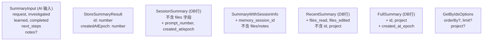

# summaries/types.ts 需求说明

> 源文件：src/services/sqlite/summaries/types.ts ｜ 类型：源码 ｜ 行数：75 ｜ 所属模块：sqlite/summaries ｜ 分析日期：2026-07-23

## 1. 文件定位总述

本文件定义了摘要（Session Summary）模块的完整类型体系，涵盖输入、输出、数据库行映射和查询选项四类接口。`SummaryInput` 是 AI 模型产出摘要的结构化输入；`StoreSummaryResult` 是写入后的返回标识；`SessionSummary`、`RecentSummary`、`FullSummary` 分别对应不同查询场景的数据库行投影；`SummaryWithSessionInfo` 增加了会话 ID 用于关联查询；`GetByIdsOptions` 提供排序和过滤选项。

## 2. 功能需求

本文件为纯类型定义文件，无运行时逻辑。核心能力是为 summaries 模块提供类型安全的输入/输出/查询契约。

## 3. 业务规则与约束

| 编号 | 规则描述 | 证据 |
|------|---------|------|
| BR-SST-01 | `SummaryInput` 包含 5 个必填文本字段（request/investigated/learned/completed/next_steps）和 1 个可选 notes | `src/services/sqlite/summaries/types.ts:3-10` |
| BR-SST-02 | `SessionSummary` 和 `RecentSummary` 字段相似但 `SessionSummary` 不含 `files_read`/`files_edited` | `src/services/sqlite/summaries/types.ts:17-29` 对比 `:41-52` |
| BR-SST-03 | `FullSummary` 增加了 `id` 和 `project` 字段，用于全局跨项目查询 | `src/services/sqlite/summaries/types.ts:54-68` |
| BR-SST-04 | `SummaryWithSessionInfo` 含 `memory_session_id`，用于将摘要关联到具体会话 | `src/services/sqlite/summaries/types.ts:31-39` |
| BR-SST-05 | `GetByIdsOptions` 支持排序方向和项目过滤，推断用于按 ID 批量查询 | `src/services/sqlite/summaries/types.ts:70-74` |

## 4. 对外暴露

| 导出项 | 类型 | 用途 |
|--------|------|------|
| `SummaryInput` | 接口 | AI 模型产出摘要的输入格式 |
| `StoreSummaryResult` | 接口 | 写入后的返回值（ID 和时间戳） |
| `SessionSummary` | 接口 | 数据库行映射（基本摘要信息） |
| `SummaryWithSessionInfo` | 接口 | 含会话 ID 的摘要行 |
| `RecentSummary` | 接口 | 含文件列表的完整摘要行 |
| `FullSummary` | 接口 | 含 ID 和项目名的全局摘要行 |
| `GetByIdsOptions` | 接口 | 按条件查询摘要的选项 |

## 5. 依赖关系

- **上游依赖**：`../../../utils/logger.js`（已引入未使用）
- **下游消费者**：summaries 模块的 store、recent、query 等文件引用

## 6. 数据结构

图示说明：五个数据库行接口为同一张 `session_summaries` 表的不同投影，按使用场景裁剪字段。

## 7. 复杂逻辑图示

不适用（纯类型定义文件）。

## 8. 逆向备注

- `logger` 已导入但未使用，推断为模板遗留。
- 五个行接口之间无继承关系，字段有大量重复，推断为有意解耦不同查询场景的类型约束，避免在修改某个投影时意外影响其他投影。
