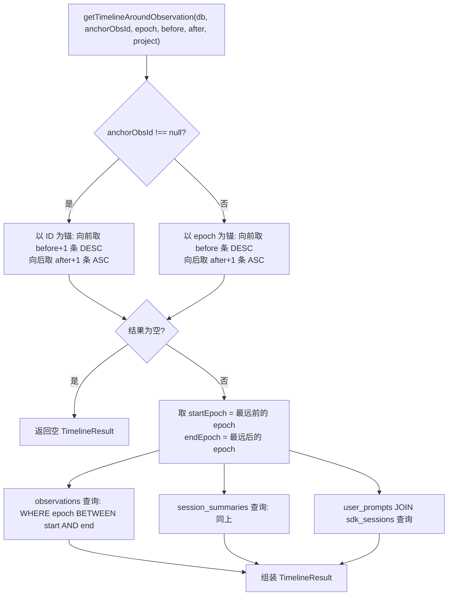

# queries.ts 需求说明

> 源文件：src/services/sqlite/timeline/queries.ts ｜ 类型：源码 ｜ 行数：180 ｜ 所属模块：sqlite/timeline ｜ 分析日期：2026-07-23

## 1. 文件定位总述

timeline/queries.ts 是时间线查询的数据访问层，负责围绕某个锚点（时间戳或 observation ID）获取前后 N 条记录的完整时间线视图。它同时查询 observations、session_summaries 和 user_prompts 三张表，按时间窗口组装为统一的 TimelineResult。该模块还提供项目列表查询功能（排除内部观察者项目），是 UI 时间线视图和详情页面的数据基础。

## 2. 功能需求

| 编号 | 需求描述（系统应当…） | 触发条件 / 输入 | 处理规则与输出 | 证据 |
|------|----------------------|----------------|---------------|------|
| FR-tq-01 | 系统应当围绕时间戳获取时间线 | 调用 `getTimelineAroundTimestamp(db, anchorEpoch, depthBefore?, depthAfter?, project?)` | 委托给 `getTimelineAroundObservation(db, null, anchorEpoch, ...)` | `queries.ts:30-38` |
| FR-tq-02 | 系统应当围绕 observation ID 或时间戳获取时间线 | 调用 `getTimelineAroundObservation(db, anchorObsId, anchorEpoch, depthBefore?, depthAfter?, project?)` | 两步边界确定 + 三表时间窗口查询 | `queries.ts:40-166` |
| FR-tq-03 | 系统应当以 observation ID 为锚点确定时间窗口边界 | anchorObservationId 非 null 时 | 向前取 depthBefore+1 条（按 id DESC），向后取 depthAfter+1 条（按 id ASC）；取两端最远的 epoch 作为窗口范围 | `queries.ts:55-79` |
| FR-tq-04 | 系统应当以纯时间戳为锚点确定时间窗口边界 | anchorObservationId 为 null 时 | 向前取 depthBefore 条（按 epoch DESC），向后取 depthAfter+1 条（按 epoch ASC）；取两端最远的 epoch 作为窗口范围 | `queries.ts:86-115` |
| FR-tq-05 | 系统应当查询时间窗口内的三种记录 | 边界确定后 | observations: `WHERE created_at_epoch >= start AND <= end`；sessions: 同上；prompts: JOIN sdk_sessions 获取 project | `queries.ts:118-142` |
| FR-tq-06 | 系统应当映射 sessions 和 prompts 为精简结构 | 查询完成后 | sessions 仅保留 id, memory_session_id, project, request, completed, next_steps, created_at/epoch；prompts 保留 id, content_session_id, prompt_number, prompt_text, project, created_at/epoch | `queries.ts:146-165` |
| FR-tq-07 | 系统应当查询所有非观察者项目列表 | 调用 `getAllProjects(db)` | 从 sdk_sessions 中查 DISTINCT project，排除 `OBSERVER_SESSIONS_PROJECT`，按 ASC 排序 | `queries.ts:168-179` |

## 3. 业务规则与约束

- **深度参数**：`depthBefore` 和 `depthAfter` 默认均为 10。`src/services/sqlite/timeline/queries.ts:34-35`
- **多取一条策略**：前后各多取 1 条（`depthBefore + 1`、`depthAfter + 1`），确保锚点记录被包含在结果中。`queries.ts:71-72`
- **prompts 表 JOIN**：user_prompts 表不直接存储 project，需 JOIN sdk_sessions 获取。`queries.ts:133-138`
- **空结果保护**：边界查询返回空时直接返回空 TimelineResult，不进入主查询。`queries.ts:74-76, 105-107`
- **project 过滤传递**：所有查询均支持可选的 project 参数过滤。`queries.ts:48-50`
- **排序**：所有主查询按 `created_at_epoch ASC` 排序。`queries.ts:123, 129, 138`

## 4. 对外暴露

| 名称 | 类型 | 说明 |
|------|------|------|
| `TimelineResult` | interface | 时间线结果：observations, sessions, prompts |
| `getTimelineAroundTimestamp(db, anchorEpoch, ...)` | function | 围绕时间戳获取时间线 |
| `getTimelineAroundObservation(db, anchorObsId, anchorEpoch, ...)` | function | 围绕观察 ID/时间戳获取时间线 |
| `getAllProjects(db)` | function | 获取所有非观察者项目列表 |

## 5. 依赖关系

- **内部依赖**：`bun:sqlite`（Database）、`../../../types/database.js`（ObservationRecord 等）、`../../../utils/logger.js`、`../../../shared/paths.js`（OBSERVER_SESSIONS_PROJECT）
- **被依赖**：时间线相关 HTTP 路由、TimelineBuilder

## 6. 数据结构

**TimelineResult 接口**：`src/services/sqlite/timeline/queries.ts:7-28`

| 字段 | 类型 | 说明 |
|------|------|------|
| observations | ObservationRecord[] | 时间窗口内的观察记录（全字段） |
| sessions | Array<{id, memory_session_id, project, request, completed, next_steps, created_at, created_at_epoch}> | 会话摘要（精简字段） |
| prompts | Array<{id, content_session_id, prompt_number, prompt_text, project, created_at, created_at_epoch}> | 用户提示（精简字段） |

## 7. 复杂逻辑图示

时间线查询的两阶段流程：先确定时间窗口边界，再在窗口内查询三张表。

## 8. 逆向备注

- prompts 查询中的 project 过滤条件替换了 `project` 别名为 `s.project`（`projectFilter.replace('project', 's.project')`），这是因为 user_prompts 表没有 project 字段，需通过 JOIN 的别名引用。`queries.ts:136`
- 边界查询中取 `beforeRecords[beforeRecords.length - 1]`（数组最后一个元素）作为 startEpoch，因为前向查询按 DESC 排序，最后一个元素时间最早。`queries.ts:78, 109`
- `ObservationRecord` 类型从 `../../../types/database.js` 导入，与 `../../types.ts` 中的 `ObservationRow` 可能是同一数据的不同类型定义。
