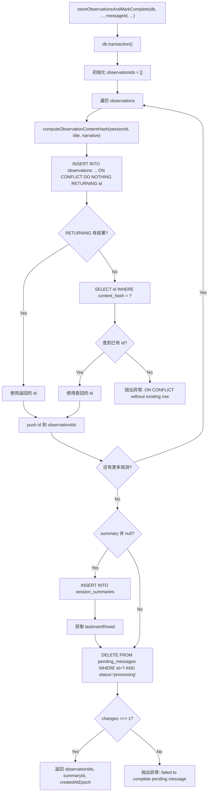

# transactions.ts 需求说明

> 源文件：src/services/sqlite/transactions.ts ｜ 类型：源码 ｜ 行数：224 ｜ 所属模块：sqlite（数据持久化事务） ｜ 分析日期：2026-07-23

## 1. 文件定位总述

transactions.ts 是 claude-mem 数据持久化层的核心事务模块，负责在 SQLite 数据库中以事务方式原子性地写入观测记录（Observations）和会话摘要（Session Summaries）。模块提供两个主要写入函数——`storeObservations`（纯写入）和 `storeObservationsAndMarkComplete`（写入并标记消息处理完成），后者还负责从 `pending_messages` 队列表中删除已处理的消息。两个函数都使用 `ON CONFLICT ... DO NOTHING` 策略处理基于 `content_hash` 的幂等写入，确保同一会话内相同内容的记录不会重复插入。该模块是 Observation 处理管线的最终落库环节。

## 2. 功能需求

| 编号 | 需求描述（系统应当…） | 触发条件 / 输入 | 处理规则与输出 | 证据 |
|------|----------------------|----------------|---------------|------|
| FR-tx-01 | 系统应当以事务方式批量写入观测记录和会话摘要 | 调用 `storeObservations(db, memorySessionId, project, observations, summary, ...)` | 在 `db.transaction()` 回调中依次插入每条观测和一条摘要（可选）；事务内任何失败全部回滚 | `src/services/sqlite/transactions.ts:126-223` |
| FR-tx-02 | 系统应当基于内容哈希实现幂等写入，防止重复插入 | 插入观测记录时 | 使用 `ON CONFLICT(memory_session_id, content_hash) DO NOTHING RETURNING id`；若 RETURNING 无结果（被 DO NOTHING 跳过），则通过 `SELECT id ... WHERE content_hash = ?` 查回已有记录的 ID；若查不到则抛出异常 | `src/services/sqlite/transactions.ts:143-153` |
| FR-tx-03 | 系统应当在写入观测后同步写入会话摘要（如提供） | summary 参数非 null 时 | 向 `session_summaries` 表插入一条记录，包含 request/investigated/learned/completed/next_steps/notes 等字段；返回 `lastInsertRowid` 作为 summaryId | `src/services/sqlite/transactions.ts:193-217` |
| FR-tx-04 | 系统应当提供写入并标记消息完成的复合事务 | 调用 `storeObservationsAndMarkComplete(db, memorySessionId, ..., messageId, ...)` | 先执行与 `storeObservations` 相同的观测和摘要写入逻辑；然后从 `pending_messages` 表删除 `id = messageId AND status = 'processing'` 的行；若删除影响行数不为 1 则抛出异常 | `src/services/sqlite/transactions.ts:16-124` |
| FR-tx-05 | 系统应当支持覆盖时间戳 | 调用时传入 `overrideTimestampEpoch` | 当该参数提供时使用其值作为 `created_at_epoch`，否则使用 `Date.now()` | `src/services/sqlite/transactions.ts:28-29` |

## 3. 业务规则与约束

1. **事务原子性**：`db.transaction()` 包裹所有写操作，任何失败导致全部回滚，不会产生部分写入。`src/services/sqlite/transactions.ts:31,140`
2. **内容哈希计算**：哈希由 `computeObservationContentHash(memorySessionId, observation.title, observation.narrative)` 生成，确保同一会话内标题和叙述相同的观测被视为重复。`src/services/sqlite/transactions.ts:47`
3. **幂等保证的双路径**：ON CONFLICT 不返回行时，必须通过 SELECT 查回已有 ID；若查不到则视为数据不一致（"ON CONFLICT without existing row"），直接抛出异常。`src/services/sqlite/transactions.ts:74-80`
4. **pending_messages 删除语义**：`storeObservationsAndMarkComplete` 删除的条件是 `id = ? AND status = 'processing'`，仅删除处于处理中状态的消息。注释说明"completed work is removed, not retained as processed"——已完成的消息直接移除而非保留为已处理状态。`src/services/sqlite/transactions.ts:110-118`
5. **JSON 序列化**：`facts`、`concepts`、`files_read`、`files_modified` 字段在写入前通过 `JSON.stringify` 序列化。`src/services/sqlite/transactions.ts:54-58`
6. **可选字段处理**：`agent_type`、`agent_id` 使用 `?? null`，`promptNumber` 使用 `|| null`，确保 undefined 值转为 SQL NULL。`src/services/sqlite/transactions.ts:59-62`
7. **ISO 时间戳并行生成**：`created_at`（ISO 格式）和 `created_at_epoch`（毫秒时间戳）基于同一个 epoch 值生成，保持一致。`src/services/sqlite/transactions.ts:28-29`

## 4. 对外暴露

| 名称 | 类型 | 签名 | 说明 |
|------|------|------|------|
| `StoreObservationsResult` | interface | `{ observationIds: number[], summaryId: number \| null, createdAtEpoch: number }` | 写入结果 |
| `StoreAndMarkCompleteResult` | type | 等价于 `StoreObservationsResult` | 写入并标记完成的返回类型别名 |
| `storeObservations` | function | `(db, memorySessionId, project, observations, summary, userLabel, promptNumber?, discoveryTokens?, overrideTimestampEpoch?) => StoreObservationsResult` | 事务写入观测和摘要 |
| `storeObservationsAndMarkComplete` | function | `(db, memorySessionId, project, observations, summary, messageId, userLabel, promptNumber?, discoveryTokens?, overrideTimestampEpoch?) => StoreAndMarkCompleteResult` | 事务写入观测、摘要并标记消息完成 |

共 2 个导出函数 + 2 个导出类型。

## 5. 依赖关系

- **上游依赖**：`bun:sqlite` 的 `Database` 类型
- **上游依赖**：`ObservationInput` 类型（来自 `./observations/types.js`）
- **上游依赖**：`SummaryInput` 类型（来自 `./summaries/types.js`）
- **上游依赖**：`computeObservationContentHash`（来自 `./observations/store.js`）
- **上游依赖**：`logger`（来自 `../../utils/logger.js`）—— 仅在 import 声明中出现，实际代码中未使用

## 6. 数据结构

- **StoreObservationsResult** (`src/services/sqlite/transactions.ts:8-12`)：`observationIds`（成功插入或查回的观测 ID 数组）、`summaryId`（摘要记录 ID 或 null）、`createdAtEpoch`（写入时的时间戳）
- **observations 表写入字段** (`src/services/sqlite/transactions.ts:35-38`)：`memory_session_id, project, type, title, subtitle, facts, narrative, concepts, files_read, files_modified, prompt_number, discovery_tokens, agent_type, agent_id, content_hash, created_at, created_at_epoch, user_label`——共 18 个字段
- **session_summaries 表写入字段** (`src/services/sqlite/transactions.ts:86-88`)：`memory_session_id, project, request, investigated, learned, completed, next_steps, notes, prompt_number, discovery_tokens, created_at, created_at_epoch, user_label`——共 13 个字段

## 7. 复杂逻辑图示

上图展示了带消息标记完成的事务写入流程，突出幂等写入的双路径（ON CONFLICT + SELECT fallback）和 pending_messages 删除的严格校验。

## 8. 逆向备注

1. **logger 未使用**：文件顶部导入了 `logger` 但在函数体中未调用，推断为遗留导入。`src/services/sqlite/transactions.ts:4`
2. **代码重复**：`storeObservations` 和 `storeObservationsAndMarkComplete` 中的观测插入和摘要插入逻辑几乎完全相同（约 50 行重复），仅后者多了一个 pending_messages 删除步骤。可考虑提取公共子事务。`src/services/sqlite/transactions.ts:31-108 vs 140-219`
3. **注释揭示设计意图**：`storeObservationsAndMarkComplete` 中注释 "Current queue rows are live work only; completed work is removed, not retained as processed" 明确说明了 pending_messages 表的生命周期设计——消息处理后直接删除而非标记为已处理。`src/services/sqlite/transactions.ts:110`
4. **promptNumber 处理差异**：`agent_type` 和 `agent_id` 使用 `?? null`（仅在 undefined 时转 null），而 `promptNumber` 使用 `|| null`（0 也会转 null）。这可能是有意为之（promptNumber 为 0 无意义），也可能是编码风格不一致。`src/services/sqlite/transactions.ts:59-62`
