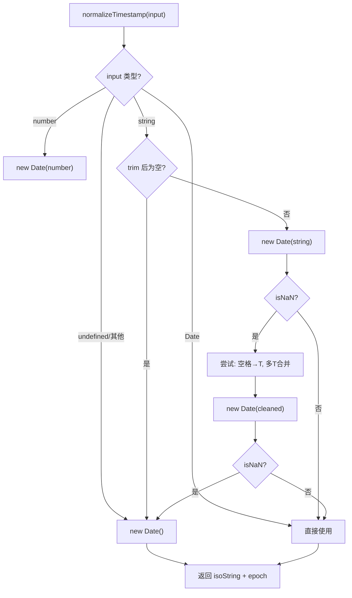

# types.ts 需求说明

> 源文件：src/services/sqlite/types.ts ｜ 类型：源码/DDL ｜ 行数：266 ｜ 所属模块：sqlite ｜ 分析日期：2026-07-23

## 1. 文件定位总述

types.ts 是 SQLite 数据层的核心类型定义文件，为所有数据库表提供 TypeScript 类型映射。它定义了行读取类型（Row）、写入输入类型（Input）、搜索结果扩展类型、搜索过滤/选项类型，以及通用时间戳标准化函数 `normalizeTimestamp`。该文件是数据访问层的"契约"，所有 SessionStore、SessionSearch、PendingMessageStore 等模块的接口签名都依赖于这些类型。

## 2. 功能需求

| 编号 | 需求描述（系统应当…） | 触发条件 / 输入 | 处理规则与输出 | 证据 |
|------|----------------------|----------------|---------------|------|
| FR-st-01 | 系统应当定义 sessions 表的行类型 | SessionRow | 包含 id, session_id, project, created_at/epoch, source(枚举), archive_path/bytes/checksum, archived_at, metadata_json | `types.ts:2-14` |
| FR-st-02 | 系统应当定义 observations 表的行类型 | ObservationRow | 包含完整的 19 个字段，type 为枚举（decision/bugfix/feature/refactor/discovery/change） | `types.ts:186-203` |
| FR-st-03 | 系统应当标准化任意格式的时间戳输入 | 调用 `normalizeTimestamp(timestamp)` | 支持 string/Date/number/undefined；对字符串尝试宽松解析（空格替换为 T、多 T 合并）；所有异常情况回退到当前时间 | `types.ts:138-169` |

## 3. 业务规则与约束

- **时间戳双存储**：所有表同时存储 ISO 字符串（`created_at`）和 epoch 毫秒（`created_at_epoch`），前者用于可读性，后者用于高效范围查询。各 Row 类型中普遍存在。
- **source 枚举**：SessionRow.source 仅限 `'compress' | 'save' | 'legacy-jsonl'`。`types.ts:8`
- **observation type 枚举**：仅限 `'decision' | 'bugfix' | 'feature' | 'refactor' | 'discovery' | 'change'`。`types.ts:191`
- **severity 枚举**：DiagnosticRow.severity 为 `'info' | 'warn' | 'error'`。`types.ts:48`
- **storage_status 枚举**：ArchiveRow.storage_status 为 `'active' | 'archived' | 'deleted'`。`types.ts:73`
- **searchType 隐式枚举**：SearchOptions.orderBy 为 `'relevance' | 'date_desc' | 'date_asc'`。`types.ts:248`
- **normalizeTimestamp 宽松策略**：字符串中的多余空格和多 T 符号会尝试修正，无效值一律回退到当前时间，不会抛异常。`types.ts:138-169`

## 4. 对外暴露

**Row 类型（数据库读取）**：SessionRow, OverviewRow, MemoryRow, DiagnosticRow, TranscriptEventRow, ArchiveRow, TitleRow, SDKSessionRow, ObservationRow, SessionSummaryRow, UserPromptRow

**Input 类型（数据库写入）**：SessionInput, OverviewInput, MemoryInput, DiagnosticInput, TranscriptEventInput

**搜索类型**：DateRange, SearchFilters, SearchOptions, ObservationSearchResult, SessionSummarySearchResult, UserPromptSearchResult

**工具函数**：`normalizeTimestamp(timestamp)`

## 5. 依赖关系

- **内部依赖**：无
- **被依赖**：SessionStore, SessionSearch, PendingMessageStore, bulk.ts, CorpusBuilder 等所有数据访问模块

## 6. 数据结构

### 核心行类型

| 类型名 | 主要字段 | 说明 |
|--------|---------|------|
| SessionRow | session_id, project, source, archive_* | 压缩会话记录 |
| ObservationRow | memory_session_id, type(6值枚举), title, subtitle, facts, narrative, concepts, files_read/modified | 核心观察记录 |
| SessionSummaryRow | memory_session_id, request, investigated, learned, completed, next_steps, files_read/edited | 会话摘要 |
| UserPromptRow | content_session_id, prompt_number, prompt_text | 用户提示记录 |
| SDKSessionRow | content_session_id, memory_session_id, status(active/completed/failed), worker_port | SDK 会话记录 |
| DiagnosticRow | session_id, message, severity(info/warn/error) | 诊断日志 |
| ArchiveRow | session_id, path, bytes, checksum, storage_status | 归档文件记录 |

### 搜索扩展类型

| 类型名 | 扩展字段 | 说明 |
|--------|---------|------|
| ObservationSearchResult | rank?, score? | 搜索排序附加字段 |
| SessionSummarySearchResult | rank?, score? | 搜索排序附加字段 |
| UserPromptSearchResult | rank?, score? | 搜索排序附加字段 |

### normalizeTimestamp 返回值

| 字段 | 类型 | 说明 |
|------|------|------|
| isoString | string | ISO 8601 格式 |
| epoch | number | 毫秒时间戳 |

## 7. 复杂逻辑图示

时间戳标准化流程：多层回退策略，从精确解析到宽松修正，最终兜底到当前时间。

## 8. 逆向备注

- MemoryRow 和 ObservationRow 存在字段重叠（都包含 session_id, text, project 等），推断 MemoryRow 是旧版结构，ObservationRow 是 SDK 模式下的新结构。
- TranscriptEventInput.captured_at 接受 `string | Date | number`，但代码中其他 Input 类型通常只接受 string。
- `isFolder` 字段仅出现在 SearchOptions 中，未出现在 SearchFilters 中，推断是搜索层面的额外参数。
