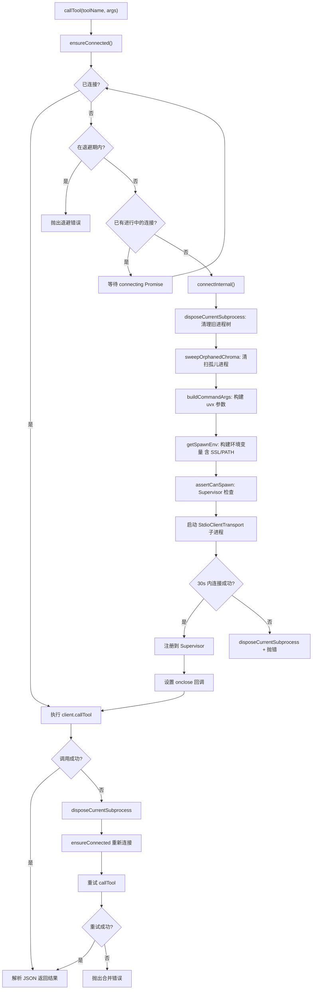
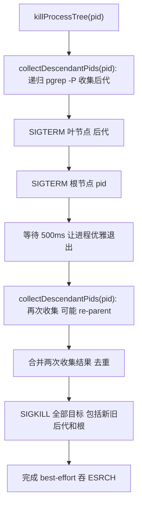

# ChromaMcpManager.ts 需求说明

> 源文件：src/services/sync/ChromaMcpManager.ts ｜ 类型：源码 ｜ 行数：808 ｜ 所属模块：sync ｜ 分析日期：2026-07-23

## 1. 文件定位总述

ChromaMcpManager 是 claude-mem 向量语义搜索能力的进程管理器，采用单例模式封装了与 chroma-mcp 子进程的 MCP stdio 通信全生命周期。它通过 `uvx` 启动 chroma-mcp Python 包（固定版本 0.2.6），借助 MCP SDK 的 StdioClientTransport 建立双向通信，对外提供 `callTool`、`isHealthy`、`probeSemanticSearch` 等方法供 ChromaSync 等上层服务调用。该类在进程树管理方面投入了大量工程：包含孤儿进程清扫、树状 kill（SIGTERM + grace + SIGKILL）、连接退避重连、传输错误自动重试、SSL 证书合并（Zscaler 企业兼容）、uvx 路径自动发现等机制，确保在 Linux/Windows/macOS 多平台上可靠运行。其下游连接到本地或远程 ChromaDB 向量数据库，为 claude-mem 的语义记忆检索提供基础设施。

## 2. 功能需求

| 编号 | 需求描述（系统应当…） | 触发条件 / 输入 | 处理规则与输出 | 证据 |
|------|----------------------|----------------|---------------|------|
| FR-CMCP-01 | 系统应当以单例模式管理 chroma-mcp 子进程的连接生命周期 | 首次调用 `getInstance()` | 创建唯一实例；后续调用返回同一实例；通过 `reset()` 可重置（主要用于测试） | `src/services/sync/ChromaMcpManager.ts:46-61,622-627` |
| FR-CMCP-02 | 系统应当按需自动建立与 chroma-mcp 的 MCP stdio 连接 | 首次 `callTool` 或其他需连接的操作 | 构建 uvx 命令参数、设置 spawn 环境（含 SSL 证书、PATH 修正）、启动子进程、30 秒超时连接；连接成功后注册到 Supervisor 进程管理器 | `src/services/sync/ChromaMcpManager.ts:94-192` |
| FR-CMCP-03 | 系统应当支持 local（本地持久化）和 remote（远程 HTTP）两种 Chroma 模式 | settings.json 中 `CLAUDE_MEM_CHROMA_MODE` 配置 | local 模式传递 `--client-type persistent --data-dir <path>`；remote 模式传递 `--client-type http --host --port --ssl --tenant --database --api-key` | `src/services/sync/ChromaMcpManager.ts:194-242` |
| FR-CMCP-04 | 系统应当在 MCP 连接断开或传输错误时自动重连并重试工具调用一次 | 传输错误或子进程意外关闭 | 清理当前子进程树后重新 `ensureConnected`，重试一次 `callTool`；二次失败则抛出合并错误信息 | `src/services/sync/ChromaMcpManager.ts:257-277` |
| FR-CMCP-05 | 系统应当对 chroma-mcp 工具调用的结果进行解析，提取 JSON 文本内容 | MCP 工具返回 `CallToolResult` | 检查 `isError` 标志，提取 `content` 数组中首个 `type=text` 的元素，尝试 JSON.parse；解析失败或内容为空返回 null | `src/services/sync/ChromaMcpManager.ts:279-306` |
| FR-CMCP-06 | 系统应当提供健康检查能力 | 调用 `isHealthy()` | 调用 `chroma_list_collections`（limit=1），成功返回 true，任何异常返回 false | `src/services/sync/ChromaMcpManager.ts:308-318` |
| FR-CMCP-07 | 系统应当提供深度语义搜索探针，返回连接状态、集合数、查询延迟等诊断信息 | 调用 `probeSemanticSearch()` | 分两阶段探查：先 list collections 获取集合数，再 query cm__claude-mem 集合获取查询延迟；任一阶段失败返回对应的 stage 和 error 信息 | `src/services/sync/ChromaMcpManager.ts:320-372` |
| FR-CMCP-08 | 系统应当在连接失败后实施退避策略，防止短时间内反复重连 | 连接失败后再次尝试连接 | 记录 `lastConnectionFailureTimestamp`，在退避期（10 秒）内拒绝新的连接尝试，抛出含剩余等待时间的错误 | `src/services/sync/ChromaMcpManager.ts:68-71` |
| FR-CMCP-09 | 系统应当在新连接建立前清扫本实例遗留的孤儿 chroma-mcp 进程 | 每次 `connectInternal` 执行 | 通过 `pgrep -f` 查找指向相同 `--data-dir` 但不属于当前 worker 进程后代的 chroma-mcp 进程，SIGKILL 清除（仅 POSIX） | `src/services/sync/ChromaMcpManager.ts:104-108,547-579` |
| FR-CMCP-10 | 系统应当使用树状 kill 彻底终止 chroma-mcp 进程及其所有后代 | 断开连接、连接超时、onclose 事件、stop | POSIX：递归 `pgrep -P` 收集所有后代 PID，先 SIGTERM 叶节点再根节点，等待 500ms 后 SIGKILL 全部目标；Windows：`taskkill /T /F` | `src/services/sync/ChromaMcpManager.ts:459-536` |
| FR-CMCP-11 | 系统应当为子进程环境自动补全 uv/uvx 可执行文件路径 | 构建 spawn 环境时 | 扫描 `~/.local/bin`、`~/.cargo/bin` 及 `CLAude_MEM_CHROMA_UVX_PATH` 环境变量指定的路径，将存在且不在当前 PATH 中的目录前置到 PATH | `src/services/sync/ChromaMcpManager.ts:706-741` |
| FR-CMCP-12 | 系统应当在 macOS 上自动检测 Zscaler 企业代理证书并合并到 SSL 证书链 | 构建 spawn 环境时 | 通过 certifi 获取 Python CA 包路径、通过 `security find-certificate` 提取 Zscaler 证书，合并写入临时文件；设置 `SSL_CERT_FILE`、`REQUESTS_CA_BUNDLE`、`CURL_CA_BUNDLE`、`NODE_EXTRA_CA_CERTS` 四个环境变量 | `src/services/sync/ChromaMcpManager.ts:629-695` |
| FR-CMCP-13 | 系统应当禁用 Chroma 的匿名遥测 | 构建子进程环境时 | 设置 `ANONYMIZED_TELEMETRY=false` 环境变量 | `src/services/sync/ChromaMcpManager.ts:757` |
| FR-CMCP-14 | 系统应当将 chroma-mcp 子进程注册到 Supervisor 进程管理器 | 连接成功后 | 记录 PID、pgid、类型为 chroma，监听 exit 事件自动注销 | `src/services/sync/ChromaMcpManager.ts:777-807` |
| FR-CMCP-15 | 系统应当优雅停止 MCP 连接并清理全部子进程资源 | 调用 `stop()` | 调用 `disposeCurrentSubprocess` 进行树状 kill、关闭 transport 和 client、注销 Supervisor 进程、清空连接状态 | `src/services/sync/ChromaMcpManager.ts:433-446` |

## 3. 业务规则与约束

### 3.1 连接管理规则

- **单例不变量**（#2313）：每个 worker 进程中最多只存在一个 chroma-mcp 子进程树。所有放弃 `this.transport`/`this.client` 的代码路径（重连、传输错误、连接超时、onclose、stop）必须经过 `disposeCurrentSubprocess`。`src/services/sync/ChromaMcpManager.ts:374-419`
- **连接退避**：最近一次连接失败后 10 秒内不发起新的连接尝试，直接抛出错误。`src/services/sync/ChromaMcpManager.ts:68-71`
- **并发连接保护**：使用 `this.connecting` Promise 防止多个调用者同时触发连接。`src/services/sync/ChromaMcpManager.ts:73-76`
- **连接超时**：MCP 连接建立超时 30 秒。`src/services/sync/ChromaMcpManager.ts:19`

### 3.2 子进程管理规则

- **chroma-mcp 版本锁定**：固定使用 `chroma-mcp==0.2.6`（`CHROMA_MCP_PINNED_VERSION`）。`src/services/sync/ChromaMcpManager.ts:24`
- **依赖覆盖**：通过 `uvx --with` 注入 `onnxruntime>=1.20` 和 `protobuf<7`，解决 chroma-mcp 0.2.6 的传递依赖兼容问题（#2371）。`src/services/sync/ChromaMcpManager.ts:41-44`
- **孤儿清扫范围**（X-004）：仅清扫指向本实例 `--data-dir` 的孤儿进程，不影响其他 profile 的 chroma 进程（多账户隔离）。`src/services/sync/ChromaMcpManager.ts:543-546`
- **树状 kill 策略**：先收集全部后代 PID（bottom-up），SIGTERM 叶节点再根节点，等待 500ms，再收集一次（处理 re-parent），SIGKILL 联合集。`src/services/sync/ChromaMcpManager.ts:484-535`
- **Supervisor 断言**：spawn 前调用 `getSupervisor().assertCanSpawn('chroma mcp')` 检查资源限制。`src/services/sync/ChromaMcpManager.ts:112`

### 3.3 SSL 证书规则

- **证书缓存有效期**：合并证书文件创建后 24 小时内有效，超期重新生成。`src/services/sync/ChromaMcpManager.ts:634-635`
- **Zscaler 仅限 macOS**：仅在 macOS 平台尝试查找 Zscaler 证书。`src/services/sync/ChromaMcpManager.ts:640`
- **证书合并目标**：将 certifi 的 Python CA 包与 Zscaler 证书拼接写入 `paths.combinedCerts()` 路径。`src/services/sync/ChromaMcpManager.ts:682-684`

### 3.4 spawn 环境规则

- **环境变量清洗**：通过 `sanitizeEnv(process.env)` 过滤基础环境，再按需追加。`src/services/sync/ChromaMcpManager.ts:745`
- **遥测禁用**：`ANONYMIZED_TELEMETRY=false` 阻止 Chroma 发出后台 HTTP 遥测请求。`src/services/sync/ChromaMcpManager.ts:757`
- **工作目录**：子进程 cwd 设为 `os.homedir()`。`src/services/sync/ChromaMcpManager.ts:127`

## 4. 对外暴露

| 能力名称 | 类型 | 签名 | 说明 |
|---------|------|------|------|
| `getInstance` | 静态方法 | `() => ChromaMcpManager` | 获取单例实例 |
| `callTool` | 公开方法 | `(toolName: string, toolArguments: Record<string, unknown>) => Promise<unknown>` | 调用 chroma-mcp 工具，含自动重连重试，返回解析后的 JSON 或 null |
| `isHealthy` | 公开方法 | `() => Promise<boolean>` | 健康检查（list collections） |
| `probeSemanticSearch` | 公开方法 | `() => Promise<{ ok, stage, error?, collections?, queryLatencyMs? }>` | 深度语义搜索探针 |
| `stop` | 公开方法 | `() => Promise<void>` | 优雅停止连接并清理子进程 |
| `reset` | 静态方法 | `() => Promise<void>` | 重置单例（测试用） |

## 5. 依赖关系

### 上游（配置与基础设施）
- **MCP SDK**（`@modelcontextprotocol/sdk`）：Client、StdioClientTransport。`src/services/sync/ChromaMcpManager.ts:2-3`
- **SettingsDefaultsManager + USER_SETTINGS_PATH**：读取 Chroma 模式、连接参数、Python 版本等配置。`src/services/sync/ChromaMcpManager.ts:10-11`
- **paths 模块**：获取 chroma 数据目录和合并证书路径。`src/services/sync/ChromaMcpManager.ts:11`
- **sanitizeEnv**（`../../supervisor/env-sanitizer`）：环境变量清洗。`src/services/sync/ChromaMcpManager.ts:12`
- **getSupervisor**（`../../supervisor/index`）：进程注册/注销/断言。`src/services/sync/ChromaMcpManager.ts:13`
- **uvx 命令**：通过 `child_process.execFile` 启动 chroma-mcp。`src/services/sync/ChromaMcpManager.ts:4,115`
- **pgrep / taskkill**：进程树管理和孤儿清扫（POSIX/Windows）。`src/services/sync/ChromaMcpManager.ts:462,554`

### 下游
- **chroma-mcp 子进程**：Python MCP 服务，提供 `chroma_list_collections`、`chroma_query_documents` 等工具。`src/services/sync/ChromaMcpManager.ts:330,346`
- **ChromaDB**（本地持久化或远程 HTTP）：向量数据库，存储和检索嵌入向量。`src/services/sync/ChromaMcpManager.ts:194-242`

### 内部依赖
- **logger**：全链路日志记录。`src/services/sync/ChromaMcpManager.ts:9`

## 6. 数据结构

### probeSemanticSearch 返回类型
```
ok: boolean               // 是否健康
stage: 'connect' | 'list' | 'query' | 'done'  // 探查阶段
error?: string             // 错误描述
collections?: number      // 集合数量
queryLatencyMs?: number   // 查询延迟（毫秒）
```
`src/services/sync/ChromaMcpManager.ts:320-327`

### MCP Client 配置
```
name: 'claude-mem-chroma'       // 客户端标识名
version: '1.0.0'                 // 客户端版本
capabilities: {}                // 空能力集
```
`src/services/sync/ChromaMcpManager.ts:17-18`

### 连接参数常量
```
MCP_CONNECTION_TIMEOUT_MS = 30_000    // 连接超时 30 秒
RECONNECT_BACKOFF_MS = 10_000         // 重连退避 10 秒
CHROMA_MCP_PINNED_VERSION = '0.2.6'    // chroma-mcp 锁定版本
CHROMA_SUPERVISOR_ID = 'chroma-mcp'   // Supervisor 注册 ID
```
`src/services/sync/ChromaMcpManager.ts:19-23`

## 7. 复杂逻辑图示

下图展示 chroma-mcp 子进程的完整生命周期管理流程，涵盖连接建立、错误处理、重连和清理：



下图展示树状 kill（POSIX）的 SIGTERM → grace → SIGKILL 两阶段策略：



## 8. 逆向备注

1. **MCP SDK 限制与 Linux 孤儿问题**（#2313）：MCP SDK 的 `StdioClientTransport` 仅信号直系子进程（uvx），不使用进程组，导致 Linux 上孙进程（uv、python、chroma-mcp）被 re-parent 到 init 后累积存活。代码通过 `killProcessTree` 手动实现树状 kill 来弥补此缺陷。`src/services/sync/ChromaMcpManager.ts:95-101`
2. **onclose 中的后台树状 kill**：当 transport 触发 onclose 时，会尝试在后台 kill 被跟踪 PID 的进程树。这是 best-effort 操作，因为此时子进程可能已退出（`src/services/sync/ChromaMcpManager.ts:183-189`）。
3. **transport._process 的私有访问**：代码通过 `(this.transport as unknown as { _process?: ChildProcess })._process` 访问 MCP SDK 的内部属性 `_process` 来获取子进程 PID。这是一种对 SDK 内部实现细节的依赖（`src/services/sync/ChromaMcpManager.ts:165,391,778`）。
4. **certifi 查找的同步执行**：`getCombinedCertPath` 中通过 `execSync` 调用 uvx 查找 certifi 路径，这是同步阻塞调用（`src/services/sync/ChromaMcpManager.ts:648`）。推断原因：该方法在 `getSpawnEnv` 中被调用，而 `getSpawnEnv` 在 `connectInternal` 的同步路径中，但实际 `connectInternal` 是 async 的，此处用 sync 可能是为了简化。
5. **用户语法配置未在 ChromaMcpManager 中使用**：parser.ts 中的 `loadUserGrammars` 功能与 ChromaMcpManager 无关，两者的 `userGrammarCache` 各自独立。ChromaMcpManager 纯粹是 MCP 进程管理，不涉及代码解析。
6. **`queryFileCache` 的进程生命周期**：parser.ts 中的 `queryTmpDir` 使用 `mkdtempSync` 创建临时目录但无显式清理逻辑（`src/services/sync/ChromaMcpManager.ts:452-466` 对应 parser.ts:452-466）。推断临时文件在进程退出时由 OS 回收。
