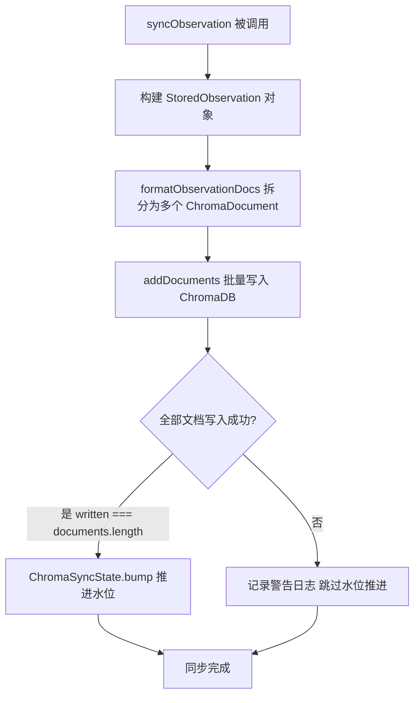
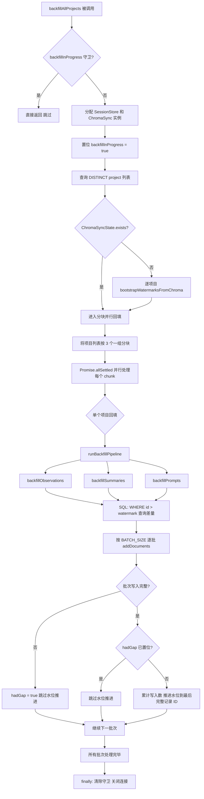
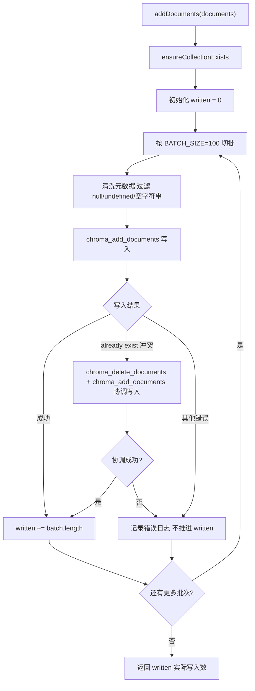

# ChromaSync.ts 需求说明

> 源文件：src/services/sync/ChromaSync.ts ｜ 类型：源码 ｜ 行数：1200 ｜ 所属模块：sync（向量同步） ｜ 分析日期：2026-07-23

## 1. 文件定位总述

ChromaSync 是 claude-mem 系统中 SQLite 关系数据库与 ChromaDB 向量数据库之间的双向同步引擎。它负责将三类核心业务数据（observations、session_summaries、user_prompts）从 SQLite 写入 ChromaDB 进行向量化嵌入，并对外提供语义查询能力。该类同时承担增量同步（实时写入后水位标记推进）与批量回填（worker 启动时基于水位扫描差量记录补齐）两种模式。所有 ChromaDB 交互均通过单例 ChromaMcpManager 进行 MCP 工具调用，实现与外部向量服务的解耦。同步水位由静态工具类 ChromaSyncState 持久化管理，确保中断恢复时不会丢失未同步记录。

## 2. 功能需求

| 编号 | 需求描述（系统应当…） | 触发条件 / 输入 | 处理规则与输出 | 证据 |
|------|----------------------|----------------|---------------|------|
| FR-COL-01 | 系统应当将项目标识符映射为确定性的 ChromaDB collection 名称，供无需实例化 ChromaSync 的调用方直接使用。 | 任意非空项目标识字符串 | 移除非字母数字字符为下划线，截断尾部连续非字母数字字符，前缀 `cm__`；空/无效标识映射为 `cm__unknown`。 | `src/services/sync/ChromaSync.ts:79-84` |
| FR-SYNC-OBS-01 | 系统应当在观测记录产生时，将其 narrative、text 和各条 fact 拆分为独立 ChromaDB 文档进行嵌入同步。 | observationId、memorySessionId、project、ParsedObservation 及其关联字段 | 将 narrative/text/facts 拆分为独立文档，携带统一基础元数据（sqlite_id、doc_type、memory_session_id、project 等），仅在全部文档写入成功后推进水位标记；部分写入时跳过水位推进并记录警告。 | `src/services/sync/ChromaSync.ts:407-459` |
| FR-SYNC-OBS-02 | 系统应当为每条 observation 事实生成按序号编排的独立向量文档，以支持细粒度语义检索。 | obs.facts（字符串数组） | 每条 fact 生成 id 为 `obs_{id}_fact_{index}` 的文档，元数据携带 `fact_index`。 | `src/services/sync/ChromaSync.ts:251-257` |
| FR-SYNC-SUM-01 | 系统应当在会话摘要产生时，将其 request、investigated、learned、completed、next_steps、notes 各字段拆分为独立 ChromaDB 文档进行嵌入同步。 | summaryId、ParsedSummary 及关联字段 | 六个非空字段各自生成独立文档，id 格式为 `summary_{id}_{field_type}`；水位推进策略同 FR-SYNC-OBS-01。 | `src/services/sync/ChromaSync.ts:462-508` |
| FR-SYNC-PROMPT-01 | 系统应当在用户提示词入库后，将其原始文本作为单条 ChromaDB 文档进行嵌入同步。 | promptId、promptText 及关联字段 | 生成 id 为 `prompt_{id}` 的单文档，元数据携带 doc_type=`user_prompt`；写入成功后推进 prompts 水位。 | `src/services/sync/ChromaSync.ts:525-562` |
| FR-BATCH-01 | 系统应当将文档批量写入 ChromaDB，每批不超过 100 条，并对批量失败实施容错继续处理。 | ChromaDocument 数组 | 按 BATCH_SIZE=100 切批，每批清洗空值元数据后写入；遇到 "already exist" 冲突时自动执行 delete+add 协调写入；其他错误记录日志并跳过该批次，永不抛出异常。返回实际成功写入的文档数。 | `src/services/sync/ChromaSync.ts:335-405` |
| FR-BFILL-01 | 系统应当在 worker 启动时对所有已注册项目执行智能回填，仅同步水位线之后的新增记录。 | 项目列表（从 SQLite 的 observations 表的 DISTINCT project 获取） | 依次对每个项目回填 observations、summaries、prompts 三类数据；当水位缓存不存在时先从 ChromaDB 现有文档引导水位；采用分块并行（并发上限 3）逐项目回填。 | `src/services/sync/ChromaSync.ts:1057-1144` |
| FR-BFILL-02 | 系统应当在回填过程中实施非连续失败保护：一旦任意批次写入失败，后续批次即使成功也不得推进水位标记，以防止跳过失败的记录。 | 回填期间的批次写入结果 | 维护 `hadGap` 标志位，批次写入不完整时置位；已置位后所有后续批次跳过水位推进，确保水位单调递增且不跨过失败区间。 | `src/services/sync/ChromaSync.ts:734-786` |
| FR-BFILL-03 | 系统应当在回填中按文档写入进度精确推进水位到已完全写入的 observation/summary/prompt 的 ID，而非批次边界。 | 批次写入成功后的文档计数 | 通过 cursor 累加各 observation 的文档数量，当累计写入量覆盖某个完整 observation 的所有文档时，以该 observation 的 ID 更新水位。 | `src/services/sync/ChromaSync.ts:764-779` |
| FR-BFILL-04 | 系统应当防止并发的 backfillAllProjects 调用重叠执行，采用静态守卫标志位进行互斥。 | 重复的 backfillAllProjects 调用 | 若 `backfillInProgress` 为 true 则直接返回；守卫在资源分配成功后才置位，finally 块中始终清除。 | `src/services/sync/ChromaSync.ts:1043-1044,1058-1061,1082,1129-1130` |
| FR-BOOT-01 | 系统应当支持从 ChromaDB 现有文档中扫描并推断水位标记，用于水位缓存丢失后的初始化恢复。 | 项目标识 | 扫描 collection 中所有文档的元数据，按 doc_type 分类提取 sqlite_id，取各类最大值写入 ChromaSyncState。 | `src/services/sync/ChromaSync.ts:631-647` |
| FR-QUERY-01 | 系统应当对外提供语义向量查询接口，返回去重后的 SQLite ID、距离分数和元数据。 | 查询文本、结果数量上限、可选的 where 过滤条件 | 调用 ChromaDB 的 chroma_query_documents，结果按 `entityType:sqliteId` 去重（同一条 observation 的多个文档段只保留最近邻一条）；连接失败时重置 collection 缓存标志。 | `src/services/sync/ChromaSync.ts:956-1037` |
| FR-DEL-COL-01 | 系统应当支持按项目删除其对应的 ChromaDB collection，采用尽力而为策略。 | 项目标识 | collection 不存在时返回 false 视为成功；仅在其他传输错误时抛出。 | `src/services/sync/ChromaSync.ts:94-115` |
| FR-DEL-DOC-01 | 系统应当支持按文档 ID 精确删除 ChromaDB 中的指定向量文档，用于观测删除后的向量清理。 | 项目标识、文档 ID 数组 | 空数组直接返回 true；collection 不存在返回 false；其他传输错误重新抛出。 | `src/services/sync/ChromaSync.ts:150-176` |
| FR-RECONCILE-ID-01 | 系统应当能从观测的 id 及内容字段重构出其对应的所有 ChromaDB 文档 ID，用于不遍历 collection 即可精准删除。 | obs.id、narrative、text、facts | 与 formatObservationDocs 保持一致的 ID 命名规则：`obs_{id}_narrative`、`obs_{id}_text`、`obs_{id}_fact_{index}`。 | `src/services/sync/ChromaSync.ts:124-140` |
| FR-MERGE-01 | 系统应当支持批量更新指定 SQLite ID 对应的 ChromaDB 文档的 merged_into_project 元数据字段。 | sqliteIds 数组、mergedIntoProject 目标值 | 按 BATCH_SIZE 分批查询现有文档，追加 merged_into_project 字段后调用 chroma_update_documents 更新元数据。 | `src/services/sync/ChromaSync.ts:1146-1195` |
| FR-ENSURE-COL-01 | 系统应当在写入或查询前确保目标 collection 存在，collection 创建为幂等操作（已存在则静默成功）。 | collection 名称 | 调用 chroma_create_collection，捕获 "already exists" 错误视为成功；创建后缓存标志位置位避免重复检查。 | `src/services/sync/ChromaSync.ts:178-201` |

## 3. 业务规则与约束

| 编号 | 规则描述 | 证据 |
|------|---------|------|
| BR-01 | **水位单调递增**：水位标记仅在文档全部写入 ChromaDB 确认后才推进，部分写入或失败时禁止推进，防止下次回填跳过未同步记录。 | `src/services/sync/ChromaSync.ts:449-459,497-507` |
| BR-02 | **非连续失败保护**：回填中一旦出现任意批次写入失败，后续所有批次即使成功也不推进水位，因为水位是单一单调 ID，无法表示"201-250 缺失、251 已同步"这种间断状态。 | `src/services/sync/ChromaSync.ts:726-733,825` |
| BR-03 | **ChromaDB 残留非致命**：SQLite 删除已提交后 ChromaDB 中的残留向量不视为数据损坏，因为 collection 可从 SQLite 完整重建。 | `src/services/sync/ChromaSync.ts:87-93,145-149` |
| BR-04 | **元数据空值过滤**：写入 ChromaDB 前必须过滤掉值为 null、undefined 或空字符串的元数据字段，防止向量存储服务拒绝。 | `src/services/sync/ChromaSync.ts:348-352` |
| BR-05 | **批量写入不抛异常**：addDocuments 方法在任何批量错误下均不抛出异常，而是返回实际写入数由调用方决定水位推进。 | `src/services/sync/ChromaSync.ts:334-335` |
| BR-06 | **回填并发上限为 3**：全量回填时最多 3 个项目并行处理，以限制并发嵌入操作对 CPU 和内存的压力。 | `src/services/sync/ChromaSync.ts:1040,1103-1108` |
| BR-07 | **重入互斥**：backfillAllProjects 通过静态标志位防止并发重叠，且守卫在 finally 中清除以防死锁。 | `src/services/sync/ChromaSync.ts:1043,1058,1129-1130` |
| BR-08 | **collection 缓存**：实例级 `collectionCreated` 标志避免每次写入都执行 create_collection 调用；查询连接失败时重置该标志以触发下次重建。 | `src/services/sync/ChromaSync.ts:66,179-201,984` |
| BR-09 | **collection 名称确定性映射**：项目 ID 到 collection 名称的映射是纯函数，用于实例化外部（如项目删除管理路径）也能推算 collection 名称。 | `src/services/sync/ChromaSync.ts:79-84` |
| BR-10 | **查询结果去重**：语义查询结果按 `entityType:sqliteId` 去重，因为一条 observation 的 narrative/text/facts 生成多条文档，查询可能返回同一条记录的多个片段。 | `src/services/sync/ChromaSync.ts:997-1037` |

## 4. 对外暴露

| 暴露类型 | 名称 | 用途 | 证据 |
|---------|------|------|------|
| 公开实例方法 | syncObservation() | 增量同步单条观测到 ChromaDB | `src/services/sync/ChromaSync.ts:407` |
| 公开实例方法 | syncSummary() | 增量同步单条会话摘要到 ChromaDB | `src/services/sync/ChromaSync.ts:462` |
| 公开实例方法 | syncUserPrompt() | 增量同步单条用户提示词到 ChromaDB | `src/services/sync/ChromaSync.ts:525` |
| 公开实例方法 | ensureBackfilled() | 对指定项目执行智能回填 | `src/services/sync/ChromaSync.ts:649` |
| 公开实例方法 | queryChroma() | 语义向量查询（去重后返回 sqlite_id） | `src/services/sync/ChromaSync.ts:956` |
| 公开实例方法 | bootstrapWatermarksFromChroma() | 从 ChromaDB 现有数据引导水位缓存 | `src/services/sync/ChromaSync.ts:631` |
| 公开实例方法 | updateMergedIntoProject() | 批量更新文档的 merged_into_project 元数据 | `src/services/sync/ChromaSync.ts:1146` |
| 公开实例方法 | close() | 关闭同步实例（当前为空操作，仅记录日志） | `src/services/sync/ChromaSync.ts:1197` |
| 公开静态方法 | collectionNameFor() | 项目 ID 到 collection 名称的确定性映射 | `src/services/sync/ChromaSync.ts:79` |
| 公开静态方法 | deleteCollectionForProject() | 删除指定项目的 ChromaDB collection | `src/services/sync/ChromaSync.ts:94` |
| 公开静态方法 | observationDocIds() | 从观测字段重构 ChromaDB 文档 ID 列表 | `src/services/sync/ChromaSync.ts:124` |
| 公开静态方法 | deleteDocumentsByIds() | 按文档 ID 删除指定向量文档 | `src/services/sync/ChromaSync.ts:150` |
| 公开静态方法 | backfillAllProjects() | 全量回填所有项目（fire-and-forget 启动调用） | `src/services/sync/ChromaSync.ts:1057` |

## 5. 依赖关系

| 依赖方向 | 依赖项 | 用途 | 证据 |
|---------|--------|------|------|
| 内部依赖 | ChromaMcpManager（单例） | 所有 ChromaDB 操作的 MCP 工具调用通道 | `src/services/sync/ChromaSync.ts:2,96,183,342` |
| 内部依赖 | ChromaSyncState（静态工具类） | 水位标记的读取、推进、替换和存在性检查 | `src/services/sync/ChromaSync.ts:3,451,499,554,638` |
| 内部依赖 | ParsedObservation / ParsedSummary（SDK 解析器类型） | 定义同步输入数据结构 | `src/services/sync/ChromaSync.ts:4` |
| 内部依赖 | SessionStore | 回填时从 SQLite 读取观测/摘要/提示词原始记录 | `src/services/sync/ChromaSync.ts:5,657,691-700` |
| 内部依赖 | logger | 结构化日志输出 | `src/services/sync/ChromaSync.ts:6` |
| 内部依赖 | parseFileList | 解析 observations 表中的 files_read/files_modified JSON 字段 | `src/services/sync/ChromaSync.ts:7,208-209` |

## 6. 数据结构

### 6.1 ChromaDocument（内部接口）

```typescript
interface ChromaDocument {
  id: string;           // 文档唯一标识，格式：obs_{id}_{field} | summary_{id}_{field} | prompt_{id}
  document: string;     // 待嵌入的文本内容
  metadata: Record<string, string | number>;  // 向量元数据
}
```

证据：`src/services/sync/ChromaSync.ts:9-13`

### 6.2 文档 ID 命名规范

| doc_type | ID 格式 | 生成条件 | 证据 |
|----------|---------|---------|------|
| observation | `obs_{sqlite_id}_narrative` | obs.narrative 非空 | `src/services/sync/ChromaSync.ts:237` |
| observation | `obs_{sqlite_id}_text` | obs.text 非空 | `src/services/sync/ChromaSync.ts:243` |
| observation | `obs_{sqlite_id}_fact_{index}` | facts 数组中的每条事实 | `src/services/sync/ChromaSync.ts:251-257` |
| session_summary | `summary_{sqlite_id}_request` | summary.request 非空 | `src/services/sync/ChromaSync.ts:276` |
| session_summary | `summary_{sqlite_id}_investigated` | summary.investigated 非空 | `src/services/sync/ChromaSync.ts:284` |
| session_summary | `summary_{sqlite_id}_learned` | summary.learned 非空 | `src/services/sync/ChromaSync.ts:292` |
| session_summary | `summary_{sqlite_id}_completed` | summary.completed 非空 | `src/services/sync/ChromaSync.ts:300` |
| session_summary | `summary_{sqlite_id}_next_steps` | summary.next_steps 非空 | `src/services/sync/ChromaSync.ts:308` |
| session_summary | `summary_{sqlite_id}_notes` | summary.notes 非空 | `src/services/sync/ChromaSync.ts:316` |
| user_prompt | `prompt_{sqlite_id}` | 始终生成（单条） | `src/services/sync/ChromaSync.ts:511-513` |

### 6.3 元数据字段清单

| 字段 | 适用 doc_type | 说明 | 证据 |
|------|-------------|------|------|
| sqlite_id | 全部 | 源 SQLite 记录 ID | `src/services/sync/ChromaSync.ts:212,265,515` |
| doc_type | 全部 | observation / session_summary / user_prompt | `src/services/sync/ChromaSync.ts:213,266,516` |
| memory_session_id | 全部 | 所属内存会话 ID | `src/services/sync/ChromaSync.ts:214,267,517` |
| project | 全部 | 所属项目标识 | `src/services/sync/ChromaSync.ts:215,268,518` |
| merged_into_project | observation, session_summary | 合并目标项目（可为 null，写入时被过滤） | `src/services/sync/ChromaSync.ts:216,269` |
| created_at_epoch | 全部 | 创建时间戳（epoch 秒） | `src/services/sync/ChromaSync.ts:217,270,519` |
| field_type | 全部 | 文档字段类型标识 | `src/services/sync/ChromaSync.ts:239,247,255,279,287,295,303,311,319` |
| type | observation | 观测类型（discovery 等） | `src/services/sync/ChromaSync.ts:218` |
| title | observation | 观测标题 | `src/services/sync/ChromaSync.ts:219` |
| subtitle | observation | 观测副标题（条件附加） | `src/services/sync/ChromaSync.ts:223-224` |
| concepts | observation | 概念列表逗号分隔（条件附加） | `src/services/sync/ChromaSync.ts:225-227` |
| files_read | observation | 读取文件列表逗号分隔（条件附加） | `src/services/sync/ChromaSync.ts:228-230` |
| files_modified | observation | 修改文件列表逗号分隔（条件附加） | `src/services/sync/ChromaSync.ts:231-233` |
| fact_index | observation (fact) | 事实在数组中的序号 | `src/services/sync/ChromaSync.ts:255` |
| prompt_number | session_summary, user_prompt | 提示词序号 | `src/services/sync/ChromaSync.ts:272,520` |

### 6.4 StoredObservation / StoredSummary / StoredUserPrompt（内部接口）

这三个接口定义了从 SQLite 读取后用于格式化为 ChromaDocument 的中间数据结构，字段与 observations / session_summaries / user_prompts 表的列一一对应。

证据：`src/services/sync/ChromaSync.ts:15-61`

## 7. 复杂逻辑图示

### 7.1 增量同步流程（以 observation 为例）



增量同步的核心保障机制是：仅在全量写入确认后推进水位，部分写入时水位不变，下次回填可重新补齐。

### 7.2 全量回填流程（backfillAllProjects）



该流程体现了双重保护机制：批次级失败保护（hadGap 标志）和全局重入互斥（backfillInProgress 守卫）。

### 7.3 批量写入容错流程（addDocuments）



## 8. 逆向备注

| 编号 | 备注 | 证据 |
|------|------|------|
| N-01 | `StoredObservation.text` 字段声明为 `string \| null`，但 `syncObservation` 中构造时硬编码为 `null` 并标注 `// Legacy field, not used`，表明 text 字段已不再用于 Chroma 同步。 | `src/services/sync/ChromaSync.ts:17,421` |
| N-02 | `close()` 方法为空操作（仅日志），无实际资源释放。推断：ChromaDB 连接由 ChromaMcpManager 单例管理，ChromaSync 实例本身不持有需释放的资源。 | `src/services/sync/ChromaSync.ts:1197-1199` |
| N-03 | `backfillAllProjects` 中查询 project 列表仅从 observations 表获取，不包括仅有 summaries 或 prompts 但无 observations 的项目。推断：observations 是核心数据表，有 observations 的项目必然也需要同步 summaries 和 prompts。 | `src/services/sync/ChromaSync.ts:1084-1086` |
| N-04 | `getExistingChromaIds` 使用 `PRAGMA` 未在代码中体现但使用了 ChromaDB 的 `where` 过滤参数 `{ project: targetProject }`，推断 ChromaDB MCP 工具的 where 参数支持嵌套字段元数据查询。 | `src/services/sync/ChromaSync.ts:588` |
| N-05 | `queryChroma` 中连接错误检测涵盖了 ECONNREFUSED、ENOTFOUND、fetch failed、subprocess closed、timed out 五种模式，覆盖了 MCP 子进程通信的主要故障场景。 | `src/services/sync/ChromaSync.ts:976-981` |
| N-06 | `syncUserPrompt` 中 `content_session_id` 字段硬编码为空字符串 `''`，注释说明 "Not needed for Chroma sync"，表明 ChromaDB 文档元数据不需要 content_session_id。 | `src/services/sync/ChromaSync.ts:535` |
| N-07 | `addDocuments` 在 already-exist 冲突时采用 delete+add 策略而非 update，推断 ChromaDB 的 add 操作不支持幂等覆盖（或 MCP 工具未暴露 update 替换文档内容的能力）。 | `src/services/sync/ChromaSync.ts:364-388` |
