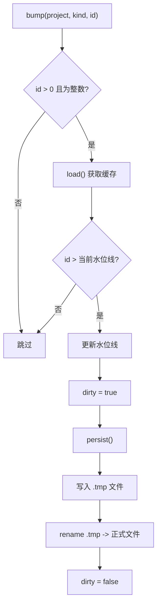

# ChromaSyncState.ts 需求说明

> 源文件：src/services/sync/ChromaSyncState.ts | 类型：源码 | 行数：92 | 所属模块：sync | 分析日期：2026-07-23

## 1. 文件定位总述

ChromaSyncState 是 Chroma 同步的水位线（watermark）持久化管理模块，记录每个项目已同步到 Chroma 的各类文档（observations/summaries/prompts）的最大 ID。它采用文件持久化（`chroma-sync-state.json`）、内存缓存、原子写入（先写 tmp 再 rename）的策略，为增量同步提供"从哪开始"的起点信息。

## 2. 功能需求

| 编号 | 需求描述（系统应当…） | 触发条件 / 输入 | 处理规则与输出 | 证据 |
|------|----------------------|----------------|---------------|------|
| FR-ChromaState-01 | 系统应当持久化并读取项目的同步水位线 | 调用 `ChromaSyncState.get(project)` | 从内存缓存或文件加载水位线；项目不存在返回全零 `{ observations: 0, summaries: 0, prompts: 0 }` | `src/services/sync/ChromaSyncState.ts:61-64` |
| FR-ChromaState-02 | 系统应当在有新数据同步时更新水位线 | 调用 `ChromaSyncState.bump(project, kind, id)` | 仅当 id > 当前水位线时更新；无效 id（非正整数）跳过；更新后立即持久化到文件 | `src/services/sync/ChromaSyncState.ts:66-75` |
| FR-ChromaState-03 | 系统应当支持整体替换某项目的水位线 | 调用 `ChromaSyncState.replace(project, marks)` | 直接替换指定项目的完整水位线对象，不进行逐字段比较；替换后立即持久化 | `src/services/sync/ChromaSyncState.ts:77-82` |
| FR-ChromaState-04 | 系统应当支持条件性刷新持久化 | 调用 `ChromaSyncState.flush()` | 仅当 dirty 标志为 true 时才执行持久化写入 | `src/services/sync/ChromaSyncState.ts:84-86` |
| FR-ChromaState-05 | 系统应当支持重置内存缓存 | 调用 `ChromaSyncState.resetCache()` | 清空内存缓存并重置 dirty 标志，下次访问时重新从文件加载 | `src/services/sync/ChromaSyncState.ts:88-91` |
| FR-ChromaState-06 | 系统应当判断水位线文件是否存在 | 调用 `ChromaSyncState.exists()` | 通过 `existsSync` 检查文件是否存在 | `src/services/sync/ChromaSyncState.ts:57-59` |

## 3. 业务规则与约束

- **原子写入**：持久化采用"先写 .tmp 再 rename"策略，防止写入中断导致数据损坏。`src/services/sync/ChromaSyncState.ts:50-53`
- **仅向上更新**：`bump` 方法仅在 id 严格大于当前值时更新，防止水位线回退。`src/services/sync/ChromaSyncState.ts:71`
- **脏标记**：仅 `bump` 和 `replace` 设置 dirty=true，`flush` 利用此标记避免不必要的文件写入。`src/services/sync/ChromaSyncState.ts:73,80,85`
- **数据归一化**：加载时对每个值做 `Number.isInteger` 校验，非整数归为 0。`src/services/sync/ChromaSyncState.ts:36-39`
- **文件路径**：水位线文件位于 `$CLAUDE_MEM_DATA_DIR/chroma-sync-state.json`。`src/services/sync/ChromaSyncState.ts:17-19`

## 4. 对外暴露

| 名称 | 类型 | 说明 |
|------|------|------|
| `ChromaSyncState` | 对象（命名空间） | 水位线管理 API |
| `ChromaSyncState.exists()` | 方法 | 判断文件是否存在 |
| `ChromaSyncState.get(project)` | 方法 | 获取项目水位线 |
| `ChromaSyncState.bump(project, kind, id)` | 方法 | 更新水位线（仅向上） |
| `ChromaSyncState.replace(project, marks)` | 方法 | 替换水位线 |
| `ChromaSyncState.flush()` | 方法 | 条件性刷新到文件 |
| `ChromaSyncState.resetCache()` | 方法 | 重置内存缓存 |
| `ProjectWatermarks` | 接口 | 水位线数据结构 |

## 5. 依赖关系

- **fs**（Node.js 内置模块）：文件读写操作
- **SettingsDefaultsManager**（`../../shared/SettingsDefaultsManager.js`）：获取 `CLAUDE_MEM_DATA_DIR` 路径

## 6. 数据结构

**ProjectWatermarks**（核心结构）：
```typescript
{
  observations: number;  // 已同步的最大 observation id
  summaries: number;      // 已同步的最大 summary id
  prompts: number;       // 已同步的最大 prompt id
}
```

**文件格式**（JSON）：
```json
{
  "project-name": {
    "observations": 123,
    "summaries": 45,
    "prompts": 67
  }
}
```

## 7. 复杂逻辑图示



水位线更新流程严格保证"仅向上"和"原子写入"，通过内存缓存避免频繁文件读取。

## 8. 逆向备注

- `bump` 和 `replace` 都直接调用 `persist()`，`flush()` 作为显式刷新接口仅对"dirty 且未被 bump/replace 持久化的场景"有意义。推断：（flush 主要用于测试或外部协调场景，正常业务流中 bump/replace 已自动持久化）。
