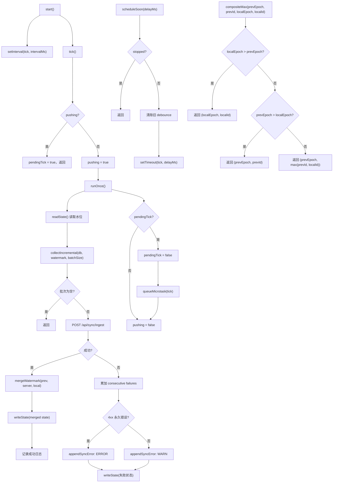

# SyncAgent.ts 需求说明

> 源文件：`src/services/sync/SyncAgent.ts` ｜ 类型：源码 ｜ 行数：303 ｜ 所属模块：sync ｜ 分析日期：2026-07-23

## 1. 文件定位总述

SyncAgent 是 claude-mem 的客户端侧数据同步代理，负责将本地 SQLite 数据库中的增量变更（sessions、observations、summaries、prompts）定期推送到上游服务器。它采用定时轮询 + 事件驱动混合模式：启动时立即执行一次 tick，之后按配置间隔周期性推送；当有新数据写入时通过 `scheduleSoon` 触发 2 秒延迟的快速推送。推送过程中通过水位标记（watermark）机制实现增量同步，使用防重入锁（pushing）保证并发安全，并通过复合水位合并算法确保 epoch+id 字典序正确性。

## 2. 功能需求

| 编号 | 需求描述（系统应当…） | 触发条件 / 输入 | 处理规则与输出 | 证据 |
|------|----------------------|----------------|---------------|------|
| FR-SYNC-01 | 系统应当启动定时同步代理 | 调用 `start()` | 创建 setInterval 定时器（unref 防止阻止进程退出），立即执行一次 tick；若已启动或已停止则跳过 | `SyncAgent.ts:64-79` |
| FR-SYNC-02 | 系统应当触发快速同步推送 | 调用 `scheduleSoon(delayMs?)` | 清除已有 debounce 定时器，设置新的延迟定时器（默认 2000ms，unref）；stopped 时不触发 | `SyncAgent.ts:86-94` |
| FR-SYNC-03 | 系统应当停止同步代理 | 调用 `stop()` | 设置 stopped 标志；清除定时器和 debounce；执行最后一次 tick（best-effort，忽略错误） | `SyncAgent.ts:96-113` |
| FR-SYNC-04 | 系统应当在每次 tick 中收集增量数据并推送到上游 | 定时器触发或 scheduleSoon 触发 | 防重入锁：若 pushing 中则标记 pendingTick 等待重入；调用 `collectIncremental` 收集增量批次；POST 到 `/api/sync/ingest`；成功则合并水位并更新状态；失败则记录错误并追加到 sync-errors.log | `SyncAgent.ts:115-193` |
| FR-SYNC-05 | 系统应当使用 HTTP POST 推送数据到上游 | 有增量数据需要推送 | 构建请求头（Content-Type: application/json, x-sync-user, authorization）；accessToken 优先于 apiKey；发送 JSON 批次；HTTP 错误抛出 PushError | `SyncAgent.ts:195-221` |
| FR-SYNC-06 | 系统应当合并服务端和本地的水位标记 | 推送成功收到服务端 next_watermark | 逐键取 prev/server/local 三者最大值；完成度和活跃度水位使用 (epoch, id) 复合字典序合并；防止服务端将水位推回导致漏推 | `SyncAgent.ts:254-297` |
| FR-SYNC-07 | 系统应当区分永久性错误和临时性错误 | HTTP 响应状态码 | 4xx 为永久性错误（ERROR 级别日志 + sync-errors.log），其他为临时性错误（WARN 级别日志 + sync-errors.log） | `SyncAgent.ts:178-191,243-246` |
| FR-SYNC-08 | 系统应当持久化同步状态 | 每次推送完成（成功或失败） | 调用 `writeState` 原子写入（tmp+rename）状态文件；包含 upstream_url、last_sync_at、成功/失败时间、水位、连续失败次数和最后错误 | `SyncAgent.ts:152-176` |
| FR-SYNC-09 | 系统应当支持多种认证模式 | SyncAgentConfig 中配置 authMode | 支持 `none`/`apikey`/`jwt`/`mtls`；实际请求中 accessToken 优先于 apiKey 作为 Bearer token | `SyncAgent.ts:201-205` |

## 3. 业务规则与约束

- **防重入保证**：`pushing` 布尔锁确保同一时刻只有一个 tick 在执行；若 tick 进行中有新请求，标记 `pendingTick` 在当前 tick 完成后通过 microtask 重入（`SyncAgent.ts:116-131`）。
- **增量收集策略**：每次 tick 只推送一个批次（`SyncAgent.ts:25-26` 注释说明），剩余数据留到下次 tick，保持每次推送的幂等性。
- **复合水位合并算法**：prompt_completions 和 prompt_activity 使用 (epoch, id) 字典序合并——epoch 为主键，仅当 epoch 相等时比较 id，防止跨 epoch 的 id 错配导致漏推（X-001 问题）（`SyncAgent.ts:268-297`）。
- **错误分类**：HTTP 4xx 为永久性错误（需人工介入），其他为临时性（自动重试）（`SyncAgent.ts:243-246`）。
- **去抖延迟**：`DEBOUNCE_MS = 2000`（`SyncAgent.ts:48`），多次 `scheduleSoon` 调用合并为一次。
- **定时器 unref**：setInterval 和 setTimeout 均调用 `unref()`（`SyncAgent.ts:73,93`），不阻止 Node.js 进程退出。
- **关闭时 best-effort 刷新**：`stop()` 中执行最后一次 tick 但忽略所有错误（`SyncAgent.ts:108-112`）。
- **请求体大小限制**：未在代码中显式设置，受 `fetch` 实现默认限制。
- **不实现指数退避**：注释明确标注留作后续（T-17 候选）（`SyncAgent.ts:24`）。

## 4. 对外暴露

| 公开成员 | 类型 | 说明 |
|---------|------|------|
| `SyncAgent` | class | 同步代理主类 |
| `PushError` | class (extends Error) | HTTP 推送错误，含 status 属性 |

**SyncAgent 构造参数**：
- `dbManager: DatabaseManager` — 数据库管理器
- `config: SyncAgentConfig` — 同步配置
- `fetchImpl?: FetchFn` — fetch 函数（可替换，便于测试）
- `statePath?: string` — 状态文件路径

**SyncAgentConfig**：
```typescript
interface SyncAgentConfig {
  upstreamUrl: string;       // 上游服务器地址
  userLabel: string;        // 用户标签
  authMode: 'none' | 'apikey' | 'jwt' | 'mtls';
  apiKey?: string;          // API 密钥
  accessToken?: string;     // 共享访问令牌（LAN 部署）
  intervalMs: number;       // 定时间隔
  batchSize: number;        // 每批大小
  retryMax: number;          // 最大重试次数
  redactPatterns: string[];  // 脱敏正则模式
}
```

## 5. 依赖关系

**内部依赖**：
- `src/services/worker/DatabaseManager.ts` → `DatabaseManager`（`SyncAgent.ts:1`）
- `src/utils/logger.ts` → 日志（`SyncAgent.ts:2`）
- `src/services/sync/sync-state.ts` → `readState`/`writeState`/`SyncState`（`SyncAgent.ts:3`）
- `src/services/sync/payload.ts` → `collectIncremental`/`IngestBatch`（`SyncAgent.ts:4`）
- `src/services/sync/error-log.ts` → `appendSyncError`（`SyncAgent.ts:5`）

**外部依赖**：
- 全局 `fetch`（可通过构造参数替换）

## 6. 数据结构

**SyncState['watermark']**（水位标记）：
```typescript
watermark: {
  sessions: number;               // sessions 表最大 ID
  observations: number;          // observations 表最大 ID
  summaries: number;              // summaries 表最大 ID
  prompts: number;               // prompts 表最大 ID
  prompt_completions: number;     // 提示完成水位 epoch
  prompt_completions_id: number;  // 提示完成水位 id
  prompt_activity: number;        // 提示活跃度水位 epoch
  prompt_activity_id: number;     // 提示活跃度水位 id
}
```

**IngestResponse**（上游响应）：
```typescript
interface IngestResponse {
  applied: Record<string, unknown>;
  next_watermark: Partial<SyncState['watermark']>;
}
```

## 7. 复杂逻辑图示



上图展示了 SyncAgent 的核心生命周期和水位合并算法。tick 执行时通过防重入锁保证安全，失败时区分永久/临时错误；复合水位合并确保 epoch 相等时 id 取大值，避免跨 epoch 错配导致的漏推。

## 8. 逆向备注

- `retryMax` 配置项在 `SyncAgentConfig` 中定义（`SyncAgent.ts:38`）但在代码中未使用——当前实现不限制重试次数，仅累加 `consecutive` 计数器。推断：（重试限制逻辑可能在上游状态消费端或留作后续实现）。
- `authMode` 支持 `jwt` 和 `mtls`（`SyncAgent.ts:32`），但 `post` 方法中实际只处理 `accessToken` 和 `apiKey` 两种 Bearer token 方式（`SyncAgent.ts:201-205`），jwt/mtls 未实现具体逻辑。
- `safeBody` 函数将响应体截断为 512 字符（`SyncAgent.ts:233`），防止过大的错误响应影响日志。
- `joinUrl` 函数处理 base 尾部和 path 头部的斜杠标准化（`SyncAgent.ts:299-303`），是简单的字符串拼接，不支持 query 参数合并。
- `SyncAgent` 不支持多批次链式推送（注释说明留作后续）（`SyncAgent.ts:26`），当前每个 tick 只推一个 batch。
