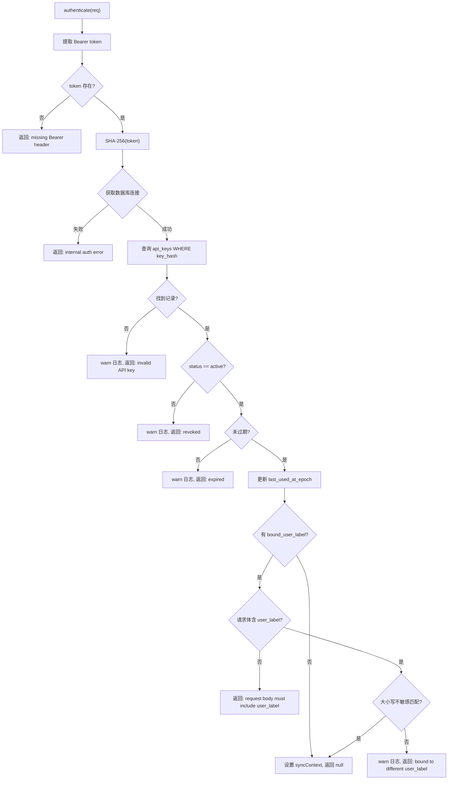

# ApiKeyAuth.ts 需求说明

> 源文件：src/services/sync/auth/ApiKeyAuth.ts ｜ 类型：源码 ｜ 行数：123 ｜ 所属模块：sync/auth ｜ 分析日期：2026-07-23

## 1. 文件定位总述

ApiKeyAuth 是同步（sync）认证系统的 API Key 认证策略实现，验证客户端通过 `Authorization: Bearer cmem_xxx` 头提交的 API 密钥。它实现了完整的密钥生命周期验证流程：SHA-256 哈希查找 → 状态检查 → 过期检查 → 用户标签绑定验证 → 活跃时间戳更新。该策略确保每个 API Key 只能用于其绑定的用户身份，防止员工跨身份推送数据。

## 2. 功能需求

| 编号 | 需求描述（系统应当…） | 触发条件 / 输入 | 处理规则与输出 | 证据 |
|------|----------------------|----------------|---------------|------|
| FR-AUTH-01 | 系统应当验证 Bearer token 格式 | 请求包含 Authorization 头 | 提取 `Bearer ` 后的 token；缺失或空 token 返回 `'missing Authorization: Bearer header'` | `ApiKeyAuth.ts:109-116` |
| FR-AUTH-02 | 系统应当通过 SHA-256 哈希匹配 API Key | token 非空 | 对原始 token 计算 SHA-256 哈希，查询 `api_keys` 表 `WHERE key_hash = ?`；未找到返回 `'invalid API key'` | `ApiKeyAuth.ts:42,53-62` |
| FR-AUTH-03 | 系统应当拒绝已撤销的 API Key | 密钥状态不为 `'active'` | 返回 `'API key has been revoked'`，记录 warn 日志 | `ApiKeyAuth.ts:64-67` |
| FR-AUTH-04 | 系统应当拒绝已过期的 API Key | `expires_at_epoch` 非空且 <= 当前时间 | 返回 `'API key has expired'`，记录 warn 日志 | `ApiKeyAuth.ts:69-72` |
| FR-AUTH-05 | 系统应当更新密钥的最后使用时间戳 | 密钥验证通过 | 更新 `api_keys.last_used_at_epoch` 为当前时间 | `ApiKeyAuth.ts:75-76` |
| FR-AUTH-06 | 系统应当校验请求中的 user_label 与密钥绑定一致 | 密钥有 `bound_user_label` 字段 | 请求体必须包含 `user_label` 且经大小写不敏感比较后匹配绑定值；不匹配返回 `'API key is bound to a different user_label'` | `ApiKeyAuth.ts:86-98` |
| FR-AUTH-07 | 系统应当将认证结果写入请求对象 | 认证成功 | 设置 `req.syncContext = { authMode: 'apikey', authenticatedUserLabel }` | `ApiKeyAuth.ts:100-104` |

## 3. 业务规则与约束

- **密码学安全**：API Key 不明文存储，仅存储 SHA-256 哈希值 (`ApiKeyAuth.ts:42`)
- **大小写不敏感比较**：user_label 比较使用 `normalizeUserLabel()` 统一为大写形式后比较 (`ApiKeyAuth.ts:90`)
- **认证信息层级**：authenticatedUserLabel 优先使用请求体中的值，回退到密钥绑定的值，最终回退到 null (`ApiKeyAuth.ts:102`)
- **数据库不可用时**：认证失败返回 `'internal auth error: db unavailable'`，不抛出异常 (`ApiKeyAuth.ts:48-51`)
- **日志安全**：token 仅记录前 10 个字符用于日志追踪 (`ApiKeyAuth.ts:61`)

## 4. 对外暴露

| 公开类/方法 | 签名 | 说明 |
|------------|------|------|
| `ApiKeyAuth` | `class implements SyncAuthStrategy` | API Key 认证策略 |
| `ApiKeyAuth.authenticate` | `(req: Request): Promise<string \| null>` | 认证方法（null 表示成功，字符串表示错误原因） |
| `ApiKeyAuth.mode` | `readonly 'apikey'` | 策略标识 |

## 5. 依赖关系

- **接口实现**：`SyncAuthStrategy`（来自 `./types.ts`）
- **数据库依赖**：`api_keys` 表（通过构造函数注入的 `getDb()` 获取连接）
- **依赖模块**：`normalizeUserLabel`（用户标签归一化）
- **上游调用**：sync 路由中间件

## 6. 数据结构

**ApiKeyRow**（内部接口，`ApiKeyAuth.ts:8-14`）：
```typescript
{ id: string; key_hash: string; status: string; expires_at_epoch: number | null; bound_user_label: string | null }
```

**req.syncContext**（认证成功后设置）：
```typescript
{ authMode: 'apikey'; authenticatedUserLabel: string | null }
```

## 7. 复杂逻辑图示



## 8. 逆向备注

- `authenticate` 返回 `null` 表示成功（非异常），返回字符串表示错误原因——这是 `SyncAuthStrategy` 接口的设计约定，便于中间件链组合多种策略 (`ApiKeyAuth.ts:36`)。
- `pickString` 辅助函数做了 trim + 空字符串检查，确保不会将空白字符串作为有效 user_label (`ApiKeyAuth.ts:118-122`)。
- 注释引用了"T-29 / S-doc §8.2"，表明该实现对应设计文档中的任务编号和章节 (`ApiKeyAuth.ts:16`)。
