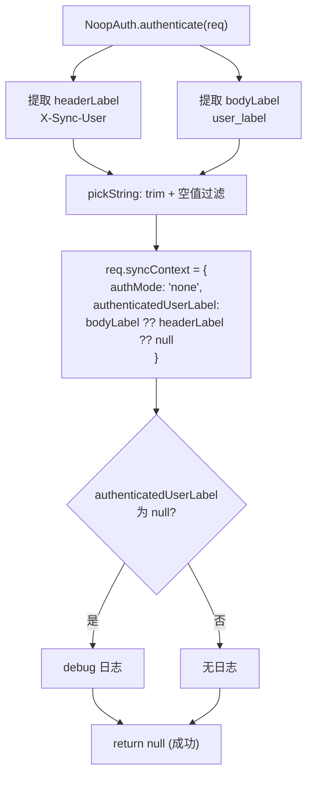

# NoopAuth.ts 需求说明

> 源文件：src/services/sync/auth/NoopAuth.ts ｜ 类型：源码 ｜ 行数：45 ｜ 所属模块：sync/auth ｜ 分析日期：2026-07-23

## 1. 文件定位总述

本文件实现了 Sync 认证策略中的"无认证"模式（NoopAuth），是默认的安全姿态。它不执行任何凭证验证，仅从请求体或请求头中提取用户声明的身份标签（`user_label`），并将其写入 `req.syncContext` 以供下游中间件统一读取。该策略设计为仅在可信网络边界内使用（如 frpc 隧道、loopback nginx），实际安全边界由 tokenAuth/serverApiGate 中间件承担。

## 2. 功能需求

| 编号 | 需求描述（系统应当…） | 触发条件 / 输入 | 处理规则与输出 | 证据 |
|------|----------------------|----------------|---------------|------|
| FR-NA-01 | 系统应当支持无认证模式下的身份标签提取 | 调用 `authenticate(req)` | 优先从请求体 `user_label` 提取，其次从请求头 `X-Sync-User` 提取；两者均不存在则为 null | `src/services/sync/auth/NoopAuth.ts:21-37` |
| FR-NA-02 | 系统应当将提取的身份标签写入请求的 `syncContext` | `authenticate` 成功 | 设置 `req.syncContext = { authMode: 'none', authenticatedUserLabel: label | null }` | `src/services/sync/auth/NoopAuth.ts:27-30` |
| FR-NA-03 | 系统应当在无身份标签时记录 debug 日志但不拒绝请求 | `authenticatedUserLabel` 为 null | 记录 debug 日志，返回 null（表示认证成功） | `src/services/sync/auth/NoopAuth.ts:32-34` |

## 3. 业务规则与约束

| 编号 | 规则描述 | 证据 |
|------|---------|------|
| BR-NA-01 | `authenticate` 始终返回 null（成功），不拒绝任何请求 | `src/services/sync/auth/NoopAuth.ts:37` |
| BR-NA-02 | 身份标签来源优先级：请求体 `user_label` > 请求头 `X-Sync-User` | `src/services/sync/auth/NoopAuth.ts:29` |
| BR-NA-03 | 身份标签经 `trim()` 处理，空字符串视为无标签（null） | `src/services/sync/auth/NoopAuth.ts:42-43` |
| BR-NA-04 | NoopAuth 提供零认证保证，必须仅用于可信网络边界 | `src/services/sync/auth/NoopAuth.ts:6-16`（注释明确安全约束） |

## 4. 对外暴露

| 导出项 | 类型 | 用途 |
|--------|------|------|
| `NoopAuth` | 类（implements `SyncAuthStrategy`） | 无认证策略实现 |

## 5. 依赖关系

- **上游依赖**：`express`（`Request`）、`../../../utils/logger.js`、`./types.js`（`SyncAuthStrategy`）
- **下游消费者**：`./index.js` 的 `buildAuthChain` 工厂函数在 `mode=none` 时实例化

## 6. 数据结构

不适用（实现类，使用上游接口）。

## 7. 复杂逻辑图示

图示说明：NoopAuth 不做任何验证，仅提取身份标签并写入请求上下文。

## 8. 逆向备注

- 注释中明确标注 "NoopAuth provides ZERO attestation"，强调该策略的安全局限性。
- `pickString` 为模块私有函数，确保空字符串和纯空白字符串不被视为有效标签。
