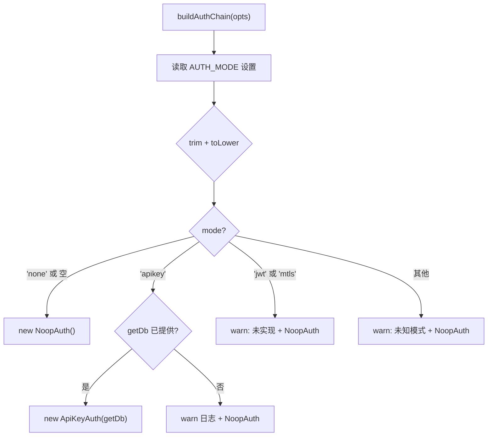

# sync/auth/index.ts 需求说明

> 源文件：src/services/sync/auth/index.ts ｜ 类型：源码 ｜ 行数：48 ｜ 所属模块：sync/auth ｜ 分析日期：2026-07-23

## 1. 文件定位总述

本文件是 Sync 认证模块的入口和工厂，负责根据设置文件中的认证模式配置创建对应的认证策略实例。它提供 `buildAuthChain` 工厂函数，支持 `none`（NoopAuth）和 `apikey`（ApiKeyAuth）两种已实现模式，对 `jwt` 和 `mtls` 两种未实现模式降级为 NoopAuth 并记录警告日志。该文件同时作为模块的公共导出汇总点。

## 2. 功能需求

| 编号 | 需求描述（系统应当…） | 触发条件 / 输入 | 处理规则与输出 | 证据 |
|------|----------------------|----------------|---------------|------|
| FR-SAI-01 | 系统应当根据设置中的认证模式创建对应的认证策略实例 | 调用 `buildAuthChain({ settings, getDb? })` | 读取 `CLAUDE_MEM_SERVER_AUTH_MODE` 设置，根据模式返回对应策略实例 | `src/services/sync/auth/index.ts:26-47` |
| FR-SAI-02 | 系统应当在模式为 `none` 时返回 NoopAuth 实例 | 设置值为 `none`、空字符串或未设置 | 返回 `new NoopAuth()` | `src/services/sync/auth/index.ts:30-31` |
| FR-SAI-03 | 系统应当在模式为 `apikey` 时返回 ApiKeyAuth 实例 | 设置值为 `apikey` 且提供了 `getDb` | 返回 `new ApiKeyAuth(getDb)` | `src/services/sync/auth/index.ts:33-37` |
| FR-SAI-04 | 系统应当在 apikey 模式但缺少 DB 访问时降级为 NoopAuth | `getDb` 为 undefined | 记录 warn 日志，返回 `new NoopAuth()` | `src/services/sync/auth/index.ts:34-36` |
| FR-SAI-05 | 系统应当在 jwt/mtls/未知模式时降级为 NoopAuth | 设置值为 `jwt`、`mtls` 或其他值 | 记录 warn 日志，返回 `new NoopAuth()` | `src/services/sync/auth/index.ts:39-45` |

## 3. 业务规则与约束

| 编号 | 规则描述 | 证据 |
|------|---------|------|
| BR-SAI-01 | 默认认证模式为 `none`（空字符串和未设置也视为 none） | `src/services/sync/auth/index.ts:27` |
| BR-SAI-02 | 模式值经 `trim().toLowerCase()` 标准化后匹配 | `src/services/sync/auth/index.ts:27` |
| BR-SAI-03 | 所有降级场景均记录 warn 级别日志，不抛异常 | `src/services/sync/auth/index.ts:35,41,44` |

## 4. 对外暴露

| 导出项 | 类型 | 用途 |
|--------|------|------|
| `buildAuthChain` | 函数 | 根据设置创建认证策略实例 |
| `BuildAuthChainSettings` | 接口 | 工厂函数的设置输入 |
| `BuildAuthChainOptions` | 接口 | 工厂函数的完整选项（含惰性 DB 访问） |
| `SyncAuthMode` | 类型（re-export） | 认证模式枚举 |
| `SyncAuthStrategy` | 接口（re-export） | 认证策略契约 |
| `SyncContext` | 接口（re-export） | 请求级身份上下文 |
| `NoopAuth` | 类（re-export） | 无认证策略实现 |
| `ApiKeyAuth` | 类（re-export） | API 密钥认证策略实现 |

## 5. 依赖关系

- **上游依赖**：
  - `bun:sqlite`（`Database` 类型）
  - `./ApiKeyAuth.js` — API 密钥认证实现
  - `./NoopAuth.js` — 无认证实现
  - `./types.js` — 类型定义
  - `../../../utils/logger.js`
- **下游消费者**：推断被 Sync 服务器的中间件配置引用

## 6. 数据结构

```typescript
interface BuildAuthChainSettings {
  CLAUDE_MEM_SERVER_AUTH_MODE?: string;
}

interface BuildAuthChainOptions {
  settings: BuildAuthChainSettings;
  getDb?: () => Database;
}
```

## 7. 复杂逻辑图示



图示说明：工厂函数根据模式分发到对应策略，未实现模式统一降级为 NoopAuth。

## 8. 逆向备注

- `ApiKeyAuth` 模块已导出但在本批次文件中未分析，推断为同模块下的另一个认证策略实现。
- 降级策略（未实现模式回退到 NoopAuth）意味着系统不会因认证配置错误而拒绝启动，而是以最宽松的姿态运行并发出警告。
