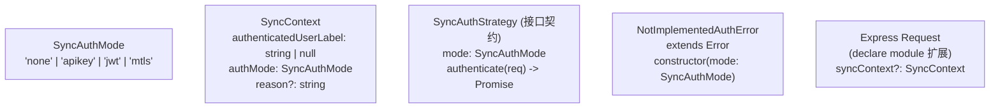

# sync/auth/types.ts 需求说明

> 源文件：src/services/sync/auth/types.ts ｜ 类型：源码 ｜ 行数：47 ｜ 所属模块：sync/auth ｜ 分析日期：2026-07-23

## 1. 文件定位总述

本文件定义了 Sync（同步）模块的认证体系类型契约，包含认证模式枚举、请求级身份上下文、可插拔认证策略接口和未实现认证模式的错误类。它是 Sync 模块安全边界的基础类型定义，通过 `SyncAuthStrategy` 接口声明了认证策略的统一契约，通过 `SyncContext` 接口规范了 Express 请求上的身份信息扩展。

## 2. 功能需求

本文件为纯类型定义文件，无运行时逻辑。核心能力是为 Sync 认证链提供类型安全的安全契约。

## 3. 业务规则与约束

| 编号 | 规则描述 | 证据 |
|------|---------|------|
| BR-SAT-01 | 认证模式支持四种：`none`（无认证）、`apikey`（API 密钥）、`jwt`（JSON Web Token）、`mtls`（双向 TLS） | `src/services/sync/auth/types.ts:3` |
| BR-SAT-02 | `SyncContext.authenticatedUserLabel` 可为 null，表示请求未声明身份 | `src/services/sync/auth/types.ts:16` |
| BR-SAT-03 | `SyncAuthStrategy.authenticate` 约定返回 null 表示成功、返回字符串表示拒绝原因（不抛异常） | `src/services/sync/auth/types.ts:38`（注释明确约束） |
| BR-SAT-04 | 策略实现必须在成功时设置 `req.syncContext`，失败时不设置 | `src/services/sync/auth/types.ts:34`（注释明确约束） |
| BR-SAT-05 | `SyncContext` 通过 Express Request 扩展（`declare module`）挂载到 `req.syncContext` | `src/services/sync/auth/types.ts:21-25` |
| BR-SAT-06 | `NotImplementedAuthError` 用于在设置中声明了但代码中未实现的认证模式时抛出 | `src/services/sync/auth/types.ts:41-46` |

## 4. 对外暴露

| 导出项 | 类型 | 用途 |
|--------|------|------|
| `SyncAuthMode` | 类型别名 | 认证模式枚举（none/apikey/jwt/mtls） |
| `SyncContext` | 接口 | 请求级身份上下文（认证模式 + 已认证用户标签） |
| `SyncAuthStrategy` | 接口 | 可插拔认证策略契约（mode + authenticate 方法） |
| `NotImplementedAuthError` | 类（extends Error） | 未实现认证模式的错误 |

## 5. 依赖关系

- **上游依赖**：`express`（`Request` 类型）
- **下游消费者**：sync/auth 模块的 `NoopAuth`、`ApiKeyAuth`、`buildAuthChain` 等实现/工厂函数

## 6. 数据结构

图示说明：`SyncAuthStrategy` 定义策略契约，`SyncContext` 通过 Express 声明合并挂载到请求对象。

## 7. 复杂逻辑图示

不适用（纯类型定义文件）。

## 8. 逆向备注

- `authenticate` 的返回值约定（null=成功，string=拒绝原因）与常见框架（如 Passport.js 的 done(err, user) 模式）不同，采用"无值=成功"的反直觉约定。
- `SyncContext.reason` 为可选字段，推断用于在拒绝时记录日志或返回给客户端的原因说明。
