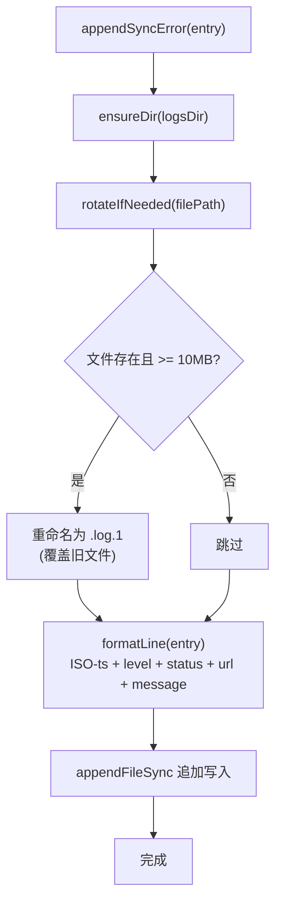

# error-log.ts 需求说明

> 源文件：src/services/sync/error-log.ts | 类型：源码 | 行数：78 | 所属模块：sync | 分析日期：2026-07-23

## 1. 文件定位总述

error-log.ts 是 SyncAgent 专用的错误日志模块，将同步失败的记录追加写入独立的日志文件 `~/.claude-mem/logs/sync-errors.log`。它与主 Worker 日志分离，以便运维人员快速定位同步问题（令牌过期、服务宕机、配置错误等）。日志采用 Tab 分隔的单行格式，支持 10MB 自动轮转（仅保留一代历史）。

## 2. 功能需求

| 编号 | 需求描述（系统应当…） | 触发条件 / 输入 | 处理规则与输出 | 证据 |
|------|----------------------|----------------|---------------|------|
| FR-SyncErrorLog-01 | 系统应当将同步错误追加写入独立日志文件 | 调用 `appendSyncError(entry, logsDir?)` | 格式化日志行（ISO 时间戳 + 级别 + HTTP 状态/NET + URL + 消息，Tab 分隔），追加写入 `sync-errors.log`；目录不存在则自动创建 | `src/services/sync/error-log.ts:33-44` |
| FR-SyncErrorLog-02 | 系统应当在日志文件超过 10MB 时自动轮转 | 写入前检查文件大小 | 当文件超过 `ROTATE_BYTES`（10MB）时，将当前文件重命名为 `.log.1`（覆盖旧 .1 文件），然后继续追加到新创建的文件 | `src/services/sync/error-log.ts:46-61` |
| FR-SyncErrorLog-03 | 系统应当在日志写入失败时静默丢弃 | `appendFileSync` 或 `renameSync` 抛出异常 | catch 块为空，不执行任何操作；注释说明 SyncAgent 主循环也会发出 warn 日志 | `src/services/sync/error-log.ts:39,57-59` |

## 3. 业务规则与约束

- **文件路径**：默认写入 `$LOGS_DIR/sync-errors.log`（`LOGS_DIR` 来自 shared/paths.js）。`src/services/sync/error-log.ts:34`
- **日志格式**：`<ISO-ts>\t<level>\t<status>\t<url>\t<message>`，单行 Tab 分隔。`src/services/sync/error-log.ts:68-73`
- **状态字段**：HTTP 状态码为 null 时使用 `'NET'`（表示网络/超时错误）。`src/services/sync/error-log.ts:70`
- **消息截断**：错误消息中的换行符替换为空格，截断至 1024 字符。`src/services/sync/error-log.ts:71`
- **轮转策略**：仅保留一代历史（`.log.1`），覆盖写入。推断：（Worker 主日志已保留完整历史，此处仅需防止文件无限增长）。`src/services/sync/error-log.ts:17-18`
- **故障静默**：日志写入/轮转失败不抛出异常，避免"日志记录的日志记录失败"的递归问题。`src/services/sync/error-log.ts:39-43`

## 4. 对外暴露

| 名称 | 类型 | 说明 |
|------|------|------|
| `appendSyncError(entry, logsDir?)` | 函数 | 追加同步错误日志 |
| `SyncErrorEntry` | 接口 | 同步错误条目类型 |
| `SyncErrorLevel` | 类型别名 | 日志级别（'WARN' | 'ERROR'） |
| `_rotateBytesForTests()` | 函数 | 测试用，暴露 ROTATE_BYTES 常量 |

## 5. 依赖关系

- **fs**（Node.js 内置模块）：文件读写操作
- **LOGS_DIR**（`../../shared/paths.js`）：日志目录路径常量

## 6. 数据结构

**SyncErrorEntry**（输入结构）：
```typescript
{
  level: 'WARN' | 'ERROR';
  status: number | null;    // HTTP 状态码，网络错误为 null
  url: string;
  message: string;
}
```

## 7. 复杂逻辑图示



每次写入前先确保目录存在、检查轮转条件，然后格式化并追加写入。轮转采用"覆盖上一代"策略。

## 8. 逆向备注

- `_rotateBytesForTests` 是唯一直接暴露内部常量的测试辅助函数。推断：（ ROTATE_BYTES 被定义为 const 局部变量，测试需要通过此函数验证轮转阈值）。
