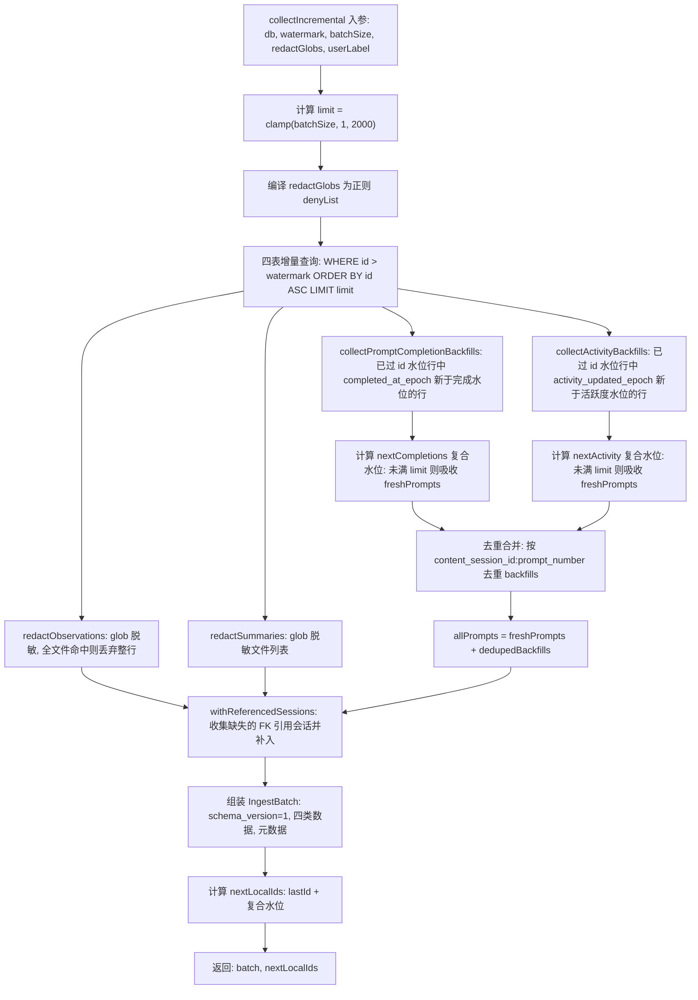

# payload.ts 需求说明

> 源文件：`src/services/sync/payload.ts` ｜ 类型：源码 ｜ 行数：521 ｜ 所属模块：sync（数据同步载荷采集） ｜ 分析日期：2026-07-23

## 1. 文件定位总述

payload.ts 是 SyncAgent 增量同步流程中的**载荷采集器**，负责从本地 SQLite 数据库中按水位线（watermark）拉取新增数据行，组装成 `IngestBatch` 供服务端按依赖顺序消费。该文件在同步链路中处于"数据采集"环节，上游接收 `SyncState` 水位与配置参数，下游产出结构化批次数据交由网络层发送至远端。核心设计围绕三个自愈机制展开：FK 引用闭包补带、prompt 完成时间回填、活跃度回填，以确保服务端 ingest 不会因时序差异导致外键约束失败或数据缺失。同时内置 glob 脱敏能力，在载荷传输前对敏感文件路径进行过滤。

## 2. 功能需求

| 编号 | 需求描述（系统应当…） | 触发条件 / 输入 | 处理规则与输出 | 证据 |
|------|----------------------|----------------|---------------|------|
| FR-PAYLOAD-01 | 系统应当从四张业务表中按水位线增量采集新增行，按依赖顺序（sessions → observations → summaries → prompts）打包为 IngestBatch | 调用 `collectIncremental()`，传入 db、watermark、batchSize、redactGlobs、userLabel | 对每张表执行 `WHERE id > watermark ORDER BY id ASC LIMIT batchSize`，将行填入 IngestBatch 对应数组 | `payload.ts:120-166` |
| FR-PAYLOAD-02 | 系统应当限制每张表每批最大拉取行数，硬性上限为默认批量的 10 倍 | batchSize 参数传入 | `limit = Math.max(1, Math.min(batchSize \| 0, DEFAULT_BATCH_SIZE * 10))`，DEFAULT_BATCH_SIZE=200，上限 2000 | `payload.ts:118,128` |
| FR-PAYLOAD-03 | 系统应当对 observations 和 summaries 中引用的文件路径执行 glob 脱敏过滤 | redactGlobs 非空 | 编译 glob 为正则，逐一匹配文件路径；过滤 observations 时若该行所有文件均被脱敏则整行丢弃；summaries 行仅清理文件列表，不丢弃整行 | `payload.ts:19-23,129,195-196,453-483` |
| FR-PAYLOAD-04 | 系统应当对 JSON 数组格式和逗号分隔格式的文件列表均能执行脱敏 | 文件列表字段值为 JSON 数组字符串或逗号分隔字符串 | `filterCsv()` 先尝试 JSON.parse，若为数组则按元素过滤；否则按逗号分隔过滤；过滤后保持原编码格式输出 | `payload.ts:485-507` |
| FR-PAYLOAD-05 | 系统应当对已完成回填的 prompt 行进行重推（完成时间回填） | prompt 行在 id 水位以下但 completed_at_epoch 晚于完成复合水位 | 查询 `id <= idWatermark AND completed_at_epoch NOT NULL AND (epoch > wm OR (epoch = wm AND id > wmId))`，按 (epoch, id) 升序限量收集 | `payload.ts:173-180,258-297` |
| FR-PAYLOAD-06 | 系统应当对已回填活跃度（active_ms）的 prompt 行进行重推（活跃度回填） | prompt 行在 id 水位以下且 activity_updated_epoch 晚于活跃度复合水位 | 与完成回填同构逻辑，使用复合游标 (activity_updated_epoch, id) 避免同毫秒行永久跳过 | `payload.ts:186-193,309-348` |
| FR-PAYLOAD-07 | 系统应当对完成回填和活跃度回填命中同一行的场景进行去重 | 同一 prompt 同时需要完成回填和活跃度回填 | 按 `content_session_id:prompt_number` 构建 Set 去重，合并后追加到 freshPrompts 后方 | `payload.ts:210-218` |
| FR-PAYLOAD-08 | 系统应当将本批数据引用到但不在水位窗口内的会话行强制补入批次（FK 闭包） | observations/summaries/prompts 引用的 memory_session_id 或 content_session_id 在 sessions 列表中不存在 | 收集缺失的 memory_session_id 和 content_session_id，从 sdk_sessions 查询补入，按 content_session_id 去重；闭包补带行不推进水位 | `payload.ts:219,360-411` |
| FR-PAYLOAD-09 | 系统应当在未命中 limit 时将本批新行自带的完成时间/活跃度时间吸收到水位，避免下个 tick 无谓重推 | backfills 数量小于 limit | 遍历 freshPrompts 中非 null 的 completed_at_epoch/activity_updated_epoch，更新水位到最大值 | `payload.ts:285-294,336-345` |
| FR-PAYLOAD-10 | 系统应当输出批次数据和更新后的水位供调用方持久化 | collectIncremental 执行完毕 | 返回 `{ batch: IngestBatch, nextLocalIds: SyncState['watermark'] }`，水位基于窗口内行的最大 id 计算 | `payload.ts:221-243` |
| FR-PAYLOAD-11 | 系统应当将 think_time_cap_minutes 纳入批次元数据 | 读取环境变量 CLAUDE_MEM_THINK_TIME_CAP_MINUTES | 从环境变量解析整数值（默认 0），写入 IngestBatch.think_time_cap_minutes | `payload.ts:225` |

## 3. 业务规则与约束

| 编号 | 规则描述 | 证据 |
|------|---------|------|
| BR-PAYLOAD-01 | 批次 schema_version 固定为 1，user_label 从参数传入，generated_at_epoch 由注入的 now() 函数生成 | `payload.ts:29-34,221-225` |
| BR-PAYLOAD-02 | JSON 列（如 files_read、facts、concepts）在载荷中作为不透明字符串传输，不进行 parse-then-re-encode，以避免字节漂移破坏服务端的 content_hash 去重 | `payload.ts:25-26` |
| BR-PAYLOAD-03 | 脱敏 glob 支持 `*`（匹配非 `/` 字符）和 `**`（匹配任意字符含 `/`），匹配区分大小写（Linux 文件路径） | `payload.ts:419-451` |
| BR-PAYLOAD-04 | observation 行整行丢弃的条件：原始引用的文件数 > 0 且过滤后全部命中脱敏列表；若行本身无文件引用则不被丢弃 | `payload.ts:468-470` |
| BR-PAYLOAD-05 | 完成回填和活跃度回填只收 id ≤ idWatermark 的旧行（新行已在本批 prompts 内），二者按 id 不重叠 | 注释 `payload.ts:169-180,181-193` |
| BR-PAYLOAD-06 | 闭包补带的会话行 id 均 ≤ 水位，不推进 nextLocalIds.sessions 水位 | 注释 `payload.ts:198-206` |
| BR-PAYLOAD-07 | 复合游标 (epoch, id) 采用 `epoch > ? OR (epoch = ? AND id > ?)` 语义，消除单时间戳水位在并列行场景下永久跳过的缺陷（X-001） | `payload.ts:270,321` |

## 4. 对外暴露

| 导出项 | 类型 | 说明 | 证据 |
|--------|------|------|------|
| `IngestBatch` | interface | 同步批次结构体，含 schema_version、user_label、四类数据行数组 | `payload.ts:29-39` |
| `SessionRow` | interface | 会话行数据结构 | `payload.ts:41-56` |
| `ObservationRow` | interface | 观测行数据结构 | `payload.ts:58-76` |
| `SummaryRow` | interface | 摘要行数据结构 | `payload.ts:78-94` |
| `PromptRow` | interface | 提示词行数据结构，含 active_ms、idle_ms、activity_updated_epoch 等活跃度字段 | `payload.ts:96-111` |
| `CollectResult` | interface | 采集结果，含 batch 和 nextLocalIds | `payload.ts:113-116` |
| `collectIncremental()` | function | 核心导出函数，执行增量采集并返回批次和水位 | `payload.ts:120-244` |

## 5. 依赖关系

| 方向 | 依赖项 | 说明 |
|------|--------|------|
| 入参依赖 | `Database` (bun:sqlite) | SQLite 数据库连接 |
| 入参依赖 | `SyncState['watermark']` (./sync-state.js) | 四表 id 水位 + 完成回填/活跃度回填复合水位 |
| 环境变量 | `CLAUDE_MEM_THINK_TIME_CAP_MINUTES` | 思考时间上限（分钟） |
| 被依赖方 | SyncAgent / 同步发送层 | 消费 IngestBatch 进行网络传输 |

## 6. 数据结构

**IngestBatch**

| 字段 | 类型 | 说明 |
|------|------|------|
| schema_version | 1 | 批次格式版本，固定为 1 |
| user_label | string | 用户标签 |
| generated_at_epoch | number | 批次生成时间戳（ms） |
| think_time_cap_minutes | number | 客户端思考时间上限（分钟） |
| sessions | SessionRow[] | 会话行（含 FK 闭包补带的会话） |
| observations | ObservationRow[] | 观测行（已脱敏） |
| summaries | SummaryRow[] | 摘要行（已脱敏文件列表） |
| prompts | PromptRow[] | 提示词行（含完成回填和活跃度回填的行） |

**PromptRow 扩展字段**（相比基础 CRUD 行）

| 字段 | 类型 | 说明 |
|------|------|------|
| active_ms | number \| null | 活跃时长（liveness 计算），NULL 表示未回填 |
| idle_ms | number \| null | 挂起时长（liveness 计算），NULL 表示未回填 |
| activity_updated_epoch | number \| null | active/idle 回填时间戳（epoch ms），NULL 表示未回填 |

**watermark 复合游标结构**

| 字段 | 类型 | 说明 |
|------|------|------|
| sessions | number | sessions 表 id 水位 |
| observations | number | observations 表 id 水位 |
| summaries | number | summaries 表 id 水位 |
| prompts | number | prompts 表 id 水位 |
| prompt_completions | number | 完成回填时间水位（epoch ms） |
| prompt_completions_id | number | 完成回填 id 水位（同 epoch 下的 id 断点） |
| prompt_activity | number | 活跃度回填时间水位（epoch ms） |
| prompt_activity_id | number | 活跃度回填 id 水位（同 epoch 下的 id 断点） |

## 7. 复杂逻辑图示

以下流程图展示了 `collectIncremental` 的核心处理逻辑，包含三大自愈机制（完成回填、活跃度回填、FK 闭包）和脱敏流程。

**说明：** 整个流程分为四个阶段——增量拉取、回填收集与去重、脱敏与 FK 闭包、批次组装与水位更新。三大自愈机制（完成回填、活跃度回填、FK 闭包）确保因时序差异导致的数据不完整在客户端侧即被修复，避免服务端 ingest 事务回滚。

## 8. 逆向备注

| 编号 | 备注 | 证据 |
|------|------|------|
| RN-01 | now() 参数允许注入，便于测试时控制时间，默认使用 Date.now() | `payload.ts:126` |
| RN-02 | `lastId()` 使用 fallback 语义：空数组时返回当前水位值（即水位不推进），确保无新数据时水位保持不变 | `payload.ts:413-416` |
| RN-03 | 注释中多处提到 X-001 缺陷修复，表明早期版本使用单时间戳水位导致同毫秒并列行永久跳过的问题，现通过复合游标 (epoch, id) 解决 | `payload.ts:184-185,252-253,303-304` |
| RN-04 | 脱敏仅影响 observations 的 files_read/files_modified 和 summaries 的 files_read/files_edited，不处理 text、narrative 等文本字段 | `payload.ts:453-483` |
| RN-05 | filterCsv 同时兼容 JSON 数组和逗号分隔格式，注释指出这是"历史漂移"导致的两种存储格式共存 | `payload.ts:490-492` |
