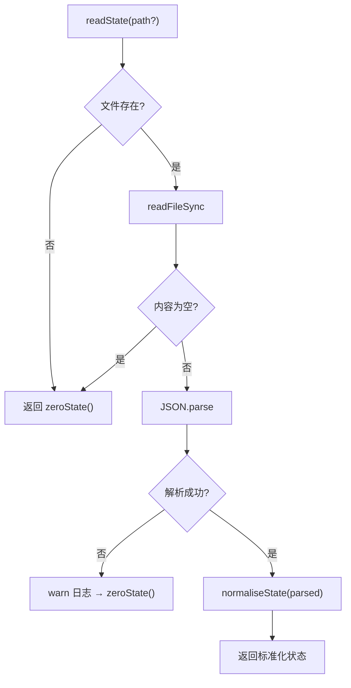
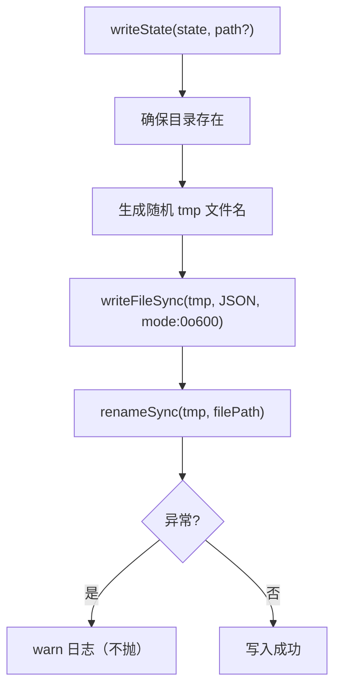

# sync-state.ts 需求说明

> 源文件：src/services/sync/sync-state.ts ｜ 类型：源码 ｜ 行数：156 ｜ 所属模块：sync ｜ 分析日期：2026-07-23

## 1. 文件定位总述

sync-state.ts 是数据同步（SyncAgent）的持久化状态管理模块，负责维护上游同步的进度水位（watermark）和失败计数。状态存储在独立的 JSON 文件（`~/.claude-mem/sync-state.json`）中，与主数据库解耦，确保同步错误不会损坏主库。该文件采用原子写入（临时文件+rename）策略，读取时对损坏/缺失文件提供容错（返回零状态），使 SyncAgent 能在任何异常后从安全起点恢复。

## 2. 功能需求

| 编号 | 需求描述（系统应当…） | 触发条件 / 输入 | 处理规则与输出 | 证据 |
|------|----------------------|----------------|---------------|------|
| FR-ss-01 | 系统应当从磁盘读取同步状态 | 调用 `readState(path?)` | 文件不存在或内容为空 → 返回零状态；文件损坏（JSON 解析失败） → warn 日志 + 返回零状态；正常读取 → `normaliseState` 填充缺失字段 | `sync-state.ts:71-94` |
| FR-ss-02 | 系统应当原子写入同步状态 | 调用 `writeState(state, path?)` | 创建随机命名的临时文件 → 写入 JSON → rename 替换目标文件；文件权限 0o600；写入失败仅 warn 日志不抛异常 | `sync-state.ts:101-123` |
| FR-ss-03 | 系统应当提供零状态工厂方法 | 调用 `zeroState()` | 返回所有数值字段为 0、字符串为空、last_error 为 null 的初始状态对象 | `sync-state.ts:63-65` |
| FR-ss-04 | 系统应当标准化部分/损坏的状态数据 | `normaliseState` 内部调用 | 缺失字段用零状态默认值填充；数值字段非有限值时归零；字符串类型校验 | `sync-state.ts:125-155` |

## 3. 业务规则与约束

- **存储隔离**：状态存储在独立 JSON 文件中，不使用主 SQLite 数据库，防止同步错误影响主库。注释说明。`sync-state.ts:14-20`
- **原子写入**：使用 `tmp + rename` 模式，避免写入过程中断导致文件损坏。`sync-state.ts:111-114`
- **文件权限**：写入权限设为 0o600（仅 owner 可读写），保护同步状态中的 upstream_url 等敏感信息。`sync-state.ts:113`
- **容错优先**：readState 和 writeState 均不抛异常，失败时降级到零状态或静默日志。`sync-state.ts:71, 101`
- **水位复合设计**：`prompt_completions` 和 `prompt_completions_id` 组成复合水位，避免同毫秒并列记录被跳过；`prompt_activity` 和 `prompt_activity_id` 同理。`sync-state.ts:38-48`
- **旧版兼容**：旧 state 文件缺少新字段时自动归零，触发全量重推（服务端幂等更新）。`sync-state.ts:35-48`

## 4. 对外暴露

| 名称 | 类型 | 说明 |
|------|------|------|
| `SyncState` | interface | 同步状态结构 |
| `readState(path?)` | function | 读取状态（容错） |
| `writeState(state, path?)` | function | 原子写入状态（容错） |
| `zeroState()` | function | 创建零状态 |

## 5. 依赖关系

- **内部依赖**：`fs`（文件操作）、`path`、`os`（tmpdir）、`crypto`（randomBytes）、`../../shared/paths.js`、`../../utils/logger.js`
- **被依赖**：SyncAgent 主循环

## 6. 数据结构

**SyncState 接口**：`src/services/sync/sync-state.ts:22-53`

| 字段 | 类型 | 说明 |
|------|------|------|
| upstream_url | string | 上游同步服务器 URL |
| last_sync_at | number | 最后同步时间（epoch ms） |
| last_success_at | number | 最后成功同步时间（epoch ms） |
| watermark.sessions | number | 已推送的 sessions 表最大 row id |
| watermark.observations | number | 已推送的 observations 表最大 row id |
| watermark.summaries | number | 已推送的 session_summaries 表最大 row id |
| watermark.prompts | number | 已推送的 user_prompts 表最大 row id |
| watermark.prompt_completions | number | 已推送的 prompts 完成回填最大 epoch ms |
| watermark.prompt_completions_id | number | 配对 id 游标，与 prompt_completions 组成复合水位 |
| watermark.prompt_activity | number | 已推送的 prompts 活跃度回填最大 epoch ms |
| watermark.prompt_activity_id | number | 配对 id 游标，与 prompt_activity 组成复合水位 |
| failures.consecutive | number | 连续失败次数 |
| failures.last_error | string \| null | 最后一次错误信息 |

## 7. 复杂逻辑图示

读取流程容错优先，写入流程原子安全。

## 8. 逆向备注

- 注释中详细解释了复合水位的设计动机（X-001）：同毫秒多记录在 `id` 游标配合下不会被跳过。`sync-state.ts:38-48`
- `writeState` 中先检查 `existsSync(dir)` 再选择 tmp 目录，但如果 mkdirSync 成功后 `existsSync` 的结果已过期，此分支看似冗余。推断是防御性编码。`sync-state.ts:106-110`
- `ZERO_STATE` 使用 `Object.freeze` 深度冻结（仅一层），但 `zeroState()` 通过 `JSON.parse(JSON.stringify(...))` 创建副本，推断是为了避免外部修改影响零状态常量。`sync-state.ts:55-65`
