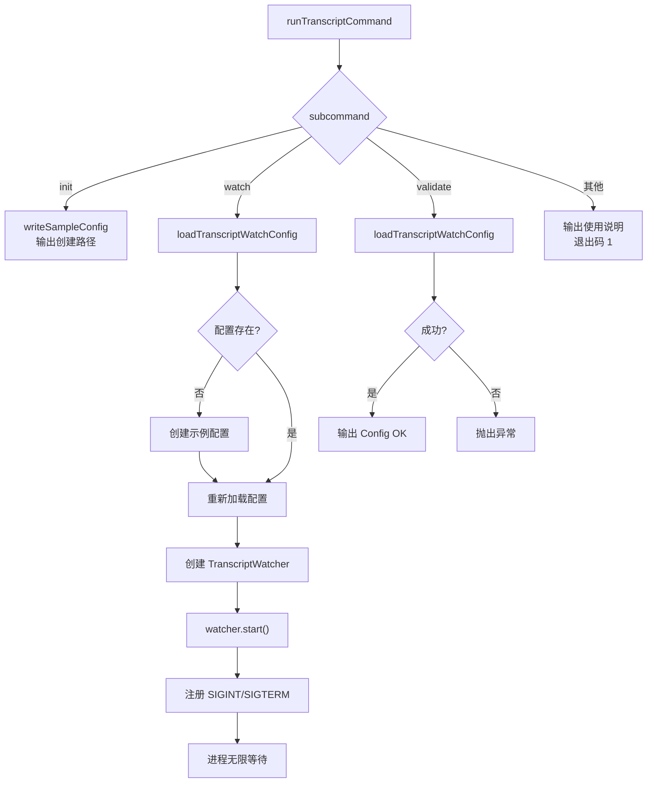

# cli.ts (transcripts) 需求说明

> 源文件：src/services/transcripts/cli.ts | 类型：源码 | 行数：66 | 所属模块：transcripts | 分析日期：2026-07-23

## 1. 文件定位总述

cli.ts 是 transcript（转录文件）子命令的 CLI 入口，提供 `init`、`watch`、`validate` 三个子命令，用于管理转录文件监视器的配置和运行。它是 claude-mem transcript 功能的用户交互层，将 CLI 参数解析后委托给 TranscriptWatcher 执行实际的文件监视工作。

## 2. 功能需求

| 编号 | 需求描述（系统应当…） | 触发条件 / 输入 | 处理规则与输出 | 证据 |
|------|----------------------|----------------|---------------|------|
| FR-TranscriptCli-01 | 系统应当提供初始化配置的子命令 | `claude-mem transcript init [--config <path>]` | 在指定路径（默认 `DEFAULT_CONFIG_PATH`）生成示例配置文件，输出创建路径信息，返回退出码 0 | `src/services/transcripts/cli.ts:13-16` |
| FR-TranscriptCli-02 | 系统应当提供启动转录文件监视的子命令 | `claude-mem transcript watch [--config <path>]` | 加载配置（若配置不存在则自动创建示例配置后重新加载）；创建 TranscriptWatcher 并启动；注册 SIGINT/SIGTERM 信号处理以优雅停止；进程进入无限等待 | `src/services/transcripts/cli.ts:17-44` |
| FR-TranscriptCli-03 | 系统应当提供配置验证的子命令 | `claude-mem transcript validate [--config <path>]` | 尝试加载配置文件（不存在则创建示例后加载）；加载成功输出 "Config OK"，返回退出码 0；加载失败抛出异常 | `src/services/transcripts/cli.ts:45-59` |
| FR-TranscriptCli-04 | 系统应当在子命令未知时输出使用说明 | 传入非 init/watch/validate 的子命令 | 输出用法说明字符串，返回退出码 1 | `src/services/transcripts/cli.ts:61-64` |

## 3. 业务规则与约束

- **配置自动创建**：`watch` 和 `validate` 子命令在配置文件不存在时，自动创建示例配置并重试加载，而非报错退出。`src/services/transcripts/cli.ts:23-28,49-54`
- **SIGINT/SIGTERM 优雅停止**：watch 模式注册信号处理器，停止 watcher 后调用 `process.exit(0)`。`src/services/transcripts/cli.ts:37-41`
- **进程阻塞**：watch 模式通过 `await new Promise(() => undefined)` 使进程永不退出，依赖信号处理终止。`src/services/transcripts/cli.ts:43`
- **配置路径优先**：`--config` 参数可覆盖默认配置路径。`src/services/transcripts/cli.ts:13,19`

## 4. 对外暴露

| 名称 | 类型 | 说明 |
|------|------|------|
| `runTranscriptCommand(subcommand, args)` | async 函数 | CLI 入口函数，返回退出码 |

## 5. 依赖关系

- **config.ts**（`./config.js`）：提供 DEFAULT_CONFIG_PATH、DEFAULT_STATE_PATH、expandHomePath、loadTranscriptWatchConfig、writeSampleConfig
- **TranscriptWatcher**（`./watcher.js`）：转录文件监视器，执行实际的文件监视工作

## 6. 数据结构

不适用（CLI 层，不定义新数据结构）。

## 7. 复杂逻辑图示

CLI 入口根据子命令分发到不同的处理逻辑。watch 模式最复杂，包含配置自动创建、监视器启动和信号处理三个阶段。

## 8. 逆向备注

- `validate` 和 `watch` 中"配置不存在则自动创建"的逻辑完全重复。推断：（这是有意的 UX 设计——首次使用时自动引导用户，而非强制先运行 init）。
