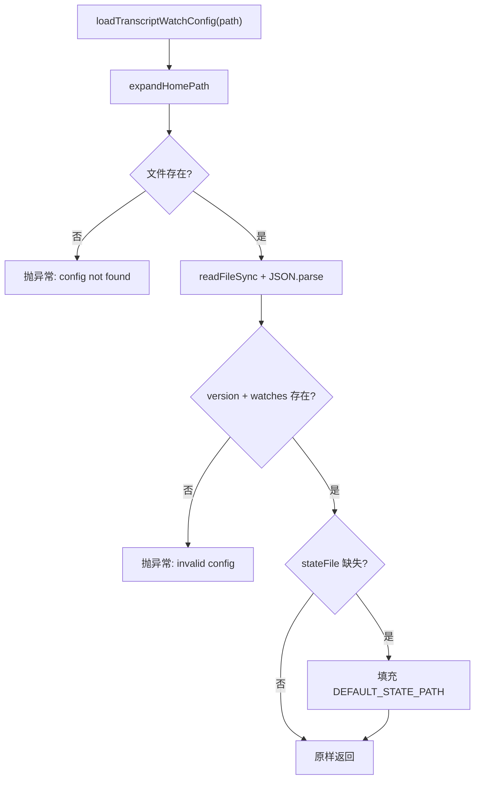

# config.ts 需求说明

> 源文件：src/services/transcripts/config.ts ｜ 类型：源码 ｜ 行数：177 ｜ 所属模块：transcripts ｜ 分析日期：2026-07-23

## 1. 文件定位总述

transcripts/config.ts 是会话转录（transcript）监听配置的加载与管理模块。它定义了默认的配置路径、示例配置模板以及 Codex 会话的 JSONL 事件映射 schema。该模块负责从磁盘加载 `transcript-watch.json` 配置文件，提供配置合法性校验，支持 `~` 路径展开，并具备针对 Codex 原生 hook 重复摄入的过滤能力，确保同一会话不会同时被 hook 和 transcript watcher 两路处理。

## 2. 功能需求

| 编号 | 需求描述（系统应当…） | 触发条件 / 输入 | 处理规则与输出 | 证据 |
|------|----------------------|----------------|---------------|------|
| FR-tc-01 | 系统应当从磁盘加载 transcript watch 配置文件 | 调用 `loadTranscriptWatchConfig(path?)` | 读取 JSON 文件，校验 `version` 和 `watches` 字段存在；`stateFile` 缺失时填充默认值 | `config.ts:153-167` |
| FR-tc-02 | 系统应当将 `~` 前缀路径展开为用户主目录 | 路径以 `~` 开头 | 替换为 `homedir() + 路径.slice(1)` | `config.ts:145-151` |
| FR-tc-03 | 系统应当写入示例配置文件到指定路径 | 调用 `writeSampleConfig(path?)` | 如父目录不存在则递归创建；写入 JSON 格式化的 `SAMPLE_CONFIG` 模板 | `config.ts:169-176` |
| FR-tc-04 | 系统应当识别 Codex 原生 hook 支持的监听项并过滤掉 | 配置中含有 codex 专属 watch 且不允许 codex 摄入 | 检查 watch 的 name/schema 是否为 codex 且路径匹配 `~/.codex/sessions/**/*.jsonl`；过滤掉匹配项并返回被移除数量 | `config.ts:117-143` |
| FR-tc-05 | 系统应当提供 Codex JSONL 事件的默认映射 schema | CODEX_SAMPLE_SCHEMA 常量 | 定义 8 种事件类型（session-meta, turn-context, user-message, assistant-message, tool-use, tool-result, exec-command-end, session-end）及其字段提取规则 | `config.ts:10-108` |

## 3. 业务规则与约束

- **Codex 重复摄入防护**：当 `allowCodexTranscriptIngestion` 为 false 时，自动移除与 codex 原生 hook 重叠的 watch 项。`src/services/transcripts/config.ts:127-143`
- **配置合法性**：`version` 和 `watches` 字段为必填项，缺失则抛异常。`src/services/transcripts/config.ts:160-162`
- **stateFile 默认值**：配置文件中未指定 `stateFile` 时，使用 `paths.transcriptsState()` 的默认路径。`src/services/transcripts/config.ts:163-165`
- **Codex 路径标准化**：路径比较时统一替换反斜杠为正斜杠（Windows 兼容）。`src/services/transcripts/config.ts:122-124`

## 4. 对外暴露

| 名称 | 类型 | 说明 |
|------|------|------|
| `DEFAULT_CONFIG_PATH` | const string | 默认配置文件路径 |
| `DEFAULT_STATE_PATH` | const string | 默认状态文件路径 |
| `CODEX_SAMPLE_SCHEMA` | const TranscriptSchema | Codex JSONL 事件映射 schema |
| `SAMPLE_CONFIG` | const TranscriptWatchConfig | 示例配置模板（空 watches） |
| `isNativeHookBackedCodexWatch(watch)` | function | 判断 watch 是否由 Codex 原生 hook 支持 |
| `filterNativeHookBackedCodexWatches(config, allow)` | function | 过滤掉原生 hook 支持的 codex watch |
| `expandHomePath(inputPath)` | function | 展开 `~` 路径 |
| `loadTranscriptWatchConfig(path?)` | function | 加载配置文件 |
| `writeSampleConfig(path?)` | function | 写入示例配置 |

## 5. 依赖关系

- **内部依赖**：`../../shared/paths.js`（`paths`）、`./types.js`（`TranscriptSchema`, `TranscriptWatchConfig`）
- **被依赖**：transcript watcher 主模块、CLI 命令

## 6. 数据结构

**CODEX_SAMPLE_SCHEMA 核心事件映射**：`src/services/transcripts/config.ts:10-108`

| 事件名 | 匹配条件 | 动作 | 关键字段 |
|--------|---------|------|---------|
| session-meta | type=session_meta | session_context | sessionId, cwd |
| user-message | payload.type=user_message | session_init | prompt |
| assistant-message | payload.type=agent_message | assistant_message | message |
| tool-use | payload.type in [function_call, custom_tool_call, web_search_call] | tool_use | toolId, toolName(coalesce), toolInput(coalesce) |
| tool-result | payload.type in [function_call_output, custom_tool_call_output] | tool_result | toolId, toolResponse |
| exec-command-end | payload.type in [exec_command_end, exec_command_output] | observation | toolName(固定=exec_command), toolInput(coalesce), toolResponse(coalesce) |
| session-end | payload.type in [turn_aborted, turn_completed, task_complete] | session_end | — |

## 7. 复杂逻辑图示

配置加载流程：路径展开后校验文件存在性，解析 JSON 后校验必填字段，补充缺失的 stateFile 默认值。

## 8. 逆向备注

- `CODEX_SAMPLE_SCHEMA` 的 description 中标注 "Codex native hooks are preferred"，暗示 transcript watcher 只是备用方案，优先使用原生 hook。`src/services/transcripts/config.ts:13`
- `tool-use` 事件的 `toolName` 使用 coalesce 策略，依次尝试 `payload.name` 和 `payload.type`，反映不同 codex 版本的事件格式差异。`src/services/transcripts/config.ts:55-60`
