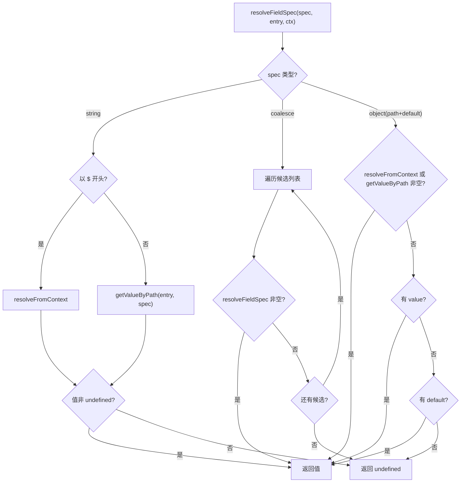

# field-utils.ts 需求说明

> 源文件：src/services/transcripts/field-utils.ts ｜ 类型：源码 ｜ 行数：154 ｜ 所属模块：transcripts ｜ 分析日期：2026-07-23

## 1. 文件定位总述

field-utils.ts 是转录记录（transcript）字段解析与匹配的核心工具模块，负责从嵌套数据结构中按路径提取值、根据字段规格（FieldSpec）解析字段（含 coalesce 回退和默认值逻辑）、以及根据匹配规则（MatchRule）判断记录是否满足过滤条件。它是 transcript 解析管道的基础设施，支持 JSON 路径表达式（含数组下标）、上下文变量引用（`$watch`、`$schema`、`$session`、`$cwd`、`$project`）和多种匹配运算符。

## 2. 功能需求

| 编号 | 需求描述（系统应当…） | 触发条件 / 输入 | 处理规则与输出 | 证据 |
|------|----------------------|----------------|---------------|------|
| FR-PARSEPATH-01 | 系统应当解析 JSON 路径表达式为 token 数组 | 调用 `parsePath(path)` | 支持点号分隔的属性名和 `[N]` 数组下标；自动去除前导 `$.`；返回 `Array<string \| number>` | `field-utils.ts:10-30` |
| FR-GETVALUE-01 | 系统应当按路径从嵌套对象中提取值 | 调用 `getValueByPath(input, path)` | 逐级访问属性，遇 null/undefined 返回 undefined | `field-utils.ts:32-43` |
| FR-RESOLVE-01 | 系统应当根据 FieldSpec 解析字段值 | 调用 `resolveFieldSpec(spec, entry, ctx)` | 支持：(1)字符串路径直接取值；(2)coalesce 候选列表逐一尝试取第一个非空值；(3)path + default 回退；(4)固定 value | `field-utils.ts:67-99` |
| FR-RESOLVEFIELDS-01 | 系统应当批量解析字段集合 | 调用 `resolveFields(fields, entry, ctx)` | 遍历 Record<string, FieldSpec>，对每个 key 调用 resolveFieldSpec，返回解析结果 Record | `field-utils.ts:101-114` |
| FR-MATCHES-01 | 系统应当按 MatchRule 判断记录是否匹配 | 调用 `matchesRule(entry, rule, schema)` | 支持 exists、equals、in、contains、regex 五种匹配模式；无规则时默认匹配 | `field-utils.ts:116-153` |
| FR-CONTEXT-01 | 系统应当支持上下文变量引用 | FieldSpec 中以 `$watch.`、`$schema.`、`$session.` 开头的路径 | 从对应上下文对象中提取值，而非从数据 entry 中提取 | `field-utils.ts:49-65` |

## 3. 业务规则与约束

- **空值判定**：`undefined`、`null`、`''` 均被视为空值 (`field-utils.ts:45-47`)
- **coalesce 语义**：coalesce 候选列表按顺序尝试，第一个非空值即返回 (`field-utils.ts:80-84`)
- **路径优先于默认值**：当 FieldSpec 同时指定 path 和 default 时，先尝试 path，非空才返回，否则用 default (`field-utils.ts:87-91`)
- **value 覆盖 default**：若 FieldSpec 同时指定 value 和 default，value 优先 (`field-utils.ts:94-96`)
- **匹配规则优先级**：exists → equals → in → contains → regex，多个条件之间为 AND 逻辑（逐个检查，任一不满足返回 false） (`field-utils.ts:126-152`)
- **正则容错**：无效正则表达式捕获异常后返回 false，不中断流程 (`field-utils.ts:142-149`)
- **无规则默认匹配**：rule 为 undefined 或 null 时直接返回 true (`field-utils.ts:121-122`)

## 4. 对外暴露

| 导出函数 | 签名 | 说明 |
|---------|------|------|
| `getValueByPath` | `(input, path: string): unknown` | 按路径提取值 |
| `resolveFieldSpec` | `(spec, entry, ctx): unknown` | 按 FieldSpec 解析单字段 |
| `resolveFields` | `(fields, entry, ctx): Record<string, unknown>` | 批量解析字段 |
| `matchesRule` | `(entry, rule, schema): boolean` | 匹配规则判断 |

## 5. 依赖关系

- **类型依赖**：`FieldSpec`、`MatchRule`、`TranscriptSchema`、`WatchTarget`（来自 `./types.ts`）
- **上游调用**：transcript 解析管道、数据提取逻辑
- **无外部模块依赖**

## 6. 数据结构

**ResolveContext** (内部接口，`field-utils.ts:4-8`)：
```typescript
{ watch: WatchTarget; schema: TranscriptSchema; session?: Record<string, unknown> }
```

**FieldSpec 路径解析优先级**：
1. coalesce 候选列表
2. path + default 回退
3. 固定 value

## 7. 复杂逻辑图示



## 8. 逆向备注

- `parsePath` 函数使用正则 `/([^[\]]+)|\[(\d+)\]/g` 同时匹配属性名和数组下标，设计较为紧凑 (`field-utils.ts:18`)。
- `matchesRule` 中各匹配条件通过 if-if-if 链串联（非 if-else），逻辑上同一时间只能命中一个匹配类型，但代码结构允许后续扩展为组合条件 (`field-utils.ts:126-152`)。
- 该模块无任何日志记录，属于纯计算工具类。
