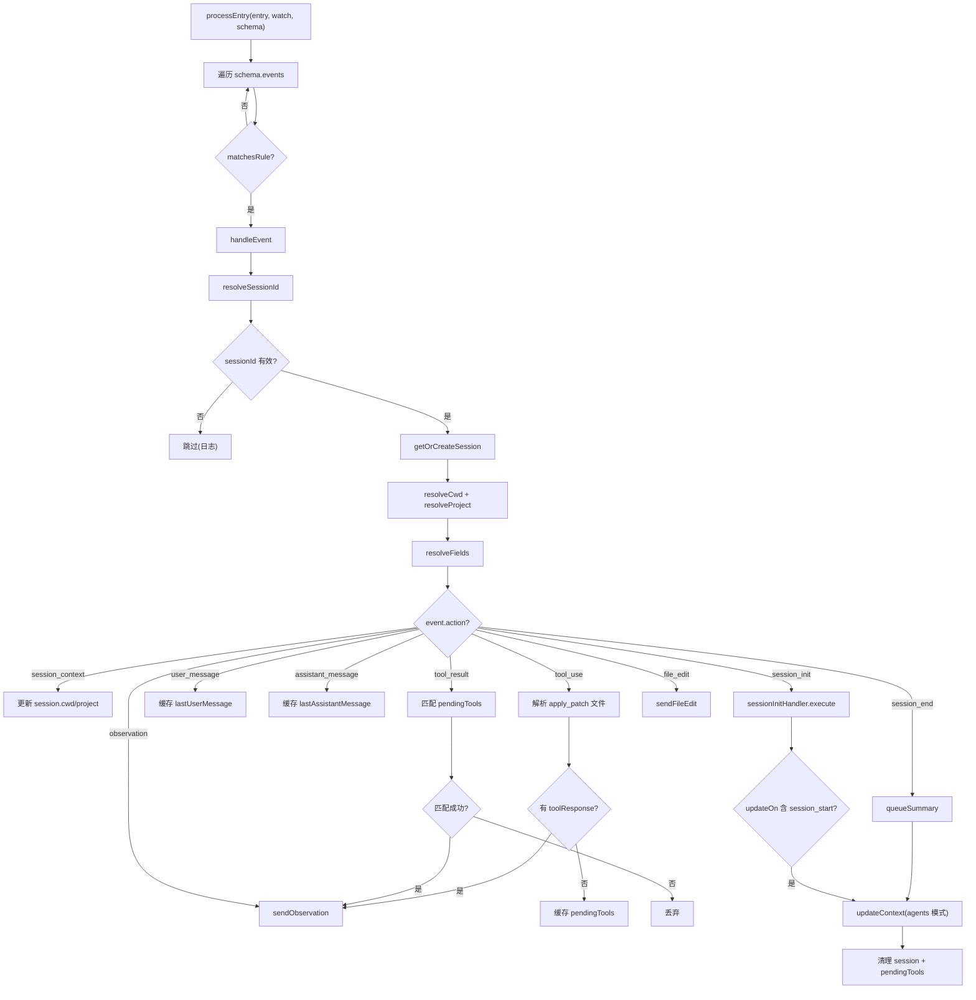
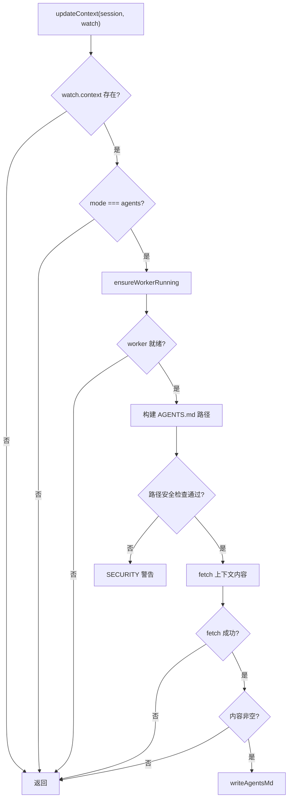

# processor.ts 需求说明

> 源文件：src/services/transcripts/processor.ts ｜ 类型：源码 ｜ 行数：388 ｜ 所属模块：transcripts ｜ 分析日期：2026-07-23

## 1. 文件定位总述

本文件是 Transcript 事件处理器的核心实现，负责解析多源（Windsurf、Gemini CLI 等）的转录文件事件，将其映射为 claude-mem 内部的会话初始化、观察记录、文件编辑、会话结束等操作。`TranscriptEventProcessor` 维护一个内存会话状态映射表，通过 schema 驱动的字段解析和匹配规则将原始事件转换为标准化的 worker API 调用。它在 session_end 时触发摘要生成和 AGENTS.md 上下文注入。

## 2. 功能需求

| 编号 | 需求描述（系统应当…） | 触发条件 / 输入 | 处理规则与输出 | 证据 |
|------|----------------------|----------------|---------------|------|
| FR-TP-01 | 系统应当根据 schema 定义的事件匹配规则逐条处理转录条目。 | 调用 `processEntry(entry, watch, schema, sessionIdOverride)`。 | 遍历 `schema.events`，对每条事件用 `matchesRule` 匹配 entry；匹配成功则调用 `handleEvent`。 | `src/services/transcripts/processor.ts:30-39` |
| FR-TP-02 | 系统应当为每个 watch+sessionId 组合维护独立的内存会话状态。 | 首次遇到某个 watch+sessionId。 | 创建 `SessionState`（含 sessionId、platformSource、cwd、project 等），缓存在 Map 中。key 格式为 `{watch.name}:{sessionId}`。 | `src/services/transcripts/processor.ts:41-56` |
| FR-TP-03 | 系统应当按优先级解析 sessionId：event.fields.sessionId > schema.sessionIdPath > sessionIdOverride。 | handleEvent 解析会话标识。 | 三级回退：事件级字段、schema 级路径、外部覆盖参数。均无法解析则跳过该事件。 | `src/services/transcripts/processor.ts:58-72` |
| FR-TP-04 | 系统应当按优先级解析 cwd：event.fields.cwd > schema.cwdPath > watch.workspace > session.cwd（缓存）。 | handleEvent 解析工作目录。 | 四级回退后更新 session 缓存。 | `src/services/transcripts/processor.ts:74-87` |
| FR-TP-05 | 系统应当按优先级解析 project：event.fields.project > schema.projectPath > watch.project > getProjectContext(session.cwd)。 | handleEvent 解析项目标识。 | 四级回退后更新 session 缓存。 | `src/services/transcripts/processor.ts:89-103` |
| FR-TP-06 | 系统应当处理 `session_init` 动作：调用 sessionInitHandler 初始化会话并可选更新上下文。 | 事件 action 为 `session_init`。 | 提取 prompt、cwd，调用 `sessionInitHandler.execute`；若 `watch.context.updateOn` 包含 `session_start` 则触发 `updateContext`。 | `src/services/transcripts/processor.ts:170-183` |
| FR-TP-07 | 系统应当处理 `tool_use` 动作：解析工具名/输入，对 `apply_patch` 特殊拆分文件路径，发送观察或缓存待匹配。 | 事件 action 为 `tool_use`。 | 若 `toolName === 'apply_patch'` 则解析受影响文件列表并逐文件发送 `sendFileEdit`；若已有 toolResponse 则直接发送观察；否则缓存到 `pendingTools` Map。 | `src/services/transcripts/processor.ts:185-212` |
| FR-TP-08 | 系统应当处理 `tool_result` 动作：与之前缓存的 `tool_use` 配对发送观察。 | 事件 action 为 `tool_result`。 | 通过 toolId 在 `pendingTools` 中查找匹配的 tool_use，补全 toolName 和 toolInput 后发送观察；无匹配则丢弃。 | `src/services/transcripts/processor.ts:214-242` |
| FR-TP-09 | 系统应当处理 `observation` 动作：直接通过 `ingestObservation` 发送观察记录到 worker。 | 事件 action 为 `observation`。 | 构建 `ingestObservation` 参数（contentSessionId、cwd、toolName、toolInput、toolResponse 等），失败时抛出 Error。 | `src/services/transcripts/processor.ts:244-261` |
| FR-TP-10 | 系统应当处理 `file_edit` 动作：调用 fileEditHandler 记录文件编辑。 | 事件 action 为 `file_edit`。 | 提取 filePath 和 edits，调用 `fileEditHandler.execute`。 | `src/services/transcripts/processor.ts:263-274` |
| FR-TP-11 | 系统应当处理 `session_end` 动作：排队摘要、更新上下文、清理会话状态。 | 事件 action 为 `session_end`。 | 调用 `queueSummary`（POST worker）、`updateContext`（agents 模式下写 AGENTS.md）、清除 pendingTools、删除会话缓存。 | `src/services/transcripts/processor.ts:312-318` |
| FR-TP-12 | 系统应当在 AGENTS.md 上下文更新时执行路径安全校验，防止路径穿越。 | updateContext 中 `watch.context.mode === 'agents'`。 | 解析后的 AGENTS.md 路径必须以 cwd 或 DATA_DIR 为前缀，否则拒绝写入并输出 SECURITY 警告。 | `src/services/transcripts/processor.ts:358-368` |
| FR-TP-13 | 系统应当对类 JSON 字符串字段尝试自动解析（`{` 或 `[` 开头），解析失败则保留原字符串。 | maybeParseJson 被调用时。 | 仅对字符串值尝试 JSON.parse，失败时输出 DEBUG 日志并返回原值。 | `src/services/transcripts/processor.ts:276-289` |
| FR-TP-14 | 系统应当从 apply_patch 工具输入中解析受影响文件路径。 | toolName 为 `apply_patch`。 | 支持 `*** Update File:`、`*** Add File:`、`*** Delete File:`、`*** Move to:`、`+++ b/path`（排除 `/dev/null`）格式，去重返回。 | `src/services/transcripts/processor.ts:291-310` |

## 3. 业务规则与约束

- **BR-TP-01** 会话状态以 `watch.name:sessionId` 为键，不同 watch 源的同 sessionId 视为不同会话。`src/services/transcripts/processor.ts:41-43`
- **BR-TP-02** platformSource 由 `normalizePlatformSource(watch.name)` 标准化。`src/services/transcripts/processor.ts:51`
- **BR-TP-03** tool_use 和 tool_result 通过 toolId 配对：tool_use 时若无 toolResponse 则缓存，tool_result 时从缓存匹配补全。`src/services/transcripts/processor.ts:201-241`
- **BR-TP-04** AGENTS.md 更新仅在 `watch.context.mode === 'agents'` 时执行。`src/services/transcripts/processor.ts:346`
- **BR-TP-05** AGENTS.md 写入路径使用原子写入（writeFileSync + renameSync 推断——`writeAgentsMd` 封装）。`src/services/transcripts/processor.ts:385`
- **BR-TP-06** 路径安全校验的允许根目录为 cwd 和 DATA_DIR。`src/services/transcripts/processor.ts:359`
- **BR-TP-07** summary 请求发送到 worker 的 `/api/sessions/summarize`。`src/services/transcripts/processor.ts:332`

## 4. 对外暴露

| 暴露项 | 类型 | 说明 |
|--------|------|------|
| `TranscriptEventProcessor` | class | 唯一公开类 |
| `processEntry(entry, watch, schema, sessionIdOverride?)` | async method | 事件处理入口 |

## 5. 依赖关系

| 依赖方 | 被依赖方 | 关系 |
|--------|---------|------|
| processor.ts | `cli/handlers/session-init.ts` | 会话初始化执行 |
| processor.ts | `cli/handlers/file-edit.ts` | 文件编辑记录 |
| processor.ts | `shared/worker-utils.ts` (`ensureWorkerRunning`, `workerHttpRequest`) | Worker 连接和 HTTP 请求 |
| processor.ts | `worker/http/shared.ts` (`ingestObservation`) | 观察记录写入 |
| processor.ts | `transcripts/field-utils.ts` | 字段解析和规则匹配 |
| processor.ts | `transcripts/config.ts` (`expandHomePath`) | 路径展开 |
| processor.ts | `utils/agents-md-utils.ts` (`writeAgentsMd`) | AGENTS.md 写入 |
| processor.ts | `utils/project-name.ts` (`getProjectContext`) | 项目标识 |
| processor.ts | `shared/query-utils.ts` (`buildContextInjectPath`) | 上下文 API 路径构建 |
| processor.ts | `shared/platform-source.ts` (`normalizePlatformSource`) | 平台源标准化 |

## 6. 数据结构

**SessionState**（`src/services/transcripts/processor.ts:16-24`）

| 字段 | 类型 | 说明 |
|------|------|------|
| sessionId | string | 会话标识 |
| platformSource | string | 平台源（标准化后） |
| cwd | string（可选） | 工作目录（动态更新） |
| project | string（可选） | 项目标识（动态更新） |
| lastUserMessage | string（可选） | 最近用户消息 |
| lastAssistantMessage | string（可选） | 最近助手消息 |
| pendingTools | Map<string, {toolName, toolInput}>（可选） | 待匹配的 tool_use 缓存 |

**event.action 枚举值**（`src/services/transcripts/processor.ts:126-161`）

`session_context`、`session_init`、`user_message`、`assistant_message`、`tool_use`、`tool_result`、`observation`、`file_edit`、`session_end`

## 7. 复杂逻辑图示

上图展示了事件处理器的完整分发逻辑：从 schema 匹配到字段解析，再到 9 种 action 的分别处理。tool_use/tool_result 通过 pendingTools Map 实现跨事件的配对。

上图展示了 AGENTS.md 上下文更新的安全控制链，包含路径穿越防护和 worker 可用性检查。

## 8. 逆向备注

- 推断：`watch.context.updateOn` 支持 `['session_start']` 等值，允许配置在哪些事件后自动更新上下文。但完整的事件名列表未在代码中体现。
- 推断：`watch.context.path` 允许自定义 AGENTS.md 输出路径，因此需要路径安全校验防止恶意配置写入任意位置。
- `user_message` 和 `assistant_message` 动作仅更新内存缓存（lastUserMessage/lastAssistantMessage），不直接发送到 worker——这些值在 session_end 的 queueSummary 中作为 `last_assistant_message` 使用。
- `apply_patch` 文件解析支持多种格式（`*** Update File:` 和 `+++ b/path`），推断是为了兼容不同 AI 工具的 patch 格式。
