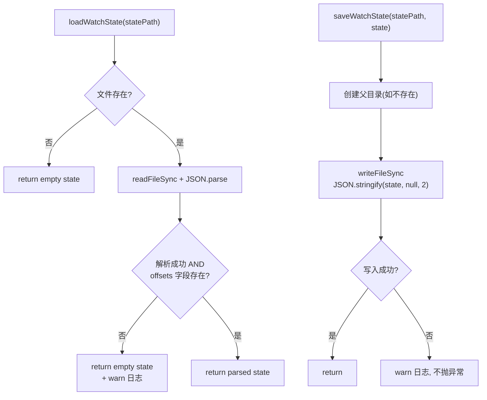

# transcripts/state.ts 需求说明

> 源文件：src/services/transcripts/state.ts ｜ 类型：源码 ｜ 行数：41 ｜ 所属模块：transcripts ｜ 分析日期：2026-07-23

## 1. 文件定位总述

本文件提供 Transcripts 监控的文件偏移量持久化能力，用于跨进程重启后恢复文件监控位置。`TranscriptWatchState` 结构以文件路径为键、字节偏移量为值记录每个监控文件的读取位置。`loadWatchState` 从 JSON 文件加载状态（文件不存在或解析失败时返回空状态），`saveWatchState` 将状态写入 JSON 文件（自动创建父目录）。

## 2. 功能需求

| 编号 | 需求描述（系统应当…） | 触发条件 / 输入 | 处理规则与输出 | 证据 |
|------|----------------------|----------------|---------------|------|
| FR-TS-01 | 系统应当能从文件加载监控偏移量状态 | 调用 `loadWatchState(statePath)` | 文件不存在返回 `{ offsets: {} }`；读取并 JSON.parse；`offsets` 字段缺失则返回空状态；解析失败返回空状态并记录 warn 日志 | `src/services/transcripts/state.ts:9-25` |
| FR-TS-02 | 系统应当能将监控偏移量状态持久化到文件 | 调用 `saveWatchState(statePath, state)` | 自动创建父目录（`recursive: true`），写入格式化 JSON（2 空格缩进）；写入失败记录 warn 日志但不抛异常 | `src/services/transcripts/state.ts:27-40` |

## 3. 业务规则与约束

| 编号 | 规则描述 | 证据 |
|------|---------|------|
| BR-TS-01 | 状态文件格式为 JSON，包含 `offsets` 对象，键为文件路径字符串，值为数字偏移量 | `src/services/transcripts/state.ts:6-7` |
| BR-TS-02 | 所有异常均不向上抛出，而是降级为空状态或静默失败并记录 warn 日志，确保监控流程不中断 | `src/services/transcripts/state.ts:18-24` 和 `:34-39` |
| BR-TS-03 | JSON 输出使用 2 空格缩进，便于人工检查和版本控制 | `src/services/transcripts/state.ts:33` |

## 4. 对外暴露

| 导出项 | 类型 | 用途 |
|--------|------|------|
| `TranscriptWatchState` | 接口 | 监控偏移量状态（文件路径到偏移量的映射） |
| `loadWatchState` | 函数 | 从文件加载监控状态 |
| `saveWatchState` | 函数 | 将监控状态保存到文件 |

## 5. 依赖关系

- **上游依赖**：`fs`（`existsSync`, `readFileSync`, `writeFileSync`, `mkdirSync`）、`path`（`dirname`）、`../../utils/logger.js`
- **下游消费者**：推断被 transcripts 监控器引用，用于持续跟踪已读取的文件位置

## 6. 数据结构

```typescript
interface TranscriptWatchState {
  offsets: Record<string, number>;
}
```

## 7. 复杂逻辑图示



图示说明：加载和保存均有完善的容错处理，确保监控流程不会因状态文件问题而中断。

## 8. 逆向备注

- `loadWatchState` 对无效 JSON 和缺失 `offsets` 字段做了双重防御，推断是为了兼容不同版本的状态文件格式。
