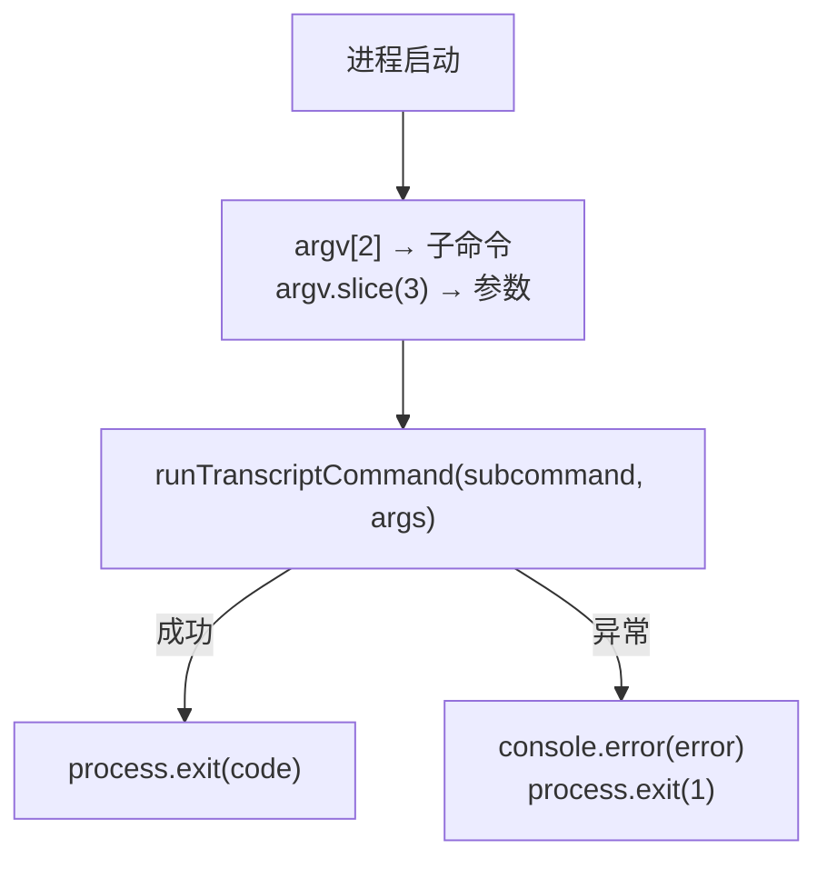

# transcript-watcher-entry.ts 需求说明

> 源文件：src/services/transcripts/transcript-watcher-entry.ts ｜ 类型：源码（入口脚本） ｜ 行数：14 ｜ 所属模块：transcripts ｜ 分析日期：2026-07-23

## 1. 文件定位总述

本文件是 transcript 命令行工具的入口脚本，负责从 `process.argv` 解析子命令和参数后委托给 `runTranscriptCommand` 执行。它是作为独立进程被调用的 CLI 入口点，可能由 hook 或 Worker 在需要处理转录文件时启动。

## 2. 功能需求

| 编号 | 需求描述（系统应当…） | 触发条件 / 输入 | 处理规则与输出 | 证据 |
|------|----------------------|----------------|---------------|------|
| FR-TranscriptEntry-01 | 系统应当从 argv 解析子命令（第 3 个参数）和剩余参数后执行转录命令 | 进程启动 | `argv[2]` 为子命令，`argv.slice(3)` 为参数，传入 runTranscriptCommand | `src/services/transcripts/transcript-watcher-entry.ts:3-6` |
| FR-TranscriptEntry-02 | 系统应当以 runTranscriptCommand 返回的退出码退出进程 | 命令执行完成 | `process.exit(code)` 使用命令返回值 | `src/services/transcripts/transcript-watcher-entry.ts:7-9` |
| FR-TranscriptEntry-03 | 系统应当在命令执行异常时输出错误并以退出码 1 终止 | runTranscriptCommand 抛出异常 | catch 块中 `console.error(error)` 后 `process.exit(1)` | `src/services/transcripts/transcript-watcher-entry.ts:10-13` |

## 3. 业务规则与约束

- **异常退出码**：正常完成使用命令返回的退出码，异常使用固定退出码 1（`src/services/transcripts/transcript-watcher-entry.ts:8,13`）

## 4. 对外暴露

| 类别 | 名称 | 类型 | 说明 |
|------|------|------|------|
| CLI 入口 | transcript-watcher-entry | 脚本 | 接受子命令和参数，执行后退出 |

## 5. 依赖关系

- **上游**：`./cli.js`（runTranscriptCommand 函数）
- **下游**：无（CLI 入口点，不被其他模块导入）

## 6. 数据结构

不适用。

## 7. 复杂逻辑图示

上图展示了入口脚本的执行流程：解析参数后委托给核心命令函数，根据成功或异常采取不同退出策略。

## 8. 逆向备注

推断：本文件作为独立进程入口，可能被 hook 配置中的命令行调用，用于处理 Claude Code 的转录文件（如解析、导入到数据库）。
