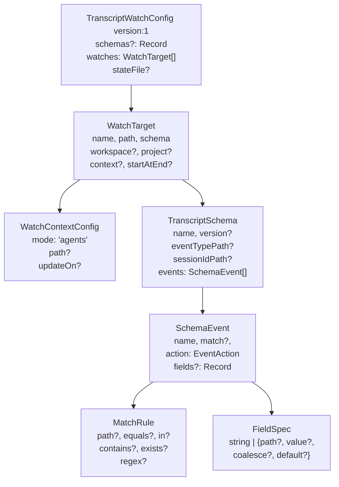

# transcripts/types.ts 需求说明

> 源文件：src/services/transcripts/types.ts ｜ 类型：源码 ｜ 行数：70 ｜ 所属模块：transcripts ｜ 分析日期：2026-07-23

## 1. 文件定位总述

本文件定义了 Transcripts 监控模块的完整类型体系，是整个 transcripts 子系统的数据契约基础。它定义了灵活的字段规范（`FieldSpec`）支持路径提取、值覆盖、合并回退和默认值；匹配规则（`MatchRule`）支持等于、包含、正则、存在性等多种条件；事件动作（`EventAction`）覆盖 Claude Code 完整的交互生命周期；以及顶层配置结构（`TranscriptSchema`、`WatchTarget`、`TranscriptWatchConfig`）用于声明式定义监控目标和解析规则。

## 2. 功能需求

本文件为纯类型定义文件，无运行时逻辑。核心能力是为 transcripts 模块提供声明式监控配置的完整类型契约。

## 3. 业务规则与约束

| 编号 | 规则描述 | 证据 |
|------|---------|------|
| BR-TT-01 | `FieldSpec` 支持四种取值方式：直接字符串、路径+值、合并回退（`coalesce` 数组）、默认值 | `src/services/transcripts/types.ts:1-8` |
| BR-TT-02 | `MatchRule` 提供五种匹配操作：路径等于、包含于列表、子串包含、存在性判断、正则匹配 | `src/services/transcripts/types.ts:10-17` |
| BR-TT-03 | `EventAction` 枚举覆盖 9 种事件类型：会话初始化、上下文、用户/助手消息、工具使用/结果、观测、文件编辑、会话结束 | `src/services/transcripts/types.ts:19-28` |
| BR-TT-04 | `WatchContextConfig.mode` 仅支持 `'agents'` 模式（推断为 Claude Code agents 模式） | `src/services/transcripts/types.ts:49` |
| BR-TT-05 | `TranscriptWatchConfig.version` 固定为 `1`，用于未来格式迁移 | `src/services/transcripts/types.ts:66` |
| BR-TT-06 | `WatchTarget.startAtEnd` 为可选布尔值，推断控制是否从文件末尾开始监控（跳过历史内容） | `src/services/transcripts/types.ts:62` |

## 4. 对外暴露

| 导出项 | 类型 | 用途 |
|--------|------|------|
| `FieldSpec` | 类型别名 | 字段提取规范（路径/值/合并/默认） |
| `MatchRule` | 接口 | 事件匹配规则（等于/包含/正则/存在性） |
| `EventAction` | 类型别名 | 事件动作枚举（9 种） |
| `SchemaEvent` | 接口 | Schema 中的事件定义（名称、匹配规则、动作、字段映射） |
| `TranscriptSchema` | 接口 | 解析 Schema（名称、版本、事件类型路径等） |
| `WatchContextConfig` | 接口 | 监控上下文配置（模式、路径、触发时机） |
| `WatchTarget` | 接口 | 监控目标（名称、路径、Schema、工作区、起始位置） |
| `TranscriptWatchConfig` | 接口 | 顶层监控配置（版本、Schema 注册表、目标列表、状态文件） |

## 5. 依赖关系

- **上游依赖**：无
- **下游消费者**：transcripts 模块的监控器、解析器、配置加载器等

## 6. 数据结构

图示说明：从顶层 `TranscriptWatchConfig` 到具体字段提取规范，形成完整的声明式配置层次。

## 7. 复杂逻辑图示

不适用（纯类型定义文件）。

## 8. 逆向备注

- `FieldSpec` 的联合类型设计（字符串直接值 vs 对象配置）推断是为了简化常见场景：直接字符串用于常量字段，对象用于需要路径提取或回退的复杂字段。
- `WatchContextConfig.mode` 类型硬编码为 `'agents'` 字面量，推断未来可能扩展其他模式（如 `raw`、`api`）。
