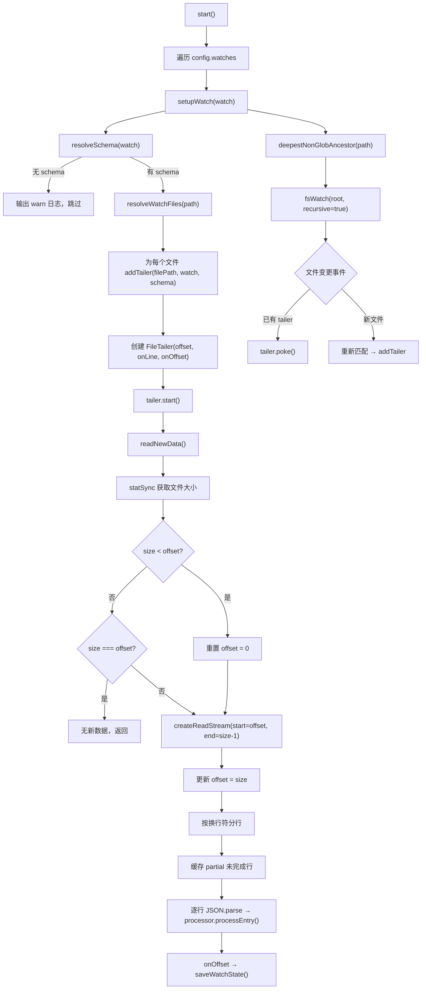

# watcher.ts 需求说明

> 源文件：`src/services/transcripts/watcher.ts` ｜ 类型：源码 ｜ 行数：293 ｜ 所属模块：transcripts ｜ 分析日期：2026-07-23

## 1. 文件定位总述

TranscriptWatcher 是 claude-mem 转录文件实时监听子系统的入口组件。它负责根据配置中的多个 WatchTarget，以递归文件监听 + 尾部追加读取（tail）的方式，持续追踪 JSONL 格式转录文件的增量内容。每读取到一行新数据，即交由 TranscriptEventProcessor 进行解析与入库。系统通过持久化偏移量状态实现断点续读，并支持 glob 模式匹配、目录自动发现以及从文件尾部开始读取等多种监听策略。

## 2. 功能需求

| 编号 | 需求描述（系统应当…） | 触发条件 / 输入 | 处理规则与输出 | 证据 |
|------|----------------------|----------------|---------------|------|
| FR-START-01 | 系统应当根据配置中的所有 WatchTarget 逐一建立文件监听 | 调用 `start()` | 遍历 `config.watches`，对每个 WatchTarget 调用 `setupWatch()` | `watcher.ts:97-101` |
| FR-START-02 | 系统应当停止所有文件监听器，并清理关联状态 | 调用 `stop()` | 关闭所有 FileTailer 的 fsWatch 和根目录 fsWatch，清空 tailers 映射和 rootWatchers 数组 | `watcher.ts:103-112` |
| FR-WATCH-01 | 系统应当为 WatchTarget 解析对应的 TranscriptSchema | WatchTarget 的 schema 为字符串引用或内联对象 | 若 schema 为字符串，从 `config.schemas` 查找；若直接为对象则使用；找不到则跳过该 WatchTarget 并输出 warn 日志 | `watcher.ts:186-191` |
| FR-WATCH-02 | 系统应当解析 WatchTarget 的路径为具体文件列表 | 路径支持字面路径、glob 模式、目录三种形式 | 字面文件直接返回；目录递归匹配 `**/*.jsonl`；glob 模式调用 `globSync`；路径中的反斜杠替换为正斜杠 | `watcher.ts:193-213` |
| FR-WATCH-03 | 系统应当为匹配到的每个文件创建 FileTailer 并启动尾部读取 | 文件首次被匹配到 | 初始化偏移量（从持久化状态恢复或从文件末尾开始），创建 FileTailer，调用 `start()`；已存在的文件不重复创建 | `watcher.ts:223-261` |
| FR-WATCH-04 | 系统应当在监听根目录上建立递归 fsWatch 以发现新文件 | WatchTarget 对应的最深非 glob 祖先目录存在 | 使用 `fsWatch(root, { recursive: true })` 监听变更；已有 tailer 的文件触发 `poke()`；新文件重新匹配后创建 tailer | `watcher.ts:134-158` |
| FR-WATCH-05 | 系统应当从文件当前偏移量处读取新增数据并按行处理 | 文件有新写入或首次启动 | 以 `createReadStream(filePath, { start: offset, end: size-1 })` 读取增量数据，按 `\n` 分行，末尾不完整行缓存为 partial，逐行回调处理 | `watcher.ts:44-84` |
| FR-WATCH-06 | 系统应当检测文件截断（文件缩小）并重置偏移量 | 文件大小小于已记录偏移量 | 将偏移量重置为 0，从头重新读取 | `watcher.ts:55-57` |
| FR-WATCH-07 | 系统应当将每行数据 JSON 解析后交给 TranscriptEventProcessor 处理 | FileTailer 读取到一行非空文本 | 调用 `JSON.parse(line)` 获取 entry，传给 `processor.processEntry(entry, watch, schema, sessionIdOverride)`；解析失败时输出 debug/warn 日志，不中断 | `watcher.ts:263-287` |
| FR-WATCH-08 | 系统应当持久化每个文件的读取偏移量 | FileTailer 读取完一批数据后 | 将新偏移量写入 state.offsets，调用 `saveWatchState()` 保存到磁盘 | `watcher.ts:248-251` |
| FR-WATCH-09 | 系统应当支持 `startAtEnd` 配置以从文件末尾开始监听 | WatchTarget 配置 `startAtEnd: true` 且文件无已保存偏移量 | 首次偏移量设为 `statSync(filePath).size`（文件末尾），仅监听后续新增内容 | `watcher.ts:233-240` |
| FR-WATCH-10 | 系统应当从文件路径中提取 UUID 形式的 sessionId | 文件路径包含 UUID 格式字符串 | 使用正则 `/[0-9a-f]{8}-...-[0-9a-f]{12}/i` 匹配，结果作为 sessionIdOverride 传入 processor | `watcher.ts:289-292` |
| FR-WATCH-11 | 系统应当计算 glob 路径的最深非 glob 祖先目录 | 路径包含 glob 通配符 | 从路径段逐段向前，遇到 glob 字符即停止，将前面的字面段拼接为祖先目录路径 | `watcher.ts:160-184` |

## 3. 业务规则与约束

- **偏移量持久化策略**：偏移量以文件绝对路径为键存储在 TranscriptWatchState 中，每次读取新数据后立即保存（`watcher.ts:248-251`）。
- **错误容错**：文件 stat 失败、JSON 解析失败均不中断监听循环，仅输出日志（`watcher.ts:49-53`, `watcher.ts:273-286`）。
- **空行跳过**：读取到的空行（trim 后为空）被跳过，不传入处理器（`watcher.ts:80-81`）。
- **重复 tailer 防护**：通过 `tailers.has(filePath)` 判断避免对同一文件创建多个 FileTailer（`watcher.ts:228`）。
- **递归监听降级**：若根目录不存在则跳过 `fsWatch`，仅依赖初始匹配；若 `fsWatch` 创建失败则输出 warn 日志但不中断（`watcher.ts:129-157`）。
- **路径分隔符标准化**：所有 glob 模式中的反斜杠统一替换为正斜杠以兼容跨平台（`watcher.ts:215-217`）。

## 4. 对外暴露

| 公开成员 | 类型 | 说明 |
|---------|------|------|
| `TranscriptWatcher` | class | 主入口类，导出供外部实例化和调用 `start()`/`stop()` |

**构造参数**：
- `config: TranscriptWatchConfig` — 监听配置（watches 数组 + schemas 映射）
- `statePath: string` — 持久化状态文件路径

**公开方法**：
- `start(): Promise<void>` — 启动所有监听
- `stop(): void` — 停止所有监听

## 5. 依赖关系

**内部依赖**：
- `src/services/transcripts/processor.ts` → `TranscriptEventProcessor`：处理解析后的转录条目（`watcher.ts:8`）
- `src/services/transcripts/state.ts` → `loadWatchState`/`saveWatchState`：偏移量状态持久化（`watcher.ts:6`）
- `src/services/transcripts/config.ts` → `expandHomePath`：展开家目录路径（`watcher.ts:5`）
- `src/services/transcripts/types.ts` → 类型定义（`watcher.ts:7`）
- `src/utils/logger.ts` → 日志（`watcher.ts:4`）

**外部依赖**：
- `fs`（`existsSync`/`statSync`/`watch`/`createReadStream`）、`path`、`glob`（`globSync`）

## 6. 数据结构

**TailState**（内部状态）：
```typescript
interface TailState {
  offset: number;    // 当前已读取的字节偏移
  partial: string;   // 末尾不完整行缓冲
}
```

**TranscriptWatcher 实例状态**：
- `processor: TranscriptEventProcessor` — 条目处理器
- `tailers: Map<string, FileTailer>` — 文件路径到 tailer 的映射
- `state: TranscriptWatchState` — 持久化偏移量状态
- `rootWatchers: Array<ReturnType<typeof fsWatch>>` — 根目录监听器数组

## 7. 复杂逻辑图示



上图展示了 TranscriptWatcher 的核心数据流：启动时根据配置建立监听，FileTailer 通过流式读取持续追踪文件尾部新增内容，每行解析后交给 TranscriptEventProcessor 处理，同时持久化偏移量。递归目录监听负责发现运行期间新创建的转录文件。

## 8. 逆向备注

- `FileTailer` 类作为内部私有类未导出，但在架构上是关键的文件尾读抽象，职责清晰。
- `deepestNonGlobAncestor` 方法在路径只有一个空段时返回空字符串（`watcher.ts:180-181`），调用方对空字符串做了 existsSync 判断后跳过 fsWatch（`watcher.ts:129`），设计上覆盖了边界情况。
- 未发现显式的文件删除处理逻辑——当被监听文件被删除时，`readNewData` 中 `existsSync` 检查会直接返回（`watcher.ts:45-46`），tailer 不会被清理但也不会报错。
